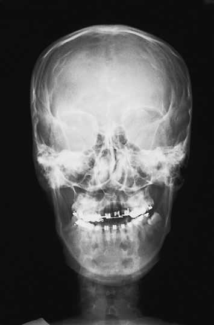
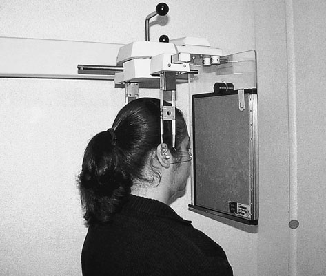

# Rx Teleradiografie Craniană (Cefalometrie) Postero-Anterior (PA) Incidență

  📷 Radiografie Convențională (Rx)
  <strong>Actualizat:</strong> 2026-09-16
  <strong>Autor:</strong> Departamentul de Radiologie / Referință Clark (Ed. 12)

---

-   __1. Rezumat Clinic & Indicații__

    ---

    === "Indicații Clinice"

        - White SC, Pharoah MJ (2004). Oral Radiology – Principles și Interpretation, 5th edn. St Louis: Mosby. Acknowledgements author este indebted la Michael Rushton pentru majority de photography în this section. James Peacop was responsible pentru new schematics și line drawings, which sunt testament la his artistic skills. Professor Keith Horner, Angela Carson, Di Whitfield, Sue Wilson, Christine Rowley, Corinne Niman, Pamela Coates și Ian Triffitt la X-ray Unit, University Dental Hospital de Manchester, provided me cu help, advice și encouragement during writing de this text. Mr Peter Hirschmann, Consultant în Dental și Maxillofacial Radiology la Leeds Dental Institute, gave valuable și constructive comments ca well ca providing great deal de valuable technical și editorial advice. Finally la Sue Lea și Zina Ismael, I extend my thanks pentru their unflagging enthusiasm during many hours that they spent ca photographic models. References British Society pentru Study de Orthodontics și British Society de Dental și Maxillofacial Radiology (1985). Report de articulație Working Party pentru British Society pentru Study de Orthodontics și British Society de Dental și Maxillofacial Radiology. reduction de dose la pacienți during Profil (lateral) cephalometric radiografie. British Journal de Orthodontics 12:176–178. Isaacson KG, Thom AR (eds) (2001). Guidelines pentru Use de radiografii în Clinical Orthodontics, 2nd edn. London: British Orthodontic Society. Kaffe I, Littner MM, Tamse A, Serebro L (1981). Clinical evaluation de bitewing film radiologic holder. Quintessence International 12:935–938. National Radiological Protection Board (2001). Guidance Notes pentru Dental Practitioners pe Safe Use de X-ray Equipment. London: Department de Health. Rushton VE și Horner K (1994). comparative study de five periapical radiographic techniques în general dental practice. Dentomaxillofacial Radiology 23:37–45, 96. Rushton VE, Horner K, Worthington H (1999). quality de panoramic radiografii în sample de general dental practices. British Dental Journal 186:630–633. Semple J, Gibb D (1982). Postero-anterior (PA) lower occlusal incidență – incidență uzuală de rutină pentru submandibular gland. radiografie 48:122–124. Tanner RJ, perete BF, Shrimpton PC, Hart D, Bungay DR (2000). Frequency de Medical și Dental X-ray Examinations în UK – 1997/98. Chilton: National Radiological Protection Board – R320. quality standards used în text sunt derived de la: Radiation Protection: European Guidelines pe Radiation Protection în Dental Radiology. Luxembourg: European Commission. Also available ca download PDF file la: http://europa.eu.int/comm/energy/nuclear/radioprotection/ publication_en.htm.

    === "Ghid Național IRIS"

        !!! info "Referință Primară: Ghidul Național IRIS (Ordinul MS 1342/2012)"
            - **Capitol Ghid IRIS:** *Ghidul Național IRIS*
            - **Grad de Recomandare:** **De verificat pe indicație; fără grad atribuit automat**
            - **Nivel de Iradiere Estimată:** `De verificat pentru examinarea și populația selectate`

            [:octicons-search-16: Deschide Ghidul IRIS](../../iris.md){ .md-button .md-button--primary } [:material-open-in-new: Aplicația Oficială PWA](https://radiologie-pediatrica.ro/iris/){ .md-button target="_blank" rel="noopener" }
-   __2. Poziționare & Centrare Fascicul__

    ---

    - **Poziție Pacient:** • equipment este rotit through 90 grade.
• pacientul este set up ca pentru Postero-anterior (PA) incidență de Mandibulă.
• orbito-meatal baseline este paralel cu floor.
• capul este imobilizat using ear pieces inserted into extern auditory meati.
    - **Punct de Centrare Fascicul:** • orizontal X-ray fascicul este fixed.
• central fascicul este centred through cervical coloană vertebrală la nivelul rami.
cephalometric Postero-anterior (PA) jaws Positioning pentru cephalometric Postero-anterior (PA) jaws incidență
    - **Distanță Focar-Film (DFF / SID):** 100 cm
    - **Comandă Respiratorie:** Apnee pe durata expunerii (apnee în inspir pentru torace; expir pentru Abdomen/bazin).

-   __3. Parametri Tehnici Expunere__

    ---

    | Parametru Tehnic | Valoare Configurare Generator / Tub |
    |:-----------------|:-------------------------------------|
    | **Tensiune Tub (kV)** | DE CONFIGURAT PE APARAT |
    | **Sarcină / Produs Curent-Timp (mAs)** | Conform AEC / grosime anatomică |
    | **Distanță Focar-Film (DFF / SID)** | 100 cm |
    | **Grilă Antidifuzoare (Bucky)** | Conform grosimii anatomice (> 10-12 cm cu grilă) |
    | **Dimensiune Focar** | Focar Mic (0.6 mm) |
    | **Camere de Ionizare AEC** | DE CONFIGURAT PE APARAT |
    | **Colimare Fascicul** | Colimare strictă la aria anatomică de interes diagnostic |
    | **Filtrare Tub** | Totală ≥ 2.5 mm Al echivalent (conform Clark: 3.0 mm Al eq.) |

-   __4. Criterii de Calitate & Reușită Imagine__

    ---

    - Vizualizarea clară întregii arii anatomice (Teleradiografie Craniană (Cefalometrie)).
    - Absența artefactelor de mișcare; trabeculație osoasă și contururi nete.
    - Densitate optică și contrast adecvate pentru diferențierea țesuturilor moi de structurile osoase.

-   __5. Protecție Radiologică (ALARA)__

    ---

    - Ecranare gonadică cu șorț plumbat dacă gonadele sunt în apropierea fasciculului util (regula ALARA).
    - Colimare precisă la dimensiunea anatomică strict necesară pentru reducerea dozei și a radiației difuze.
    - Verificarea posibilității unei sarcini la pacientele de vârstă fertilă înainte de expunere.

!!! note "Observații Clinice & Tehnice"
    Pregătirea pacientului prin îndepărtarea tuturor accesoriilor radio-opace.

### 🖼️ Imagini

<figure class="protocol-image-card" markdown>

<figcaption><strong>Figura 1: Aspect radiografic / Poziționare (Clark Ed. 12)</strong> — Poziționare pacient și centrare fascicul conform Clark (Ed. 12)</figcaption>

</figure>

<figure class="protocol-image-card" markdown>

<figcaption><strong>Figura 2: Aspect radiografic / Poziționare (Clark Ed. 12)</strong> — Aspect radiografic / ghid de poziționare conform tratatului Clark (Ed. 12)</figcaption>

</figure>

=== "Ghid Rapid de Execuție"

    1. **Identificarea și verificarea pacientului:** verificare identitate, zonă de examinat, consimțământ conform procedurii și evaluarea posibilității unei sarcini, când este relevantă.
    2. **Pregătire:** îndepărtarea oricăror obiecte radiopace (bijuterii, agrafe, fermoare, proteze, pansamente dense).
    3. **Poziționare precisă:** alinierea receptorului de imagine și a tubului la distanța prescrisă (100 cm).
    4. **Colimare strictă:** adaptarea fasciculului strict la regiunea de diagnostic pentru scăderea iradierii și reducerea radiației difuze.
    5. **Radioprotecție:** verificarea [politicii RX](../radioprotectie.md), cu măsuri distincte pentru pacient, personal și însoțitor.

## Surse de documentare

- [Clark's Positioning in Radiography (Ed. 12), Pagina 343](../../assets/protocols/sources/Clark___Positioning_in_Radiography__12th_edition.pdf#page=343)
