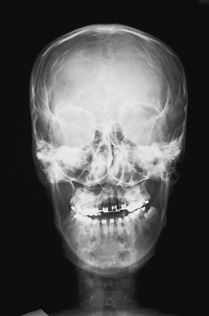
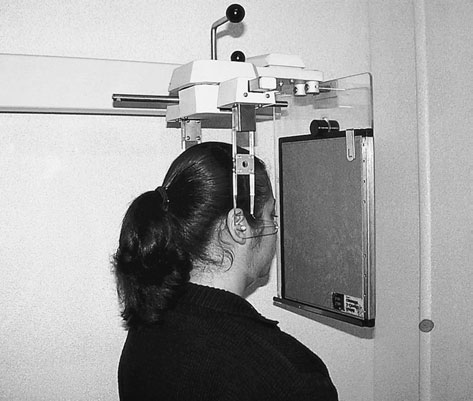

# Rx Teleradiografie Craniană (Cefalometrie) Postero-Anterior (PA) Incidență

  📷 Radiografie Convențională (Rx)
  <strong>Actualizat:</strong> 2026-09-16
  <strong>Autor:</strong> Departamentul de Radiologie / Referință Clark (Ed. 12)

---

-   __1. Rezumat Clinic & Indicații__

    ---

    === "Indicații Clinice"

        - White SC, Pharoah MJ (2004). Radiologie orală – Principii și interpretare, ediția a 5-a. St Louis: Mosby. Mulțumiri Autorul îi este îndatorat lui Michael Rushton pentru majoritatea fotografiilor din această secțiune. James Peacop a fost responsabil pentru noile scheme și desene liniare, care constituie o mărturie a aptitudinilor sale artistice. Profesorul Keith Horner, Angela Carson, Di Whitfield, Sue Wilson, Christine Rowley, Corinne Niman, Pamela Coates și Ian Triffitt de la Unitatea de radiologie, Spitalul Universitar de Stomatologie din Manchester, mi-au oferit ajutor, sfaturi și încurajare în timpul redactării acestui text. Domnul Peter Hirschmann, consultant în radiologie dentară și maxilo-facială la Leeds Dental Institute, a făcut comentarii valoroase și constructive, precum și a oferit numeroase sfaturi tehnice și editoriale valoroase. În cele din urmă, le mulțumesc lui Sue Lea și Zina Ismael pentru entuziasmul lor neobosit în timpul numeroaselor ore pe care le-au petrecut ca modele fotografice. Referințe Societatea Britanică pentru Studiul Ortodonției și Societatea Britanică de Radiologie Dentară și Maxilo-Facială (1985). Raportul grupului de lucru comun al Societății Britanice pentru Studiul Ortodonției și Societății Britanice de Radiologie Dentară și Maxilo-Facială. Reducerea dozei la pacienți în timpul radiografiei cefalometrice de profil (laterală). British Journal of Orthodontics 12:176–178. Isaacson KG, Thom AR (eds) (2001). Ghiduri pentru utilizarea radiografiilor în ortodonția clinică, ediția a 2-a. Londra: British Orthodontic Society. Kaffe I, Littner MM, Tamse A, Serebro L (1981). Evaluarea clinică a unui suport radiologic pentru filmul bitewing. Quintessence International 12:935–938. National Radiological Protection Board (2001). Note de orientare pentru medicii stomatologi privind utilizarea în siguranță a echipamentelor cu raze X. Londra: Department of Health. Rushton VE și Horner K (1994). Studiu comparativ al cinci tehnici radiografice periapicale în practica dentară generală. Dentomaxillofacial Radiology 23:37–45, 96. Rushton VE, Horner K, Worthington H (1999). Calitatea radiografiilor panoramice într-un eșantion de cabinete de medicină dentară generală. British Dental Journal 186:630–633. Semple J, Gibb D (1982). Incidența ocluzală inferioară postero-anterioară (PA) – incidență uzuală de rutină pentru glanda submandibulară. Radiography 48:122–124. Tanner RJ, Wall BF, Shrimpton PC, Hart D, Bungay DR (2000). Frecvența examinărilor radiologice medicale și dentare în Regatul Unit – 1997/98. Chilton: National Radiological Protection Board – R320. Standardele de calitate utilizate în text sunt derivate din: Protecția împotriva radiațiilor: Ghiduri europene privind protecția împotriva radiațiilor în radiologia dentară. Luxemburg: Comisia Europeană. Disponibil și pentru descărcare ca fișier PDF la: http://europa.eu.int/comm/energy/nuclear/radioprotection/ publication_en.htm.

    === "Ghid Național IRIS"

        !!! info "Referință Primară: Ghidul Național IRIS (Ordinul MS 1342/2012)"
            - **Capitol Ghid IRIS:** *Traumatisme — Față și orbite*
            - **Grad de Recomandare:** **Grad B**
            - **Nivel de Iradiere Estimată:** `Clasa 1 (Minimă < 0.2 mSv)`

            [:octicons-search-16: Deschide Ghidul IRIS](../../iris.md){ .md-button .md-button--primary } [:material-open-in-new: Aplicația Oficială PWA](https://radiologie-pediatrica.ro/iris/){ .md-button target="_blank" rel="noopener" }

-   __2. Poziționare & Centrare Fascicul__

    ---

    - **Poziție Pacient:**
        - echipamentul este rotit cu 90 de grade.
        - pacientul este poziționat ca pentru incidența postero-anterioară (PA) a mandibulei.
        - linia bazală orbito-meatală este paralelă cu podeaua.
        - capul este imobilizat folosind olive introduse în meaturile acustice externe.
    - **Punct de Centrare Fascicul:**
        - fasciculul de raze X orizontal este fix.
        - raza centrală este centrată prin coloana vertebrală cervicală la nivelul ramurilor. Poziționarea pentru incidența cefalometrică postero-anterioară (PA) a mandibulei
    - **Distanță Focar-Film (DFF / SID):** 100 cm
    - **Comandă Respiratorie:** Apnee pe durata expunerii (apnee în inspir pentru torace; expir pentru Abdomen/bazin).

-   __3. Parametri Tehnici Expunere__

    ---

    | Parametru Tehnic | Valoare Configurare Generator / Tub |
    |:-----------------|:-------------------------------------|
    | **Tensiune Tub (kV)** | DE CONFIGURAT PE APARAT |
    | **Sarcină / Produs Curent-Timp (mAs)** | Conform AEC / grosimii anatomice |
    | **Distanță Focar-Film (DFF / SID)** | 100 cm |
    | **Grilă Antidifuzoare (Bucky)** | Conform grosimii anatomice (> 10-12 cm cu grilă) |
    | **Dimensiune Focar** | Focar Mic (0.6 mm) |
    | **Camere de Ionizare AEC** | DE CONFIGURAT PE APARAT |
    | **Colimare Fascicul** | Colimare strictă la aria anatomică de interes diagnostic |
    | **Filtrare Tub** | Totală ≥ 2.5 mm Al echivalent (conform Clark: 3.0 mm Al echivalent) |

-   __4. Criterii de Calitate & Reușită Imagine__

    ---

    - Vizualizarea clară întregii arii anatomice (Teleradiografie Craniană (Cefalometrie)).
    - Absența artefactelor de mișcare; trabeculație osoasă și contururi nete.
    - Densitate optică și contrast adecvate pentru diferențierea țesuturilor moi de structurile osoase.

-   __5. Protecție Radiologică (ALARA)__

    ---

    - Ecranare gonadică cu șorț plumbat dacă gonadele sunt în apropierea fasciculului util (regula ALARA).
    - Colimare precisă la dimensiunea anatomică strict necesară pentru reducerea dozei și a radiației difuze.
    - Verificarea posibilității unei sarcini la pacientele de vârstă fertilă înainte de expunere.

!!! note "Observații Clinice & Tehnice"
    Pregătirea pacientului prin îndepărtarea tuturor accesoriilor radio-opace.

### 🖼️ Imagini

<figure class="protocol-image-card" markdown>

<figcaption><strong>Figura 1: Aspect radiografic / Poziționare (Clark Ed. 12)</strong> — Poziționarea pacientului și centrarea fasciculului conform Clark (Ed. 12)</figcaption>

</figure>

<figure class="protocol-image-card" markdown>

<figcaption><strong>Figura 2: Aspect radiografic / Poziționare (Clark Ed. 12)</strong> — Aspect radiografic / ghid de poziționare conform tratatului Clark (Ed. 12)</figcaption>

</figure>

=== "Ghid Rapid de Execuție"

    1. **Identificarea și verificarea pacientului:** verificare identitate, zonă de examinat, consimțământ conform procedurii și evaluarea posibilității unei sarcini, când este relevantă.
    2. **Pregătire:** îndepărtarea oricăror obiecte radiopace (bijuterii, agrafe, fermoare, proteze, pansamente dense).
    3. **Poziționare precisă:** alinierea receptorului de imagine și a tubului la distanța prescrisă (100 cm).
    4. **Colimare strictă:** adaptarea fasciculului strict la regiunea de diagnostic pentru scăderea iradierii și reducerea radiației difuze.
    5. **Radioprotecție:** verificarea [politicii RX](../radioprotectie.md), cu măsuri distincte pentru pacient, personal și însoțitor.

## Surse de documentare

- [Clark's Positioning in Radiography (Ed. 12), Pagina 343](https://books.google.com/books/about/Clark_s_Positioning_in_Radiography.html?id=Xxu6MwEACAAJ)
