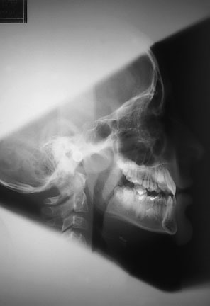
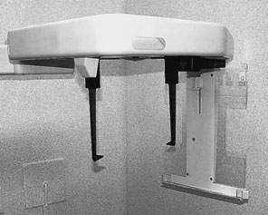
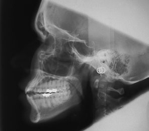
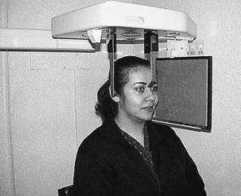

# Rx Teleradiografie Craniană (Cefalometrie) Profil (Lateral) Incidență

  📷 Radiografie Convențională (Rx)
  <strong>Actualizat:</strong> 2026-09-16
  <strong>Autor:</strong> Departamentul de Radiologie / Referință Clark (Ed. 12)

---

-   __1. Rezumat Clinic & Indicații__

    ---

    === "Indicații Clinice"

        - use de fascicul collimation has dramatically reduced dose la pacienți whilst adequately imaging pacientul fără loss de information that este necessary pentru orthodontic sau orthognathic 326 True cephalometric Profil (lateral) Craniu radiografie. imagini de metal ear rods sunt superimposed over one another și imagine displays optim collimation cephalostat True cephalometric Profil (lateral) Craniu radiografie cu imagini de metal ear rods separated indicating ‘off centring’ Positioning pentru true cephalometric Profil (lateral) Craniu radiografie

    === "Ghid Național IRIS"

        !!! info "Referință Primară: Ghidul Național IRIS (Ordinul MS 1342/2012)"
            - **Capitol Ghid IRIS:** *Ghidul Național IRIS*
            - **Grad de Recomandare:** **De verificat pe indicație; fără grad atribuit automat**
            - **Nivel de Iradiere Estimată:** `De verificat pentru examinarea și populația selectate`

            [:octicons-search-16: Deschide Ghidul IRIS](../../iris.md){ .md-button .md-button--primary } [:material-open-in-new: Aplicația Oficială PWA](https://radiologie-pediatrica.ro/iris/){ .md-button target="_blank" rel="noopener" }
-   __2. Poziționare & Centrare Fascicul__

    ---

    - **Poziție Pacient:** • pacientul stă așezat sau stands inside cephalometric unit, cu plan sagital vertical și paralel cu casetă.
• Frankfort plane trebuie să fie orizontal.
• capul este imobilizat prin guiding ear pieces carefully into extern auditory meati. Metal circular markeri within ear pieces allow operator la rapidly recognize off-centring de cephalostat.
• nasul support este poziționat pe / sprijinit de nazion.
• wedge-shaped filter este poziționat so that it will fie superimposed pe fața, cu its thick edge plasat anteriorly.
• pacientul este instructed la close their mouth și la bite together pe their back teeth (i.e. în centric occlusion). Some children find this difficult la do, so it este worth checking before exposing radiografie.
• lips trebuie să fie relaxat.
    - **Punct de Centrare Fascicul:** • direction și centring de X-ray fascicul will normally fie fixed. Fascicul Orizontal este centred pe extern auditory meati.
    - **Distanță Focar-Film (DFF / SID):** 100 cm
    - **Comandă Respiratorie:** Apnee pe durata expunerii (apnee în inspir pentru torace; expir pentru Abdomen/bazin).

-   __3. Parametri Tehnici Expunere__

    ---

    | Parametru Tehnic | Valoare Configurare Generator / Tub |
    |:-----------------|:-------------------------------------|
    | **Tensiune Tub (kV)** | DE CONFIGURAT PE APARAT |
    | **Sarcină / Produs Curent-Timp (mAs)** | Conform AEC / grosime anatomică |
    | **Distanță Focar-Film (DFF / SID)** | 100 cm |
    | **Grilă Antidifuzoare (Bucky)** | Conform grosimii anatomice (> 10-12 cm cu grilă) |
    | **Dimensiune Focar** | Focar Mic (0.6 mm) |
    | **Camere de Ionizare AEC** | DE CONFIGURAT PE APARAT |
    | **Colimare Fascicul** | Colimare strictă la aria anatomică de interes diagnostic |
    | **Filtrare Tub** | Totală ≥ 2.5 mm Al echivalent (conform Clark: 3.0 mm Al eq.) |

-   __4. Criterii de Calitate & Reușită Imagine__

    ---

    - fără removable metallic corp străin radiopac.
    - fără distortion due la movement.
    - Frankfort plane perpendicular pe film radiologic.
    - fără anterior-posterior positioning errors.
    - fără plan sagital positioning errors.
    - fără plan ocluzal positioning errors.
    - Teeth în centric occlusion (stable și natural intercuspation).
    - Lips relaxat.
    - Exact matching de extern auditory meati cu positioning devices.
    - Visibility de toate cephalometric tracing points required pentru analysis.
    - Visibility de toate anterior skeletal și părți moi structures.
    - Good densitate optică și contrast.
    - fără casetă/screen problems.
    - fără pressure marks pe film radiologic.
    - fără roller marks (automatic processing only).
    - fără evidence de film radiologic fog.
    - fără chemical streaks/splashes/contamination.
    - fără evidence de inadequate fixation/washing.
    - Name și date legible.

-   __5. Protecție Radiologică (ALARA)__

    ---

    - Ecranare gonadică cu șorț plumbat dacă gonadele sunt în apropierea fasciculului util (regula ALARA).
    - Colimare precisă la dimensiunea anatomică strict necesară pentru reducerea dozei și a radiației difuze.
    - Verificarea posibilității unei sarcini la pacientele de vârstă fertilă înainte de expunere.

!!! note "Observații Clinice & Tehnice"
    Pregătirea pacientului prin îndepărtarea tuturor accesoriilor radio-opace.

### 🖼️ Imagini

<figure class="protocol-image-card" markdown>

<figcaption><strong>before exposing radiografie.</strong> — Poziționare pacient și centrare fascicul conform Clark (Ed. 12)</figcaption>

</figure>

<figure class="protocol-image-card" markdown>

<figcaption><strong>True cephalometric Profil (lateral) Craniu radiografie. imagini de metal ear rods sunt</strong> — Aspect radiografic / ghid de poziționare conform tratatului Clark (Ed. 12)</figcaption>

</figure>

<figure class="protocol-image-card" markdown>

<figcaption><strong>True cephalometric Profil (lateral) Craniu radiografie cu imagini de metal ear rods</strong> — Aspect radiografic / ghid de poziționare conform tratatului Clark (Ed. 12)</figcaption>

</figure>

<figure class="protocol-image-card" markdown>

<figcaption><strong>Positioning pentru true cephalometric Profil (lateral) Craniu radiografie</strong> — Aspect radiografic / ghid de poziționare conform tratatului Clark (Ed. 12)</figcaption>

</figure>

=== "Ghid Rapid de Execuție"

    1. **Identificarea și verificarea pacientului:** verificare identitate, zonă de examinat, consimțământ conform procedurii și evaluarea posibilității unei sarcini, când este relevantă.
    2. **Pregătire:** îndepărtarea oricăror obiecte radiopace (bijuterii, agrafe, fermoare, proteze, pansamente dense).
    3. **Poziționare precisă:** alinierea receptorului de imagine și a tubului la distanța prescrisă (100 cm).
    4. **Colimare strictă:** adaptarea fasciculului strict la regiunea de diagnostic pentru scăderea iradierii și reducerea radiației difuze.
    5. **Radioprotecție:** verificarea [politicii RX](../radioprotectie.md), cu măsuri distincte pentru pacient, personal și însoțitor.

## Surse de documentare

- [Clark's Positioning in Radiography (Ed. 12), Pagina 341](../../assets/protocols/sources/Clark___Positioning_in_Radiography__12th_edition.pdf#page=341)
