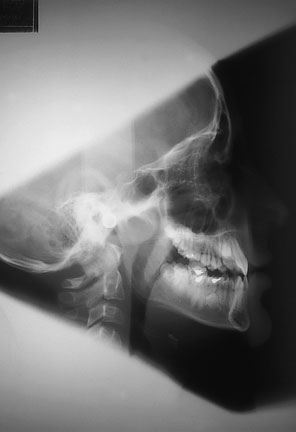
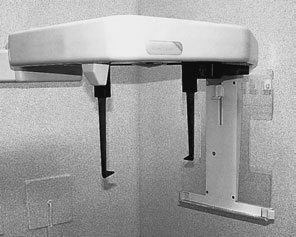
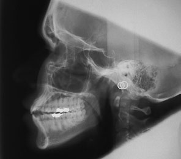
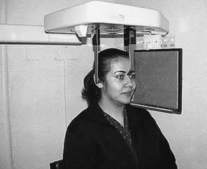

# Rx Teleradiografie Craniană (Cefalometrie) Profil (Lateral) Incidență

  📷 Radiografie Convențională (Rx)
  <strong>Actualizat:</strong> 2026-09-16
  <strong>Autor:</strong> Departamentul de Radiologie / Referință Clark (Ed. 12)

---

-   __1. Rezumat Clinic & Indicații__

    ---

    === "Indicații Clinice"

        - Utilizarea colimării fasciculului a redus dramatic doza la pacienți, asigurând totodată examinarea radiologică adecvată a pacientului, fără pierderea informațiilor necesare pentru analiza ortodontică sau ortognatică. 326 Radiografie cefalometrică de profil (laterală) a craniului cu imagini ale tijelor metalice auriculare suprapuse una peste alta și imagine care demonstrează colimarea optimă a cefalostatului Radiografie cefalometrică adevărată de profil (laterală) a craniului cu imagini ale tijelor metalice auriculare separate, indicând „decentrarea” Poziționarea pentru radiografia cefalometrică adevărată de profil (laterală) a craniului

    === "Ghid Național IRIS"

        !!! info "Referință Primară: Ghidul Național IRIS (Ordinul MS 1342/2012)"
            - **Capitol Ghid IRIS:** *Traumatisme — Față și orbite*
            - **Grad de Recomandare:** **Grad B**
            - **Nivel de Iradiere Estimată:** `Clasa 1 (Minimă < 0.2 mSv)`

            [:octicons-search-16: Deschide Ghidul IRIS](../../iris.md){ .md-button .md-button--primary } [:material-open-in-new: Aplicația Oficială PWA](https://radiologie-pediatrica.ro/iris/){ .md-button target="_blank" rel="noopener" }

-   __2. Poziționare & Centrare Fascicul__

    ---

    - **Poziție Pacient:**
        - pacientul stă așezat sau în picioare în interiorul unității cefalometrice, cu planul sagital vertical și paralel cu caseta.
        - planul Frankfort trebuie să fie orizontal.
        - capul este imobilizat prin introducerea cu grijă a olivelor în meaturile acustice externe. Markerii metalici circulari din olive permit operatorului să recunoască rapid decentrarea cefalostatului.
        - suportul nazal este poziționat pe / sprijinit de nazion.
        - filtrul în formă de pană este poziționat astfel încât să se suprapună peste față, cu marginea sa groasă plasată anterior.
        - pacientul este instruit să închidă gura și să muște împreună pe dinții posteriori (adică în ocluzie centrică). Unii copii întâmpină dificultăți în acest sens, de aceea merită verificat înainte de efectuarea radiografiei.
        - buzele trebuie să fie relaxate.
    - **Punct de Centrare Fascicul:** • direcția și centrarea fasciculului de raze X vor fi în mod normal fixe. Fasciculul orizontal este centrat pe meaturile acustice externe.
    - **Distanță Focar-Film (DFF / SID):** 100 cm
    - **Comandă Respiratorie:** Apnee pe durata expunerii (apnee în inspir pentru torace; expir pentru Abdomen/bazin).

-   __3. Parametri Tehnici Expunere__

    ---

    | Parametru Tehnic | Valoare Configurare Generator / Tub |
    |:-----------------|:-------------------------------------|
    | **Tensiune Tub (kV)** | DE CONFIGURAT PE APARAT |
    | **Sarcină / Produs Curent-Timp (mAs)** | Conform AEC / grosimii anatomice |
    | **Distanță Focar-Film (DFF / SID)** | 100 cm |
    | **Grilă Antidifuzoare (Bucky)** | Conform grosimii anatomice (> 10-12 cm cu grilă) |
    | **Dimensiune Focar** | Focar Mic (0.6 mm) |
    | **Camere de Ionizare AEC** | DE CONFIGURAT PE APARAT |
    | **Colimare Fascicul** | Colimare strictă la aria anatomică de interes diagnostic |
    | **Filtrare Tub** | Totală ≥ 2.5 mm Al echivalent (conform Clark: 3.0 mm Al echivalent) |

-   __4. Criterii de Calitate & Reușită Imagine__

    ---

    - fără corp străin metalic radiopac detașabil.
    - fără distorsiuni datorate mișcării.
    - planul Frankfort perpendicular pe filmul radiologic.
    - fără erori de poziționare antero-posterioară.
    - fără erori de poziționare a planului sagital.
    - fără erori de poziționare a planului ocluzal.
    - Dinți în ocluzie centrică (intercuspidare stabilă și naturală).
    - Buze relaxate.
    - Potrivirea exactă a meaturilor acustice externe cu dispozitivele de poziționare.
    - Vizibilitatea tuturor punctelor de trasare cefalometrică necesare pentru analiză.
    - Vizibilitatea tuturor structurilor scheletice anterioare și ale părților moi.
    - Densitate optică și contrast bune.
    - fără probleme ale casetei/ecranelor.
    - fără urme de presiune pe filmul radiologic.
    - fără urme de role (numai procesare automată).
    - fără dovezi de voalare a filmului radiologic.
    - fără dâre/picături de substanțe chimice/contaminare.
    - fără dovezi de fixare/spălare insuficientă.
    - Numele și data lizibile.

-   __5. Protecție Radiologică (ALARA)__

    ---

    - Ecranare gonadică cu șorț plumbat dacă gonadele sunt în apropierea fasciculului util (regula ALARA).
    - Colimare precisă la dimensiunea anatomică strict necesară pentru reducerea dozei și a radiației difuze.
    - Verificarea posibilității unei sarcini la pacientele de vârstă fertilă înainte de expunere.

!!! note "Observații Clinice & Tehnice"
    Pregătirea pacientului prin îndepărtarea tuturor accesoriilor radio-opace.

### 🖼️ Imagini

<figure class="protocol-image-card" markdown>

<figcaption><strong>înainte de efectuarea radiografiei.</strong> — Poziționarea pacientului și centrarea fasciculului conform Clark (Ed. 12)</figcaption>

</figure>

<figure class="protocol-image-card" markdown>

<figcaption><strong>Radiografie cefalometrică adevărată de profil (laterală) a craniului. Imaginile tijelor metalice auriculare sunt</strong> — Aspect radiografic / ghid de poziționare conform tratatului Clark (Ed. 12)</figcaption>

</figure>

<figure class="protocol-image-card" markdown>

<figcaption><strong>Radiografie cefalometrică adevărată de profil (laterală) a craniului cu imagini ale tijelor metalice auriculare</strong> — Aspect radiografic / ghid de poziționare conform tratatului Clark (Ed. 12)</figcaption>

</figure>

<figure class="protocol-image-card" markdown>

<figcaption><strong>Poziționarea pentru radiografia cefalometrică adevărată de profil (laterală) a craniului</strong> — Aspect radiografic / ghid de poziționare conform tratatului Clark (Ed. 12)</figcaption>

</figure>

=== "Ghid Rapid de Execuție"

    1. **Identificarea și verificarea pacientului:** verificare identitate, zonă de examinat, consimțământ conform procedurii și evaluarea posibilității unei sarcini, când este relevantă.
    2. **Pregătire:** îndepărtarea oricăror obiecte radiopace (bijuterii, agrafe, fermoare, proteze, pansamente dense).
    3. **Poziționare precisă:** alinierea receptorului de imagine și a tubului la distanța prescrisă (100 cm).
    4. **Colimare strictă:** adaptarea fasciculului strict la regiunea de diagnostic pentru scăderea iradierii și reducerea radiației difuze.
    5. **Radioprotecție:** verificarea [politicii RX](../radioprotectie.md), cu măsuri distincte pentru pacient, personal și însoțitor.

## Surse de documentare

- [Clark's Positioning in Radiography (Ed. 12), Pagina 341](https://books.google.com/books/about/Clark_s_Positioning_in_Radiography.html?id=Xxu6MwEACAAJ)
