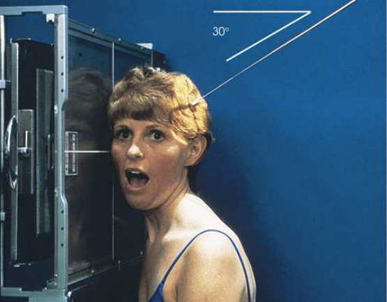
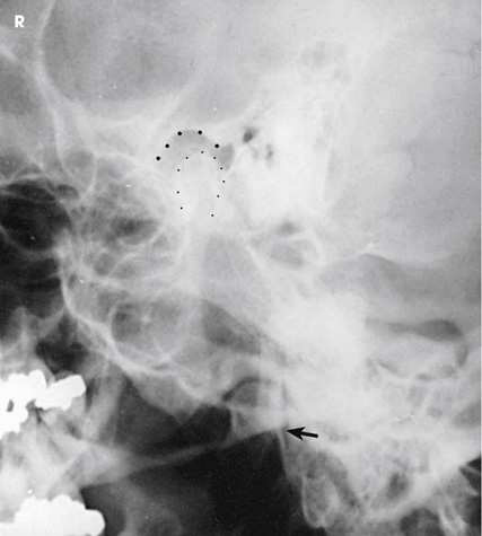
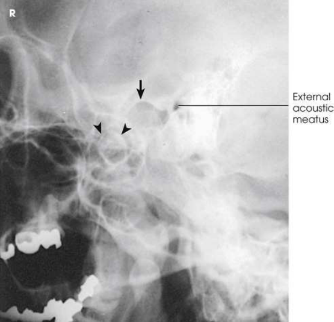
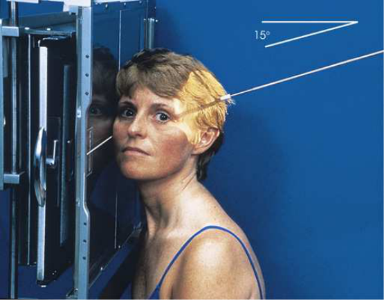
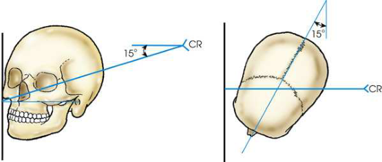
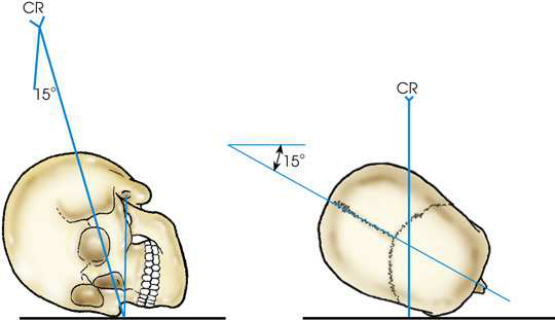

# Rx Temporomandibular Articulations — Axiolateral Incidență — Right and Profil Stângs (Merrill)

  📷 Radiografie Convențională (Rx)
  <strong>Actualizat:</strong> 2026-09-16
  <strong>Autor:</strong> Referință Merrill

---

-   __1. Rezumat Clinic & Indicații__

    ---

    === "Indicații Clinice"

        - Conform reperelor anatomice standard din tratat

    === "Ghid Național IRIS"

        !!! info "Referință Primară: Ghidul Național IRIS (Ordinul MS 1342/2012)"
            - **Capitol Ghid IRIS:** *Ghidul Național IRIS*
            - **Grad de Recomandare:** **De verificat pe indicație; fără grad atribuit automat**
            - **Nivel de Iradiere Estimată:** `De verificat pentru examinarea și populația selectate`

            [:octicons-search-16: Deschide Ghidul IRIS](../../iris.md){ .md-button .md-button--primary } [:material-open-in-new: Aplicația Oficială PWA](https://radiologie-pediatrica.ro/iris/){ .md-button target="_blank" rel="noopener" }
-   __2. Poziționare & Centrare Fascicul__

    ---

    - **Poziție Pacient:** Put mark pe fiecare cheek la point inch (1.3 cm) anterior la conduct auditiv extern (CAE) și 1 inch (2.5 cm) inferior la conduct auditiv extern (CAE) la localize TMī if needed. se așază pacientul în semiprone poziție, sau se așază pacientul pe scaun before stativ vertical Bucky.; Center point inch (1.3 cm) anterior la conduct auditiv extern (CAE) la receptorul de imagine, și se poziționează pacientul’s cap în Incidență de Profil (lateral) cu afected side cel mai apropiat de receptorul de imagine. se ajustează pacient’s cap so that MSP este paralel cu plane de receptorul de imagine și linie interpupilară (LIP) este perpendicular pe receptorul de imagine (RI) plane (Figs. 11.154– 11.156). Se imobilizează capul pacientului.
    - **Punct de Centrare Fascicul:** Orientat spre punctul central al receptorului de imagine la un unghi de 25 sau 30 grade caudal. raza centrală enters about inch (1.3 cm) anterior și 2 inches (5 cm) superior la upside conduct auditiv extern (CAE).
    - **Distanță Focar-Film (DFF / SID):** Nespecificat în fragmentul extras; de verificat în sursă
    - **Comandă Respiratorie:** apnee (oprirea respirației). After making expunere cu pacientul’s mouth closed, change receptorul de imagine; then, unless contraindicated, Se instruiește pacientul să open mouth widely (Fig. 11.157). Recheck pacientul’s poziție, și make second expunere.

-   __3. Parametri Tehnici Expunere__

    ---

    | Parametru Tehnic | Valoare Configurare Generator / Tub |
    |:-----------------|:-------------------------------------|
    | **Tensiune Tub (kV)** | DE CONFIGURAT PE APARAT |
    | **Sarcină / Produs Curent-Timp (mAs)** | DE CONFIGURAT PE APARAT |
    | **Distanță Focar-Film (DFF / SID)** | Nespecificat în fragmentul extras; de verificat în sursă |
    | **Grilă Antidifuzoare (Bucky)** | DE CONFIGURAT PE APARAT |
    | **Dimensiune Focar** | DE CONFIGURAT PE APARAT |
    | **Camere de Ionizare AEC** | DE CONFIGURAT PE APARAT |
    | **Colimare Fascicul** | se ajustează câmp de iradiere la extend 1 inch (2.5 cm) beyond anterior skin line, posterior și inferior la TMīs. expunere field trebuie să fie fără larger than 8 × 10 inches (18 × 24 cm). Place marker de lateralitate (D/S) în collimated expunere field. |
    | **Filtrare Tub** | DE CONFIGURAT PE APARAT |

-   __4. Criterii de Calitate & Reușită Imagine__

    ---

    - Criterii radiologice de calitate imaginii: n Evidence de corect collimation și presence de marker de lateralitate (D/S) plasat clear de anatomy de interest n TMī anterior la conduct auditiv extern (CAE) n Condyle în mandibular fossa în closed-mouth examination n Condyle inferior la articular tubercle în open-mouth examination if pacientul este normal și able la open mouth widely n părți moi și bony detalii trabeculare osoase

-   __5. Protecție Radiologică (ALARA)__

    ---

    - Nespecificat în fragmentul extras; de verificat în sursă

!!! note "Observații Clinice & Tehnice"
    Conform reperelor anatomice standard din tratat

### 🖼️ Imagini

<figure class="protocol-image-card" markdown>

<figcaption><strong>Merrill — pagina PDF 940, imaginea 1</strong> — Imagine din fragmentul sursă; asocierea necesită revizie.</figcaption>

</figure>

<figure class="protocol-image-card" markdown>

<figcaption><strong>Merrill — pagina PDF 941, imaginea 2</strong> — Imagine din fragmentul sursă; asocierea necesită revizie.</figcaption>

</figure>

<figure class="protocol-image-card" markdown>

<figcaption><strong>Merrill — pagina PDF 941, imaginea 3</strong> — Imagine din fragmentul sursă; asocierea necesită revizie.</figcaption>

</figure>

<figure class="protocol-image-card" markdown>

<figcaption><strong>Merrill — pagina PDF 942, imaginea 4</strong> — Imagine din fragmentul sursă; asocierea necesită revizie.</figcaption>

</figure>

<figure class="protocol-image-card" markdown>

<figcaption><strong>Merrill — pagina PDF 942, imaginea 5</strong> — Imagine din fragmentul sursă; asocierea necesită revizie.</figcaption>

</figure>

<figure class="protocol-image-card" markdown>

<figcaption><strong>Merrill — pagina PDF 943, imaginea 6</strong> — Imagine din fragmentul sursă; asocierea necesită revizie.</figcaption>

</figure>

=== "Ghid Rapid de Execuție"

    1. **Identificarea și verificarea pacientului:** verificare identitate, zonă de examinat, consimțământ conform procedurii și evaluarea posibilității unei sarcini, când este relevantă.
    2. **Pregătire:** îndepărtarea oricăror obiecte radiopace (bijuterii, agrafe, fermoare, proteze, pansamente dense).
    3. **Poziționare precisă:** alinierea receptorului de imagine și a tubului la distanța prescrisă (Nespecificat în fragmentul extras; de verificat în sursă).
    4. **Colimare strictă:** adaptarea fasciculului strict la regiunea de diagnostic pentru scăderea iradierii și reducerea radiației difuze.
    5. **Radioprotecție:** verificarea [politicii RX](../radioprotectie.md), cu măsuri distincte pentru pacient, personal și însoțitor.

## Surse de documentare

- [Merrill’s Atlas, 11. Cranium, pagini PDF 939–943](../../assets/protocols/sources/a56d45c16829_Merrills_Atlas_of_Radiographic_Positioning__Procedures_3Vol_Set.pdf#page=939)

## Fragmente sursă traduse (referință tehnică)

### anatomy

TMī when mouth este open și closed (Figs. 11.158 și 11.159). Examine ambele părți (bilateral) pentru comparison.

### collimation

• se ajustează câmp de iradiere la extend 1 inch (2.5 cm) beyond anterior skin line, posterior și inferior la TMīs. expunere field
trebuie să fie fără larger than 8 × 10 inches (18 × 24 cm). Place marker de lateralitate (D/S) în collimated expunere field.

### cr

• Orientat spre punctul central al receptorului de imagine la un unghi de 25 sau 30 grade caudal. raza centrală enters about
inch (1.3 cm) anterior și 2 inches (5 cm) superior la upside conduct auditiv extern (CAE).

### criteria

Criterii radiologice de calitate imaginii:
n Evidence de corect collimation și presence de marker de lateralitate (D/S) plasat clear de anatomy de interest
n TMī anterior la conduct auditiv extern (CAE)
n Condyle în mandibular fossa în closed-mouth examination
n Condyle inferior la articular tubercle în open-mouth examination if pacientul este normal și able la open mouth widely
n părți moi și bony detalii trabeculare osoase

### part_pos

• Center point
inch (1.3 cm) anterior la conduct auditiv extern (CAE) la receptorul de imagine, și se poziționează pacientul’s cap în poziție de profil (lateral) cu afected side cel mai apropiat de receptorul de imagine.
• se ajustează pacient’s cap so that MSP este paralel cu plane de receptorul de imagine și linie interpupilară (LIP) este perpendicular pe receptorul de imagine (RI) plane (Figs. 11.154–
11.156).
• Se imobilizează capul pacientului.

### patient_pos

• Put mark pe fiecare cheek la point
inch (1.3 cm) anterior la conduct auditiv extern (CAE) și 1 inch (2.5 cm) inferior la conduct auditiv extern (CAE) la localize TMī if needed.
• se așază pacientul în semiprone poziție, sau se așază pacientul pe scaun before stativ vertical Bucky.

### respiration

apnee (oprirea respirației).
• After making expunere cu pacientul’s mouth closed, change receptorul de imagine; then, unless contraindicated, Se instruiește pacientul să open mouth widely (Fig. 11.157).
• Recheck pacientul’s poziție, și make second expunere.

### tech

poziționat prin manufacturer sau department protocol pentru corect anatomy display orientation; raza centrală plate: 10 × 12 inches (24
× 30 cm) transversal.

