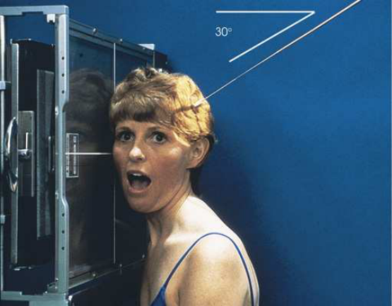
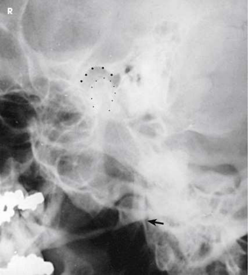
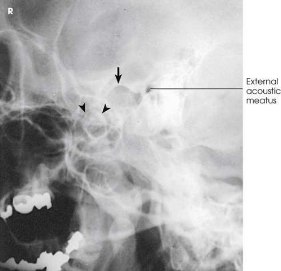
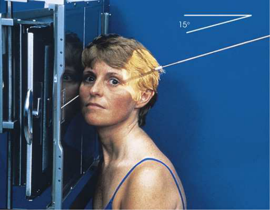
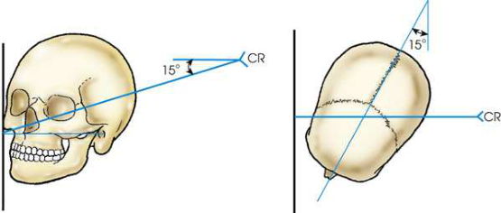
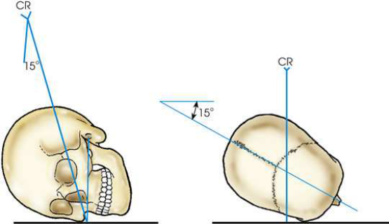

# Radiografia articulațiilor temporomandibulare — incidență axiolaterală — dreapta și profil stâng (Merrill)

  📷 Radiografie Convențională (Rx)
  <strong>Actualizat:</strong> 2026-09-16
  <strong>Autor:</strong> Referință Merrill

---

-   __1. Rezumat Clinic & Indicații__

    ---

    === "Indicații Clinice"

        - Conform reperelor anatomice standard din tratat

    === "Ghid Național IRIS"

        !!! info "Referință Primară: Ghidul Național IRIS (Ordinul MS 1342/2012)"
            - **Capitol Ghid IRIS:** *Ghidul Național IRIS*
            - **Grad de Recomandare:** **De verificat pe indicație; fără grad atribuit automat**
            - **Nivel de Iradiere Estimată:** `De verificat pentru examinarea și populația selectate`

            [:octicons-search-16: Deschide Ghidul IRIS](../../iris.md){ .md-button .md-button--primary } [:material-open-in-new: Aplicația Oficială PWA](https://radiologie-pediatrica.ro/iris/){ .md-button target="_blank" rel="noopener" }
-   __2. Poziționare & Centrare Fascicul__

    ---

    - **Poziție Pacient:** Marcați fiecare obraz la punctul situat la inch (1.3 cm) anterior de conductul auditiv extern (CAE) și la 1 inch (2.5 cm) inferior de conductul auditiv extern (CAE), pentru localizarea TMī dacă este necesar. Se așază pacientul în poziție semipronă sau pe scaun înaintea stativului vertical Bucky.; Centrați punctul la inch (1.3 cm) anterior de conductul auditiv extern (CAE) la receptorul de imagine și poziționați capul pacientului în incidență de profil (lateral), cu partea afectată cel mai aproape de receptorul de imagine. Ajustați capul pacientului astfel încât MSP să fie paralel cu planul receptorului de imagine, iar linia interpupilară (LIP) să fie perpendiculară pe planul receptorului de imagine (RI) (Fig. 11.154–11.156). Imobilizați capul pacientului.
    - **Punct de Centrare Fascicul:** Orientat spre punctul central al receptorului de imagine la un unghi de 25 sau 30 grade caudal. Raza centrală intră la aproximativ inch (1.3 cm) anterior și 2 inches (5 cm) superior de conductul auditiv extern (CAE) opus.
    - **Distanță Focar-Film (DFF / SID):** Nespecificat în fragmentul extras; de verificat în sursă
    - **Comandă Respiratorie:** apnee (oprirea respirației). După efectuarea expunerii cu gura pacientului închisă, schimbați receptorul de imagine; apoi, dacă nu există contraindicații, instruiți pacientul să deschidă larg gura (Fig. 11.157). Verificați din nou poziția pacientului și efectuați a doua expunere.

-   __3. Parametri Tehnici Expunere__

    ---

    | Parametru Tehnic | Valoare Configurare Generator / Tub |
    |:-----------------|:-------------------------------------|
    | **Tensiune Tub (kV)** | DE CONFIGURAT PE APARAT |
    | **Sarcină / Produs Curent-Timp (mAs)** | DE CONFIGURAT PE APARAT |
    | **Distanță Focar-Film (DFF / SID)** | Nespecificat în fragmentul extras; de verificat în sursă |
    | **Grilă Antidifuzoare (Bucky)** | DE CONFIGURAT PE APARAT |
    | **Dimensiune Focar** | DE CONFIGURAT PE APARAT |
    | **Camere de Ionizare AEC** | DE CONFIGURAT PE APARAT |
    | **Colimare Fascicul** | Se ajustează câmpul de iradiere pentru a se extinde cu 1 inch (2.5 cm) dincolo de linia cutanată anterioară, posterior și inferior față de ATM. Câmpul de expunere trebuie să nu fie mai mare de 8 × 10 inches (18 × 24 cm). Se plasează markerul de lateralitate (D/S) în câmpul de expunere colimat. |
    | **Filtrare Tub** | DE CONFIGURAT PE APARAT |

-   __4. Criterii de Calitate & Reușită Imagine__

    ---

    - Criterii radiologice de calitate a imaginii: n Dovada unei colimări corecte și prezența markerului de lateralitate (D/S), plasat clar față de anatomia de interes n ATM anterior față de conductul auditiv extern (CAE) n Condilul în fosa mandibulară la examinarea cu gura închisă n Condilul inferior față de tuberculul articular la examinarea cu gura deschisă, dacă pacientul este normal și poate deschide larg gura n părți moi și detalii osoase trabeculare

-   __5. Protecție Radiologică (ALARA)__

    ---

    - Nespecificat în fragmentul extras; de verificat în sursă

!!! note "Observații Clinice & Tehnice"
    Conform reperelor anatomice standard din tratat

### 🖼️ Imagini

<figure class="protocol-image-card" markdown>

<figcaption><strong>Merrill — pagina 940, imaginea 1</strong> — Imagine din fragmentul sursă; asocierea necesită revizie.</figcaption>

</figure>

<figure class="protocol-image-card" markdown>

<figcaption><strong>Merrill — pagina 941, imaginea 2</strong> — Imagine din fragmentul sursă; asocierea necesită revizie.</figcaption>

</figure>

<figure class="protocol-image-card" markdown>

<figcaption><strong>Merrill — pagina 941, imaginea 3</strong> — Imagine din fragmentul sursă; asocierea necesită revizie.</figcaption>

</figure>

<figure class="protocol-image-card" markdown>

<figcaption><strong>Merrill — pagina 942, imaginea 4</strong> — Imagine din fragmentul sursă; asocierea necesită revizie.</figcaption>

</figure>

<figure class="protocol-image-card" markdown>

<figcaption><strong>Merrill — pagina 942, imaginea 5</strong> — Imagine din fragmentul sursă; asocierea necesită revizie.</figcaption>

</figure>

<figure class="protocol-image-card" markdown>

<figcaption><strong>Merrill — pagina 943, imaginea 6</strong> — Imagine din fragmentul sursă; asocierea necesită revizie.</figcaption>

</figure>

=== "Ghid Rapid de Execuție"

    1. **Identificarea și verificarea pacientului:** verificare identitate, zonă de examinat, consimțământ conform procedurii și evaluarea posibilității unei sarcini, când este relevantă.
    2. **Pregătire:** îndepărtarea oricăror obiecte radiopace (bijuterii, agrafe, fermoare, proteze, pansamente dense).
    3. **Poziționare precisă:** alinierea receptorului de imagine și a tubului la distanța prescrisă (Nespecificat în fragmentul extras; de verificat în sursă).
    4. **Colimare strictă:** adaptarea fasciculului strict la regiunea de diagnostic pentru scăderea iradierii și reducerea radiației difuze.
    5. **Radioprotecție:** verificarea [politicii RX](../radioprotectie.md), cu măsuri distincte pentru pacient, personal și însoțitor.

## Surse de documentare

- [Merrill’s Atlas, 11. Cranium, pagini 939–943](https://books.google.com/books/about/Merrill_s_Atlas_of_Radiographic_Position.html?id=BM0lEQAAQBAJ)

## Fragmente sursă traduse (referință tehnică)

### anatomie

ATM cu gura deschisă și închisă (Fig. 11.158 și 11.159). Se examinează ambele părți (bilateral) pentru comparație.

### colimare

• Se ajustează câmpul de iradiere pentru a se extinde cu 1 inch (2.5 cm) dincolo de linia cutanată anterioară, posterior și inferior față de ATM. Câmpul de expunere trebuie să nu fie mai mare de 8 × 10 inches (18 × 24 cm). Se plasează markerul de lateralitate (D/S) în câmpul de expunere colimat.

### raza centrală

• Orientată spre punctul central al receptorului de imagine, la un unghi de 25 sau 30 grade caudal. Raza centrală intră la aproximativ
inch (1.3 cm) anterior și 2 inches (5 cm) superior față de conductul auditiv extern (CAE) de partea superioară.

### criterii

Criterii radiologice de calitate a imaginii:
n Dovada unei colimări corecte și prezența markerului de lateralitate (D/S), plasat clar față de anatomia de interes
n ATM anterior față de conductul auditiv extern (CAE)
n Condilul în fosa mandibulară la examinarea cu gura închisă
n Condilul inferior față de tuberculul articular la examinarea cu gura deschisă, dacă pacientul este normal și poate deschide larg gura
n părți moi și detalii osoase trabeculare

### part_pos

• Se centrează punctul
inch (1.3 cm) anterior față de conductul auditiv extern (CAE) la receptorul de imagine și se poziționează capul pacientului în incidență de profil (lateral), cu partea afectată cel mai aproape de receptorul de imagine.
• Se ajustează capul pacientului astfel încât MSP să fie paralel cu planul receptorului de imagine, iar linia interpupilară (LIP) să fie perpendiculară pe planul receptorului de imagine (RI) (Fig. 11.154–
11.156).
• Se imobilizează capul pacientului.

### patient_pos

• Se marchează fiecare obraz la
inch (1.3 cm) anterior față de conductul auditiv extern (CAE) și 1 inch (2.5 cm) inferior față de conductul auditiv extern (CAE), pentru localizarea ATM, dacă este necesar.
• Se așază pacientul în poziție semipronă sau pe scaun, în fața stativului vertical Bucky.

### respirație

Apnee (oprirea respirației).
• După efectuarea expunerii cu gura pacientului închisă, se schimbă receptorul de imagine; apoi, dacă nu există contraindicații, pacientul este instruit să deschidă larg gura (Fig. 11.157).
• Se reverifică poziția pacientului și se efectuează a doua expunere.

### tehnică

poziționat conform indicațiilor producătorului sau protocolului departamentului, pentru orientarea corectă a afișării anatomiei; placa razei centrale: 10 × 12 țoli (24
× 30 cm), transversal.

