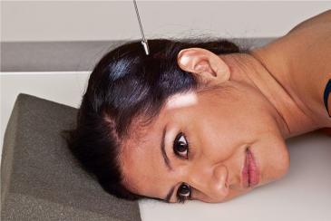
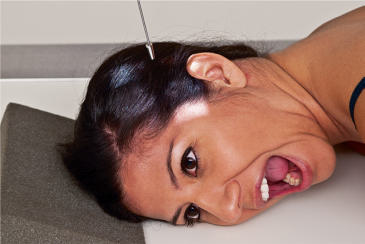
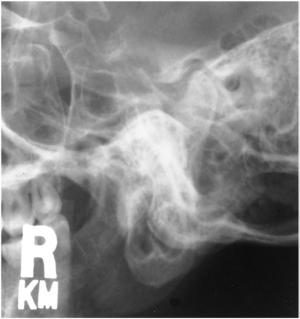
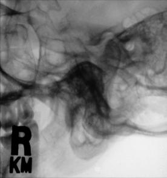

# Rx TEMPOROMANDIBULAR JOINT AXIOLATERAL Oblică (MODIFIED LAW METHOD)

  📷 Radiografie Convențională (Rx)
  <strong>Actualizat:</strong> 2026-09-15
  <strong>Autor:</strong> Departamentul de Radiologie / Referință Bontrager

---

-   __1. Rezumat Clinic & Indicații__

    ---

    === "Indicații Clinice"

        - Abnormal relationship or range of motion between condyle and TM fossa

    === "Ghid Național IRIS"

        !!! info "Referință Primară: Ghidul Național IRIS (Ordinul MS 1342/2012)"
            - **Capitol Ghid IRIS:** *Ghidul Național IRIS*
            - **Grad de Recomandare:** **De verificat pe indicație; fără grad atribuit automat**
            - **Nivel de Iradiere Estimată:** `De verificat pentru examinarea și populația selectate`

            [:octicons-search-16: Deschide Ghidul IRIS](../../iris.md){ .md-button .md-button--primary } [:material-open-in-new: Aplicația Oficială PWA](https://radiologie-pediatrica.ro/iris/){ .md-button target="_blank" rel="noopener" }
-   __2. Poziționare & Centrare Fascicul__

    ---

    - **Poziție Pacient:** Pacient: Patient position is Ortostatism or semiprone (Ortostatism is preferred if patient’s condition allows). Rest lateral aspect of head against table/ upright imaging device surface, with side of interest closest to IR.; Regiune anatomică: Prevent tilt by maintaining iPl perpendicular to IR. MSP is parallel to IR to start. Align ioMl perpendicular to front edge of IR (Fig. 11.177). From Incidență de Profil (Lateral), rotate face toward iR 15° (with MSP of head rotated 15° from plane of IR). Closed- and openmouth projections are often taken to demonstrate range of motion of the Articulații Temporomandibulare (ATM) (Fig. 11.178).
    - **Punct de Centrare Fascicul:** Angle CR 15° caudad, centered to 1½ inches (4 cm) superior to upside EAM (to pass through downside Articulații Temporomandibulare (ATM)). Center IR to projected CR.
    - **Distanță Focar-Film (DFF / SID):** 100 cm
    - **Comandă Respiratorie:** Suspend respiration. TEMPOROMANDIBULAR JOINTS ROUTINE AP axial (modified Incidență AP Axială (Metoda Towne)) SPECIAL Axiolateral 15° oblique (modified law method) Axiolateral (Schuller) Orthopantomography

-   __3. Parametri Tehnici Expunere__

    ---

    | Parametru Tehnic | Valoare Configurare Generator / Tub |
    |:-----------------|:-------------------------------------|
    | **Tensiune Tub (kV)** | 75-85 kV |
    | **Sarcină / Produs Curent-Timp (mAs)** | DE CONFIGURAT PE APARAT |
    | **Distanță Focar-Film (DFF / SID)** | 100 cm |
    | **Grilă Antidifuzoare (Bucky)** | Cu grilă antidifuzoare Bucky |
    | **Dimensiune Focar** | Focar Mic (0.6 mm) |
    | **Camere de Ionizare AEC** | Camerele laterale (sau camera centrală funcție de regiune) |
    | **Colimare Fascicul** | Collimate on four sides to anatomy of interest. |
    | **Filtrare Tub** | Totală ≥ 2.5 mm Al echivalent |

-   __4. Criterii de Calitate & Reușită Imagine__

    ---

    - Articulații Temporomandibulare (ATM) nearest IR is visible.
    - Closedmouth image demonstrates condyle within mandibular fossa; the condyle moves to the anterior margin (articular tubercle) of the mandibular fossa in the openmouth position (Figs. 11.179 and 11.180). Position:
    - Correctly positioned images demonstrate Articulații Temporomandibulare (ATM) closest to IR clearly, without superimposition of opposite Articulații Temporomandibulare (ATM) (15° rotation prevents superimposition).
    - Articulații Temporomandibulare (ATM) of interest is not superimposed by Coloană Cervicală.
    - Collimation to area of interest. Exposure:
    - Optimal image receptor exposure and contrast are sufficient to visualize Articulații Temporomandibulare (ATM).
    - Sharp bony margins indicate no motion. Fig. 11.179 Articulații Temporomandibulare (ATM)—closed mouth. Right condyle Right EAM Right Articulații Temporomandibulare (ATM) (downside, side of interest) Fig. 11.180 Articulații Temporomandibulare (ATM)—closed mouth. Fig. 11.177 Right Articulații Temporomandibulare (ATM)—closed mouth; 15° oblique; CR 15° caudad. Fig. 11.178 Right Articulații Temporomandibulare (ATM)—open mouth; 15° oblique; CR 15° caudad.

-   __5. Protecție Radiologică (ALARA)__

    ---

    - Ecranare gonadică și a organelor radiosensibile conform procedurilor locale de radioprotecție ALARA.
    - Colimare strictă la aria de interes pentru limitarea radiației difuze.
    - Verificarea posibilității unei sarcini la pacientele de vârstă fertilă înainte de expunere.

### 🖼️ Imagini

<figure class="protocol-image-card" markdown>

<figcaption><strong>Fig. 11.179 Articulații Temporomandibulare (ATM)—closed mouth.</strong> — Poziționare pacient conform Ghidului Bontrager (Fig. 11.179 TMJ—closed mouth.)</figcaption>

</figure>

<figure class="protocol-image-card" markdown>

<figcaption><strong>Fig. 11.180 Articulații Temporomandibulare (ATM)—closed mouth.</strong> — Aspect radiografic de referință conform Ghidului Bontrager (Fig. 11.180 TMJ—closed mouth.)</figcaption>

</figure>

<figure class="protocol-image-card" markdown>

<figcaption><strong>Fig. 11.177 Right Articulații Temporomandibulare (ATM)—closed mouth; 15° oblique; CR 15° caudad.</strong> — Aspect radiografic de referință conform Ghidului Bontrager (Fig. 11.177 Right TMJ—closed mouth; 15° oblique; CR 15° caudad.)</figcaption>

</figure>

<figure class="protocol-image-card" markdown>

<figcaption><strong>Fig. 11.178 Right Articulații Temporomandibulare (ATM)—open mouth; 15° oblique; CR 15° caudad.</strong> — Aspect radiografic de referință conform Ghidului Bontrager (Fig. 11.178 Right TMJ—open mouth; 15° oblique; CR 15° caudad.)</figcaption>

</figure>

=== "Ghid Rapid de Execuție"

    1. **Identificarea și verificarea pacientului:** verificare identitate, zonă de examinat, consimțământ conform procedurii și evaluarea posibilității unei sarcini, când este relevantă.
    2. **Pregătire:** îndepărtarea oricăror obiecte radiopace (bijuterii, agrafe, fermoare, proteze, pansamente dense).
    3. **Poziționare precisă:** alinierea receptorului de imagine și a tubului la distanța prescrisă (100 cm).
    4. **Colimare strictă:** adaptarea fasciculului strict la regiunea de diagnostic pentru scăderea iradierii și reducerea radiației difuze.
    5. **Radioprotecție:** verificarea [politicii RX](../radioprotectie.md), cu măsuri distincte pentru pacient, personal și însoțitor.

## Surse de documentare

- [Bontrager's Textbook of Radiographic Positioning (Ed. 9/10), Pagina 461](https://www.elsevier.com/books/textbook-of-radiographic-positioning-and-related-anatomy/lampignano/978-0-323-65367-1)
