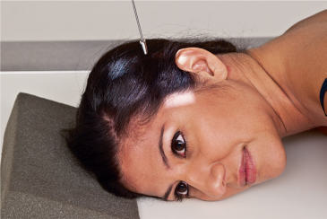
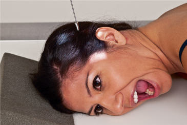
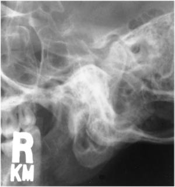
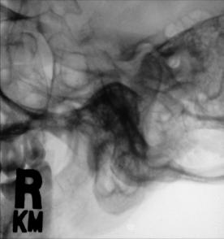

# Radiografia articulației temporomandibulare, incidență axiolaterală oblică (METODA LAW MODIFICATĂ)

  📷 Radiografie Convențională (Rx)
  <strong>Actualizat:</strong> 2026-09-15
  <strong>Autor:</strong> Departamentul de Radiologie / Referință Bontrager

---

-   __1. Rezumat Clinic & Indicații__

    ---

    === "Indicații Clinice"

        - Relație anormală sau amplitudine anormală a mișcării între condil și fosa ATM

    === "Ghid Național IRIS"

        !!! info "Referință Primară: Ghidul Național IRIS (Ordinul MS 1342/2012)"
            - **Capitol Ghid IRIS:** *Traumatisme — Față și orbite*
            - **Grad de Recomandare:** **Grad B**
            - **Nivel de Iradiere Estimată:** `Clasa 1 (Minimă < 0.1 mSv)`

            [:octicons-search-16: Deschide Ghidul IRIS](../../iris.md){ .md-button .md-button--primary } [:material-open-in-new: Aplicația Oficială PWA](https://radiologie-pediatrica.ro/iris/){ .md-button target="_blank" rel="noopener" }

-   __2. Poziționare & Centrare Fascicul__

    ---

    - **Poziție Pacient:** Pacient: pacientul este în ortostatism sau în poziție semipronă (ortostatismul este preferat dacă starea pacientului permite). Se sprijină aspectul lateral al capului pe masă/pe suprafața dispozitivului de imagistică în ortostatism, cu partea de interes cel mai aproape de receptorul de imagine. Regiune anatomică: se previne înclinarea prin menținerea liniei interpupilare (LIP) perpendiculară pe receptorul de imagine. MSP este paralel cu receptorul de imagine la început. Se aliniază linia infraorbitomeatală (LIOM) perpendicular pe marginea anterioară a receptorului de imagine (Fig. 11.177). Din incidență de profil (lateral), se rotește fața spre receptorul de imagine cu 15° (cu MSP al capului rotit cu 15° față de planul receptorului de imagine). Incidențele cu gura închisă și deschisă sunt efectuate frecvent pentru a evidenția amplitudinea mișcării articulațiilor temporomandibulare (ATM) (Fig. 11.178).
    - **Punct de Centrare Fascicul:** Raza centrală se înclină 15° caudal (spre picioare), centrată la 1½ țoli (4 cm) superior față de conductul auditiv extern (CAE) de partea superioară, pentru a trece prin articulația temporomandibulară (ATM) de partea inferioară. Se centrează receptorul de imagine pe proiecția razei centrale.
    - **Distanță Focar-Film (DFF / SID):** 100 cm
    - **Comandă Respiratorie:** Apnee pe durata expunerii. ARTICULAȚII TEMPOROMANDIBULARE DE RUTINĂ AP axială (incidență AP axială modificată (metoda Towne)) SPECIALĂ Axiolaterală oblică la 15° (metoda Law modificată) Axiolaterală (Schuller) Ortopantomografie

-   __3. Parametri Tehnici Expunere__

    ---

    | Parametru Tehnic | Valoare Configurare Generator / Tub |
    |:-----------------|:-------------------------------------|
    | **Tensiune Tub (kV)** | 75-85 kV |
    | **Sarcină / Produs Curent-Timp (mAs)** | DE CONFIGURAT PE APARAT |
    | **Distanță Focar-Film (DFF / SID)** | 100 cm |
    | **Grilă Antidifuzoare (Bucky)** | Cu grilă antidifuzoare Bucky |
    | **Dimensiune Focar** | Focar Mic (0.6 mm) |
    | **Camere de Ionizare AEC** | Camerele laterale (sau camera centrală, în funcție de regiune) |
    | **Colimare Fascicul** | Colimați pe cele patru laturi la anatomia de interes. |
    | **Filtrare Tub** | Totală ≥ 2.5 mm Al echivalent |

-   __4. Criterii de Calitate & Reușită Imagine__

    ---

    - Este vizibilă articulația temporomandibulară (ATM) cea mai apropiată de receptorul de imagine.
    - Imaginea cu gura închisă evidențiază condilul în fosa mandibulară; condilul se deplasează la marginea anterioară (tuberculul articular) a fosei mandibulare în poziția cu gura deschisă (Fig. 11.179 și 11.180). Poziție:
    - Imaginile poziționate corect evidențiază clar articulația temporomandibulară (ATM) cea mai apropiată de receptorul de imagine, fără suprapunerea articulației temporomandibulare (ATM) opuse (rotația de 15° previne suprapunerea).
    - Articulația temporomandibulară (ATM) de interes nu este suprapusă de coloana cervicală.
    - Colimare la aria de interes diagnostic. Expunere:
    - Expunerea și contrastul optime ale receptorului de imagine sunt suficiente pentru vizualizarea articulației temporomandibulare (ATM).
    - Marginile osoase nete indică absența mișcării. Fig. 11.179 Articulația temporomandibulară (ATM)—gură închisă. condil drept conduct auditiv extern (CAE) drept ATM dreaptă (de partea inferioară, partea de interes) Fig. 11.180 Articulația temporomandibulară (ATM)—gură închisă. Fig. 11.177 ATM dreaptă—gură închisă; oblică la 15°; raza centrală 15° caudal. Fig. 11.178 ATM dreaptă—gură deschisă (transorală); oblică la 15°; raza centrală 15° caudal.

-   __5. Protecție Radiologică (ALARA)__

    ---

    - Ecranare gonadică și a organelor radiosensibile conform procedurilor locale de radioprotecție ALARA.
    - Colimare strictă la aria de interes pentru limitarea radiației difuze.
    - Verificarea posibilității unei sarcini la pacientele de vârstă fertilă înainte de expunere.

### 🖼️ Imagini

<figure class="protocol-image-card" markdown>

<figcaption><strong>Fig. 11.179 Articulația temporomandibulară (ATM)—gură închisă.</strong> — Poziționarea pacientului conform Ghidului Bontrager (Fig. 11.179 ATM—gură închisă.)</figcaption>

</figure>

<figure class="protocol-image-card" markdown>

<figcaption><strong>Fig. 11.180 Articulația temporomandibulară (ATM)—gură închisă.</strong> — Aspect radiografic de referință conform Ghidului Bontrager (Fig. 11.180 ATM—gură închisă.)</figcaption>

</figure>

<figure class="protocol-image-card" markdown>

<figcaption><strong>Fig. 11.177 ATM dreaptă—gură închisă; oblică la 15°; raza centrală 15° caudal.</strong> — Aspect radiografic de referință conform Ghidului Bontrager (Fig. 11.177 ATM dreaptă—gură închisă; oblică la 15°; raza centrală 15° caudal.)</figcaption>

</figure>

<figure class="protocol-image-card" markdown>

<figcaption><strong>Fig. 11.178 ATM dreaptă—gură deschisă (transorală); oblică la 15°; raza centrală 15° caudal.</strong> — Aspect radiografic de referință conform Ghidului Bontrager (Fig. 11.178 ATM dreaptă—gură deschisă (transorală); oblică la 15°; raza centrală 15° caudal.)</figcaption>

</figure>

=== "Ghid Rapid de Execuție"

    1. **Identificarea și verificarea pacientului:** verificare identitate, zonă de examinat, consimțământ conform procedurii și evaluarea posibilității unei sarcini, când este relevantă.
    2. **Pregătire:** îndepărtarea oricăror obiecte radiopace (bijuterii, agrafe, fermoare, proteze, pansamente dense).
    3. **Poziționare precisă:** alinierea receptorului de imagine și a tubului la distanța prescrisă (100 cm).
    4. **Colimare strictă:** adaptarea fasciculului strict la regiunea de diagnostic pentru scăderea iradierii și reducerea radiației difuze.
    5. **Radioprotecție:** verificarea [politicii RX](../radioprotectie.md), cu măsuri distincte pentru pacient, personal și însoțitor.

## Surse de documentare

- [Bontrager's Textbook of Radiographic Positioning (Ed. 9/10), Pagina 461](https://www.elsevier.com/books/textbook-of-radiographic-positioning-and-related-anatomy/lampignano/978-0-323-65367-1)
