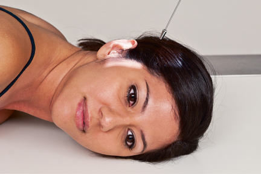
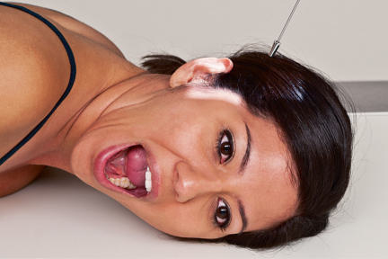
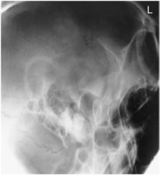
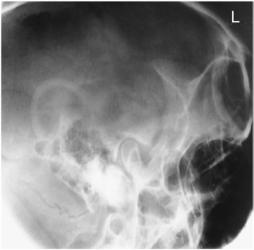
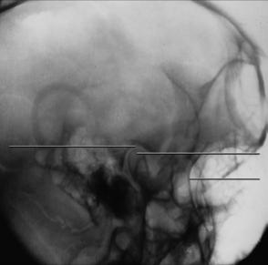

# Rx TEMPOROMANDIBULAR JOINT AXIOLATERAL Incidență (SCHULLER METHOD)

  📷 Radiografie Convențională (Rx)
  <strong>Actualizat:</strong> 2026-09-15
  <strong>Autor:</strong> Departamentul de Radiologie / Referință Bontrager

---

-   __1. Rezumat Clinic & Indicații__

    ---

    === "Indicații Clinice"

        - Abnormal relationship sau range de mișcare între condyle și TM fossa

    === "Ghid Național IRIS"

        !!! info "Referință Primară: Ghidul Național IRIS (Ordinul MS 1342/2012)"
            - **Capitol Ghid IRIS:** *Ghidul Național IRIS*
            - **Grad de Recomandare:** **De verificat pe indicație; fără grad atribuit automat**
            - **Nivel de Iradiere Estimată:** `De verificat pentru examinarea și populația selectate`

            [:octicons-search-16: Deschide Ghidul IRIS](../../iris.md){ .md-button .md-button--primary } [:material-open-in-new: Aplicația Oficială PWA](https://radiologie-pediatrica.ro/iris/){ .md-button target="_blank" rel="noopener" }
-   __2. Poziționare & Centrare Fascicul__

    ---

    - **Poziție Pacient:** Pacient: poziție pacient Ortostatism sau semiprone. Place capul în true Incidență de Profil (lateral), cu side de interest nearest receptorul de imagine.; Regiune anatomică: Adjust cap into true Incidență de Profil (lateral) și move pacient’s corp în oblic direction, ca needed pentru pacient’s comfort. Align linie interpupilară (LIP) perpendicular pe receptorul de imagine. Align MsP paralel cu table/imaging device surface. poziție linie infraorbitomeatală (LIOM) perpendicular la front edge de receptorul de imagine (Fig. 11.181). Closed- și openmouth incidențe sunt often taken la evidențiază range de mișcare de Articulații Temporomandibulare (ATM) (Fig. 11.182).
    - **Punct de Centrare Fascicul:** Raza centrală se înclină 25°–30° caudal (spre picioare), centrat pe ½ inch (1.3 cm) anterior și 2 inches (5 cm) superior la upside conduct auditiv extern (CAE). Center receptorul de imagine la projected Articulații Temporomandibulare (ATM).
    - **Distanță Focar-Film (DFF / SID):** 100 cm
    - **Comandă Respiratorie:** Apnee pe durata expunerii.

-   __3. Parametri Tehnici Expunere__

    ---

    | Parametru Tehnic | Valoare Configurare Generator / Tub |
    |:-----------------|:-------------------------------------|
    | **Tensiune Tub (kV)** | 75-85 kV |
    | **Sarcină / Produs Curent-Timp (mAs)** | DE CONFIGURAT PE APARAT |
    | **Distanță Focar-Film (DFF / SID)** | 100 cm |
    | **Grilă Antidifuzoare (Bucky)** | Cu grilă antidifuzoare Bucky |
    | **Dimensiune Focar** | Focar Mic (0.6 mm) |
    | **Camere de Ionizare AEC** | Camerele laterale (sau camera centrală funcție de regiune) |
    | **Colimare Fascicul** | Collimate pe four sides la anatomy de interest. |
    | **Filtrare Tub** | Totală ≥ 2.5 mm Al echivalent |

-   __4. Criterii de Calitate & Reușită Imagine__

    ---

    - Articulații Temporomandibulare (ATM) nearest receptorul de imagine este vizibil.
    - Closedmouth imagine (Figs. 11.183 și 11.184) evidențiază condyle within mandibular fossa; condyle moves la anterior margin (articular tubercle) de fossa în openmouth poziție (Fig. 11.185). poziție:
    - TMJs sunt evidențiat fără rotație, ca evidenced prin superimposed lateral margins.
    - Collimation la aria de interes diagnostic. expunere:
    - optim receptorul de imagine expunere și contrast sunt sufficient la visualize Articulații Temporomandibulare (ATM).
    - net bony margins indicate fără mișcare. TEMPOROMANDIBULAR articulații ROUTINE
    - AP axial (modified Incidență AP Axială (Metoda Towne)) SPECIAL
    - Axiolateral 15° oblic (modified law method)
    - Axiolateral (Schuller method)
    - Orthopantomography Fig. 11.181 stâng Articulații Temporomandibulare (ATM)—gură închisă; true lateral, raza centrală 25° la 30° caudal angle. Fig. 11.182 stâng Articulații Temporomandibulare (ATM)—gură deschisă (transorală); true lateral, raza centrală 25° la 30° caudal angle. Fig. 11.185 gură deschisă (transorală). Fig. 11.183 gură închisă. stâng condyle L lateral orbital margin stâng temporomandibular fossa Fig. 11.184 gură închisă.

-   __5. Protecție Radiologică (ALARA)__

    ---

    - Ecranare gonadică și a organelor radiosensibile conform procedurilor locale de radioprotecție ALARA.
    - Colimare strictă la aria de interes pentru limitarea radiației difuze.
    - Verificarea posibilității unei sarcini la pacientele de vârstă fertilă înainte de expunere.

### 🖼️ Imagini

<figure class="protocol-image-card" markdown>

<figcaption><strong>Fig. 11.181 stâng Articulații Temporomandibulare (ATM)—gură închisă; true lateral, raza centrală 25° la 30°</strong> — Poziționare pacient conform Ghidului Bontrager (Fig. 11.181 stâng TMJ—gură închisă; true lateral, raza centrală 25° la 30°)</figcaption>

</figure>

<figure class="protocol-image-card" markdown>

<figcaption><strong>Fig. 11.182 stâng Articulații Temporomandibulare (ATM)—gură deschisă (transorală); true lateral, raza centrală 25° la 30°</strong> — Aspect radiografic de referință conform Ghidului Bontrager (Fig. 11.182 stâng TMJ—gură deschisă (transorală); true lateral, raza centrală 25° la 30°)</figcaption>

</figure>

<figure class="protocol-image-card" markdown>

<figcaption><strong>Fig. 11.185 gură deschisă (transorală).</strong> — Aspect radiografic de referință conform Ghidului Bontrager (Fig. 11.185 gură deschisă (transorală).)</figcaption>

</figure>

<figure class="protocol-image-card" markdown>

<figcaption><strong>Fig. 11.183 gură închisă.</strong> — Aspect radiografic de referință conform Ghidului Bontrager (Fig. 11.183 gură închisă.)</figcaption>

</figure>

<figure class="protocol-image-card" markdown>

<figcaption><strong>Fig. 11.184 gură închisă.</strong> — Aspect radiografic de referință conform Ghidului Bontrager (Fig. 11.184 gură închisă.)</figcaption>

</figure>

=== "Ghid Rapid de Execuție"

    1. **Identificarea și verificarea pacientului:** verificare identitate, zonă de examinat, consimțământ conform procedurii și evaluarea posibilității unei sarcini, când este relevantă.
    2. **Pregătire:** îndepărtarea oricăror obiecte radiopace (bijuterii, agrafe, fermoare, proteze, pansamente dense).
    3. **Poziționare precisă:** alinierea receptorului de imagine și a tubului la distanța prescrisă (100 cm).
    4. **Colimare strictă:** adaptarea fasciculului strict la regiunea de diagnostic pentru scăderea iradierii și reducerea radiației difuze.
    5. **Radioprotecție:** verificarea [politicii RX](../radioprotectie.md), cu măsuri distincte pentru pacient, personal și însoțitor.

## Surse de documentare

- [Bontrager's Textbook of Radiographic Positioning (Ed. 9/10), Pagina 462](https://www.elsevier.com/books/textbook-of-radiographic-positioning-and-related-anatomy/lampignano/978-0-323-65367-1)
