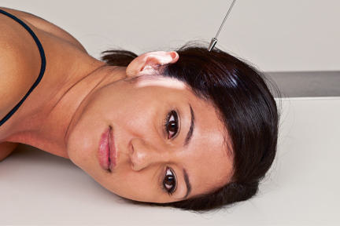
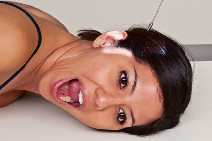
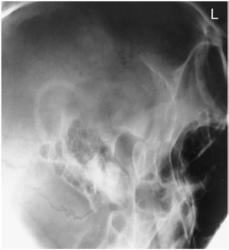
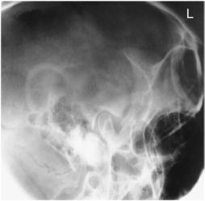
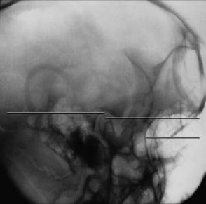

# Radiografia articulației temporomandibulare, incidență axiolaterală (METODA SCHULLER)

  📷 Radiografie Convențională (Rx)
  <strong>Actualizat:</strong> 2026-09-15
  <strong>Autor:</strong> Departamentul de Radiologie / Referință Bontrager

---

-   __1. Rezumat Clinic & Indicații__

    ---

    === "Indicații Clinice"

        - Relație anormală sau amplitudine anormală a mișcării între condil și fosa ATM

    === "Ghid Național IRIS"

        !!! info "Referință Primară: Ghidul Național IRIS (Ordinul MS 1342/2012)"
            - **Capitol Ghid IRIS:** *Traumatisme — Față și orbite*
            - **Grad de Recomandare:** **Grad B**
            - **Nivel de Iradiere Estimată:** `Clasa 1 (Minimă < 0.1 mSv)`

            [:octicons-search-16: Deschide Ghidul IRIS](../../iris.md){ .md-button .md-button--primary } [:material-open-in-new: Aplicația Oficială PWA](https://radiologie-pediatrica.ro/iris/){ .md-button target="_blank" rel="noopener" }

-   __2. Poziționare & Centrare Fascicul__

    ---

    - **Poziție Pacient:** Pacient: poziția pacientului este în ortostatism sau semipronă. Se plasează capul în incidență de profil adevărată (laterală), cu partea de interes cel mai aproape de receptorul de imagine. Regiune anatomică: se ajustează capul în incidență de profil adevărată (laterală) și se deplasează corpul pacientului în direcție oblică, după cum este necesar pentru confortul pacientului. Se aliniază linia interpupilară (LIP) perpendicular pe receptorul de imagine. Se aliniază MSP paralel cu suprafața mesei/dispozitivului de imagistică. Poziție: linia infraorbitomeatală (LIOM) perpendiculară pe marginea anterioară a receptorului de imagine (Fig. 11.181). Incidențele cu gura închisă și deschisă sunt efectuate frecvent pentru a evidenția amplitudinea mișcării articulațiilor temporomandibulare (ATM) (Fig. 11.182).
    - **Punct de Centrare Fascicul:** Raza centrală se înclină 25°–30° caudal (spre picioare), centrată la ½ țol (1.3 cm) anterior și 2 țoli (5 cm) superior față de conductul auditiv extern (CAE) de partea superioară. Se centrează receptorul de imagine pe ATM proiectată.
    - **Distanță Focar-Film (DFF / SID):** 100 cm
    - **Comandă Respiratorie:** Apnee pe durata expunerii.

-   __3. Parametri Tehnici Expunere__

    ---

    | Parametru Tehnic | Valoare Configurare Generator / Tub |
    |:-----------------|:-------------------------------------|
    | **Tensiune Tub (kV)** | 75-85 kV |
    | **Sarcină / Produs Curent-Timp (mAs)** | DE CONFIGURAT PE APARAT |
    | **Distanță Focar-Film (DFF / SID)** | 100 cm |
    | **Grilă Antidifuzoare (Bucky)** | Cu grilă antidifuzoare Bucky |
    | **Dimensiune Focar** | Focar Mic (0.6 mm) |
    | **Camere de Ionizare AEC** | Camerele laterale (sau camera centrală, în funcție de regiune) |
    | **Colimare Fascicul** | Colimați pe cele patru laturi la anatomia de interes. |
    | **Filtrare Tub** | Totală ≥ 2.5 mm Al echivalent |

-   __4. Criterii de Calitate & Reușită Imagine__

    ---

    - Este vizibilă articulația temporomandibulară (ATM) cea mai apropiată de receptorul de imagine.
    - Imaginea cu gura închisă (Fig. 11.183 și 11.184) evidențiază condilul în fosa mandibulară; condilul se deplasează la marginea anterioară (tuberculul articular) a fosei în poziția cu gura deschisă (Fig. 11.185). Poziție:
    - ATM sunt evidențiate fără rotație, după cum indică marginile laterale suprapuse.
    - Colimare la aria de interes diagnostic. Expunere:
    - Expunerea și contrastul optime ale receptorului de imagine sunt suficiente pentru vizualizarea articulației temporomandibulare (ATM).
    - Marginile osoase nete indică absența mișcării. ARTICULAȚII TEMPOROMANDIBULARE DE RUTINĂ
    - AP axială (incidență AP axială modificată (metoda Towne)) SPECIALĂ
    - Axiolaterală oblică la 15° (metoda Law modificată)
    - Axiolaterală (metoda Schuller)
    - Ortopantomografie Fig. 11.181 ATM stângă—gură închisă; profil adevărat, unghiul razei centrale 25° la 30° caudal. Fig. 11.182 ATM stângă—gură deschisă (transorală); profil adevărat, unghiul razei centrale 25° la 30° caudal. Fig. 11.185 gură deschisă (transorală). Fig. 11.183 gură închisă. condil stâng L marginea orbitală laterală stângă fosa temporomandibulară stângă Fig. 11.184 gură închisă.

-   __5. Protecție Radiologică (ALARA)__

    ---

    - Ecranare gonadică și a organelor radiosensibile conform procedurilor locale de radioprotecție ALARA.
    - Colimare strictă la aria de interes pentru limitarea radiației difuze.
    - Verificarea posibilității unei sarcini la pacientele de vârstă fertilă înainte de expunere.

### 🖼️ Imagini

<figure class="protocol-image-card" markdown>

<figcaption><strong>Fig. 11.181 ATM stângă—gură închisă; profil adevărat, raza centrală 25° la 30°</strong> — Poziționarea pacientului conform Ghidului Bontrager (Fig. 11.181 ATM stângă—gură închisă; profil adevărat, raza centrală 25° la 30°)</figcaption>

</figure>

<figure class="protocol-image-card" markdown>

<figcaption><strong>Fig. 11.182 ATM stângă—gură deschisă (transorală); profil adevărat, raza centrală 25° la 30°</strong> — Aspect radiografic de referință conform Ghidului Bontrager (Fig. 11.182 TMJ stângă — gură deschisă (transorală); profil adevărat, raza centrală 25° la 30°)</figcaption>

</figure>

<figure class="protocol-image-card" markdown>

<figcaption><strong>Fig. 11.185 gură deschisă (transorală).</strong> — Aspect radiografic de referință conform Ghidului Bontrager (Fig. 11.185 gură deschisă (transorală).)</figcaption>

</figure>

<figure class="protocol-image-card" markdown>

<figcaption><strong>Fig. 11.183 gură închisă.</strong> — Aspect radiografic de referință conform Ghidului Bontrager (Fig. 11.183 gură închisă.)</figcaption>

</figure>

<figure class="protocol-image-card" markdown>

<figcaption><strong>Fig. 11.184 gură închisă.</strong> — Aspect radiografic de referință conform Ghidului Bontrager (Fig. 11.184 gură închisă.)</figcaption>

</figure>

=== "Ghid Rapid de Execuție"

    1. **Identificarea și verificarea pacientului:** verificare identitate, zonă de examinat, consimțământ conform procedurii și evaluarea posibilității unei sarcini, când este relevantă.
    2. **Pregătire:** îndepărtarea oricăror obiecte radiopace (bijuterii, agrafe, fermoare, proteze, pansamente dense).
    3. **Poziționare precisă:** alinierea receptorului de imagine și a tubului la distanța prescrisă (100 cm).
    4. **Colimare strictă:** adaptarea fasciculului strict la regiunea de diagnostic pentru scăderea iradierii și reducerea radiației difuze.
    5. **Radioprotecție:** verificarea [politicii RX](../radioprotectie.md), cu măsuri distincte pentru pacient, personal și însoțitor.

## Surse de documentare

- [Bontrager's Textbook of Radiographic Positioning (Ed. 9/10), Pagina 462](https://www.elsevier.com/books/textbook-of-radiographic-positioning-and-related-anatomy/lampignano/978-0-323-65367-1)
