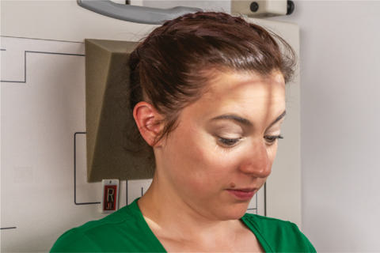
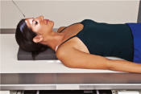
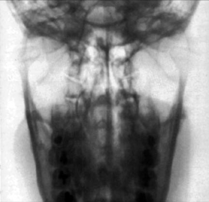

# Rx TEMPOROMANDIBULAR JOINTS AP Axială (MODIFIED Incidență AP Axială (Metoda Towne))

  📷 Radiografie Convențională (Rx)
  <strong>Actualizat:</strong> 2026-09-15
  <strong>Autor:</strong> Departamentul de Radiologie / Referință Bontrager

---

-   __1. Rezumat Clinic & Indicații__

    ---

    === "Indicații Clinice"

        - suspiciune de fractură și abnormal relationship sau range de mișcare între condyle și TM fossa. See NOTE 1 pe openmouth și closedmouth comparisons.

    === "Ghid Național IRIS"

        !!! info "Referință Primară: Ghidul Național IRIS (Ordinul MS 1342/2012)"
            - **Capitol Ghid IRIS:** *Ghidul Național IRIS*
            - **Grad de Recomandare:** **De verificat pe indicație; fără grad atribuit automat**
            - **Nivel de Iradiere Estimată:** `De verificat pentru examinarea și populația selectate`

            [:octicons-search-16: Deschide Ghidul IRIS](../../iris.md){ .md-button .md-button--primary } [:material-open-in-new: Aplicația Oficială PWA](https://radiologie-pediatrica.ro/iris/){ .md-button target="_blank" rel="noopener" }
-   __2. Poziționare & Centrare Fascicul__

    ---

    - **Poziție Pacient:** Pacient: Se îndepărtează toate obiectele metalice sau din plastic din regiunea capului și gâtului. poziție pacient Ortostatism sau Decubit dorsal.; Regiune anatomică: Rest pacient’s posterior Craniu against table/în ortostatism imaging device surface. Tuck chin, bringing linie orbitomeatală (LOM) perpendicular la table/imaging device surface sau bringing linie infraorbitomeatală (LIOM) perpendicular și increasing raza centrală angle prin 7° (Fig. 11.175). Align MsP perpendicular la linia mediană grilă sau masa de examinare/ în ortostatism imaging device surface la prevent cap rotație sau tilt.
    - **Punct de Centrare Fascicul:** Raza centrală se înclină 35° caudal (spre picioare) de la linie orbitomeatală (LOM) sau 42° de la linie infraorbitomeatală (LIOM) (see NOTE 2). Direct raza centrală 3 inches (7.5 cm) superior la nazion. Se centrează receptorul de imagine pe proiecția razei centrale.
    - **Distanță Focar-Film (DFF / SID):** 100 cm
    - **Comandă Respiratorie:** Apnee pe durata expunerii.

-   __3. Parametri Tehnici Expunere__

    ---

    | Parametru Tehnic | Valoare Configurare Generator / Tub |
    |:-----------------|:-------------------------------------|
    | **Tensiune Tub (kV)** | 75-85 kV |
    | **Sarcină / Produs Curent-Timp (mAs)** | DE CONFIGURAT PE APARAT |
    | **Distanță Focar-Film (DFF / SID)** | 100 cm |
    | **Grilă Antidifuzoare (Bucky)** | Cu grilă antidifuzoare Bucky |
    | **Dimensiune Focar** | Focar Mic (0.6 mm) |
    | **Camere de Ionizare AEC** | Camerele laterale (sau camera centrală funcție de regiune) |
    | **Colimare Fascicul** | Collimate pe four sides la anatomy de interest. |
    | **Filtrare Tub** | Totală ≥ 2.5 mm Al echivalent |

-   __4. Criterii de Calitate & Reușită Imagine__

    ---

    - Condyloid processes de Mandibulă și TM fossae sunt evidențiat (Fig. 11.176). poziție:
    - Correctly poziționat pacient, cu Absența rotației anatomice: clavicule echidistante față de linia apofizelor spinoase, este indicated prin following: condyloid processes visualized symmetrically, lateral la Coloană Cervicală; clear visualization de condyle și TM fossae relationship.
    - Collimation la aria de interes diagnostic. expunere:
    - optim receptorul de imagine expunere și contrast sunt sufficient la visualize condyloid process și TM fossa.
    - net bony margins indicate fără mișcare. Fig. 11.175 AP axial—raza centrală 35° la linie orbitomeatală (LOM) (closedmouth poziție) sau 42° la linie infraorbitomeatală (LIOM) (inset). R Fig. 11.176 AP axial (closedmouth poziție).

-   __5. Protecție Radiologică (ALARA)__

    ---

    - Ecranare gonadică și a organelor radiosensibile conform procedurilor locale de radioprotecție ALARA.
    - Colimare strictă la aria de interes pentru limitarea radiației difuze.
    - Verificarea posibilității unei sarcini la pacientele de vârstă fertilă înainte de expunere.

!!! note "Observații Clinice & Tehnice"
    additional 5° increase în raza centrală poate best evidențiază TM fossae și TMJs. TEMPOROMANDIBULAR articulații ROUTINE AP axial (modified Incidență AP Axială (Metoda Towne)) SPECIAL Axiolateral oblic (modified law method) Axiolateral (Schuller method) Orthopantomography

### 🖼️ Imagini

<figure class="protocol-image-card" markdown>

<figcaption><strong>Fig. 11.175 AP axial—raza centrală 35° la linie orbitomeatală (LOM) (closed-</strong> — Poziționare pacient conform Ghidului Bontrager (Fig. 11.175 AP axial—raza centrală 35° la linie orbitomeatală (LOM) (closed-)</figcaption>

</figure>

<figure class="protocol-image-card" markdown>

<figcaption><strong>Fig. 11.176 AP axial (closed-</strong> — Aspect radiografic de referință conform Ghidului Bontrager (Fig. 11.176 AP axial (closed-)</figcaption>

</figure>

<figure class="protocol-image-card" markdown>

<figcaption><strong>Figura 3</strong> — Aspect radiografic de referință conform Ghidului Bontrager (Figura 3)</figcaption>

</figure>

=== "Ghid Rapid de Execuție"

    1. **Identificarea și verificarea pacientului:** verificare identitate, zonă de examinat, consimțământ conform procedurii și evaluarea posibilității unei sarcini, când este relevantă.
    2. **Pregătire:** îndepărtarea oricăror obiecte radiopace (bijuterii, agrafe, fermoare, proteze, pansamente dense).
    3. **Poziționare precisă:** alinierea receptorului de imagine și a tubului la distanța prescrisă (100 cm).
    4. **Colimare strictă:** adaptarea fasciculului strict la regiunea de diagnostic pentru scăderea iradierii și reducerea radiației difuze.
    5. **Radioprotecție:** verificarea [politicii RX](../radioprotectie.md), cu măsuri distincte pentru pacient, personal și însoțitor.

## Surse de documentare

- [Bontrager's Textbook of Radiographic Positioning (Ed. 9/10), Pagina 460](https://www.elsevier.com/books/textbook-of-radiographic-positioning-and-related-anatomy/lampignano/978-0-323-65367-1)
