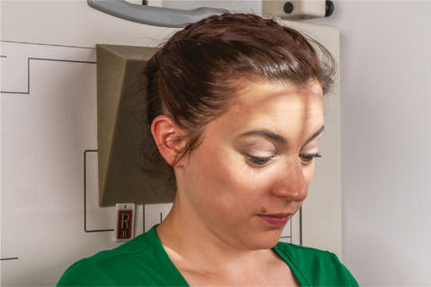
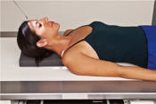
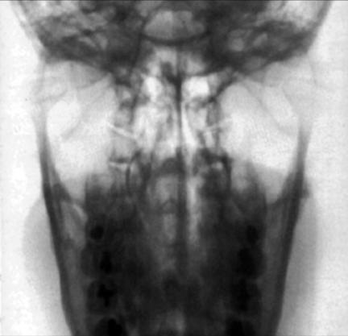

# Rx ARTICULAȚII TEMPOROMANDIBULARE AP axială (incidență AP axială modificată (metoda Towne))

  📷 Radiografie Convențională (Rx)
  <strong>Actualizat:</strong> 2026-09-15
  <strong>Autor:</strong> Departamentul de Radiologie / Referință Bontrager

---

-   __1. Rezumat Clinic & Indicații__

    ---

    === "Indicații Clinice"

        - suspiciune de fractură și relație anormală sau amplitudine a mișcării între condil și fosa TM. Vezi NOTA 1 pentru comparațiile cu gura deschisă și închisă.

    === "Ghid Național IRIS"

        !!! info "Referință Primară: Ghidul Național IRIS (Ordinul MS 1342/2012)"
            - **Capitol Ghid IRIS:** *Traumatisme — Față și orbite*
            - **Grad de Recomandare:** **Grad B**
            - **Nivel de Iradiere Estimată:** `Clasa 1 (Minimă < 0.1 mSv)`

            [:octicons-search-16: Deschide Ghidul IRIS](../../iris.md){ .md-button .md-button--primary } [:material-open-in-new: Aplicația Oficială PWA](https://radiologie-pediatrica.ro/iris/){ .md-button target="_blank" rel="noopener" }

-   __2. Poziționare & Centrare Fascicul__

    ---

    - **Poziție Pacient:** Pacient: Se îndepărtează toate obiectele metalice sau din plastic din regiunea capului și gâtului. Poziția pacientului: Ortostatism sau decubit dorsal.; Regiune anatomică: Sprijiniți partea posterioară a craniului pacientului pe suprafața mesei/dispozitivului de imagistică în ortostatism. Coborâți bărbia, aducând linia orbitomeatală (LOM) perpendiculară pe suprafața mesei/dispozitivului de imagistică sau aducând linia infraorbitomeatală (LIOM) perpendiculară și mărind unghiul razei centrale cu 7° (Fig. 11.175). Aliniați MSP perpendicular pe linia mediană a grilei sau a mesei de examinare/suprafața dispozitivului de imagistică în ortostatism pentru a preveni rotația sau înclinarea capului.
    - **Punct de Centrare Fascicul:** Raza centrală se înclină 35° caudal (spre picioare) de la linia orbitomeatală (LOM) sau 42° de la linia infraorbitomeatală (LIOM) (vezi NOTA 2). Direcționați raza centrală la 3 țoli (7.5 cm) superior de nazion. Centrați receptorul de imagine pe proiecția razei centrale.
    - **Distanță Focar-Film (DFF / SID):** 100 cm
    - **Comandă Respiratorie:** Apnee pe durata expunerii.

-   __3. Parametri Tehnici Expunere__

    ---

    | Parametru Tehnic | Valoare Configurare Generator / Tub |
    |:-----------------|:-------------------------------------|
    | **Tensiune Tub (kV)** | 75-85 kV |
    | **Sarcină / Produs Curent-Timp (mAs)** | DE CONFIGURAT PE APARAT |
    | **Distanță Focar-Film (DFF / SID)** | 100 cm |
    | **Grilă Antidifuzoare (Bucky)** | Cu grilă antidifuzoare Bucky |
    | **Dimensiune Focar** | Focar Mic (0.6 mm) |
    | **Camere de Ionizare AEC** | Camerele laterale (sau camera centrală, în funcție de regiune) |
    | **Colimare Fascicul** | Colimați pe cele patru laturi la anatomia de interes. |
    | **Filtrare Tub** | Totală ≥ 2.5 mm Al echivalent |

-   __4. Criterii de Calitate & Reușită Imagine__

    ---

    - Procesele condiliene ale mandibulei și fosele TM sunt evidențiate (Fig. 11.176). Poziție:
    - Poziționarea corectă a pacientului, cu absența rotației anatomice: claviculele echidistante față de linia apofizelor spinoase, este indicată prin următoarele: procesele condiliene vizualizate simetric, lateral față de coloana cervicală; vizualizarea clară a relației dintre condil și fosele TM.
    - Colimare la aria de interes diagnostic. Expunere:
    - Expunerea și contrastul optime ale receptorului de imagine sunt suficiente pentru vizualizarea procesului condilian și a fosei TM.
    - Marginile osoase clare indică absența mișcării. Fig. 11.175 AP axială — raza centrală 35° față de linia orbitomeatală (LOM) (poziția cu gura închisă) sau 42° față de linia infraorbitomeatală (LIOM) (detaliu). R Fig. 11.176 AP axială (poziția cu gura închisă).

-   __5. Protecție Radiologică (ALARA)__

    ---

    - Ecranare gonadică și a organelor radiosensibile conform procedurilor locale de radioprotecție ALARA.
    - Colimare strictă la aria de interes pentru limitarea radiației difuze.
    - Verificarea posibilității unei sarcini la pacientele de vârstă fertilă înainte de expunere.

!!! note "Observații Clinice & Tehnice"
    O creștere suplimentară de 5° a înclinării razei centrale poate evidenția mai bine fosele TM și articulațiile TM. ARTICULAȚII TEMPOROMANDIBULARE AP axială de rutină (incidență AP axială modificată (metoda Towne)) SPECIALĂ Axiolaterală oblică (metoda Law modificată) Axiolaterală (metoda Schuller) Ortopantomografie

### 🖼️ Imagini

<figure class="protocol-image-card" markdown>

<figcaption><strong>Fig. 11.175 AP axială — raza centrală 35° față de linia orbitomeatală (LOM) (poziția cu gura închisă —</strong> — Poziționarea pacientului conform Ghidului Bontrager (Fig. 11.175 AP axială — raza centrală 35° față de linia orbitomeatală (LOM) (poziția cu gura închisă —)</figcaption>

</figure>

<figure class="protocol-image-card" markdown>

<figcaption><strong>Fig. 11.176 AP axială (poziția cu gura închisă —</strong> — Aspect radiografic de referință conform Ghidului Bontrager (Fig. 11.176 AP axială (poziția cu gura închisă —)</figcaption>

</figure>

<figure class="protocol-image-card" markdown>

<figcaption><strong>Figura 3</strong> — Aspect radiografic de referință conform Ghidului Bontrager (Figura 3)</figcaption>

</figure>

=== "Ghid Rapid de Execuție"

    1. **Identificarea și verificarea pacientului:** verificare identitate, zonă de examinat, consimțământ conform procedurii și evaluarea posibilității unei sarcini, când este relevantă.
    2. **Pregătire:** îndepărtarea oricăror obiecte radiopace (bijuterii, agrafe, fermoare, proteze, pansamente dense).
    3. **Poziționare precisă:** alinierea receptorului de imagine și a tubului la distanța prescrisă (100 cm).
    4. **Colimare strictă:** adaptarea fasciculului strict la regiunea de diagnostic pentru scăderea iradierii și reducerea radiației difuze.
    5. **Radioprotecție:** verificarea [politicii RX](../radioprotectie.md), cu măsuri distincte pentru pacient, personal și însoțitor.

## Surse de documentare

- [Bontrager's Textbook of Radiographic Positioning (Ed. 9/10), Pagina 460](https://www.elsevier.com/books/textbook-of-radiographic-positioning-and-related-anatomy/lampignano/978-0-323-65367-1)
