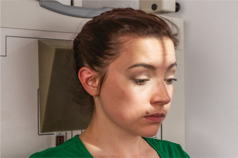
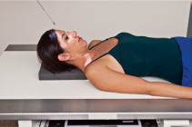
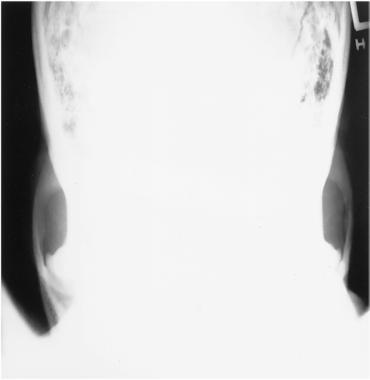
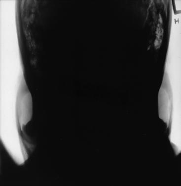

# Rx ZYGOMATIC ARCHES AP Axială (MODIFIED Incidență AP Axială (Metoda Towne))

  📷 Radiografie Convențională (Rx)
  <strong>Actualizat:</strong> 2026-09-15
  <strong>Autor:</strong> Departamentul de Radiologie / Referință Bontrager

---

-   __1. Rezumat Clinic & Indicații__

    ---

    === "Indicații Clinice"

        - suspiciune de fractură and neoplastic or inflammatory processes of zygomatic arch

    === "Ghid Național IRIS"

        !!! info "Referință Primară: Ghidul Național IRIS (Ordinul MS 1342/2012)"
            - **Capitol Ghid IRIS:** *Ghidul Național IRIS*
            - **Grad de Recomandare:** **De verificat pe indicație; fără grad atribuit automat**
            - **Nivel de Iradiere Estimată:** `De verificat pentru examinarea și populația selectate`

            [:octicons-search-16: Deschide Ghidul IRIS](../../iris.md){ .md-button .md-button--primary } [:material-open-in-new: Aplicația Oficială PWA](https://radiologie-pediatrica.ro/iris/){ .md-button target="_blank" rel="noopener" }
-   __2. Poziționare & Centrare Fascicul__

    ---

    - **Poziție Pacient:** Pacient: Remove all metallic or plastic objects from head and neck. Patient position is Ortostatism or Decubit Dorsal.; Regiune anatomică: Rest patient’s posterior Craniu against table/upright imaging device surface. Tuck chin, bringing oMl (or ioMl) perpendicular to IR (see
    - **Punct de Centrare Fascicul:** Angle CR 30° caudad to OML or 37° to IOML (see NOTE). Center CR to 1 inch (2.5 cm) superior to nasion (to pass through midarches) at level of the gonion. Center IR to projected CR.
    - **Distanță Focar-Film (DFF / SID):** 100 cm
    - **Comandă Respiratorie:** Suspend respiration.

-   __3. Parametri Tehnici Expunere__

    ---

    | Parametru Tehnic | Valoare Configurare Generator / Tub |
    |:-----------------|:-------------------------------------|
    | **Tensiune Tub (kV)** | 70-85 kV |
    | **Sarcină / Produs Curent-Timp (mAs)** | DE CONFIGURAT PE APARAT |
    | **Distanță Focar-Film (DFF / SID)** | 100 cm |
    | **Grilă Antidifuzoare (Bucky)** | Cu grilă antidifuzoare Bucky |
    | **Dimensiune Focar** | Focar Mic (0.6 mm) |
    | **Camere de Ionizare AEC** | Camerele laterale (sau camera centrală funcție de regiune) |
    | **Colimare Fascicul** | Collimate to outer margins of zygomatic arches. |
    | **Filtrare Tub** | Totală ≥ 2.5 mm Al echivalent |

-   __4. Criterii de Calitate & Reușită Imagine__

    ---

    - Bilateral zygomatic arches, free of superimposition, are demonstrated (Figs. 11.150 and 11.151). Position:
    - Zygomatic arches are visualized without patient rotation as indicated by symmetric appearance of arches bilaterally.
    - Collimation to area of interest. Exposure:
    - Optimal image receptor exposure and contrast are sufficient to visualize zygomatic arches.
    - Sharp bony margins indicate no motion. Fig. 11.149 AP axial—zygomatic arches—CR 30° to oMl (37° to IOML), Ortostatism and Decubit Dorsal (inset). Zygomatic arch Mastoid air cells Mandibular ramus Zygomatic arch Fig. 11.151 AP axial. Fig. 11.150 AP axial.

-   __5. Protecție Radiologică (ALARA)__

    ---

    - Ecranare gonadică și a organelor radiosensibile conform procedurilor locale de radioprotecție ALARA.
    - Colimare strictă la aria de interes pentru limitarea radiației difuze.
    - Verificarea posibilității unei sarcini la pacientele de vârstă fertilă înainte de expunere.

!!! note "Observații Clinice & Tehnice"
    If patient is unable to depress the chin sufficiently to bring OML perpendicular to IR, IOML can be placed perpendicular instead and CR angle increased to 37° caudad. This positioning maintains the 30° angle between OML and CR and demonstrates the same anatomic relationships. (A 7° difference is noted between OML and IOML.) ZYGOMATIC ARCHES ROUTINE SMV Oblique inferosuperior (tangential) AP axial (modified Incidență AP Axială (Metoda Towne))

### 🖼️ Imagini

<figure class="protocol-image-card" markdown>

<figcaption><strong>Fig. 11.149 AP axial—zygomatic arches—CR 30° to oMl (37° to</strong> — Poziționare pacient conform Ghidului Bontrager (Fig. 11.149 AP axial—zygomatic arches—CR 30° to oMl (37° to)</figcaption>

</figure>

<figure class="protocol-image-card" markdown>

<figcaption><strong>Fig. 11.151 AP axial.</strong> — Aspect radiografic de referință conform Ghidului Bontrager (Fig. 11.151 AP axial.)</figcaption>

</figure>

<figure class="protocol-image-card" markdown>

<figcaption><strong>Fig. 11.150 AP axial.</strong> — Aspect radiografic de referință conform Ghidului Bontrager (Fig. 11.150 AP axial.)</figcaption>

</figure>

<figure class="protocol-image-card" markdown>

<figcaption><strong>Figura 4</strong> — Aspect radiografic de referință conform Ghidului Bontrager (Figura 4)</figcaption>

</figure>

=== "Ghid Rapid de Execuție"

    1. **Identificarea și verificarea pacientului:** verificare identitate, zonă de examinat, consimțământ conform procedurii și evaluarea posibilității unei sarcini, când este relevantă.
    2. **Pregătire:** îndepărtarea oricăror obiecte radiopace (bijuterii, agrafe, fermoare, proteze, pansamente dense).
    3. **Poziționare precisă:** alinierea receptorului de imagine și a tubului la distanța prescrisă (100 cm).
    4. **Colimare strictă:** adaptarea fasciculului strict la regiunea de diagnostic pentru scăderea iradierii și reducerea radiației difuze.
    5. **Radioprotecție:** verificarea [politicii RX](../radioprotectie.md), cu măsuri distincte pentru pacient, personal și însoțitor.

## Surse de documentare

- [Bontrager's Textbook of Radiographic Positioning (Ed. 9/10), Pagina 451](https://www.elsevier.com/books/textbook-of-radiographic-positioning-and-related-anatomy/lampignano/978-0-323-65367-1)
