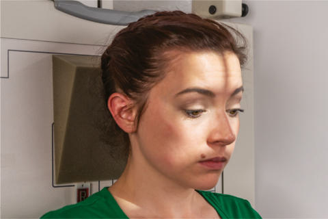
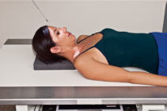
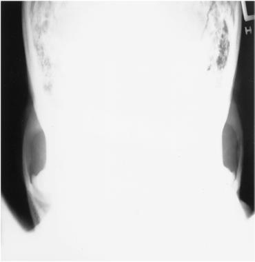
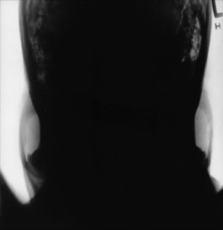

# Rx ARCADE ZIGOMATICE AP axială (incidență AP axială modificată (metoda Towne))

  📷 Radiografie Convențională (Rx)
  <strong>Actualizat:</strong> 2026-09-15
  <strong>Autor:</strong> Departamentul de Radiologie / Referință Bontrager

---

-   __1. Rezumat Clinic & Indicații__

    ---

    === "Indicații Clinice"

        - suspiciune de fractură și procese neoplazice sau inflamatorii ale arcadei zigomatice

    === "Ghid Național IRIS"

        !!! info "Referință Primară: Ghidul Național IRIS (Ordinul MS 1342/2012)"
            - **Capitol Ghid IRIS:** *Traumatisme — Față și orbite*
            - **Grad de Recomandare:** **Grad B**
            - **Nivel de Iradiere Estimată:** `Clasa 1 (Minimă < 0.1 mSv)`

            [:octicons-search-16: Deschide Ghidul IRIS](../../iris.md){ .md-button .md-button--primary } [:material-open-in-new: Aplicația Oficială PWA](https://radiologie-pediatrica.ro/iris/){ .md-button target="_blank" rel="noopener" }

-   __2. Poziționare & Centrare Fascicul__

    ---

    - **Poziție Pacient:** Pacient: Se îndepărtează toate obiectele metalice sau din plastic din regiunea capului și gâtului. Poziția pacientului este ortostatism sau decubit dorsal.; Regiune anatomică: Sprijiniți partea posterioară a craniului pacientului pe suprafața mesei/dispozitivului de imagistică în ortostatism. Coborâți bărbia, aducând linia orbitomeatală (LOM) (sau linia infraorbitomeatală (LIOM)) perpendiculară pe receptorul de imagine (vezi
    - **Punct de Centrare Fascicul:** Raza centrală se înclină 30° caudal (spre picioare) față de linia orbitomeatală (LOM) sau 37° față de linia infraorbitomeatală (LIOM) (vezi NOTA). Centrați raza centrală la 1 țol (2.5 cm) superior de nazion (pentru a trece prin arcadele mediane), la nivelul gonionului (unghiul mandibulei). Centrați receptorul de imagine pe proiecția razei centrale.
    - **Distanță Focar-Film (DFF / SID):** 100 cm
    - **Comandă Respiratorie:** Apnee pe durata expunerii.

-   __3. Parametri Tehnici Expunere__

    ---

    | Parametru Tehnic | Valoare Configurare Generator / Tub |
    |:-----------------|:-------------------------------------|
    | **Tensiune Tub (kV)** | 70-85 kV |
    | **Sarcină / Produs Curent-Timp (mAs)** | DE CONFIGURAT PE APARAT |
    | **Distanță Focar-Film (DFF / SID)** | 100 cm |
    | **Grilă Antidifuzoare (Bucky)** | Cu grilă antidifuzoare Bucky |
    | **Dimensiune Focar** | Focar Mic (0.6 mm) |
    | **Camere de Ionizare AEC** | Camerele laterale (sau camera centrală, în funcție de regiune) |
    | **Colimare Fascicul** | Colimați la marginile externe ale arcadelor zigomatice. |
    | **Filtrare Tub** | Totală ≥ 2.5 mm Al echivalent |

-   __4. Criterii de Calitate & Reușită Imagine__

    ---

    - Ambele arcade zigomatice, libere de suprapuneri, sunt evidențiate (Figs. 11.150 și 11.151). Poziție:
    - Arcadele zigomatice sunt vizualizate fără rotația pacientului, după cum indică aspectul simetric bilateral al arcadelor.
    - Colimare la aria de interes diagnostic. Expunere:
    - Expunerea și contrastul receptorului de imagine sunt suficiente pentru vizualizarea arcadelor zigomatice.
    - Marginile osoase clare indică absența mișcării. Fig. 11.149 AP axială — arcade zigomatice — raza centrală 30° față de linia orbitomeatală (LOM) (37° față de linia infraorbitomeatală (LIOM)), ortostatism și decubit dorsal (detaliu). Arcadă zigomatică Celule aeriene mastoidiene Ramuri mandibulare Arcadă zigomatică Fig. 11.151 AP axială. Fig. 11.150 AP axială.

-   __5. Protecție Radiologică (ALARA)__

    ---

    - Ecranare gonadică și a organelor radiosensibile conform procedurilor locale de radioprotecție ALARA.
    - Colimare strictă la aria de interes pentru limitarea radiației difuze.
    - Verificarea posibilității unei sarcini la pacientele de vârstă fertilă înainte de expunere.

!!! note "Observații Clinice & Tehnice"
    Dacă pacientul nu poate coborî bărbia suficient pentru a aduce linia orbitomeatală (LOM) perpendiculară pe receptorul de imagine, linia infraorbitomeatală (LIOM) poate fi așezată perpendicular, iar unghiul razei centrale se mărește la 37° caudal. Această poziționare menține un unghi de 30° între linia orbitomeatală (LOM) și raza centrală și evidențiază aceleași relații anatomice. (Se observă o diferență de 7° între linia orbitomeatală (LOM) și linia infraorbitomeatală (LIOM).) ARCADE ZIGOMATICE INCIDENȚĂ DE RUTINĂ SMV oblică inferosuperior (tangențială) AP axială (incidență AP axială modificată (metoda Towne))

### 🖼️ Imagini

<figure class="protocol-image-card" markdown>

<figcaption><strong>Fig. 11.149 AP axială — arcade zigomatice — raza centrală 30° față de linia orbitomeatală (LOM) (37° față de</strong> — Poziționarea pacientului conform Ghidului Bontrager (Fig. 11.149 AP axială — arcade zigomatice — raza centrală 30° față de linia orbitomeatală (LOM) (37° față de)</figcaption>

</figure>

<figure class="protocol-image-card" markdown>

<figcaption><strong>Fig. 11.151 AP axială.</strong> — Aspect radiografic de referință conform Ghidului Bontrager (Fig. 11.151 AP axială.)</figcaption>

</figure>

<figure class="protocol-image-card" markdown>

<figcaption><strong>Fig. 11.150 AP axială.</strong> — Aspect radiografic de referință conform Ghidului Bontrager (Fig. 11.150 AP axială.)</figcaption>

</figure>

<figure class="protocol-image-card" markdown>

<figcaption><strong>Figura 4</strong> — Aspect radiografic de referință conform Ghidului Bontrager (Figura 4)</figcaption>

</figure>

=== "Ghid Rapid de Execuție"

    1. **Identificarea și verificarea pacientului:** verificare identitate, zonă de examinat, consimțământ conform procedurii și evaluarea posibilității unei sarcini, când este relevantă.
    2. **Pregătire:** îndepărtarea oricăror obiecte radiopace (bijuterii, agrafe, fermoare, proteze, pansamente dense).
    3. **Poziționare precisă:** alinierea receptorului de imagine și a tubului la distanța prescrisă (100 cm).
    4. **Colimare strictă:** adaptarea fasciculului strict la regiunea de diagnostic pentru scăderea iradierii și reducerea radiației difuze.
    5. **Radioprotecție:** verificarea [politicii RX](../radioprotectie.md), cu măsuri distincte pentru pacient, personal și însoțitor.

## Surse de documentare

- [Bontrager's Textbook of Radiographic Positioning (Ed. 9/10), Pagina 451](https://www.elsevier.com/books/textbook-of-radiographic-positioning-and-related-anatomy/lampignano/978-0-323-65367-1)
