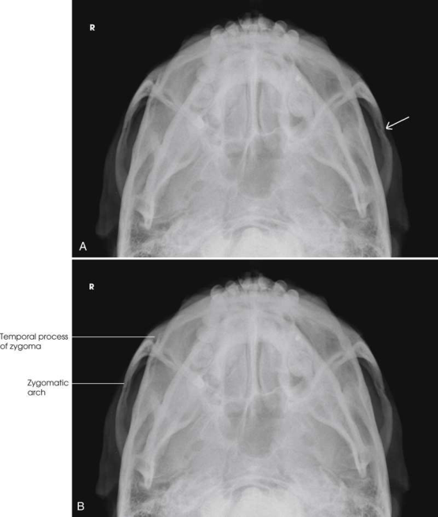
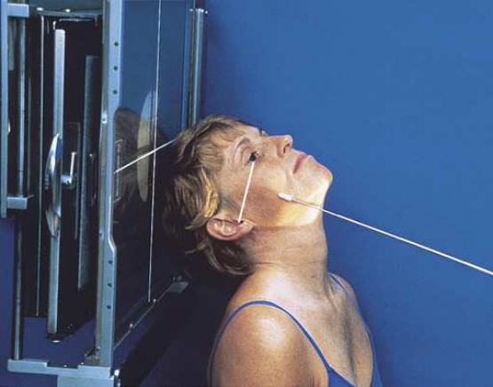
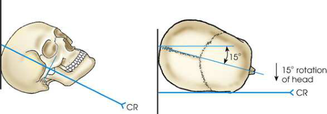
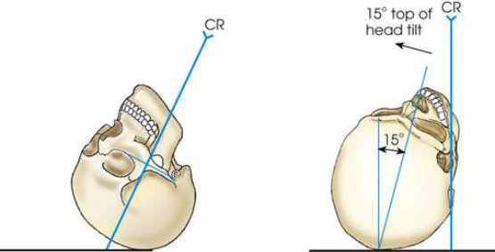

# Rx Zygomatic Arches — Submentovertical Incidență (Merrill)

  📷 Radiografie Convențională (Rx)
  <strong>Actualizat:</strong> 2026-09-16
  <strong>Autor:</strong> Referință Merrill

---

-   __1. Rezumat Clinic & Indicații__

    ---

    === "Indicații Clinice"

        - Conform reperelor anatomice standard din tratat

    === "Ghid Național IRIS"

        !!! info "Referință Primară: Ghidul Național IRIS (Ordinul MS 1342/2012)"
            - **Capitol Ghid IRIS:** *Ghidul Național IRIS*
            - **Grad de Recomandare:** **De verificat pe indicație; fără grad atribuit automat**
            - **Nivel de Iradiere Estimată:** `De verificat pentru examinarea și populația selectate`

            [:octicons-search-16: Deschide Ghidul IRIS](../../iris.md){ .md-button .md-button--primary } [:material-open-in-new: Aplicația Oficială PWA](https://radiologie-pediatrica.ro/iris/){ .md-button target="_blank" rel="noopener" }
-   __2. Poziționare & Centrare Fascicul__

    ---

    - **Poziție Pacient:** se așază pacientul în Poziție Șezândă în ortostatism sau Decubit dorsal poziție. When Decubit dorsal poziție este used, elevate pacientul’s trunk pe several firm pillows sau suitable pad la allow complete extension de gâtul. se flectează pacient’s genunchi la relax abdominal muscles. Center MSP de pacientul’s corp la linia mediană grilă device.; Hyperextend pacientul’s neck completely astfel încât linie infraorbitomeatală (LIOM) este ca paralel cu plane de receptorul de imagine ca possible. se sprijină pacientul’s cap pe its vertex, și se ajustează cap so that MSP este perpendicular pe plane de receptorul de imagine (Figs. 11.120–11.122).
    - **Punct de Centrare Fascicul:** perpendicular pe linie infraorbitomeatală (LIOM) și entering MSP de throat la level approximately 1 inch (2.5 cm) posterior la outer canthi. Se centrează receptorul de imagine pe raza centrală.
    - **Distanță Focar-Film (DFF / SID):** Nespecificat în fragmentul extras; de verificat în sursă
    - **Comandă Respiratorie:** apnee (oprirea respirației).

-   __3. Parametri Tehnici Expunere__

    ---

    | Parametru Tehnic | Valoare Configurare Generator / Tub |
    |:-----------------|:-------------------------------------|
    | **Tensiune Tub (kV)** | DE CONFIGURAT PE APARAT |
    | **Sarcină / Produs Curent-Timp (mAs)** | DE CONFIGURAT PE APARAT |
    | **Distanță Focar-Film (DFF / SID)** | Nespecificat în fragmentul extras; de verificat în sursă |
    | **Grilă Antidifuzoare (Bucky)** | DE CONFIGURAT PE APARAT |
    | **Dimensiune Focar** | DE CONFIGURAT PE APARAT |
    | **Camere de Ionizare AEC** | DE CONFIGURAT PE APARAT |
    | **Colimare Fascicul** | Adjust câmp de iradiere la extend 1 inch (2.5 cm) beyond lateral sides de fața, superiorly la bărbia, și inferiorly la gonions. expunere field trebuie să fie fără larger than 10 inches (24 cm) wide și 8 inches (18 cm) long. Place marker de lateralitate (D/S) în collimated expunere field. |
    | **Filtrare Tub** | DE CONFIGURAT PE APARAT |

-   __4. Criterii de Calitate & Reușită Imagine__

    ---

    - Criterii radiologice de calitate imaginii: n Evidence de corect collimation și presence de marker de lateralitate (D/S) plasat clear de anatomy de interest n Zygomatic arches liber de la overlying structures n Absența rotației anatomice (simetrie bilaterală perfectă) sau tilt de cap, evidențiat prin:
    - Zygomatic arches simetric și fără foreshortening n părți moi și bony detalii trabeculare osoase

-   __5. Protecție Radiologică (ALARA)__

    ---

    - Nespecificat în fragmentul extras; de verificat în sursă

!!! note "Observații Clinice & Tehnice"
    Conform reperelor anatomice standard din tratat

### 🖼️ Imagini

<figure class="protocol-image-card" markdown>

<figcaption><strong>Merrill — pagina PDF 917, imaginea 1</strong> — Imagine din fragmentul sursă; asocierea necesită revizie.</figcaption>

</figure>

<figure class="protocol-image-card" markdown>

<figcaption><strong>Merrill — pagina PDF 918, imaginea 2</strong> — Imagine din fragmentul sursă; asocierea necesită revizie.</figcaption>

</figure>

<figure class="protocol-image-card" markdown>

<figcaption><strong>Merrill — pagina PDF 918, imaginea 3</strong> — Imagine din fragmentul sursă; asocierea necesită revizie.</figcaption>

</figure>

<figure class="protocol-image-card" markdown>

<figcaption><strong>Merrill — pagina PDF 919, imaginea 4</strong> — Imagine din fragmentul sursă; asocierea necesită revizie.</figcaption>

</figure>

=== "Ghid Rapid de Execuție"

    1. **Identificarea și verificarea pacientului:** verificare identitate, zonă de examinat, consimțământ conform procedurii și evaluarea posibilității unei sarcini, când este relevantă.
    2. **Pregătire:** îndepărtarea oricăror obiecte radiopace (bijuterii, agrafe, fermoare, proteze, pansamente dense).
    3. **Poziționare precisă:** alinierea receptorului de imagine și a tubului la distanța prescrisă (Nespecificat în fragmentul extras; de verificat în sursă).
    4. **Colimare strictă:** adaptarea fasciculului strict la regiunea de diagnostic pentru scăderea iradierii și reducerea radiației difuze.
    5. **Radioprotecție:** verificarea [politicii RX](../radioprotectie.md), cu măsuri distincte pentru pacient, personal și însoțitor.

## Surse de documentare

- [Merrill’s Atlas, 11. Cranium, pagini PDF 916–919](../../assets/protocols/sources/a56d45c16829_Merrills_Atlas_of_Radiographic_Positioning__Procedures_3Vol_Set.pdf#page=916)

## Fragmente sursă traduse (referință tehnică)

### anatomy

bilateral simetric SMV imagini de zygomatic arches sunt vizualizat, projected liber de superimposed structures (Fig. 11.123). Unless very flat sau
traumatically coborât, arches, being farther de la receptorul de imagine, sunt projected beyond prominent parietal eminences prin divergent x-ray
fascicul.

### collimation

• Adjust câmp de iradiere la extend 1 inch (2.5 cm) beyond lateral sides de fața, superiorly la bărbia, și inferiorly la gonions.
expunere field trebuie să fie fără larger than 10 inches (24 cm) wide și 8 inches (18 cm) long. Place marker de lateralitate (D/S) în collimated
expunere field.

### cr

• perpendicular pe linie infraorbitomeatală (LIOM) și entering MSP de throat la level approximately 1 inch (2.5 cm) posterior la outer canthi.
• Se centrează receptorul de imagine pe raza centrală.

### criteria

Criterii radiologice de calitate imaginii:
n Evidence de corect collimation și presence de marker de lateralitate (D/S) plasat clear de anatomy de interest
n Zygomatic arches liber de la overlying structures
n Absența rotației anatomice (simetrie bilaterală perfectă) sau tilt de cap, evidențiat prin:
• Zygomatic arches simetric și fără foreshortening
n părți moi și bony detalii trabeculare osoase

### part_pos

• Hyperextend pacientul’s neck completely astfel încât linie infraorbitomeatală (LIOM) este ca paralel cu plane de receptorul de imagine ca possible.
• se sprijină pacientul’s cap pe its vertex, și se ajustează cap so that MSP este perpendicular pe plane de receptorul de imagine (Figs. 11.120–11.122).

### patient_pos

• se așază pacientul în așezat pe scaun în ortostatism sau decubit dorsal.
• When decubit dorsal este used, elevate pacientul’s trunk pe several firm pillows sau suitable pad la allow complete extension de
gâtul. se flectează pacient’s genunchi la relax abdominal muscles.
• Center MSP de pacientul’s corp la linia mediană grilă device.

### respiration

apnee (oprirea respirației).

### tech

poziționat prin manufacturer sau department protocol pentru corect anatomy display orientation; raza centrală plate: 10 × 12 inches (24
× 30 cm) transversal.

