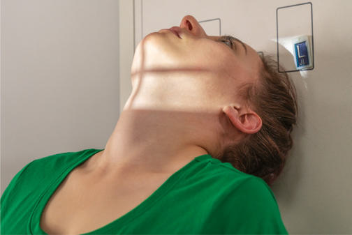
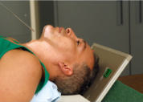
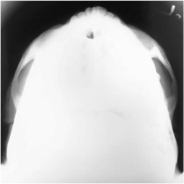
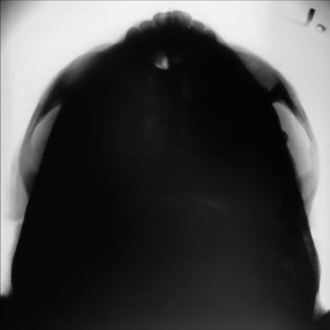

# Rx ZYGOMATIC ARCHES SUBMENTOVERTICAL (SMV) PROJECTION

  📷 Radiografie Convențională (Rx)
  <strong>Actualizat:</strong> 2026-09-15
  <strong>Autor:</strong> Departamentul de Radiologie / Referință Bontrager

---

-   __1. Rezumat Clinic & Indicații__

    ---

    === "Indicații Clinice"

        - suspiciune de fractură of zygomatic arch
        - Neoplastic or inflammatory processes

    === "Ghid Național IRIS"

        !!! info "Referință Primară: Ghidul Național IRIS (Ordinul MS 1342/2012)"
            - **Capitol Ghid IRIS:** *Ghidul Național IRIS*
            - **Grad de Recomandare:** **De verificat pe indicație; fără grad atribuit automat**
            - **Nivel de Iradiere Estimată:** `De verificat pentru examinarea și populația selectate`

            [:octicons-search-16: Deschide Ghidul IRIS](../../iris.md){ .md-button .md-button--primary } [:material-open-in-new: Aplicația Oficială PWA](https://radiologie-pediatrica.ro/iris/){ .md-button target="_blank" rel="noopener" }
-   __2. Poziționare & Centrare Fascicul__

    ---

    - **Poziție Pacient:** Pacient: Remove all metallic or plastic objects from head and neck. This projection may be taken with the patient Ortostatism or Decubit Dorsal.; Regiune anatomică: Raise chin, hyperextend neck until ioMl is parallel to IR (see
    - **Punct de Centrare Fascicul:** Align Raza centrală (RC) perpendiculară pe receptorul de imagine (see NOTE 2). Center CR midway between zygomatic arches, at a level 1½ inches (4 cm) inferior to mandibular symphysis. Center IR to CR, with plane of IR parallel to IOML.
    - **Distanță Focar-Film (DFF / SID):** 100 cm
    - **Comandă Respiratorie:** Suspend respiration.

-   __3. Parametri Tehnici Expunere__

    ---

    | Parametru Tehnic | Valoare Configurare Generator / Tub |
    |:-----------------|:-------------------------------------|
    | **Tensiune Tub (kV)** | 75-85 kV |
    | **Sarcină / Produs Curent-Timp (mAs)** | DE CONFIGURAT PE APARAT |
    | **Distanță Focar-Film (DFF / SID)** | 100 cm |
    | **Grilă Antidifuzoare (Bucky)** | Fără grilă (expunere directă) |
    | **Dimensiune Focar** | Focar Mic (0.6 mm) |
    | **Camere de Ionizare AEC** | DE CONFIGURAT PE APARAT |
    | **Colimare Fascicul** | Collimate to outer margins of zygomatic arches. |
    | **Filtrare Tub** | Totală ≥ 2.5 mm Al echivalent |

-   __4. Criterii de Calitate & Reușită Imagine__

    ---

    - Zygomatic arches are demonstrated laterally from each mandibular ramus (Figs. 11.144 and 11.145). Position:
    - Correct IOML/CR relationship, as indicated by superimposition of mandibular symphysis on frontal bone.
    - no patient rotation, as indicated by zygomatic arches visualized symmetrically.
    - Collimation to area of interest. Exposure:
    - Optimal image receptor exposure and contrast to visualize zygomatic arches.
    - Sharp bony margins indicate no motion. Fig. 11.143 SMV projection, Ortostatism and Decubit Dorsal (inset)—IOML parallel to IR; Raza centrală perpendiculară to IOML. Fig. 11.144 SMV projection. Mandibular symphysis over frontal bone Zygomatic bone Zygomatic arch Temporal bone Fig. 11.145 SMV projection. 24 18 No AEC L

-   __5. Protecție Radiologică (ALARA)__

    ---

    - Ecranare gonadică și a organelor radiosensibile conform procedurilor locale de radioprotecție ALARA.
    - Colimare strictă la aria de interes pentru limitarea radiației difuze.
    - Verificarea posibilității unei sarcini la pacientele de vârstă fertilă înainte de expunere.

!!! note "Observații Clinice & Tehnice"
    If patient is unable to extend neck adequately, angle Raza centrală perpendiculară to ioMl. If equipment allows, IR should be angled to maintain CR/ IR perpendicular relationship (Fig. 11.143, inset). ZYGOMATIC ARCHES ROUTINE SMV Oblique inferosuperior (tangential) AP axial (modified Incidență AP Axială (Metoda Towne))

### 🖼️ Imagini

<figure class="protocol-image-card" markdown>

<figcaption><strong>Fig. 11.143 SMV projection, Ortostatism and Decubit Dorsal (inset)—IOML parallel</strong> — Poziționare pacient conform Ghidului Bontrager (Fig. 11.143 SMV projection, erect and supine (inset)—IOML parallel)</figcaption>

</figure>

<figure class="protocol-image-card" markdown>

<figcaption><strong>Fig. 11.144 SMV projection.</strong> — Aspect radiografic de referință conform Ghidului Bontrager (Fig. 11.144 SMV projection.)</figcaption>

</figure>

<figure class="protocol-image-card" markdown>

<figcaption><strong>Fig. 11.145 SMV projection.</strong> — Aspect radiografic de referință conform Ghidului Bontrager (Fig. 11.145 SMV projection.)</figcaption>

</figure>

<figure class="protocol-image-card" markdown>

<figcaption><strong>Figura 4</strong> — Aspect radiografic de referință conform Ghidului Bontrager (Figura 4)</figcaption>

</figure>

=== "Ghid Rapid de Execuție"

    1. **Identificarea și verificarea pacientului:** verificare identitate, zonă de examinat, consimțământ conform procedurii și evaluarea posibilității unei sarcini, când este relevantă.
    2. **Pregătire:** îndepărtarea oricăror obiecte radiopace (bijuterii, agrafe, fermoare, proteze, pansamente dense).
    3. **Poziționare precisă:** alinierea receptorului de imagine și a tubului la distanța prescrisă (100 cm).
    4. **Colimare strictă:** adaptarea fasciculului strict la regiunea de diagnostic pentru scăderea iradierii și reducerea radiației difuze.
    5. **Radioprotecție:** verificarea [politicii RX](../radioprotectie.md), cu măsuri distincte pentru pacient, personal și însoțitor.

## Surse de documentare

- [Bontrager's Textbook of Radiographic Positioning (Ed. 9/10), Pagina 449](https://www.elsevier.com/books/textbook-of-radiographic-positioning-and-related-anatomy/lampignano/978-0-323-65367-1)
