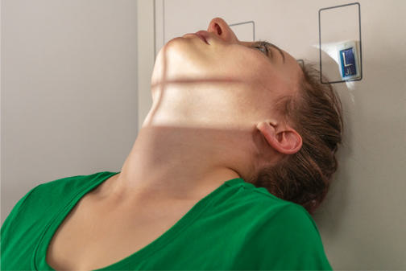
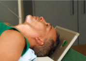
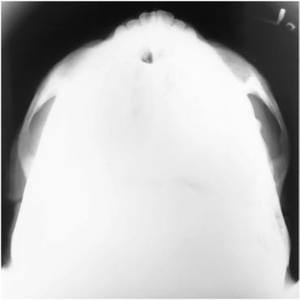
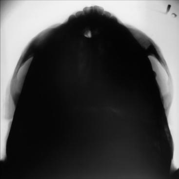

# Rx ARCE ZIGOMATICE INCIDENȚĂ SUBMENTOVERTICALĂ (SMV)

  📷 Radiografie Convențională (Rx)
  <strong>Actualizat:</strong> 2026-09-15
  <strong>Autor:</strong> Departamentul de Radiologie / Referință Bontrager

---

-   __1. Rezumat Clinic & Indicații__

    ---

    === "Indicații Clinice"

        - suspiciune de fractură a arcadei zigomatice
        - Procese neoplazice sau inflamatorii

    === "Ghid Național IRIS"

        !!! info "Referință Primară: Ghidul Național IRIS (Ordinul MS 1342/2012)"
            - **Capitol Ghid IRIS:** *Traumatisme — Față și orbite*
            - **Grad de Recomandare:** **Grad B**
            - **Nivel de Iradiere Estimată:** `Clasa 1 (Minimă < 0.1 mSv)`

            [:octicons-search-16: Deschide Ghidul IRIS](../../iris.md){ .md-button .md-button--primary } [:material-open-in-new: Aplicația Oficială PWA](https://radiologie-pediatrica.ro/iris/){ .md-button target="_blank" rel="noopener" }

-   __2. Poziționare & Centrare Fascicul__

    ---

    - **Poziție Pacient:** Pacient: Se îndepărtează toate obiectele metalice sau din plastic din regiunea capului și gâtului. Această incidență poate fi efectuată cu pacientul în ortostatism sau decubit dorsal.; Regiune anatomică: Ridicați bărbia, hiperextindeți gâtul până când linia infraorbitomeatală (LIOM) este paralelă cu receptorul de imagine (vezi
    - **Punct de Centrare Fascicul:** Aliniați raza centrală (RC) perpendicular pe receptorul de imagine (vezi NOTA 2). Centrați raza centrală la jumătatea distanței dintre arcadele zigomatice, la nivelul de 1½ țoli (4 cm) inferior de simfiza mandibulară. Centrați receptorul de imagine pe raza centrală, cu planul receptorului de imagine paralel cu linia infraorbitomeatală (LIOM).
    - **Distanță Focar-Film (DFF / SID):** 100 cm
    - **Comandă Respiratorie:** Apnee pe durata expunerii.

-   __3. Parametri Tehnici Expunere__

    ---

    | Parametru Tehnic | Valoare Configurare Generator / Tub |
    |:-----------------|:-------------------------------------|
    | **Tensiune Tub (kV)** | 75-85 kV |
    | **Sarcină / Produs Curent-Timp (mAs)** | DE CONFIGURAT PE APARAT |
    | **Distanță Focar-Film (DFF / SID)** | 100 cm |
    | **Grilă Antidifuzoare (Bucky)** | Fără grilă (expunere directă) |
    | **Dimensiune Focar** | Focar Mic (0.6 mm) |
    | **Camere de Ionizare AEC** | DE CONFIGURAT PE APARAT |
    | **Colimare Fascicul** | Colimați la marginile externe ale arcadelor zigomatice. |
    | **Filtrare Tub** | Totală ≥ 2.5 mm Al echivalent |

-   __4. Criterii de Calitate & Reușită Imagine__

    ---

    - Arcadele zigomatice sunt evidențiate lateral față de fiecare ramură mandibulară (Figs. 11.144 și 11.145). Poziție:
    - Relația corectă dintre linia infraorbitomeatală (LIOM) și raza centrală, indicată prin suprapunerea simfizei mandibulare peste osul frontal.
    - fără rotația pacientului, după cum indică vizualizarea simetrică a arcadelor zigomatice.
    - Colimare la aria de interes diagnostic. Expunere:
    - Expunerea și contrastul receptorului de imagine sunt optime pentru vizualizarea arcadelor zigomatice.
    - Marginile osoase nete indică absența mișcării. Fig. 11.143 Incidență SMV, în ortostatism și în decubit dorsal (imagine inserată)—linia infraorbitomeatală (LIOM) paralelă cu receptorul de imagine; raza centrală perpendiculară pe linia infraorbitomeatală (LIOM). Fig. 11.144 Incidență SMV. Simfiza mandibulară suprapusă peste osul frontal Os zigomatic Arc zigomatic Os temporal Fig. 11.145 Incidență SMV. 24 18 fără AEC L

-   __5. Protecție Radiologică (ALARA)__

    ---

    - Ecranare gonadică și a organelor radiosensibile conform procedurilor locale de radioprotecție ALARA.
    - Colimare strictă la aria de interes pentru limitarea radiației difuze.
    - Verificarea posibilității unei sarcini la pacientele de vârstă fertilă înainte de expunere.

!!! note "Observații Clinice & Tehnice"
    Dacă pacientul nu poate extinde gâtul adecvat, înclinați raza centrală perpendicular pe linia infraorbitomeatală (LIOM). Dacă echipamentul permite, receptorul de imagine trebuie înclinat pentru a menține relația perpendiculară dintre raza centrală și receptorul de imagine (Fig. 11.143, detaliu). ARCADE ZIGOMATICE INCIDENȚĂ DE RUTINĂ SMV oblică inferosuperior (tangențială) AP axială (incidență AP axială modificată (metoda Towne))

### 🖼️ Imagini

<figure class="protocol-image-card" markdown>

<figcaption><strong>Fig. 11.143 Incidență SMV, în ortostatism și în decubit dorsal (imagine inserată)—linia infraorbitomeatală (LIOM) paralelă</strong> — Poziționarea pacientului conform Ghidului Bontrager (Fig. 11.143 Incidență SMV, în ortostatism și în decubit dorsal (imagine inserată)—linia infraorbitomeatală (LIOM) paralelă)</figcaption>

</figure>

<figure class="protocol-image-card" markdown>

<figcaption><strong>Fig. 11.144 Incidență SMV.</strong> — Aspect radiografic de referință conform Ghidului Bontrager (Fig. 11.144 Incidență SMV.)</figcaption>

</figure>

<figure class="protocol-image-card" markdown>

<figcaption><strong>Fig. 11.145 Incidență SMV.</strong> — Aspect radiografic de referință conform Ghidului Bontrager (Fig. 11.145 Incidență SMV.)</figcaption>

</figure>

<figure class="protocol-image-card" markdown>

<figcaption><strong>Figura 4</strong> — Aspect radiografic de referință conform Ghidului Bontrager (Figura 4)</figcaption>

</figure>

=== "Ghid Rapid de Execuție"

    1. **Identificarea și verificarea pacientului:** verificare identitate, zonă de examinat, consimțământ conform procedurii și evaluarea posibilității unei sarcini, când este relevantă.
    2. **Pregătire:** îndepărtarea oricăror obiecte radiopace (bijuterii, agrafe, fermoare, proteze, pansamente dense).
    3. **Poziționare precisă:** alinierea receptorului de imagine și a tubului la distanța prescrisă (100 cm).
    4. **Colimare strictă:** adaptarea fasciculului strict la regiunea de diagnostic pentru scăderea iradierii și reducerea radiației difuze.
    5. **Radioprotecție:** verificarea [politicii RX](../radioprotectie.md), cu măsuri distincte pentru pacient, personal și însoțitor.

## Surse de documentare

- [Bontrager's Textbook of Radiographic Positioning (Ed. 9/10), Pagina 449](https://www.elsevier.com/books/textbook-of-radiographic-positioning-and-related-anatomy/lampignano/978-0-323-65367-1)
