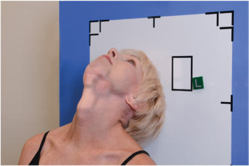
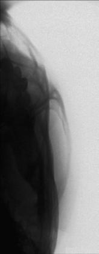
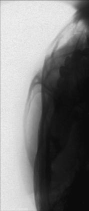
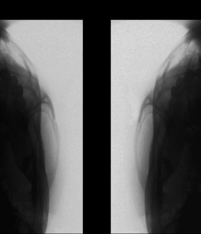

# Rx ZYGOMATIC OBLIQUE INFEROSUPERIOR (TANGENTIAL) Incidență (ARCHES)

  📷 Radiografie Convențională (Rx)
  <strong>Actualizat:</strong> 2026-09-15
  <strong>Autor:</strong> Departamentul de Radiologie / Referință Bontrager

---

-   __1. Rezumat Clinic & Indicații__

    ---

    === "Indicații Clinice"

        - suspiciune de fractură de zygomatic arch
        - Especially useful pentru coborât zygomatic arches caused prin traumatism acuttism / Regim Urgență sau Craniu morphology radiografii de ambele părți (bilateral) generally sunt taken pentru comparison.

    === "Ghid Național IRIS"

        !!! info "Referință Primară: Ghidul Național IRIS (Ordinul MS 1342/2012)"
            - **Capitol Ghid IRIS:** *Ghidul Național IRIS*
            - **Grad de Recomandare:** **De verificat pe indicație; fără grad atribuit automat**
            - **Nivel de Iradiere Estimată:** `De verificat pentru examinarea și populația selectate`

            [:octicons-search-16: Deschide Ghidul IRIS](../../iris.md){ .md-button .md-button--primary } [:material-open-in-new: Aplicația Oficială PWA](https://radiologie-pediatrica.ro/iris/){ .md-button target="_blank" rel="noopener" }
-   __2. Poziționare & Centrare Fascicul__

    ---

    - **Poziție Pacient:** Pacient: Se îndepărtează toate obiectele metalice sau din plastic din regiunea capului și gâtului. pacient poziție este Ortostatism sau Decubit dorsal. Ortostatism, which este easier pentru pacientul, poate fie done cu Ortostatism table sau în ortostatism imaging device.; Regiune anatomică: Raise chin, hyperextending neck until linie infraorbitomeatală (LIOM) este paralel cu receptorul de imagine (see
    - **Punct de Centrare Fascicul:** Align Raza centrală (RC) perpendiculară pe receptorul de imagine și linie infraorbitomeatală (LIOM) (see NOTE 2). Center raza centrală la zygomatic arch de interest (raza centrală skims ramuri mandibulare, passes through arch, și skims parietal eminence pe downside (side nearest la receptorul de imagine, side de interest). Adjust receptorul de imagine so it este paralel la linie infraorbitomeatală (LIOM) și perpendicular la raza centrală.
    - **Distanță Focar-Film (DFF / SID):** 100 cm
    - **Comandă Respiratorie:** Apnee pe durata expunerii.

-   __3. Parametri Tehnici Expunere__

    ---

    | Parametru Tehnic | Valoare Configurare Generator / Tub |
    |:-----------------|:-------------------------------------|
    | **Tensiune Tub (kV)** | 70-85 kV |
    | **Sarcină / Produs Curent-Timp (mAs)** | DE CONFIGURAT PE APARAT |
    | **Distanță Focar-Film (DFF / SID)** | 100 cm |
    | **Grilă Antidifuzoare (Bucky)** | Fără grilă (expunere directă) |
    | **Dimensiune Focar** | Focar Mic (0.6 mm) |
    | **Camere de Ionizare AEC** | DE CONFIGURAT PE APARAT |
    | **Colimare Fascicul** | Collimate closely la zygomatic bone și arch. |
    | **Filtrare Tub** | Totală ≥ 2.5 mm Al echivalent |

-   __4. Criterii de Calitate & Reușită Imagine__

    ---

    - Single zygomatic arch, liber de superimposition, este evidențiat (Figs. 11.147 și 11.148). poziție:
    - Correct pacient poziție provides pentru demonstration de zygomatic arch fără superimposition de parietal bone sau Mandibulă.
    - Collimation la aria de interes diagnostic. expunere:
    - optim receptorul de imagine expunere și contrast sunt sufficient la visualize zygomatic arch.
    - net bony margins indicate fără mișcare. Fig. 11.146 oblic inferosuperior (tangențial), în ortostatism imaging device (15° tilt, 15° rotație, Raza centrală perpendiculară la linie infraorbitomeatală (LIOM)). drept și stâng zygomatic arches R L Fig. 11.148 oblic inferosuperior (tangențial). L R Fig. 11.147 oblic inferosuperior (tangențial).

-   __5. Protecție Radiologică (ALARA)__

    ---

    - Ecranare gonadică și a organelor radiosensibile conform procedurilor locale de radioprotecție ALARA.
    - Colimare strictă la aria de interes pentru limitarea radiației difuze.
    - Verificarea posibilității unei sarcini la pacientele de vârstă fertilă înainte de expunere.

!!! note "Observații Clinice & Tehnice"
    If pacient este unable la extend neck sufficiently, angle Raza centrală perpendiculară la linie infraorbitomeatală (LIOM). If equipment allows, receptorul de imagine trebuie să fie înclinat la maintain raza centrală/ receptorul de imagine perpendicular relationship. fără AEC ZYGOMATIC ARCHES ROUTINE SMV oblic inferosuperior (tangențial) AP axial (modified Incidență AP Axială (Metoda Towne))

### 🖼️ Imagini

<figure class="protocol-image-card" markdown>

<figcaption><strong>Fig. 11.146 oblic inferosuperior (tangențial), în ortostatism imaging</strong> — Poziționare pacient conform Ghidului Bontrager (Fig. 11.146 oblic inferosuperior (tangențial), în ortostatism imaging)</figcaption>

</figure>

<figure class="protocol-image-card" markdown>

<figcaption><strong>Fig. 11.148 oblic inferosuperior (tangențial).</strong> — Aspect radiografic de referință conform Ghidului Bontrager (Fig. 11.148 oblic inferosuperior (tangențial).)</figcaption>

</figure>

<figure class="protocol-image-card" markdown>

<figcaption><strong>Fig. 11.147 oblic inferosuperior (tangențial).</strong> — Aspect radiografic de referință conform Ghidului Bontrager (Fig. 11.147 oblic inferosuperior (tangențial).)</figcaption>

</figure>

<figure class="protocol-image-card" markdown>

<figcaption><strong>Figura 4</strong> — Aspect radiografic de referință conform Ghidului Bontrager (Figura 4)</figcaption>

</figure>

<figure class="protocol-image-card" markdown>

<figcaption><strong>Figura 5</strong> — Aspect radiografic de referință conform Ghidului Bontrager (Figura 5)</figcaption>

</figure>

=== "Ghid Rapid de Execuție"

    1. **Identificarea și verificarea pacientului:** verificare identitate, zonă de examinat, consimțământ conform procedurii și evaluarea posibilității unei sarcini, când este relevantă.
    2. **Pregătire:** îndepărtarea oricăror obiecte radiopace (bijuterii, agrafe, fermoare, proteze, pansamente dense).
    3. **Poziționare precisă:** alinierea receptorului de imagine și a tubului la distanța prescrisă (100 cm).
    4. **Colimare strictă:** adaptarea fasciculului strict la regiunea de diagnostic pentru scăderea iradierii și reducerea radiației difuze.
    5. **Radioprotecție:** verificarea [politicii RX](../radioprotectie.md), cu măsuri distincte pentru pacient, personal și însoțitor.

## Surse de documentare

- [Bontrager's Textbook of Radiographic Positioning (Ed. 9/10), Pagina 450](https://www.elsevier.com/books/textbook-of-radiographic-positioning-and-related-anatomy/lampignano/978-0-323-65367-1)
