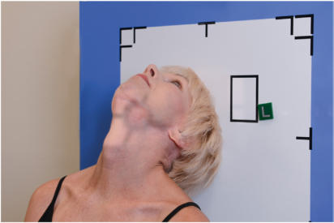
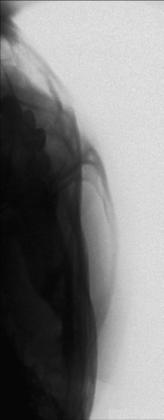
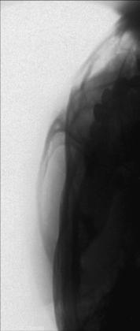
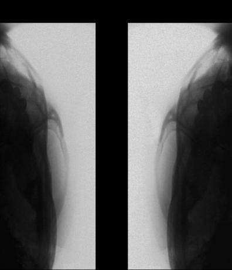

# Rx ARCE ZIGOMATICE INCIDENȚĂ OBLICĂ INFEROSUPERIOARĂ (TANGENȚIALĂ)

  📷 Radiografie Convențională (Rx)
  <strong>Actualizat:</strong> 2026-09-15
  <strong>Autor:</strong> Departamentul de Radiologie / Referință Bontrager

---

-   __1. Rezumat Clinic & Indicații__

    ---

    === "Indicații Clinice"

        - suspiciune de fractură a arcadei zigomatice
        - Deosebit de utilă pentru arcele zigomatice coborâte ca urmare a unui traumatism acut / în regim de urgență; radiografiile craniului de ambele părți (bilaterale) sunt efectuate, în general, pentru comparație.

    === "Ghid Național IRIS"

        !!! info "Referință Primară: Ghidul Național IRIS (Ordinul MS 1342/2012)"
            - **Capitol Ghid IRIS:** *Traumatisme — Față și orbite*
            - **Grad de Recomandare:** **Grad B**
            - **Nivel de Iradiere Estimată:** `Clasa 1 (Minimă < 0.1 mSv)`

            [:octicons-search-16: Deschide Ghidul IRIS](../../iris.md){ .md-button .md-button--primary } [:material-open-in-new: Aplicația Oficială PWA](https://radiologie-pediatrica.ro/iris/){ .md-button target="_blank" rel="noopener" }

-   __2. Poziționare & Centrare Fascicul__

    ---

    - **Poziție Pacient:** Pacient: Se îndepărtează toate obiectele metalice sau din plastic din regiunea capului și gâtului. Pacientul este în ortostatism sau în decubit dorsal. Ortostatismul, care este mai ușor pentru pacient, poate fi realizat la masa de ortostatism sau într-un dispozitiv de imagistică în ortostatism. Regiune anatomică: Ridicați bărbia, hiperextinzând gâtul până când linia infraorbitomeatală (LIOM) este paralelă cu receptorul de imagine (a se vedea
    - **Punct de Centrare Fascicul:** Aliniați raza centrală (RC) perpendicular pe receptorul de imagine și pe linia infraorbitomeatală (LIOM) (a se vedea NOTA 2). Centrați raza centrală pe arcul zigomatic de interes (raza centrală atinge tangențial ramurile mandibulare, trece prin arc și atinge tangențial eminența parietală de pe partea inferioară (partea cea mai apropiată de receptorul de imagine, partea de interes). Reglați receptorul de imagine astfel încât să fie paralel cu linia infraorbitomeatală (LIOM) și perpendicular pe raza centrală.
    - **Distanță Focar-Film (DFF / SID):** 100 cm
    - **Comandă Respiratorie:** Apnee pe durata expunerii.

-   __3. Parametri Tehnici Expunere__

    ---

    | Parametru Tehnic | Valoare Configurare Generator / Tub |
    |:-----------------|:-------------------------------------|
    | **Tensiune Tub (kV)** | 70-85 kV |
    | **Sarcină / Produs Curent-Timp (mAs)** | DE CONFIGURAT PE APARAT |
    | **Distanță Focar-Film (DFF / SID)** | 100 cm |
    | **Grilă Antidifuzoare (Bucky)** | Fără grilă (expunere directă) |
    | **Dimensiune Focar** | Focar Mic (0.6 mm) |
    | **Camere de Ionizare AEC** | DE CONFIGURAT PE APARAT |
    | **Colimare Fascicul** | Colimați strâns osul zigomatic și arcul. |
    | **Filtrare Tub** | Totală ≥ 2.5 mm Al echivalent |

-   __4. Criterii de Calitate & Reușită Imagine__

    ---

    - Un singur arc zigomatic, liber de suprapuneri, este evidențiat (Fig. 11.147 și 11.148). Poziție:
    - Poziționarea corectă a pacientului permite evidențierea arcului zigomatic fără suprapunerea osului parietal sau a mandibulei.
    - Colimare la aria de interes diagnostic. Expunere:
    - Expunerea și contrastul optime ale receptorului de imagine sunt suficiente pentru vizualizarea arcului zigomatic.
    - Marginile osoase nete indică absența mișcării. Fig. 11.146 oblică inferosuperioară (tangențială), în dispozitiv de imagistică în ortostatism (înclinare de 15°, rotație de 15°, raza centrală perpendiculară pe linia infraorbitomeatală (LIOM)). Arcele zigomatice drept și stâng R L Fig. 11.148 oblică inferosuperioară (tangențială). L R Fig. 11.147 oblică inferosuperioară (tangențială).

-   __5. Protecție Radiologică (ALARA)__

    ---

    - Ecranare gonadică și a organelor radiosensibile conform procedurilor locale de radioprotecție ALARA.
    - Colimare strictă la aria de interes pentru limitarea radiației difuze.
    - Verificarea posibilității unei sarcini la pacientele de vârstă fertilă înainte de expunere.

!!! note "Observații Clinice & Tehnice"
    Dacă pacientul nu poate extinde suficient gâtul, orientați raza centrală perpendicular pe linia infraorbitomeatală (LIOM). Dacă echipamentul permite, receptorul de imagine trebuie înclinat pentru a menține relația de perpendicularitate dintre raza centrală și receptorul de imagine. fără AEC ARCE ZIGOMATICE INCIDENȚĂ SMV DE RUTINĂ oblică inferosuperioară (tangențială) AP axială (modificată Incidență AP axială (metoda Towne))

### 🖼️ Imagini

<figure class="protocol-image-card" markdown>

<figcaption><strong>Fig. 11.146 oblică inferosuperioară (tangențială), în dispozitiv de imagistică în ortostatism</strong> — Poziționarea pacientului conform Ghidului Bontrager (Fig. 11.146 oblică inferosuperioară (tangențială), în dispozitiv de imagistică în ortostatism)</figcaption>

</figure>

<figure class="protocol-image-card" markdown>

<figcaption><strong>Fig. 11.148 oblică inferosuperioară (tangențială).</strong> — Aspect radiografic de referință conform Ghidului Bontrager (Fig. 11.148 oblică inferosuperioară (tangențială).)</figcaption>

</figure>

<figure class="protocol-image-card" markdown>

<figcaption><strong>Fig. 11.147 oblică inferosuperioară (tangențială).</strong> — Aspect radiografic de referință conform Ghidului Bontrager (Fig. 11.147 oblică inferosuperioară (tangențială).)</figcaption>

</figure>

<figure class="protocol-image-card" markdown>

<figcaption><strong>Figura 4</strong> — Aspect radiografic de referință conform Ghidului Bontrager (Figura 4)</figcaption>

</figure>

<figure class="protocol-image-card" markdown>

<figcaption><strong>Figura 5</strong> — Aspect radiografic de referință conform Ghidului Bontrager (Figura 5)</figcaption>

</figure>

=== "Ghid Rapid de Execuție"

    1. **Identificarea și verificarea pacientului:** verificare identitate, zonă de examinat, consimțământ conform procedurii și evaluarea posibilității unei sarcini, când este relevantă.
    2. **Pregătire:** îndepărtarea oricăror obiecte radiopace (bijuterii, agrafe, fermoare, proteze, pansamente dense).
    3. **Poziționare precisă:** alinierea receptorului de imagine și a tubului la distanța prescrisă (100 cm).
    4. **Colimare strictă:** adaptarea fasciculului strict la regiunea de diagnostic pentru scăderea iradierii și reducerea radiației difuze.
    5. **Radioprotecție:** verificarea [politicii RX](../radioprotectie.md), cu măsuri distincte pentru pacient, personal și însoțitor.

## Surse de documentare

- [Bontrager's Textbook of Radiographic Positioning (Ed. 9/10), Pagina 450](https://www.elsevier.com/books/textbook-of-radiographic-positioning-and-related-anatomy/lampignano/978-0-323-65367-1)
