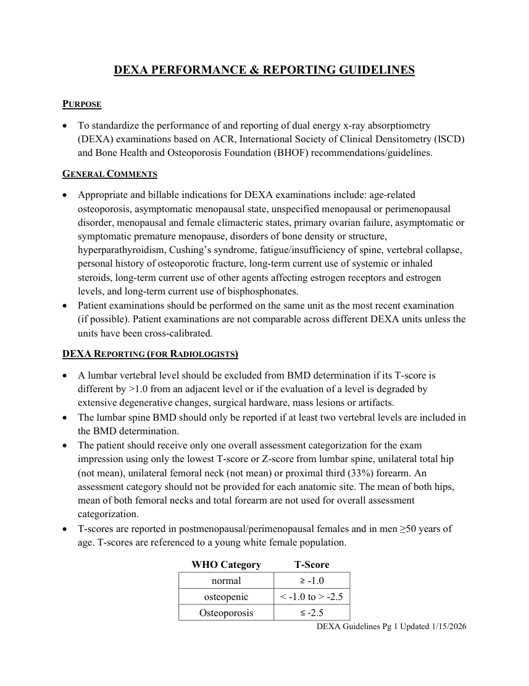
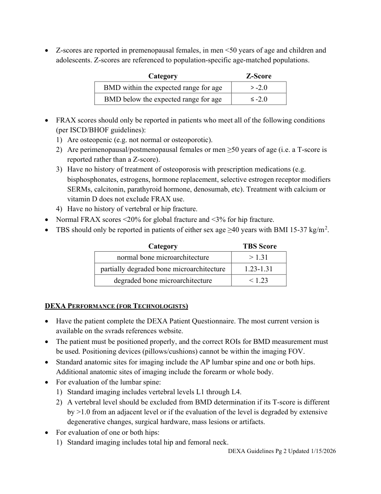
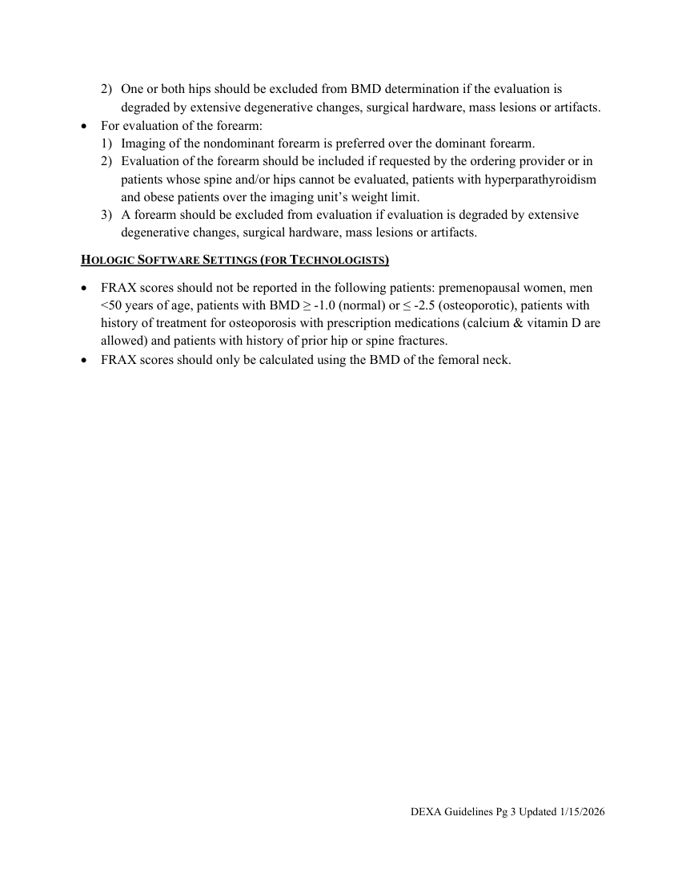

# RX — Densitometrie DEXA (MCB)

## Documentul original MCB — Densitometrie DEXA

**Ghid · 3 pagini · consultat la 2026-09-27.**

[Descarcă PDF-ul integral](../../assets/mcb-modalities/rx-densitometrie-dexa-mcb/document.pdf) · [Sursa MCB](https://ref.mcbradiology.com/DEXA/DEXA%20Guidelines.pdf) · [Catalogul MCB pentru această modalitate](../mcb/index.md)

Instrucțiunile, valorile și ilustrațiile din documentul original sunt păstrate în **engleză**. Titlul și navigarea sunt în română.

### Pagina 1

{ loading=lazy }

### Pagina 2

{ loading=lazy }

### Pagina 3

{ loading=lazy }

## Textul documentului original

??? abstract "Pagina 1 — text în engleză"

    
DEXA PERFORMANCE &amp; REPORTING GUIDELINES 
     
    PURPOSE  
     To standardize the performance of and reporting of dual energy x-ray absorptiometry 
    (DEXA) examinations based on ACR, International Society of Clinical Densitometry (ISCD) 
    and Bone Health and Osteoporosis Foundation (BHOF) recommendations/guidelines.  
    GENERAL COMMENTS  
     Appropriate and billable indications for DEXA examinations include: age-related 
    osteoporosis, asymptomatic menopausal state, unspecified menopausal or perimenopausal 
    disorder, menopausal and female climacteric states, primary ovarian failure, asymptomatic or 
    symptomatic premature menopause, disorders of bone density or structure, 
    hyperparathyroidism, Cushing’s syndrome, fatigue/insufficiency of spine, vertebral collapse, 
    personal history of osteoporotic fracture, long-term current use of systemic or inhaled 
    steroids, long-term current use of other agents affecting estrogen receptors and estrogen 
    levels, and long-term current use of bisphosphonates. 
     Patient examinations should be performed on the same unit as the most recent examination 
    (if possible). Patient examinations are not comparable across different DEXA units unless the 
    units have been cross-calibrated.  
    DEXA REPORTING (FOR RADIOLOGISTS) 
     A lumbar vertebral level should be excluded from BMD determination if its T-score is 
    different by &gt;1.0 from an adjacent level or if the evaluation of a level is degraded by 
    extensive degenerative changes, surgical hardware, mass lesions or artifacts. 
     The lumbar spine BMD should only be reported if at least two vertebral levels are included in 
    the BMD determination. 
     The patient should receive only one overall assessment categorization for the exam 
    impression using only the lowest T-score or Z-score from lumbar spine, unilateral total hip 
    (not mean), unilateral femoral neck (not mean) or proximal third (33%) forearm. An 
    assessment category should not be provided for each anatomic site. The mean of both hips, 
    mean of both femoral necks and total forearm are not used for overall assessment 
    categorization. 
     T-scores are reported in postmenopausal/perimenopausal females and in men ≥50 years of 
    age. T-scores are referenced to a young white female population. 
    WHO Category 
    T-Score 
    normal 
    ≥ -1.0 
    osteopenic 
    &lt; -1.0 to &gt; -2.5 
    Osteoporosis 
    ≤ -2.5 
    DEXA Guidelines Pg 1 Updated 1/15/2026 
     
     
    

??? abstract "Pagina 2 — text în engleză"

    
 Z-scores are reported in premenopausal females, in men &lt;50 years of age and children and 
    adolescents. Z-scores are referenced to population-specific age-matched populations. 
    Category 
    Z-Score 
    BMD within the expected range for age 
    &gt; -2.0 
    BMD below the expected range for age 
    ≤ -2.0 
     
     FRAX scores should only be reported in patients who meet all of the following conditions                              
    (per ISCD/BHOF guidelines):  
    1) Are osteopenic (e.g. not normal or osteoporotic). 
    2) Are perimenopausal/postmenopausal females or men ≥50 years of age (i.e. a T-score is 
    reported rather than a Z-score). 
    3) Have no history of treatment of osteoporosis with prescription medications (e.g. 
    bisphosphonates, estrogens, hormone replacement, selective estrogen receptor modifiers 
    SERMs, calcitonin, parathyroid hormone, denosumab, etc). Treatment with calcium or 
    vitamin D does not exclude FRAX use. 
    4) Have no history of vertebral or hip fracture. 
     Normal FRAX scores &lt;20% for global fracture and &lt;3% for hip fracture. 
     TBS should only be reported in patients of either sex age ≥40 years with BMI 15-37 kg/m2. 
    Category 
     TBS Score 
    normal bone microarchitecture 
    &gt; 1.31 
    partially degraded bone microarchitecture 
    1.23-1.31 
    degraded bone microarchitecture 
    &lt; 1.23 
     
    DEXA PERFORMANCE (FOR TECHNOLOGISTS) 
     Have the patient complete the DEXA Patient Questionnaire. The most current version is 
    available on the svrads references website. 
     The patient must be positioned properly, and the correct ROIs for BMD measurement must 
    be used. Positioning devices (pillows/cushions) cannot be within the imaging FOV. 
     Standard anatomic sites for imaging include the AP lumbar spine and one or both hips. 
    Additional anatomic sites of imaging include the forearm or whole body. 
     For evaluation of the lumbar spine: 
    1) Standard imaging includes vertebral levels L1 through L4. 
    2) A vertebral level should be excluded from BMD determination if its T-score is different 
    by &gt;1.0 from an adjacent level or if the evaluation of the level is degraded by extensive 
    degenerative changes, surgical hardware, mass lesions or artifacts. 
     For evaluation of one or both hips: 
    1) Standard imaging includes total hip and femoral neck. 
    DEXA Guidelines Pg 2 Updated 1/15/2026 
     
     
    

??? abstract "Pagina 3 — text în engleză"

    
2) One or both hips should be excluded from BMD determination if the evaluation is 
    degraded by extensive degenerative changes, surgical hardware, mass lesions or artifacts. 
     For evaluation of the forearm: 
    1) Imaging of the nondominant forearm is preferred over the dominant forearm. 
    2) Evaluation of the forearm should be included if requested by the ordering provider or in 
    patients whose spine and/or hips cannot be evaluated, patients with hyperparathyroidism 
    and obese patients over the imaging unit’s weight limit. 
    3) A forearm should be excluded from evaluation if evaluation is degraded by extensive 
    degenerative changes, surgical hardware, mass lesions or artifacts. 
    HOLOGIC SOFTWARE SETTINGS (FOR TECHNOLOGISTS) 
     FRAX scores should not be reported in the following patients: premenopausal women, men 
    &lt;50 years of age, patients with BMD ≥ -1.0 (normal) or ≤ -2.5 (osteoporotic), patients with 
    history of treatment for osteoporosis with prescription medications (calcium &amp; vitamin D are 
    allowed) and patients with history of prior hip or spine fractures.  
     FRAX scores should only be calculated using the BMD of the femoral neck. 
     
    DEXA Guidelines Pg 3 Updated 1/15/2026 
     
     
    

