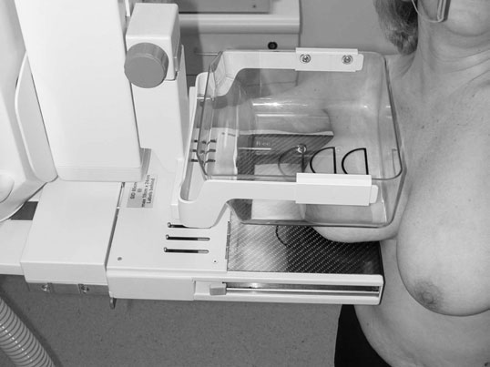
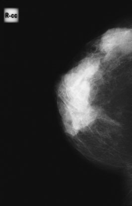
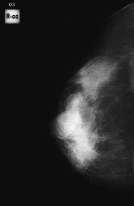
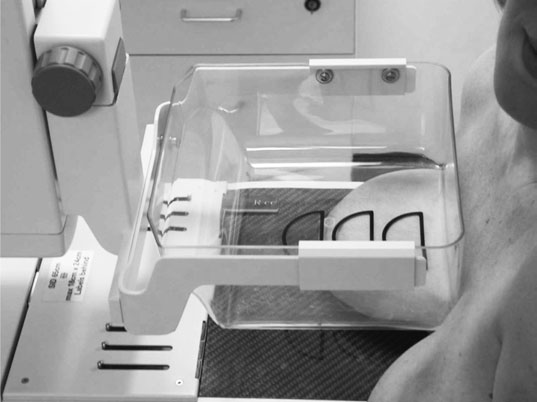
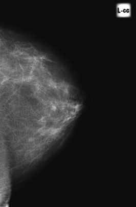

# Rx INCIDENȚĂ CRANIO-CAUDALĂ EXTINSĂ A SÂNULUI (MAMOGRAFIE), ROTAȚIE EXTERNĂ (LATERALĂ)

  📷 Radiografie Convențională (Rx)
  <strong>Actualizat:</strong> 2026-09-16
  <strong>Autor:</strong> Departamentul de Radiologie / Referință Clark (Ed. 12)

---

-   __1. Rezumat Clinic & Indicații__

    ---

    === "Indicații Clinice"

        - Deoarece toate leziunile trebuie evidențiate în două incidențe, această incidență cranio-caudală extinsă este utilă pentru evidențierea cadranului extern, cozii axilare și axilei. 453 15 cranio-caudală extinsă – rotită medial. Aceasta este utilă pentru evidențierea leziunilor din porțiunea medială a sânului (mamografie).

    === "Ghid Național IRIS"

        !!! info "Referință Primară: Ghidul Național IRIS (Ordinul MS 1342/2012)"
            - **Capitol Ghid IRIS:** *Sân*
            - **Grad de Recomandare:** **Grad A**
            - **Nivel de Iradiere Estimată:** `Clasa 1 (Minimă < 0.4 mSv)`

            [:octicons-search-16: Deschide Ghidul IRIS](../../iris.md){ .md-button .md-button--primary } [:material-open-in-new: Aplicația Oficială PWA](https://radiologie-pediatrica.ro/iris/){ .md-button target="_blank" rel="noopener" }

-   __2. Poziționare & Centrare Fascicul__

    ---

    - **Poziție Pacient:**
        - Femeia stă cu fața spre echipament, iar partea examinată este rotită aproximativ 45 de grade către echipament.
        - Sânul este ridicat cu mâna radiografului până formează un unghi drept cu corpul, iar mamelonul este poziționat de profil. Masa de susținere a sânului este ridicată până atinge partea inferioară a sânului, cea mai apropiată de peretele toracic.
        - Mâna este retrasă ușor, lăsând sânul cu regiunea mamelonară pe marginea medială extremă a mesei de susținere a sânului.
        - Brațul femeii este așezat pe partea mesei de susținere a sânului, menținând echipamentul.
        - Radiograful stă în spatele femeii și ridică sânul, extinzându-l cât mai mult posibil pentru a evidenția cât mai mult țesut mamar.
        - Femeia se apleacă posterior aproximativ 45 de grade, dacă este posibil, coborând umărul pentru a permite cadranului extern și axilei să atingă masa de susținere a sânului.
        - Brațul femeii este extins. Ea se ține de echipament cu cealaltă mână pentru stabilitate și pentru a-și menține poziția.
        - În timp ce sânul este menținut în poziție pe masa de susținere a sânului, femeii i se cere să se aplece spre echipament și este împinsă ușor în acesta. Dacă nu se poate apleca posterior până la 45 de grade, incidența satisfăcătoare a cadranului superoextern va fi totuși posibilă, cu condiția să fie rotită adecvat. 452
        - Mamelonul trebuie menținut de profil. Nu va fi evidențiat întregul aspect medial al sânului.
        - Sânul este susținut manual în timp ce se inițiază compresia. Mâna este retrasă anterior, dar nu înainte ca o compresie aproape completă să fie obținută, astfel încât sânul să nu se deplaseze.
        - Placa de compresie se potrivește în unghiul dintre capul humeral și cutia toracică.
        - Femeia stă cu fața spre echipament. Sternul ei se află la aproximativ 8 cm de marginea medială a mesei de susținere a sânului.
        - Ambii sâni sunt ridicați pe masa de susținere a sânului, care este coborâtă în acest scop. Apoi este ridicată la înălțimea corectă, permițând mamelonului de pe partea examinată să fie de profil.
        - Femeia este împinsă ușor spre echipament.
        - Sânul care urmează să fie evidențiat este întins și rotit pentru a permite vizualizarea regiunii posteromediale. Sânul este menținut în poziție în timpul aplicării compresiei inițiale. Apoi mâna radiografului este retrasă, pentru a putea fi realizată compresia finală.
    - **Punct de Centrare Fascicul:** Raza centrală perpendiculară pe centrul receptorului de imagine.
    - **Distanță Focar-Film (DFF / SID):** 100 cm
    - **Comandă Respiratorie:** Apnee pe durata expunerii (apnee în inspir pentru torace; expir pentru Abdomen/bazin).

-   __3. Parametri Tehnici Expunere__

    ---

    | Parametru Tehnic | Valoare Configurare Generator / Tub |
    |:-----------------|:-------------------------------------|
    | **Tensiune Tub (kV)** | DE CONFIGURAT PE APARAT |
    | **Sarcină / Produs Curent-Timp (mAs)** | Conform AEC / grosimii anatomice |
    | **Distanță Focar-Film (DFF / SID)** | 100 cm |
    | **Grilă Antidifuzoare (Bucky)** | Conform grosimii anatomice (> 10-12 cm cu grilă) |
    | **Dimensiune Focar** | Focar Mic (0.6 mm) |
    | **Camere de Ionizare AEC** | DE CONFIGURAT PE APARAT |
    | **Colimare Fascicul** | Colimare strictă la aria anatomică de interes diagnostic |
    | **Filtrare Tub** | Totală ≥ 2.5 mm Al echivalent (conform Clark: 3.0 mm Al echivalent) |

-   __4. Criterii de Calitate & Reușită Imagine__

    ---

    - Sânul trebuie poziționat astfel încât coada axilară să fie prezentă pe filmul radiologic, vizualizându-se cât mai mult țesut mamar posibil.
    - Este evidențiată includerea maximă a porțiunii medioposterioare a sânului.
    - Erori de evitat / remedii: Dacă imaginea sânului prezintă o coadă axilară și o axilă insuficient evidențiate, mamelonul nu a fost poziționat suficient de aproape de marginea medială a suportului filmului radiologic înainte ca femeia să se aplece posterior.
    - Erori de evitat / remedii: Dacă mamelonul nu a fost de profil, femeia nu s-a aplecat suficient pentru a permite rotirea spre interior a porțiunii mediale a sânului.
    - Erori de evitat / remedii: Dacă compresia este inadecvată, sânul nu a fost verificat pentru fermitate, iar compresia este posibil să fi fost prea apropiată de capul humeral.

-   __5. Protecție Radiologică (ALARA)__

    ---

    - Ecranare gonadică cu șorț plumbat dacă gonadele sunt în apropierea fasciculului util (regula ALARA).
    - Colimare precisă la dimensiunea anatomică strict necesară pentru reducerea dozei și a radiației difuze.
    - Verificarea posibilității unei sarcini la pacientele de vârstă fertilă înainte de expunere.

!!! note "Observații Clinice & Tehnice"
    Pregătirea pacientului prin îndepărtarea tuturor accesoriilor radio-opace.

### 🖼️ Imagini

<figure class="protocol-image-card" markdown>

<figcaption><strong>• Sânul este ridicat cu mâna radiografului până formează un</strong> — Poziționarea pacientului și centrarea fasciculului conform Clark (Ed. 12)</figcaption>

</figure>

<figure class="protocol-image-card" markdown>

<figcaption><strong>• Radiograful stă în spatele femeii și ridică</strong> — Aspect radiografic / ghid de poziționare conform tratatului Clark (Ed. 12)</figcaption>

</figure>

<figure class="protocol-image-card" markdown>

<figcaption><strong>detaliu, de exemplu microcalcificări patologice; trebuie acordată o mare atenție</strong> — Aspect radiografic / ghid de poziționare conform tratatului Clark (Ed. 12)</figcaption>

</figure>

<figure class="protocol-image-card" markdown>

<figcaption><strong>Mâna radiografului este retrasă, astfel încât compresia finală să poată</strong> — Aspect radiografic / ghid de poziționare conform tratatului Clark (Ed. 12)</figcaption>

</figure>

<figure class="protocol-image-card" markdown>

<figcaption><strong>de exemplu microcalcificări patologice; trebuie acordată o mare atenție pentru a asigura</strong> — Aspect radiografic / ghid de poziționare conform tratatului Clark (Ed. 12)</figcaption>

</figure>

=== "Ghid Rapid de Execuție"

    1. **Identificarea și verificarea pacientului:** verificare identitate, zonă de examinat, consimțământ conform procedurii și evaluarea posibilității unei sarcini, când este relevantă.
    2. **Pregătire:** îndepărtarea oricăror obiecte radiopace (bijuterii, agrafe, fermoare, proteze, pansamente dense).
    3. **Poziționare precisă:** alinierea receptorului de imagine și a tubului la distanța prescrisă (100 cm).
    4. **Colimare strictă:** adaptarea fasciculului strict la regiunea de diagnostic pentru scăderea iradierii și reducerea radiației difuze.
    5. **Radioprotecție:** verificarea [politicii RX](../radioprotectie.md), cu măsuri distincte pentru pacient, personal și însoțitor.

## Surse de documentare

- [Clark's Positioning in Radiography (Ed. 12), Pagina 467](https://books.google.com/books/about/Clark_s_Positioning_in_Radiography.html?id=Xxu6MwEACAAJ)
