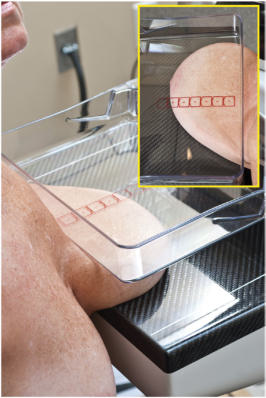
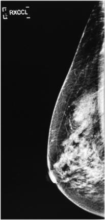
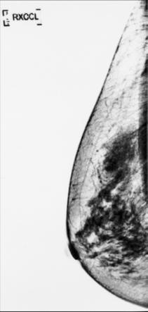

# Rx INCIDENȚĂ CRANIO-CAUDALĂ EXAGERATĂ (LATERAL) (XCCL) A SÂNULUI (MAMOGRAFIE)

  📷 Radiografie Convențională (Rx)
  <strong>Actualizat:</strong> 2026-09-15
  <strong>Autor:</strong> Departamentul de Radiologie / Referință Bontrager

---

-   __1. Rezumat Clinic & Indicații__

    ---

    === "Indicații Clinice"

        - Posibilă afecțiune sau modificare patologică a sânului ori a țesutului mamar; evidențiază, de asemenea, țesutul axilar
        - Cea mai frecvent solicitată incidență opțională atunci când incidența CC nu evidențiază întregul țesut axilar sau când leziunea este observată pe MLO, dar nu pe CC

    === "Ghid Național IRIS"

        !!! info "Referință Primară: Ghidul Național IRIS (Ordinul MS 1342/2012)"
            - **Capitol Ghid IRIS:** *Sân*
            - **Grad de Recomandare:** **Grad A**
            - **Nivel de Iradiere Estimată:** `Clasa 1 (Minimă < 0.4 mSv)`

            [:octicons-search-16: Deschide Ghidul IRIS](../../iris.md){ .md-button .md-button--primary } [:material-open-in-new: Aplicația Oficială PWA](https://radiologie-pediatrica.ro/iris/){ .md-button target="_blank" rel="noopener" }

-   __2. Poziționare & Centrare Fascicul__

    ---

    - **Poziție Pacient:** Pacient: În ortostatism, dacă este posibil; Regiune anatomică: Începeți ca pentru efectuarea incidenței CC, apoi rotiți ușor corpul în sens opus față de receptorul de imagine, după cum este necesar, pentru a include mai mult din aspectul axilar al sânului pe receptorul de imagine (Fig. 20.73). Așezați mâna pacientei pe bara anterioară și relaxați umărul (unii recomandă înclinarea unității cu 5° lateromedial). Capul este rotit în sens opus față de partea examinată (cu fața spre tehnician). Sânul este tras anterior pe receptorul de imagine; cutele și pliurile trebuie netezite, iar compresia se aplică până când sânul este întins. Mamelonul trebuie să fie de profil (Fig. 20.74). Markerul de incidență R sau L este plasat întotdeauna pe partea axilară.
    - **Punct de Centrare Fascicul:** perpendiculară, centrată pe baza sânului, marginea peretelui toracic a receptorului de imagine; raza centrală nu este mobilă
    - **Distanță Focar-Film (DFF / SID):** 60 cm
    - **Comandă Respiratorie:** Apnee (oprirea respirației) respirație.

-   __3. Parametri Tehnici Expunere__

    ---

    | Parametru Tehnic | Valoare Configurare Generator / Tub |
    |:-----------------|:-------------------------------------|
    | **Tensiune Tub (kV)** | DE CONFIGURAT PE APARAT |
    | **Sarcină / Produs Curent-Timp (mAs)** | DE CONFIGURAT PE APARAT |
    | **Distanță Focar-Film (DFF / SID)** | 60 cm |
    | **Grilă Antidifuzoare (Bucky)** | Cu grilă antidifuzoare Bucky |
    | **Dimensiune Focar** | Focar Mic (0.6 mm) |
    | **Camere de Ionizare AEC** | Camerele laterale (sau camera centrală, în funcție de regiune) |
    | **Colimare Fascicul** | Raza centrală și colimarea sunt fixe și corect centrate dacă țesutul mamar este corect centrat și vizualizat pe receptorul de imagine. Expunere: Zonele dense sunt penetr ate adecvat, rezultând un contrast optim. Marcajele tisulare nete indică absența mișcării. Markerii R și L și informațiile despre pacient sunt plasați corect pe partea axilară a receptorului de imagine. Nu sunt vizibili artefacte. Mamelon Țesut glandular Țesut adipos Mușchi pectoral Fig. 20.75 Incidență XCCL. |
    | **Filtrare Tub** | Totală ≥ 2.5 mm Al echivalent |

-   __4. Criterii de Calitate & Reușită Imagine__

    ---

    - Sunt incluse țesutul mamar axilar, mușchiul pectoral și țesuturile centrale și subareolare (Fig. 20.74 și 20.75). Poziție și compresie
    - Mamelonul este vizualizat de profil.
    - Grosimea țesutului este distribuită uniform, indicând o compresie optimă.
    - Țesuturile axilare, inclusiv mușchiul pectoral, sunt vizualizate, indicând poziționarea corectă cu rotație suficientă a corpului.

-   __5. Protecție Radiologică (ALARA)__

    ---

    - Ecranare gonadică și a organelor radiosensibile conform procedurilor locale de radioprotecție ALARA.
    - Colimare strictă la aria de interes pentru limitarea radiației difuze.
    - Verificarea posibilității unei sarcini la pacientele de vârstă fertilă înainte de expunere.

!!! note "Observații Clinice & Tehnice"
    S: Dacă leziunea este mai profundă sau superioară, este necesară această incidență. Dacă leziunea nu este identificată pe aspectul lateral al sânului, trebuie efectuată o incidență cranio-caudală exagerată medial. Poziționați camera AEC în poziția adecvată pentru a asigura o expunere adecvată a diferitelor densități tisulare. Fig. 20.73 Incidență XCCL. NOTĂ: Pacienta este rotită astfel încât țesutul axilar să fie inclus în imagine. Brațul și mâna sunt poziționate anterior pentru a ușura rotirea corpului. Fig. 20.74 Incidență XCCL.

### 🖼️ Imagini

<figure class="protocol-image-card" markdown>

<figcaption><strong>Fig. 20.73 Incidență XCCL. NOTĂ: pacientul este rotit astfel încât țesutul axilar</strong> — Poziționarea pacientului conform Ghidului Bontrager (Fig. 20.73 Incidență XCCL. NOTĂ: pacientul este rotit astfel încât țesutul axilar</figcaption>

</figure>

<figure class="protocol-image-card" markdown>

<figcaption><strong>Fig. 20.74 Incidență XCCL.</strong> — Aspect radiografic de referință conform Ghidului Bontrager (Fig. 20.74 Incidență XCCL.)</figcaption>

</figure>

<figure class="protocol-image-card" markdown>

<figcaption><strong>Fig. 20.75 Incidență XCCL.</strong> — Aspect radiografic de referință conform Ghidului Bontrager (Fig. 20.75 Incidență XCCL.)</figcaption>

</figure>

=== "Ghid Rapid de Execuție"

    1. **Identificarea și verificarea pacientului:** verificare identitate, zonă de examinat, consimțământ conform procedurii și evaluarea posibilității unei sarcini, când este relevantă.
    2. **Pregătire:** îndepărtarea oricăror obiecte radiopace (bijuterii, agrafe, fermoare, proteze, pansamente dense).
    3. **Poziționare precisă:** alinierea receptorului de imagine și a tubului la distanța prescrisă (60 cm).
    4. **Colimare strictă:** adaptarea fasciculului strict la regiunea de diagnostic pentru scăderea iradierii și reducerea radiației difuze.
    5. **Radioprotecție:** verificarea [politicii RX](../radioprotectie.md), cu măsuri distincte pentru pacient, personal și însoțitor.

## Surse de documentare

- [Bontrager's Textbook of Radiographic Positioning (Ed. 9/10), Pagina 793](https://www.elsevier.com/books/textbook-of-radiographic-positioning-and-related-anatomy/lampignano/978-0-323-65367-1)
