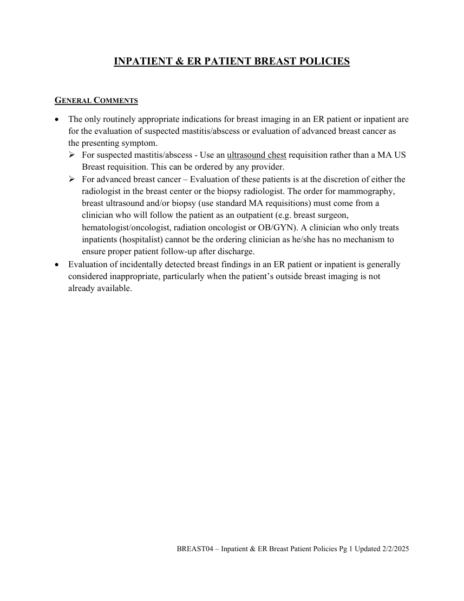

# RX — Imagistică mamară: pacienți internați și urgențe (MCB)

## Documentul original MCB — Imagistică mamară: pacienți internați și urgențe

**Politică procedurală · 1 pagini · consultat la 2026-09-27.**

[Descarcă PDF-ul integral](../../assets/mcb-modalities/rx-imagistica-mamara-pacienti-internati-si-urgente-mcb/document.pdf) · [Sursa MCB](https://ref.mcbradiology.com/Breast/Policies/BREAST04%20-%20Inpatient%20&%20ER%20Patient%20Breast%20Policies.pdf) · [Catalogul MCB pentru această modalitate](../mcb/index.md)

Instrucțiunile, valorile și ilustrațiile din documentul original sunt păstrate în **engleză**. Titlul și navigarea sunt în română.

### Pagina 1

{ loading=lazy }

## Textul documentului original

??? abstract "Pagina 1 — text în engleză"

    
INPATIENT &amp; ER PATIENT BREAST POLICIES 
     
    GENERAL COMMENTS 
     The only routinely appropriate indications for breast imaging in an ER patient or inpatient are 
    for the evaluation of suspected mastitis/abscess or evaluation of advanced breast cancer as 
    the presenting symptom.  
     For suspected mastitis/abscess - Use an ultrasound chest requisition rather than a MA US 
    Breast requisition. This can be ordered by any provider. 
     For advanced breast cancer – Evaluation of these patients is at the discretion of either the 
    radiologist in the breast center or the biopsy radiologist. The order for mammography, 
    breast ultrasound and/or biopsy (use standard MA requisitions) must come from a 
    clinician who will follow the patient as an outpatient (e.g. breast surgeon, 
    hematologist/oncologist, radiation oncologist or OB/GYN). A clinician who only treats 
    inpatients (hospitalist) cannot be the ordering clinician as he/she has no mechanism to 
    ensure proper patient follow-up after discharge. 
     Evaluation of incidentally detected breast findings in an ER patient or inpatient is generally 
    considered inappropriate, particularly when the patient’s outside breast imaging is not 
    already available. 
    BREAST04 – Inpatient &amp; ER Breast Patient Policies Pg 1 Updated 2/2/2025 
     
     
    

