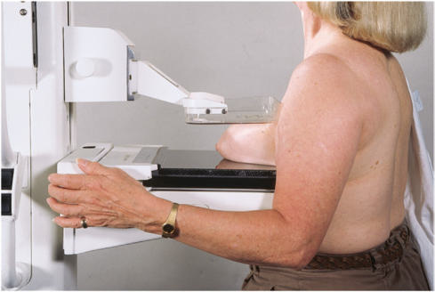

# Rx Mamografie Cranio-Caudală (CC)

  📷 Radiografie Convențională (Rx)
  <strong>Actualizat:</strong> 2026-09-15
  <strong>Autor:</strong> Departamentul de Radiologie / Referință Bontrager

---

-   __1. Rezumat Clinic & Indicații__

    ---

    === "Indicații Clinice"

        - Detectarea sau evaluarea calcificărilor, chisturilor, carcinoamelor sau a altor anomalii ori modificări ale țesutului mamar, indicând o posibilă afecțiune patologică
        - Sânii sunt examinați separat pentru comparație.

    === "Ghid Național IRIS"

        !!! info "Referință Primară: Ghidul Național IRIS (Ordinul MS 1342/2012)"
            - **Capitol Ghid IRIS:** *Sân*
            - **Grad de Recomandare:** **Grad A**
            - **Nivel de Iradiere Estimată:** `Clasa 1 (Minimă < 0.4 mSv)`

            [:octicons-search-16: Deschide Ghidul IRIS](../../iris.md){ .md-button .md-button--primary } [:material-open-in-new: Aplicația Oficială PWA](https://radiologie-pediatrica.ro/iris/){ .md-button target="_blank" rel="noopener" }

-   __2. Poziționare & Centrare Fascicul__

    ---

    - **Poziție Pacient:** Pacient: Ortostatism, dacă este posibil; Regiune anatomică: înălțimea receptorului de imagine este determinată prin ridicarea mamografiei pentru a obține un unghi de 90° față de peretele toracic. Receptorul de imagine este la nivelul iMF, la limitele sale superioare. (Tehnicianul trebuie să se poziționeze întotdeauna pe partea medială a pacientului pentru a se asigura că țesutul mamar este paralel cu receptorul de imagine (RI). Poziționarea dinspre aspectul lateral al sânului îngreunează manevrele. Sânul este tras înainte pe receptorul de imagine, central, cu mamelonul în profil ori de câte ori este posibil (Fig. 20.64 și 20.65). Brațul de pe partea examinată este relaxat pe lângă corp, iar umărul este retras din cale. Capul este întors în partea opusă celei examinate (cu fața către tehnician). Țesutul medial al sânului contralateral este așezat peste colțul receptorului de imagine. Cutele și pliurile sânului trebuie netezite, iar compresia aplicată până când acesta devine întins. Markerul și informațiile de identificare ale pacientului sunt plasate întotdeauna pe partea axilară. Sfaturi de poziționare pentru paciente cu abdomen mare, proeminent—După așezarea pacientei la bucky, i se cere să facă un pas înapoi, să țină picioarele nemișcate, apoi să se aplece înainte și să așeze sânul pe receptorul de imagine. Astfel, întregul sân poate ajunge la receptorul de imagine fără blocarea de către abdomen. Pacientele tinere, cu sâni mici, au adesea țesut dificil de reprezentat într-o singură incidență. Pentru a evita efectuarea a trei imagini (doză suplimentară pentru pacientă), la prima imagine CC se urmărește obținerea țesutului medial; la a doua imagine se urmărește evidențierea țesutului lateral. Niciuna dintre incidențe nu trebuie să fie o incidență exagerată. Această tehnică evită necesitatea efectuării unei incidențe CC directe și apoi a ambelor incidențe exagerate (medială și laterală). Fig. 20.64 Incidență CC. (din Long BW, Rollins JH, Smith BJ: Merrill’s atlas de poziționare și proceduri radiografice, ed. 13, St. Louis, 2016, Mosby.)
    - **Punct de Centrare Fascicul:** perpendiculară pe centrul ariei de interes
    - **Distanță Focar-Film (DFF / SID):** 60 cm
    - **Comandă Respiratorie:** Apnee pe durata expunerii (sau conform cooperării pacientului)

-   __3. Parametri Tehnici Expunere__

    ---

    | Parametru Tehnic | Valoare Configurare Generator / Tub |
    |:-----------------|:-------------------------------------|
    | **Tensiune Tub (kV)** | DE CONFIGURAT PE APARAT |
    | **Sarcină / Produs Curent-Timp (mAs)** | DE CONFIGURAT PE APARAT |
    | **Distanță Focar-Film (DFF / SID)** | 60 cm |
    | **Grilă Antidifuzoare (Bucky)** | Cu grilă antidifuzoare Bucky |
    | **Dimensiune Focar** | Focar Mic (0.6 mm) |
    | **Camere de Ionizare AEC** | Camerele laterale (sau camera centrală, în funcție de regiune) |
    | **Colimare Fascicul** | Colimare strictă pe regiunea anatomică de interes diagnostic |
    | **Filtrare Tub** | Totală ≥ 2.5 mm Al echivalent |

-   __4. Criterii de Calitate & Reușită Imagine__

    ---

    - Vizualizarea completă a regiunii anatomice explorate
    - Absența artefactelor de mișcare sau a suprapunerilor neadecvate
    - Contrast și penetrare optime pentru decelarea structurilor osoase și a părților moi

-   __5. Protecție Radiologică (ALARA)__

    ---

    - Ecranare gonadică și a organelor radiosensibile conform procedurilor locale de radioprotecție ALARA.
    - Colimare strictă la aria de interes pentru limitarea radiației difuze.
    - Verificarea posibilității unei sarcini la pacientele de vârstă fertilă înainte de expunere.

### 🖼️ Imagini

<figure class="protocol-image-card" markdown>

<figcaption><strong>Fig. 20.64 Incidență CC. (din Long BW, Rollins JH, Smith BJ:</strong> — Poziționarea pacientului conform Ghidului Bontrager (Fig. 20.64 Incidență CC. (din Long BW, Rollins JH, Smith BJ:)</figcaption>

</figure>

=== "Ghid Rapid de Execuție"

    1. **Identificarea și verificarea pacientului:** verificare identitate, zonă de examinat, consimțământ conform procedurii și evaluarea posibilității unei sarcini, când este relevantă.
    2. **Pregătire:** îndepărtarea oricăror obiecte radiopace (bijuterii, agrafe, fermoare, proteze, pansamente dense).
    3. **Poziționare precisă:** alinierea receptorului de imagine și a tubului la distanța prescrisă (60 cm).
    4. **Colimare strictă:** adaptarea fasciculului strict la regiunea de diagnostic pentru scăderea iradierii și reducerea radiației difuze.
    5. **Radioprotecție:** verificarea [politicii RX](../radioprotectie.md), cu măsuri distincte pentru pacient, personal și însoțitor.

## Surse de documentare

- [Bontrager's Textbook of Radiographic Positioning (Ed. 9/10), Pagina 789](https://www.elsevier.com/books/textbook-of-radiographic-positioning-and-related-anatomy/lampignano/978-0-323-65367-1)
