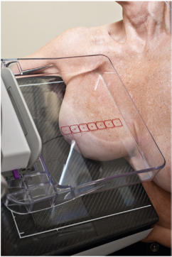
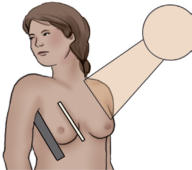
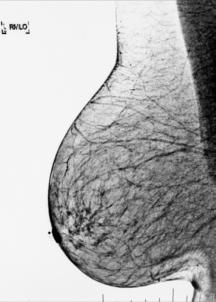
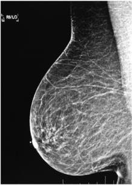

# Rx Mamografie Oblică Medio-Laterală (MLO) (SUPEROMEDIAL)

  📷 Radiografie Convențională (Rx)
  <strong>Actualizat:</strong> 2026-09-15
  <strong>Autor:</strong> Departamentul de Radiologie / Referință Bontrager

---

-   __1. Rezumat Clinic & Indicații__

    ---

    === "Indicații Clinice"

        - Detectarea sau evaluarea calcificărilor, chisturilor, carcinoamelor și a altor anomalii sau modificări din aspectul lateral profund al țesutului mamar
        - Sânii sunt examinați separat pentru comparație.

    === "Ghid Național IRIS"

        !!! info "Referință Primară: Ghidul Național IRIS (Ordinul MS 1342/2012)"
            - **Capitol Ghid IRIS:** *Sân*
            - **Grad de Recomandare:** **Grad A**
            - **Nivel de Iradiere Estimată:** `Clasa 1 (Minimă < 0.4 mSv)`

            [:octicons-search-16: Deschide Ghidul IRIS](../../iris.md){ .md-button .md-button--primary } [:material-open-in-new: Aplicația Oficială PWA](https://radiologie-pediatrica.ro/iris/){ .md-button target="_blank" rel="noopener" }

-   __2. Poziționare & Centrare Fascicul__

    ---

    - **Poziție Pacient:** Pacient: Ortostatism, dacă este posibil; Regiune anatomică: Tubul și receptorul de imagine rămân la unghiuri drepte unul față de celălalt; raza centrală pătrunde medial în sân, perpendicular pe mușchiul pectoral al pacientei. Evaluarea corectă a unghiului mușchiului pectoral față de peretele toracic al pacientei este necesară pentru ca imaginea să evidențieze cantitatea maximă de țesut mamar. Acest unghi poate fi determinat corect de tehnician folosind palma întinsă de-a lungul aspectului lateral al sânului și ridicând-o ușor de la corp, potrivind unghiul palmei (Fig. 20.67). Reglați înălțimea receptorului de imagine astfel încât partea superioară a receptorului de imagine să fie la nivelul axilei. Cu pacienta orientată spre unitate și cu picioarele înainte, exact ca în incidența CC, așezați brațul de pe partea examinată de-a lungul părții superioare a receptorului de imagine, în stare relaxată. Trageți anterior și medial țesutul mamar și mușchiul pectoral, îndepărtându-le de peretele toracic. Evaluați unghiul mușchiului pectoral și reglați unitatea în consecință. Împingeți ușor pacienta spre receptorul de imagine înclinat până când aspectul inferolateral al sânului atinge receptorul de imagine. Mamelonul trebuie să fie în profil. Aplicați lent compresia, menținând sânul îndepărtat de peretele toracic și ridicat pentru a preveni lăsarea și pentru a prezenta regiunea IMF (Fig. 20.68). Marginea superioară a dispozitivului de compresie se sprijină sub claviculă, iar marginea inferioară include IMF. Cutele și pliurile sânului trebuie netezite, iar compresia aplicată până când acesta devine întins. Dacă este necesar, instruiți pacienta să retragă ușor sânul opus cu cealaltă mână pentru a preveni suprapunerea. Markerul pentru incidența R sau L (RMLO, LMLO) trebuie plasat sus, în apropierea axilei.
    - **Punct de Centrare Fascicul:** perpendiculară, centrată pe baza sânului, marginea peretelui toracic a receptorului de imagine; raza centrală nu este mobilă
    - **Distanță Focar-Film (DFF / SID):** 60 cm
    - **Comandă Respiratorie:** Instrucțiunile vor varia în funcție de utilizarea unor unități convenționale sau 3D.

-   __3. Parametri Tehnici Expunere__

    ---

    | Parametru Tehnic | Valoare Configurare Generator / Tub |
    |:-----------------|:-------------------------------------|
    | **Tensiune Tub (kV)** | DE CONFIGURAT PE APARAT |
    | **Sarcină / Produs Curent-Timp (mAs)** | DE CONFIGURAT PE APARAT |
    | **Distanță Focar-Film (DFF / SID)** | 60 cm |
    | **Grilă Antidifuzoare (Bucky)** | Cu grilă antidifuzoare Bucky |
    | **Dimensiune Focar** | Focar Mic (0.6 mm) |
    | **Camere de Ionizare AEC** | Camerele laterale (sau camera centrală, în funcție de regiune) |
    | **Colimare Fascicul** | Raza centrală și colimarea sunt fixe și centrate corect dacă țesutul mamar este centrat corect și vizualizat pe receptorul de imagine. Expunere: zonele dense sunt penetrate adecvat, rezultând un contrast optim. Marcajele tisulare clare indică absența mișcării. Markerul pentru incidența R sau L și informațiile despre pacientă sunt plasate corect pe partea axilară. Nu sunt vizibili artefacte. |
    | **Filtrare Tub** | Totală ≥ 2.5 mm Al echivalent |

-   __4. Criterii de Calitate & Reușită Imagine__

    ---

    - Întregul țesut mamar este vizibil, de la mușchiul pectoral până la nivelul mamelonului (Fig. 20.69 și 20.70).
    - IMF trebuie să fie vizibil, iar sânul nu trebuie să fie lăsat să atârne. Poziționare și compresie
    - Mamelonul este vizualizat de profil.
    - Sânul este vizibil tras în afară și îndepărtat de torace, cu grosime uniformă, indicând o compresie optimă.

-   __5. Protecție Radiologică (ALARA)__

    ---

    - Ecranare gonadică și a organelor radiosensibile conform procedurilor locale de radioprotecție ALARA.
    - Colimare strictă la aria de interes pentru limitarea radiației difuze.
    - Verificarea posibilității unei sarcini la pacientele de vârstă fertilă înainte de expunere.

!!! note "Observații Clinice & Tehnice"
    Pentru a evidenția întregul țesut mamar în această incidență, în cazul sânilor de dimensiuni mai mari pot fi necesare două imagini, una poziționată mai sus pentru a include întreaga regiune axilară și a doua poziționată mai jos pentru a include partea principală a sânului. Dacă este cazul, plasați camera AEC în poziția corespunzătoare pentru a asigura expunerea adecvată a diferitelor densități tisulare. Mamelon Țesut glandular Țesut adipos PNL Mușchi pectoral Fig. 20.70 Incidență MLO. PNL trebuie să se afle la 1 cm de PNL din incidența CC. 40°-70° 45° Receptorul de imagine (capătul incidenței) Platou de compresie Fig. 20.67 Incidență MLO. Fig. 20.68 Incidență MLO. (Rețineți că tubul radiogen/unitatea radiologică cu film este înclinată la aproximativ 45°; consultați Fig. 20.70.) Fig. 20.69 Incidență MLO.

### 🖼️ Imagini

<figure class="protocol-image-card" markdown>

<figcaption><strong>Fig. 20.70 Incidență MLO. PNL trebuie să</strong> — Poziționarea pacientului conform Ghidului Bontrager (Fig. 20.70 Incidență MLO. PNL trebuie să)</figcaption>

</figure>

<figure class="protocol-image-card" markdown>

<figcaption><strong>Fig. 20.67 Incidență MLO.</strong> — Aspect radiografic de referință conform Ghidului Bontrager (Fig. 20.67 Incidență MLO.)</figcaption>

</figure>

<figure class="protocol-image-card" markdown>

<figcaption><strong>Fig. 20.68 Incidență MLO. (Rețineți că tubul</strong> — Aspect radiografic de referință conform Ghidului Bontrager (Fig. 20.68 Incidență MLO. (Rețineți că tubul)</figcaption>

</figure>

<figure class="protocol-image-card" markdown>

<figcaption><strong>Fig. 20.69 Incidență MLO.</strong> — Aspect radiografic de referință conform Ghidului Bontrager (Fig. 20.69 Incidență MLO.)</figcaption>

</figure>

=== "Ghid Rapid de Execuție"

    1. **Identificarea și verificarea pacientului:** verificare identitate, zonă de examinat, consimțământ conform procedurii și evaluarea posibilității unei sarcini, când este relevantă.
    2. **Pregătire:** îndepărtarea oricăror obiecte radiopace (bijuterii, agrafe, fermoare, proteze, pansamente dense).
    3. **Poziționare precisă:** alinierea receptorului de imagine și a tubului la distanța prescrisă (60 cm).
    4. **Colimare strictă:** adaptarea fasciculului strict la regiunea de diagnostic pentru scăderea iradierii și reducerea radiației difuze.
    5. **Radioprotecție:** verificarea [politicii RX](../radioprotectie.md), cu măsuri distincte pentru pacient, personal și însoțitor.

## Surse de documentare

- [Bontrager's Textbook of Radiographic Positioning (Ed. 9/10), Pagina 791](https://www.elsevier.com/books/textbook-of-radiographic-positioning-and-related-anatomy/lampignano/978-0-323-65367-1)
