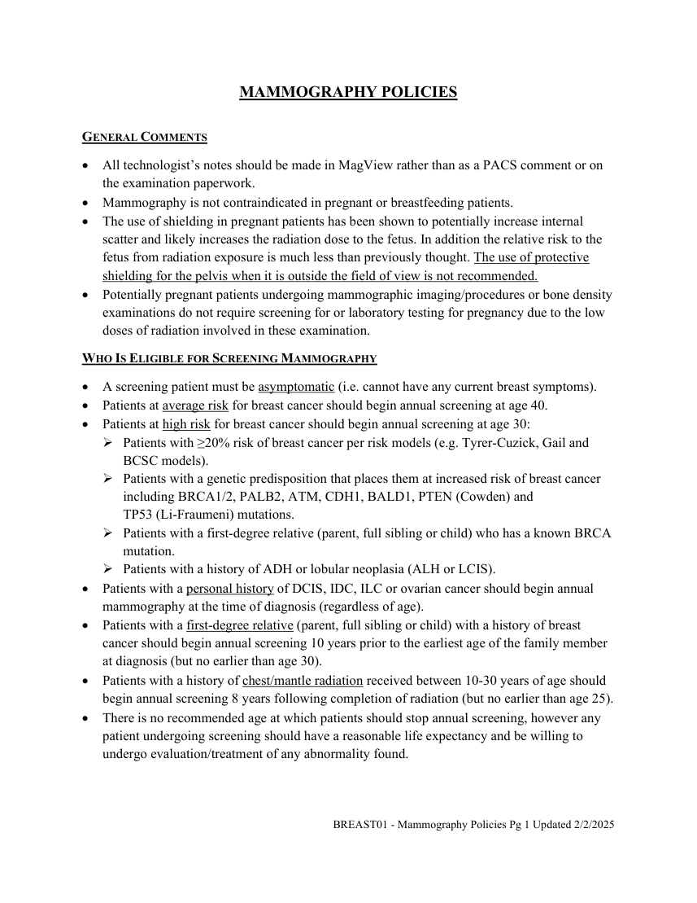
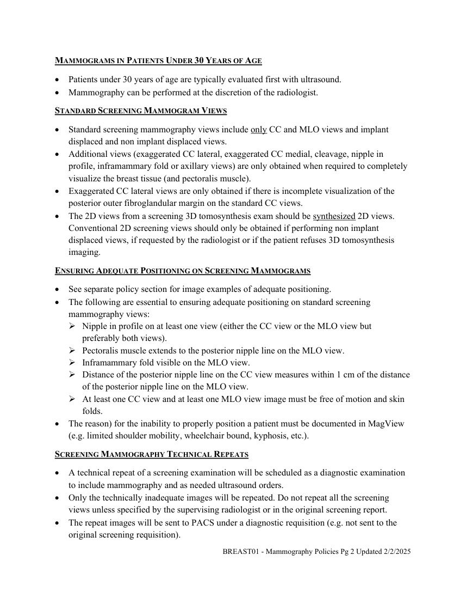
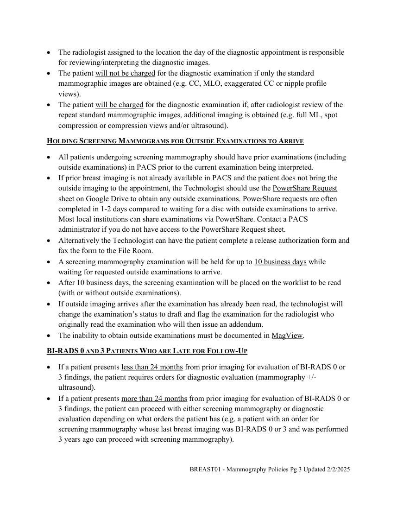

# RX — Mamografie: politici de examinare (MCB)

## Documentul original MCB — Mamografie: politici de examinare

**Politică procedurală · 4 pagini · consultat la 2026-09-27.**

[Descarcă PDF-ul integral](../../assets/mcb-modalities/rx-mamografie-politici-de-examinare-mcb/document.pdf) · [Sursa MCB](https://ref.mcbradiology.com/Breast/Policies/BREAST01%20-%20Mammography%20Policies.pdf) · [Catalogul MCB pentru această modalitate](../mcb/index.md)

Instrucțiunile, valorile și ilustrațiile din documentul original sunt păstrate în **engleză**. Titlul și navigarea sunt în română.

### Pagina 1

{ loading=lazy }

### Pagina 2

{ loading=lazy }

### Pagina 3

{ loading=lazy }

### Pagina 4

{ loading=lazy }

## Textul documentului original

??? abstract "Pagina 1 — text în engleză"

    
MAMMOGRAPHY POLICIES 
     
    GENERAL COMMENTS  
     All technologist’s notes should be made in MagView rather than as a PACS comment or on 
    the examination paperwork. 
     Mammography is not contraindicated in pregnant or breastfeeding patients. 
     The use of shielding in pregnant patients has been shown to potentially increase internal 
    scatter and likely increases the radiation dose to the fetus. In addition the relative risk to the 
    fetus from radiation exposure is much less than previously thought. The use of protective 
    shielding for the pelvis when it is outside the field of view is not recommended. 
     Potentially pregnant patients undergoing mammographic imaging/procedures or bone density 
    examinations do not require screening for or laboratory testing for pregnancy due to the low 
    doses of radiation involved in these examination. 
    WHO IS ELIGIBLE FOR SCREENING MAMMOGRAPHY 
     A screening patient must be asymptomatic (i.e. cannot have any current breast symptoms).  
     Patients at average risk for breast cancer should begin annual screening at age 40. 
     Patients at high risk for breast cancer should begin annual screening at age 30: 
     Patients with ≥20% risk of breast cancer per risk models (e.g. Tyrer-Cuzick, Gail and 
    BCSC models).  
     Patients with a genetic predisposition that places them at increased risk of breast cancer 
    including BRCA1/2, PALB2, ATM, CDH1, BALD1, PTEN (Cowden) and                                         
    TP53 (Li-Fraumeni) mutations. 
     Patients with a first-degree relative (parent, full sibling or child) who has a known BRCA 
    mutation.  
     Patients with a history of ADH or lobular neoplasia (ALH or LCIS). 
     Patients with a personal history of DCIS, IDC, ILC or ovarian cancer should begin annual 
    mammography at the time of diagnosis (regardless of age). 
     Patients with a first-degree relative (parent, full sibling or child) with a history of breast 
    cancer should begin annual screening 10 years prior to the earliest age of the family member 
    at diagnosis (but no earlier than age 30). 
     Patients with a history of chest/mantle radiation received between 10-30 years of age should 
    begin annual screening 8 years following completion of radiation (but no earlier than age 25). 
     There is no recommended age at which patients should stop annual screening, however any 
    patient undergoing screening should have a reasonable life expectancy and be willing to 
    undergo evaluation/treatment of any abnormality found. 
     
     
    BREAST01 - Mammography Policies Pg 1 Updated 2/2/2025 
     
     
    

??? abstract "Pagina 2 — text în engleză"

    
MAMMOGRAMS IN PATIENTS UNDER 30 YEARS OF AGE 
     Patients under 30 years of age are typically evaluated first with ultrasound.  
     Mammography can be performed at the discretion of the radiologist. 
    STANDARD SCREENING MAMMOGRAM VIEWS 
     Standard screening mammography views include only CC and MLO views and implant 
    displaced and non implant displaced views.  
     Additional views (exaggerated CC lateral, exaggerated CC medial, cleavage, nipple in 
    profile, inframammary fold or axillary views) are only obtained when required to completely 
    visualize the breast tissue (and pectoralis muscle).  
     Exaggerated CC lateral views are only obtained if there is incomplete visualization of the 
    posterior outer fibroglandular margin on the standard CC views. 
     The 2D views from a screening 3D tomosynthesis exam should be synthesized 2D views. 
    Conventional 2D screening views should only be obtained if performing non implant 
    displaced views, if requested by the radiologist or if the patient refuses 3D tomosynthesis 
    imaging. 
    ENSURING ADEQUATE POSITIONING ON SCREENING MAMMOGRAMS 
     See separate policy section for image examples of adequate positioning. 
     The following are essential to ensuring adequate positioning on standard screening 
    mammography views: 
     Nipple in profile on at least one view (either the CC view or the MLO view but 
    preferably both views). 
     Pectoralis muscle extends to the posterior nipple line on the MLO view. 
     Inframammary fold visible on the MLO view. 
     Distance of the posterior nipple line on the CC view measures within 1 cm of the distance 
    of the posterior nipple line on the MLO view. 
     At least one CC view and at least one MLO view image must be free of motion and skin 
    folds. 
     The reason) for the inability to properly position a patient must be documented in MagView 
    (e.g. limited shoulder mobility, wheelchair bound, kyphosis, etc.). 
    SCREENING MAMMOGRAPHY TECHNICAL REPEATS 
     A technical repeat of a screening examination will be scheduled as a diagnostic examination 
    to include mammography and as needed ultrasound orders. 
     Only the technically inadequate images will be repeated. Do not repeat all the screening 
    views unless specified by the supervising radiologist or in the original screening report. 
     The repeat images will be sent to PACS under a diagnostic requisition (e.g. not sent to the 
    original screening requisition). 
    BREAST01 - Mammography Policies Pg 2 Updated 2/2/2025 
     
     
    

??? abstract "Pagina 3 — text în engleză"

    
 The radiologist assigned to the location the day of the diagnostic appointment is responsible 
    for reviewing/interpreting the diagnostic images. 
     The patient will not be charged for the diagnostic examination if only the standard 
    mammographic images are obtained (e.g. CC, MLO, exaggerated CC or nipple profile 
    views).  
     The patient will be charged for the diagnostic examination if, after radiologist review of the 
    repeat standard mammographic images, additional imaging is obtained (e.g. full ML, spot 
    compression or compression views and/or ultrasound). 
    HOLDING SCREENING MAMMOGRAMS FOR OUTSIDE EXAMINATIONS TO ARRIVE 
     All patients undergoing screening mammography should have prior examinations (including 
    outside examinations) in PACS prior to the current examination being interpreted.  
     If prior breast imaging is not already available in PACS and the patient does not bring the 
    outside imaging to the appointment, the Technologist should use the PowerShare Request 
    sheet on Google Drive to obtain any outside examinations. PowerShare requests are often 
    completed in 1-2 days compared to waiting for a disc with outside examinations to arrive. 
    Most local institutions can share examinations via PowerShare. Contact a PACS 
    administrator if you do not have access to the PowerShare Request sheet. 
     Alternatively the Technologist can have the patient complete a release authorization form and 
    fax the form to the File Room. 
     A screening mammography examination will be held for up to 10 business days while 
    waiting for requested outside examinations to arrive.  
     After 10 business days, the screening examination will be placed on the worklist to be read 
    (with or without outside examinations).  
     If outside imaging arrives after the examination has already been read, the technologist will 
    change the examination’s status to draft and flag the examination for the radiologist who 
    originally read the examination who will then issue an addendum.  
     The inability to obtain outside examinations must be documented in MagView. 
    BI-RADS 0 AND 3 PATIENTS WHO ARE LATE FOR FOLLOW-UP 
     If a patient presents less than 24 months from prior imaging for evaluation of BI-RADS 0 or 
    3 findings, the patient requires orders for diagnostic evaluation (mammography +/- 
    ultrasound).  
     If a patient presents more than 24 months from prior imaging for evaluation of BI-RADS 0 or 
    3 findings, the patient can proceed with either screening mammography or diagnostic 
    evaluation depending on what orders the patient has (e.g. a patient with an order for 
    screening mammography whose last breast imaging was BI-RADS 0 or 3 and was performed 
    3 years ago can proceed with screening mammography). 
    BREAST01 - Mammography Policies Pg 3 Updated 2/2/2025 
     
     
    

??? abstract "Pagina 4 — text în engleză"

    
 If a patient presents for a unilateral examination and is within 2 months of being due for 
    imaging of the other breast too, every attempt should be made to obtain an order for imaging 
    of both breasts so the patient does not have to return for a second appointment. 
    BREAST01 - Mammography Policies Pg 4 Updated 2/2/2025 
     
     
    

