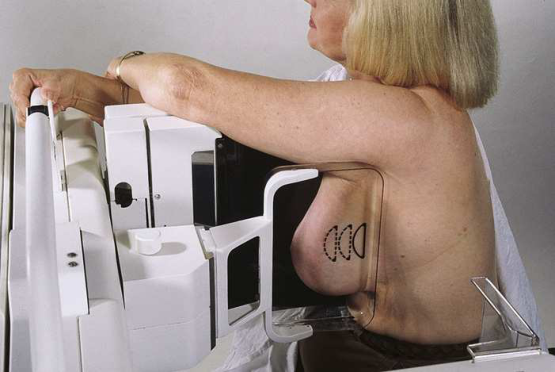
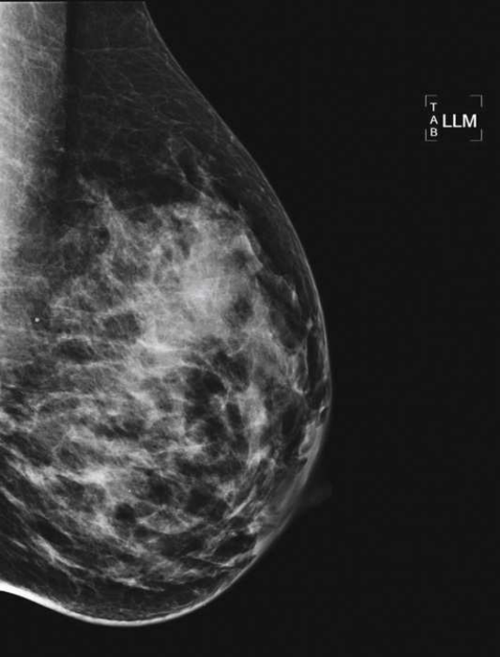

# Rx Mamografie — Profil Latero-Medial (LM 90°) sau 10 × 12 inci (24 × 30 cm). (Merrill)

  📷 Radiografie Convențională (Rx)
  <strong>Actualizat:</strong> 2026-09-16
  <strong>Autor:</strong> Referință Merrill

---

-   __1. Rezumat Clinic & Indicații__

    ---

    === "Indicații Clinice"

        - Conform reperelor anatomice standard din tratat

    === "Ghid Național IRIS"

        !!! info "Referință Primară: Ghidul Național IRIS (Ordinul MS 1342/2012)"
            - **Capitol Ghid IRIS:** *Sân*
            - **Grad de Recomandare:** **Grad A**
            - **Nivel de Iradiere Estimată:** `Clasa 1 (Minimă < 0.4 mSv)`

            [:octicons-search-16: Deschide Ghidul IRIS](../../iris.md){ .md-button .md-button--primary } [:material-open-in-new: Aplicația Oficială PWA](https://radiologie-pediatrica.ro/iris/){ .md-button target="_blank" rel="noopener" }

-   __2. Poziționare & Centrare Fascicul__

    ---

    - **Poziție Pacient:** Instruiți pacienta să stea cu fața către receptorul de imagine sau așezați pacienta pe un scaun, pe un taburet reglabil, cu fața către unitate.; rotiți ansamblul brațului C cu 90 grade, cu tubul radiogen plasat pe partea laterală a sânului pacientei. Poziționați colțul superior al receptorului de imagine la nivelul incizurii jugulare (furculița sternală). Instruiți pacienta să-și flecteze ușor gâtul înainte. Instruiți pacienta să-și relaxeze umărul de pe partea afectată, să ridice brațul de pe partea afectată și să flecteze cotul, apoi să-și sprijine brațul afectat peste partea superioară a receptorului de imagine. Trageți țesutul mamar și mușchiul pectoral superior și anterior, asigurându-vă că sternul pacientei este apăsat ferm pe/sprijinit de marginea receptorului de imagine. Rotiți pacienta ușor medial pentru a ajuta la aducerea țesutului lateral înainte. Instruiți pacienta să-și sprijine bărbia pe marginea superioară a receptorului de imagine pentru a ajuta la relaxarea pielii din aspectul medial al sânului. Poziționați mamelonul în profil. Țineți sânul pacientei ridicat și în afară. Nu-l lăsați să atârne. Informați pacienta cu privire la aplicarea compresiei asupra glandei mamare. Aduceți platoul de compresie dincolo de mușchiul latissimus dorsi și în contact cu sânul. Aplicați lent compresia în timp ce deplasați mâna în afară, spre mamelon, până când sânul pacientei devine întins. Instruiți pacienta să indice dacă această compresie devine inconfortabilă. Când se obține compresia completă, deplasați detectorul AEC în poziția corespunzătoare, dacă este necesar, și instruiți pacienta să-și oprească respirația (Fig. 18.48). Declanșați expunerea. Decomprimați sânul imediat după efectuarea expunerii.
    - **Punct de Centrare Fascicul:** perpendicular pe baza sânului
    - **Distanță Focar-Film (DFF / SID):** Nespecificat în fragmentul extras; de verificat în sursă
    - **Comandă Respiratorie:** Conform reperelor anatomice standard din tratat

-   __3. Parametri Tehnici Expunere__

    ---

    | Parametru Tehnic | Valoare Configurare Generator / Tub |
    |:-----------------|:-------------------------------------|
    | **Tensiune Tub (kV)** | DE CONFIGURAT PE APARAT |
    | **Sarcină / Produs Curent-Timp (mAs)** | DE CONFIGURAT PE APARAT |
    | **Distanță Focar-Film (DFF / SID)** | Nespecificat în fragmentul extras; de verificat în sursă |
    | **Grilă Antidifuzoare (Bucky)** | DE CONFIGURAT PE APARAT |
    | **Dimensiune Focar** | DE CONFIGURAT PE APARAT |
    | **Camere de Ionizare AEC** | DE CONFIGURAT PE APARAT |
    | **Colimare Fascicul** | Conform reperelor anatomice standard din tratat |
    | **Filtrare Tub** | DE CONFIGURAT PE APARAT |

-   __4. Criterii de Calitate & Reușită Imagine__

    ---

    - Următoarele trebuie să fie clar vizualizate:
    - Mamelon în profil
    - Pliul inframamar deschis
    - Țesuturile mamare profund și superficial sunt bine separate atunci când sânul este mobilizat adecvat în sus și în afara peretelui toracic
    - Grăsimea retroglandulară este bine vizualizată pentru a asigura includerea țesutului fibroglandular profund al sânului
    - Expunere tisulară uniformă dacă compresia este adecvată

-   __5. Protecție Radiologică (ALARA)__

    ---

    - Nespecificat în fragmentul extras; de verificat în sursă

!!! note "Observații Clinice & Tehnice"
    Conform reperelor anatomice standard din tratat

### 🖼️ Imagini

<figure class="protocol-image-card" markdown>

<figcaption><strong>Merrill — pagina 1379, imaginea 1</strong> — Imagine din fragmentul sursă; asocierea necesită revizie.</figcaption>

</figure>

<figure class="protocol-image-card" markdown>

<figcaption><strong>Merrill — pagina 1380, imaginea 2</strong> — Imagine din fragmentul sursă; asocierea necesită revizie.</figcaption>

</figure>

=== "Ghid Rapid de Execuție"

    1. **Identificarea și verificarea pacientului:** verificare identitate, zonă de examinat, consimțământ conform procedurii și evaluarea posibilității unei sarcini, când este relevantă.
    2. **Pregătire:** îndepărtarea oricăror obiecte radiopace (bijuterii, agrafe, fermoare, proteze, pansamente dense).
    3. **Poziționare precisă:** alinierea receptorului de imagine și a tubului la distanța prescrisă (Nespecificat în fragmentul extras; de verificat în sursă).
    4. **Colimare strictă:** adaptarea fasciculului strict la regiunea de diagnostic pentru scăderea iradierii și reducerea radiației difuze.
    5. **Radioprotecție:** verificarea [politicii RX](../radioprotectie.md), cu măsuri distincte pentru pacient, personal și însoțitor.

## Surse de documentare

- [Merrill’s Atlas, 18. Mammography, pagini 1379–1380](https://books.google.com/books/about/Merrill_s_Atlas_of_Radiographic_Position.html?id=BM0lEQAAQBAJ)
