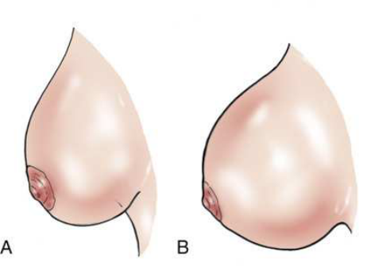
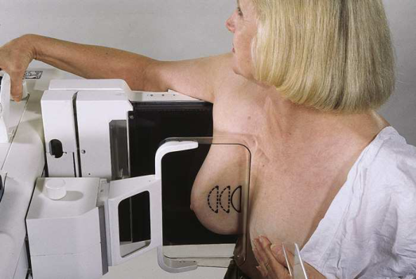
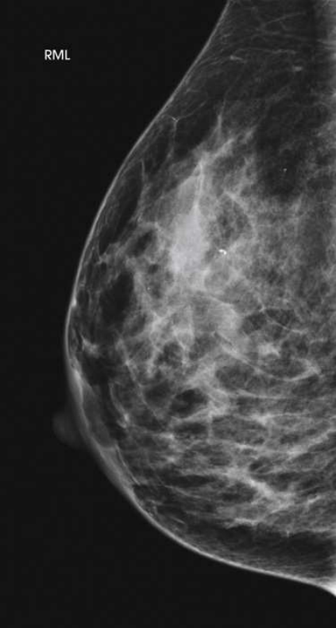

# Rx Mamografie — Profil Medio-Lateral (ML 90°) sau 10 × 12 țoli (24 × 30 cm). (Merrill)

  📷 Radiografie Convențională (Rx)
  <strong>Actualizat:</strong> 2026-09-16
  <strong>Autor:</strong> Referință Merrill

---

-   __1. Rezumat Clinic & Indicații__

    ---

    === "Indicații Clinice"

        - Conform reperelor anatomice standard din tratat

    === "Ghid Național IRIS"

        !!! info "Referință Primară: Ghidul Național IRIS (Ordinul MS 1342/2012)"
            - **Capitol Ghid IRIS:** *Sân*
            - **Grad de Recomandare:** **Grad A**
            - **Nivel de Iradiere Estimată:** `Clasa 1 (Minimă < 0.4 mSv)`

            [:octicons-search-16: Deschide Ghidul IRIS](../../iris.md){ .md-button .md-button--primary } [:material-open-in-new: Aplicația Oficială PWA](https://radiologie-pediatrica.ro/iris/){ .md-button target="_blank" rel="noopener" }

-   __2. Poziționare & Centrare Fascicul__

    ---

    - **Poziție Pacient:** Se instruiește pacientul să stea cu fața către receptorul de imagine sau se așază pacientul pe un scaun, pe un taburet reglabil, cu fața către aparat.; se rotește ansamblul brațului C cu 90 grade, cu tubul de raze X plasat pe partea medială a pacientei. Se instruiește pacientul să se aplece ușor înainte din talie. Se poziționează colțul superior al receptorului de imagine cât mai sus în axilă, cu cotul pacientului flectat și brațul afectat sprijinit în spatele receptorului de imagine. Se instruiește pacientul să relaxeze umărul afectat. Se trage țesutul mamar și mușchiul pectoral superior și anterior, asigurându-se că marginea laterală a coastelor este apăsată ferm pe / sprijinită de marginea receptorului de imagine. se rotește pacientul ușor lateral pentru a aduce țesutul medial înainte. Se trage ușor țesutul mamar medial înainte de la stern și se poziționează mamelonul de profil. Se susține sânul pacientului în sus și în afară prin rotirea mâinii, astfel încât baza policelui și călcâiul mâinii să susțină sânul. Se informează pacienta cu privire la aplicarea compresiei pe glanda mamară. Se continuă susținerea sânului pacientului în sus și în afară în timp ce se deplasează mâna spre mamelon, pe măsură ce paleta de compresie este adusă în contact cu sânul. Nu se permite lăsarea sânului să atârne (Fig. 18.45). Se aplică progresiv compresia până când glanda mamară este ferm fixată. Se instruiește pacientul să indice dacă compresia devine prea inconfortabilă. Se instruiește pacientul să țină sânul opus în afara traiectului fasciculului. Se instruiește pacientul să ridice bărbia pentru a elibera câmpul de posibile artefacte. Când se obține compresia completă, se deplasează detectorul AEC în poziția corespunzătoare, dacă este necesar, și se instruiește pacientul să-și oprească respirația (Fig. 18.46). Se declanșează expunerea. Se decomprimă sânul imediat după efectuarea expunerii.
    - **Punct de Centrare Fascicul:** perpendicular pe baza sânului
    - **Distanță Focar-Film (DFF / SID):** Nespecificat în fragmentul extras; de verificat în sursă
    - **Comandă Respiratorie:** Conform reperelor anatomice standard din tratat

-   __3. Parametri Tehnici Expunere__

    ---

    | Parametru Tehnic | Valoare Configurare Generator / Tub |
    |:-----------------|:-------------------------------------|
    | **Tensiune Tub (kV)** | DE CONFIGURAT PE APARAT |
    | **Sarcină / Produs Curent-Timp (mAs)** | DE CONFIGURAT PE APARAT |
    | **Distanță Focar-Film (DFF / SID)** | Nespecificat în fragmentul extras; de verificat în sursă |
    | **Grilă Antidifuzoare (Bucky)** | DE CONFIGURAT PE APARAT |
    | **Dimensiune Focar** | DE CONFIGURAT PE APARAT |
    | **Camere de Ionizare AEC** | DE CONFIGURAT PE APARAT |
    | **Colimare Fascicul** | Conform reperelor anatomice standard din tratat |
    | **Filtrare Tub** | DE CONFIGURAT PE APARAT |

-   __4. Criterii de Calitate & Reușită Imagine__

    ---

    - Următoarele trebuie să fie clar vizualizate:
    - Mamelon în profil
    - Pliul inframamar deschis
    - Țesuturile mamare profunde și superficiale sunt bine separate atunci când sânul este manevrat corespunzător în sus și în afară de peretele toracic (Fig. 18.47)
    - Grăsimea retroglandulară este bine vizualizată pentru a asigura includerea țesutului fibroglandular profund al sânului
    - Expunere tisulară uniformă dacă compresia este adecvată

-   __5. Protecție Radiologică (ALARA)__

    ---

    - Nespecificat în fragmentul extras; de verificat în sursă

!!! note "Observații Clinice & Tehnice"
    Conform reperelor anatomice standard din tratat

### 🖼️ Imagini

<figure class="protocol-image-card" markdown>

<figcaption><strong>Merrill — pagina 1377, imaginea 1</strong> — Imagine din fragmentul sursă; asocierea necesită revizie.</figcaption>

</figure>

<figure class="protocol-image-card" markdown>

<figcaption><strong>Merrill — pagina 1377, imaginea 2</strong> — Imagine din fragmentul sursă; asocierea necesită revizie.</figcaption>

</figure>

<figure class="protocol-image-card" markdown>

<figcaption><strong>Merrill — pagina 1378, imaginea 3</strong> — Imagine din fragmentul sursă; asocierea necesită revizie.</figcaption>

</figure>

=== "Ghid Rapid de Execuție"

    1. **Identificarea și verificarea pacientului:** verificare identitate, zonă de examinat, consimțământ conform procedurii și evaluarea posibilității unei sarcini, când este relevantă.
    2. **Pregătire:** îndepărtarea oricăror obiecte radiopace (bijuterii, agrafe, fermoare, proteze, pansamente dense).
    3. **Poziționare precisă:** alinierea receptorului de imagine și a tubului la distanța prescrisă (Nespecificat în fragmentul extras; de verificat în sursă).
    4. **Colimare strictă:** adaptarea fasciculului strict la regiunea de diagnostic pentru scăderea iradierii și reducerea radiației difuze.
    5. **Radioprotecție:** verificarea [politicii RX](../radioprotectie.md), cu măsuri distincte pentru pacient, personal și însoțitor.

## Surse de documentare

- [Merrill’s Atlas, 18. Mammography, pagini 1376–1378](https://books.google.com/books/about/Merrill_s_Atlas_of_Radiographic_Position.html?id=BM0lEQAAQBAJ)
