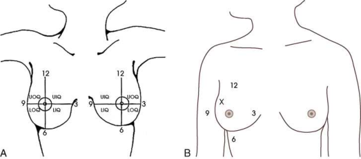
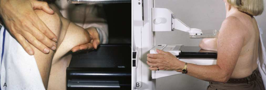
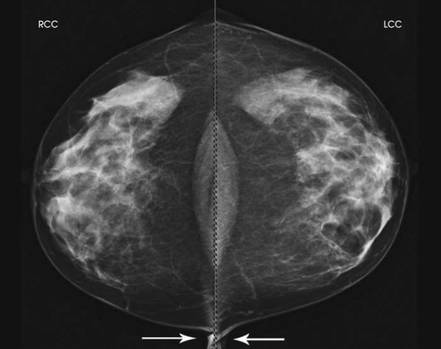

# Rx Mamografie — Cranio-Caudală (CC) sau 10 × 12 țoli (24 × 30 cm). (Merrill)

  📷 Radiografie Convențională (Rx)
  <strong>Actualizat:</strong> 2026-09-16
  <strong>Autor:</strong> Referință Merrill

---

-   __1. Rezumat Clinic & Indicații__

    ---

    === "Indicații Clinice"

        - Conform reperelor anatomice standard din tratat

    === "Ghid Național IRIS"

        !!! info "Referință Primară: Ghidul Național IRIS (Ordinul MS 1342/2012)"
            - **Capitol Ghid IRIS:** *Sân*
            - **Grad de Recomandare:** **Grad A**
            - **Nivel de Iradiere Estimată:** `Clasa 1 (Minimă < 0.4 mSv)`

            [:octicons-search-16: Deschide Ghidul IRIS](../../iris.md){ .md-button .md-button--primary } [:material-open-in-new: Aplicația Oficială PWA](https://radiologie-pediatrica.ro/iris/){ .md-button target="_blank" rel="noopener" }

-   __2. Poziționare & Centrare Fascicul__

    ---

    - **Poziție Pacient:** Se instruiește pacientul să stea cu fața către receptorul de imagine, cu picioarele orientate perpendicular pe aparatul de mamografie. Dacă pacientul nu poate sta în picioare pe durata examinării, se instruiește pacientul să stea pe un taburet reglabil, cu fața către aparat. În ortostatism, pe partea medială a sânului care urmează să fie examinat, se ridică pliul inframamar la înălțimea sa maximă. se ajustează înălțimea brațului C la nivelul suprafeței inferioare a sânului pacientului. Se instruiește pacientul să se aplece ușor înainte din talie. Se folosesc ambele mâini pentru a trage ușor sânul pe suprafața receptorului de imagine, instruind pacientul să apese toracele pe / să-l sprijine de receptorul de imagine. Se așază sânul opus peste colțul receptorului de imagine. Această manevră îmbunătățește evidențierea țesutului medial. Se instruiește pacientul să se țină de bara de sprijin cu mâna contralaterală; acest lucru ajută la menținerea stabilității pacientului în timp ce se continuă poziționarea. Se menține sânul perpendicular pe peretele toracic. Tehnologul trebuie să folosească vârfurile degetelor pentru a trage ușor țesutul inferior posterior înainte, pe receptorul de imagine. se centrează sânul deasupra detectorului AEC, cu mamelonul de profil, dacă este posibil. se imobilizează sânul cu o mână, având grijă să nu se îndepărteze această mână până la începerea compresiei. În timp ce se așază brațul pe / se sprijină de spatele pacientului, cu mâna pe umărul părții afectate, se verifică dacă umărul pacientului este relaxat și în rotație externă. se rotește capul pacientului în partea opusă părții afectate și se sprijină capul pacientului pe apărătoarea facială. Se verifică să nu existe alte obiecte, precum bijuterii sau păr, care să obstrucționeze traiectul fasciculului. Cu mâna pe umărul pacientului, se deplasează ușor pielea în sus, peste claviculă. Folosind mâna care ancorează sânul pacientului, se trage țesutul lateral pe receptorul de imagine fără a sacrifica țesutul medial. Menținând sânul în poziție, se folosește aceeași mână pentru a netezi anterior pliurile cutanate, spre mamelon. Se informează pacientul că va începe compresia sânului. Folosind comenzile de compresie acționate cu pedala, se aduce paleta de compresie în contact cu sânul în timp ce se deplasează mâna spre mamelon. Se aplică lent compresia manual până când sânul devine tensionat. Se verifică aspectele medial și lateral ale sânului pentru o compresie adecvată. Se instruiește pacientul să indice dacă compresia devine inconfortabilă. După obținerea și verificarea compresiei complete, se instruiește pacientul să-și oprească respirația (Fig. 18.28). Se declanșează expunerea. Se decomprimă sânul imediat după efectuarea expunerii.
    - **Punct de Centrare Fascicul:** perpendicular pe baza sânului
    - **Distanță Focar-Film (DFF / SID):** Nespecificat în fragmentul extras; de verificat în sursă
    - **Comandă Respiratorie:** Conform reperelor anatomice standard din tratat

-   __3. Parametri Tehnici Expunere__

    ---

    | Parametru Tehnic | Valoare Configurare Generator / Tub |
    |:-----------------|:-------------------------------------|
    | **Tensiune Tub (kV)** | DE CONFIGURAT PE APARAT |
    | **Sarcină / Produs Curent-Timp (mAs)** | DE CONFIGURAT PE APARAT |
    | **Distanță Focar-Film (DFF / SID)** | Nespecificat în fragmentul extras; de verificat în sursă |
    | **Grilă Antidifuzoare (Bucky)** | DE CONFIGURAT PE APARAT |
    | **Dimensiune Focar** | DE CONFIGURAT PE APARAT |
    | **Camere de Ionizare AEC** | DE CONFIGURAT PE APARAT |
    | **Colimare Fascicul** | Conform reperelor anatomice standard din tratat |
    | **Filtrare Tub** | DE CONFIGURAT PE APARAT |

-   __4. Criterii de Calitate & Reușită Imagine__

    ---

    - Următoarele trebuie să fie clar vizualizate:
    - PNL extins posterior până la marginea imaginii și măsurând în limita a ⅓ țol (1 cm) din profunzimea PNL pe incidența MLO (vezi Fig. 18.29)
    - întregul țesut medial, evidențiat prin vizualizarea grăsimii retroglandulare mediale și absența țesutului fibroglandular care se extinde până la marginea posteromedială a imaginii
    - Mamelonul de profil (dacă este posibil) și pe linia mediană, indicând absența exagerării poziționării
    - pentru evidențierea țesutului medial, o parte din țesutul lateral poate fi exclusă.
    - Mușchiul pectoral vizibil posterior față de grăsimea retroglandulară medială în aproximativ 30% dintre imaginile CC poziționate corespunzător
    - Ușoară reflexie cutanată medială la nivelul decolteului, asigurând includerea adecvată a țesutului posteromedial
    - Expunere tisulară uniformă dacă compresia este adecvată

-   __5. Protecție Radiologică (ALARA)__

    ---

    - Nespecificat în fragmentul extras; de verificat în sursă

!!! note "Observații Clinice & Tehnice"
    Conform reperelor anatomice standard din tratat

### 🖼️ Imagini

<figure class="protocol-image-card" markdown>

<figcaption><strong>Merrill — pagina 1353, imaginea 1</strong> — Imagine din fragmentul sursă; asocierea necesită revizie.</figcaption>

</figure>

<figure class="protocol-image-card" markdown>

<figcaption><strong>Merrill — pagina 1354, imaginea 2</strong> — Imagine din fragmentul sursă; asocierea necesită revizie.</figcaption>

</figure>

<figure class="protocol-image-card" markdown>

<figcaption><strong>Merrill — pagina 1355, imaginea 3</strong> — Imagine din fragmentul sursă; asocierea necesită revizie.</figcaption>

</figure>

=== "Ghid Rapid de Execuție"

    1. **Identificarea și verificarea pacientului:** verificare identitate, zonă de examinat, consimțământ conform procedurii și evaluarea posibilității unei sarcini, când este relevantă.
    2. **Pregătire:** îndepărtarea oricăror obiecte radiopace (bijuterii, agrafe, fermoare, proteze, pansamente dense).
    3. **Poziționare precisă:** alinierea receptorului de imagine și a tubului la distanța prescrisă (Nespecificat în fragmentul extras; de verificat în sursă).
    4. **Colimare strictă:** adaptarea fasciculului strict la regiunea de diagnostic pentru scăderea iradierii și reducerea radiației difuze.
    5. **Radioprotecție:** verificarea [politicii RX](../radioprotectie.md), cu măsuri distincte pentru pacient, personal și însoțitor.

## Surse de documentare

- [Merrill’s Atlas, 18. Mammography, pagini 1353–1355](https://books.google.com/books/about/Merrill_s_Atlas_of_Radiographic_Position.html?id=BM0lEQAAQBAJ)
