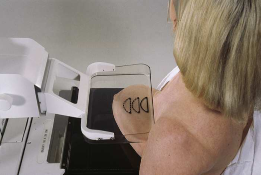
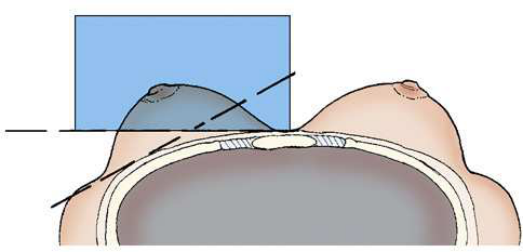
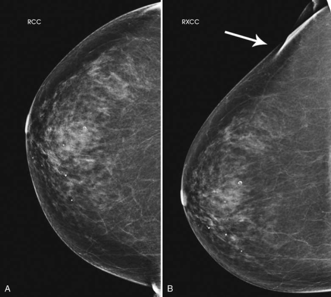
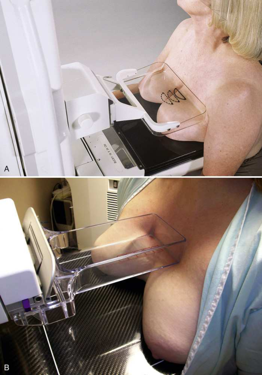
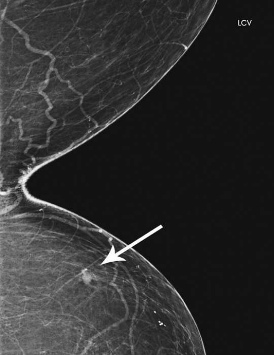
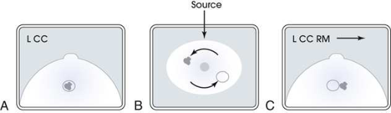
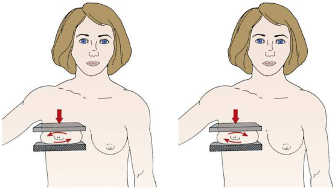
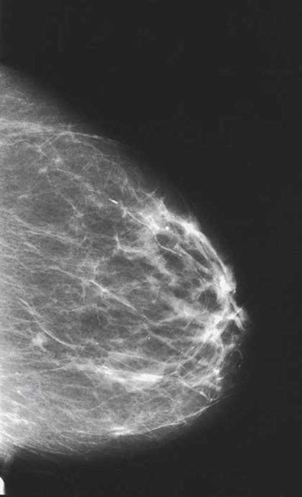

# Rx Mamografie — Cranio-Caudală Exagerată (XCCL) sau 10 × 12 țoli (24 × 30 cm). (Merrill)

  📷 Radiografie Convențională (Rx)
  <strong>Actualizat:</strong> 2026-09-16
  <strong>Autor:</strong> Referință Merrill

---

-   __1. Rezumat Clinic & Indicații__

    ---

    === "Indicații Clinice"

        - Conform reperelor anatomice standard din tratat

    === "Ghid Național IRIS"

        !!! info "Referință Primară: Ghidul Național IRIS (Ordinul MS 1342/2012)"
            - **Capitol Ghid IRIS:** *Sân*
            - **Grad de Recomandare:** **Grad A**
            - **Nivel de Iradiere Estimată:** `Clasa 1 (Minimă < 0.4 mSv)`

            [:octicons-search-16: Deschide Ghidul IRIS](../../iris.md){ .md-button .md-button--primary } [:material-open-in-new: Aplicația Oficială PWA](https://radiologie-pediatrica.ro/iris/){ .md-button target="_blank" rel="noopener" }

-   __2. Poziționare & Centrare Fascicul__

    ---

    - **Poziție Pacient:** Se instruiește pacientul să stea cu fața spre receptorul de imagine sau se așază pacientul pe un scaun, pe un taburet reglabil, cu fața spre aparat. Partea contralaterală trebuie să fie îndepărtată de receptorul de imagine. Aspectul lateral al sânului ipsilateral trebuie să fie cel mai apropiat de receptorul de imagine. Se ridică pliul inframamar la înălțimea maximă. Se ajustează corespunzător înălțimea C-brațului. Cu o mână, se ridică țesutul mamar inferior și posterior de la pliul inframamar și se așază sânul pe receptorul de imagine. Aceasta trebuie efectuată cu mâna dreaptă a tehnicianului când este poziționat sânul stâng și cu mâna stângă când este poziționat sânul drept. Se folosesc ambele mâini pentru a trage ușor sânul pe receptorul de imagine, instruind pacienta să apese toracele pe / să se sprijine de suportul pentru sân. Se rotește ușor pacientul medial pentru a așeza aspectul lateral al sânului pe receptorul de imagine. Se așază brațul pe / sprijinit de spatele pacientului, cu mâna pe umărul părții afectate, asigurându-se că umărul este relaxat și în rotație externă. Se rotește ușor capul pacientului în direcția opusă părții afectate. Se instruiește pacientul să se aplece spre aparat și să-și sprijine capul pe / de protecția facială. Se rotește ansamblul C-brațului mediolateral cu aproximativ 5 grade, dacă este necesar, pentru a elimina suprapunerea capului humeral. Se informează pacienta cu privire la aplicarea compresiei pe glanda mamară. Se netezește și se aplatizează țesutul mamar spre mamelon, aducând în același timp paleta de compresie în contact cu sânul. Se aplică progresiv compresia până când glanda mamară este fixată ferm. Se instruiește pacientul să indice dacă compresia devine inconfortabilă. Când se obține compresia completă, se deplasează detectorul AEC în poziția corespunzătoare, dacă este necesar, și se instruiește pacientul să oprească respirația (Fig. 18.50 și 18.51). Se declanșează expunerea. Se decomprimă sânul imediat după efectuarea expunerii. Se oprește AEC și se preselectează tehnica manuală. Radiograful poate utiliza AEC numai dacă este poziționată o cantitate suficientă de țesut mamar deasupra detectorului AEC. Clivajul poate fi decalat intenționat în acest scop. Se determină corect înălțimea suportului pentru sân prin ridicarea pliului inframamar la înălțimea maximă. Se ajustează corespunzător înălțimea C-brațului. Se ridică și se trag ușor ambii sâni înainte, pe receptorul de imagine, instruind pacientul să apese toracele pe / să se sprijine de receptorul de imagine. Se trage cât mai mult țesut mamar medial posibil pe receptorul de imagine. Se rotește ușor capul pacientului în direcția opusă părții afectate. Se instruiește pacientul să se aplece spre aparat și să-și sprijine capul pe / de protecția facială. Se instruiește pacientul să țină barele de sprijin cu ambele mâini pentru a se menține în poziție pe receptorul de imagine. Se ridică ușor înălțimea receptorului de imagine pentru a elibera țesutul superior. Se așază o mână la nivelul incizurii jugulare a pacientului (furculița sternală), apoi se glisează mâna în jos pe toracele pacientului, trăgând înainte cât mai mult țesut medial profund posibil. Se informează pacienta cu privire la aplicarea compresiei pe glanda mamară. Se aduce paleta de compresie în contact cu sânii și se aplică lent compresia până când țesutul medial devine întins. Utilizarea unei palete de compresie pentru cadran permite o compresie mai bună a zonei clivajului și permite tragerea unei suprafețe mai mari de interes diagnostic în aria de examinare. Dacă se utilizează paleta pentru cadran, se colimează aria de compresie pentru a vizualiza mai bine detaliile țesutului. Se instruiește pacientul să indice dacă compresia devine inconfortabilă. Când se obține compresia completă, se deplasează detectorul AEC în poziția corespunzătoare dacă se utilizează AEC și se instruiește pacientul să oprească respirația (Fig. 18.53). Se declanșează expunerea. Se decomprimă sânul imediat după efectuarea expunerii. Se repoziționează sânul pacientului în incidență CC. Se așază mâinile pe suprafețele opuse ale sânului pacientului (superior/inferior) și se rulează suprafețele în direcții opuse. Direcția rulării nu este importantă, atât timp cât mamograful rulează suprafața superioară într-o direcție și suprafața inferioară în cealaltă direcție. În esență, mamograful rotește foarte ușor sânul cu aproximativ 10 până la 15 grade (Fig. 18.55). Se poziționează sânul pacientului pe suprafața receptorului de imagine cu mâna inferioară, menținând poziția rulată cu mâna superioară. Se notează direcția rulării suprafeței superioare (laterală [RL] sau medială [RM]) și se marchează imaginea corespunzător. Dacă aspectul superior al sânului este rulat medial, imaginea trebuie marcată RM. Se informează pacienta cu privire la aplicarea compresiei pe glanda mamară. Se aduce paleta de compresie în contact cu sânul și se retrage mâna în timp ce se rulează țesutul mamar. Se aplică progresiv compresia până când glanda mamară este fixată ferm. Se instruiește pacientul să indice dacă compresia devine inconfortabilă. Când se obține compresia completă, se deplasează detectorul AEC în poziția corespunzătoare, dacă este necesar, și se instruiește pacientul să oprească respirația (Fig. 18.56). Se declanșează expunerea. Se decomprimă sânul imediat după efectuarea expunerii.
    - **Punct de Centrare Fascicul:** înclinat cu 5 grade mediolateral față de baza sânului, dacă este necesar, perpendicular pe aria de interes diagnostic sau centrat pe decolteu, perpendicular pe baza sânului
    - **Distanță Focar-Film (DFF / SID):** Nespecificat în fragmentul extras; de verificat în sursă
    - **Comandă Respiratorie:** Conform reperelor anatomice standard din tratat

-   __3. Parametri Tehnici Expunere__

    ---

    | Parametru Tehnic | Valoare Configurare Generator / Tub |
    |:-----------------|:-------------------------------------|
    | **Tensiune Tub (kV)** | DE CONFIGURAT PE APARAT |
    | **Sarcină / Produs Curent-Timp (mAs)** | DE CONFIGURAT PE APARAT |
    | **Distanță Focar-Film (DFF / SID)** | Nespecificat în fragmentul extras; de verificat în sursă |
    | **Grilă Antidifuzoare (Bucky)** | DE CONFIGURAT PE APARAT |
    | **Dimensiune Focar** | DE CONFIGURAT PE APARAT |
    | **Camere de Ionizare AEC** | DE CONFIGURAT PE APARAT |
    | **Colimare Fascicul** | Conform reperelor anatomice standard din tratat |
    | **Filtrare Tub** | DE CONFIGURAT PE APARAT |

-   __4. Criterii de Calitate & Reușită Imagine__

    ---

    - Următoarele trebuie să fie clar vizualizate:
    - Țesutul adipos retroglandular este bine vizualizat pentru a asigura includerea țesutului fibroglandular mamar profund pe aspectul lateral al sânului și în regiunea axilară inferioară
    - Mușchiul pectoral este vizualizat deasupra peretelui toracic lateral (Fig. 18.52)
    - Capul humeral este proiectat liber de imagine utilizând un unghi ML de 5 grade
    - Expunere uniformă a țesutului dacă este aplicată o compresie adecvată; următoarele trebuie să fie clar vizualizate:
    - Aria de interes diagnostic deasupra porțiunii centrale a receptorului de imagine (deasupra detectorului AEC, dacă este posibil), cu clivajul ușor descentrat sau cu clivajul centrat pe receptorul de imagine și tehnica manuală selectată (Fig. 18.54)
    - Țesutul medial profund al sânului afectat
    - Este inclus tot țesutul medial, după cum se observă prin vizualizarea grăsimii retroglandulare mediale și absența oricărui țesut fibroglandular care se extinde până la marginea posteromedială a sânilor examinați
    - Expunere uniformă a țesutului. Nu este necesară imagistica întregului țesut mamar în această incidență. Următoarele trebuie să fie clar vizualizate:
    - Suprapunerea suspectată este rezolvată adecvat
    - Leziune suspectată în aspectul superior sau inferior al sânului
    - Este inclus tot țesutul medial, după cum se observă prin vizualizarea grăsimii retroglandulare mediale și absența țesutului fibroglandular care se extinde până la marginea posteromedială a imaginii
    - Mamelonul este de profil și pe linia mediană, indicând absența exagerării poziționării. Mamelonul este utilizat ca reper pentru a diferenția localizarea leziunii suspectate, dacă aceasta există.
    - Este posibil ca o parte din țesutul lateral să fie exclusă pentru a accentua țesutul medial vizualizat
    - Ușoară reflexie cutanată medială la nivelul clivajului, asigurând includerea adecvată a țesutului posteromedial
    - Expunere tisulară uniformă dacă compresia este adecvată

-   __5. Protecție Radiologică (ALARA)__

    ---

    - Nespecificat în fragmentul extras; de verificat în sursă

!!! note "Observații Clinice & Tehnice"
    Conform reperelor anatomice standard din tratat

### 🖼️ Imagini

<figure class="protocol-image-card" markdown>

<figcaption><strong>Merrill — pagina 1381, imaginea 1</strong> — Imagine din fragmentul sursă; asocierea necesită revizie.</figcaption>

</figure>

<figure class="protocol-image-card" markdown>

<figcaption><strong>Merrill — pagina 1381, imaginea 2</strong> — Imagine din fragmentul sursă; asocierea necesită revizie.</figcaption>

</figure>

<figure class="protocol-image-card" markdown>

<figcaption><strong>Merrill — pagina 1382, imaginea 3</strong> — Imagine din fragmentul sursă; asocierea necesită revizie.</figcaption>

</figure>

<figure class="protocol-image-card" markdown>

<figcaption><strong>Merrill — pagina 1383, imaginea 4</strong> — Imagine din fragmentul sursă; asocierea necesită revizie.</figcaption>

</figure>

<figure class="protocol-image-card" markdown>

<figcaption><strong>Merrill — pagina 1385, imaginea 5</strong> — Imagine din fragmentul sursă; asocierea necesită revizie.</figcaption>

</figure>

<figure class="protocol-image-card" markdown>

<figcaption><strong>Merrill — pagina 1386, imaginea 6</strong> — Imagine din fragmentul sursă; asocierea necesită revizie.</figcaption>

</figure>

<figure class="protocol-image-card" markdown>

<figcaption><strong>Merrill — pagina 1386, imaginea 7</strong> — Imagine din fragmentul sursă; asocierea necesită revizie.</figcaption>

</figure>

<figure class="protocol-image-card" markdown>

<figcaption><strong>Merrill — pagina 1388, imaginea 8</strong> — Imagine din fragmentul sursă; asocierea necesită revizie.</figcaption>

</figure>

=== "Ghid Rapid de Execuție"

    1. **Identificarea și verificarea pacientului:** verificare identitate, zonă de examinat, consimțământ conform procedurii și evaluarea posibilității unei sarcini, când este relevantă.
    2. **Pregătire:** îndepărtarea oricăror obiecte radiopace (bijuterii, agrafe, fermoare, proteze, pansamente dense).
    3. **Poziționare precisă:** alinierea receptorului de imagine și a tubului la distanța prescrisă (Nespecificat în fragmentul extras; de verificat în sursă).
    4. **Colimare strictă:** adaptarea fasciculului strict la regiunea de diagnostic pentru scăderea iradierii și reducerea radiației difuze.
    5. **Radioprotecție:** verificarea [politicii RX](../radioprotectie.md), cu măsuri distincte pentru pacient, personal și însoțitor.

## Surse de documentare

- [Merrill’s Atlas, 18. Mammography, pagini 1380–1388](https://books.google.com/books/about/Merrill_s_Atlas_of_Radiographic_Position.html?id=BM0lEQAAQBAJ)
