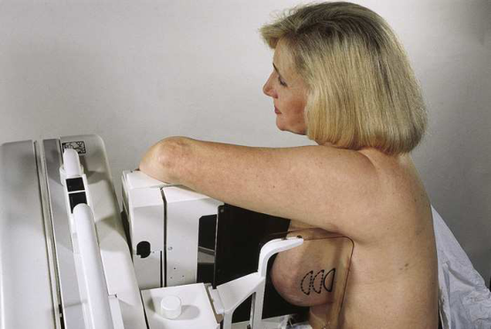
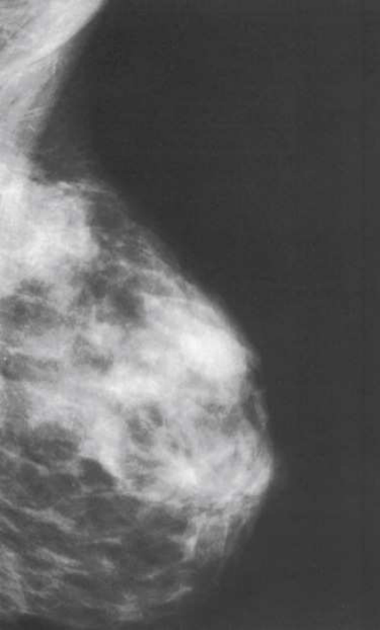

# Rx Mamografie — Oblică Latero-Medială (LMO) sau 10 × 12 țoli (24 × 30 cm). (Merrill)

  📷 Radiografie Convențională (Rx)
  <strong>Actualizat:</strong> 2026-09-16
  <strong>Autor:</strong> Referință Merrill

---

-   __1. Rezumat Clinic & Indicații__

    ---

    === "Indicații Clinice"

        - Conform reperelor anatomice standard din tratat

    === "Ghid Național IRIS"

        !!! info "Referință Primară: Ghidul Național IRIS (Ordinul MS 1342/2012)"
            - **Capitol Ghid IRIS:** *Sân*
            - **Grad de Recomandare:** **Grad A**
            - **Nivel de Iradiere Estimată:** `Clasa 1 (Minimă < 0.4 mSv)`

            [:octicons-search-16: Deschide Ghidul IRIS](../../iris.md){ .md-button .md-button--primary } [:material-open-in-new: Aplicația Oficială PWA](https://radiologie-pediatrica.ro/iris/){ .md-button target="_blank" rel="noopener" }

-   __2. Poziționare & Centrare Fascicul__

    ---

    - **Poziție Pacient:** Instruiți pacientul să stea cu fața spre receptorul de imagine sau așezați pacientul pe un scaun, pe un taburet reglabil, cu fața spre aparat.; Determinați gradul de oblicitate al aparatului cu C-braț prin rotirea ansamblului până când marginea lungă a receptorului de imagine este paralelă cu treimea superioară a mușchiului pectoral de pe partea afectată. Raza centrală intră în aspectul inferior al sânului dinspre partea laterală. Gradul de oblicitate trebuie să fie între 30 și 60 grade, în funcție de conformația corporală a pacientului. ajustați înălțimea C-brațului astfel încât marginea superioară a receptorului de imagine să fie la nivelul incizurii jugulare (furculița sternală). Instruiți pacientul să așeze mâna opusă pe C-braț. Cotul pacientului trebuie să fie flectat. Aplecați pacientul spre aparatul cu C-braț și apăsați sternul pe / sprijiniți-l de marginea receptorului de imagine, care este ușor deplasat spre sânul opus. Instruiți pacientul să relaxeze umărul afectat și să-l aplece ușor anterior. Trageți ușor sânul și mușchiul pectoral al pacientului anterior și medial, cu suprafața palmară a mâinii poziționată de-a lungul aspectului lateral al sânului. Ridicați țesutul mamar cu mâna, prinzând ușor sânul între degete și police. Centrați sânul cu mamelonul în profil, dacă este posibil, și mențineți sânul în poziție. Informați pacienta cu privire la aplicarea compresiei asupra glandei mamare. Continuați să mențineți sânul pacientului ridicat și în afară, în timp ce glisați mâna spre mamelon, pe măsură ce paleta de compresie este adusă în contact cu cadranul inferolateral al sânului. Aplicați progresiv compresia până când glanda mamară este ferm fixată. Instruiți pacientul să indice dacă presiunea devine inconfortabilă. Trageți în jos țesutul abdominal al pacientului pentru a deschide pliul inframamar. Instruiți pacientul să-și sprijine cotul afectat pe marginea superioară a receptorului de imagine. Când este obținută compresia completă, deplasați detectorul AEC în poziția adecvată și instruiți pacientul să oprească respirația (Fig. 18.70). Declanșați expunerea. Decomprimați sânul imediat după efectuarea expunerii.
    - **Punct de Centrare Fascicul:** perpendicular pe receptorul de imagine (RI). Aparatul cu C-braț este poziționat la un unghi determinat de panta mușchiului pectoral al pacientului (30 la 60 grade). Unghiul actual este determinat de conformația corporală a pacientului: pacienții înalți și slabi necesită o angulație accentuată, în timp ce pacienții scunzi și corpolenți necesită o angulație redusă.
    - **Distanță Focar-Film (DFF / SID):** Nespecificat în fragmentul extras; de verificat în sursă
    - **Comandă Respiratorie:** Conform reperelor anatomice standard din tratat

-   __3. Parametri Tehnici Expunere__

    ---

    | Parametru Tehnic | Valoare Configurare Generator / Tub |
    |:-----------------|:-------------------------------------|
    | **Tensiune Tub (kV)** | DE CONFIGURAT PE APARAT |
    | **Sarcină / Produs Curent-Timp (mAs)** | DE CONFIGURAT PE APARAT |
    | **Distanță Focar-Film (DFF / SID)** | Nespecificat în fragmentul extras; de verificat în sursă |
    | **Grilă Antidifuzoare (Bucky)** | DE CONFIGURAT PE APARAT |
    | **Dimensiune Focar** | DE CONFIGURAT PE APARAT |
    | **Camere de Ionizare AEC** | DE CONFIGURAT PE APARAT |
    | **Colimare Fascicul** | Conform reperelor anatomice standard din tratat |
    | **Filtrare Tub** | DE CONFIGURAT PE APARAT |

-   __4. Criterii de Calitate & Reușită Imagine__

    ---

    - Următoarele trebuie să fie clar vizualizate:
    - țesutul mamar medial vizualizat clar (Fig. 18.71)
    - PNL măsurând în limita a ⅓ țol (1 cm) din profunzimea PNL pe incidența CC. (În timp ce trasați PNL oblic, urmând orientarea țesutului mamar spre mușchiul pectoral, măsurați profunzimea acestuia de la mamelon la mușchiul pectoral sau la marginea imaginii, oricare dintre acestea este întâlnită prima.)
    - aspectul inferior al mușchiului pectoral extinzându-se până la linia mamelonului sau sub aceasta, dacă este posibil
    - Mușchiul pectoral cu convexitate anterioară pentru a asigura relaxarea umărului și axilei
    - Mamelonul în profil, dacă este posibil
    - Pliul inframamar deschis
    - Țesuturile mamare profund și superficial sunt bine separate atunci când sânul este mobilizat adecvat în sus și în afara peretelui toracic
    - Grăsimea retroglandulară este bine vizualizată pentru a asigura includerea țesutului fibroglandular profund al sânului
    - Expunere tisulară uniformă dacă compresia este adecvată

-   __5. Protecție Radiologică (ALARA)__

    ---

    - Nespecificat în fragmentul extras; de verificat în sursă

!!! note "Observații Clinice & Tehnice"
    Conform reperelor anatomice standard din tratat

### 🖼️ Imagini

<figure class="protocol-image-card" markdown>

<figcaption><strong>Merrill — pagina 1400, imaginea 1</strong> — Imagine din fragmentul sursă; asocierea necesită revizie.</figcaption>

</figure>

<figure class="protocol-image-card" markdown>

<figcaption><strong>Merrill — pagina 1401, imaginea 2</strong> — Imagine din fragmentul sursă; asocierea necesită revizie.</figcaption>

</figure>

=== "Ghid Rapid de Execuție"

    1. **Identificarea și verificarea pacientului:** verificare identitate, zonă de examinat, consimțământ conform procedurii și evaluarea posibilității unei sarcini, când este relevantă.
    2. **Pregătire:** îndepărtarea oricăror obiecte radiopace (bijuterii, agrafe, fermoare, proteze, pansamente dense).
    3. **Poziționare precisă:** alinierea receptorului de imagine și a tubului la distanța prescrisă (Nespecificat în fragmentul extras; de verificat în sursă).
    4. **Colimare strictă:** adaptarea fasciculului strict la regiunea de diagnostic pentru scăderea iradierii și reducerea radiației difuze.
    5. **Radioprotecție:** verificarea [politicii RX](../radioprotectie.md), cu măsuri distincte pentru pacient, personal și însoțitor.

## Surse de documentare

- [Merrill’s Atlas, 18. Mammography, pagini 1399–1401](https://books.google.com/books/about/Merrill_s_Atlas_of_Radiographic_Position.html?id=BM0lEQAAQBAJ)
