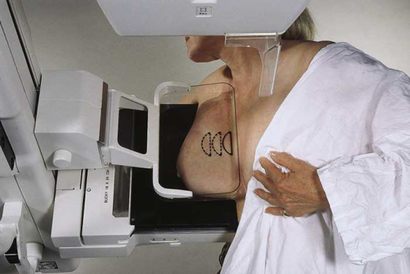
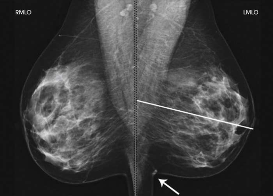

# Rx Mamografie — Oblică Medio-Laterală (MLO) sau 10 × 12 țoli (24 × 30 cm). (Merrill)

  📷 Radiografie Convențională (Rx)
  <strong>Actualizat:</strong> 2026-09-16
  <strong>Autor:</strong> Referință Merrill

---

-   __1. Rezumat Clinic & Indicații__

    ---

    === "Indicații Clinice"

        - Conform reperelor anatomice standard din tratat

    === "Ghid Național IRIS"

        !!! info "Referință Primară: Ghidul Național IRIS (Ordinul MS 1342/2012)"
            - **Capitol Ghid IRIS:** *Sân*
            - **Grad de Recomandare:** **Grad A**
            - **Nivel de Iradiere Estimată:** `Clasa 1 (Minimă < 0.4 mSv)`

            [:octicons-search-16: Deschide Ghidul IRIS](../../iris.md){ .md-button .md-button--primary } [:material-open-in-new: Aplicația Oficială PWA](https://radiologie-pediatrica.ro/iris/){ .md-button target="_blank" rel="noopener" }

-   __2. Poziționare & Centrare Fascicul__

    ---

    - **Poziție Pacient:** Pacientului i se indică să stea cu fața spre receptorul de imagine, cu picioarele orientate înainte, sau pacientul se așază pe un scaun, pe un taburet reglabil, cu fața spre aparat. Se determină gradul de oblicitate al aparatului cu braț în C. Gradul de oblicitate trebuie să fie de aproximativ 45 grade, dar va varia de la 30 la 60 grade, în funcție de conformația corporală a pacientului. Se trasează o linie imaginară de la umărul pacientului la mijlocul sternului și se angulează brațul în C paralel cu această linie. Se ajustează înălțimea aparatului cu braț în C astfel încât marginea superioară a receptorului de imagine să fie la nivelul axilei. Pacientului i se indică să se aplece ușor înainte din talie. Se ridică brațul de pe partea afectată peste colțul receptorului de imagine și se sprijină mâna pe mânerul adiacent. Cotul pacientului trebuie să fie flectat și sprijinit posterior de receptorul de imagine. Se plasează colțul superior al receptorului de imagine cât mai sus posibil în axila pacientului, între mușchii pectoral și latissimus dorsi, astfel încât receptorul de imagine să fie în spatele pliului pectoral. Se verifică dacă umărul afectat al pacientului este relaxat și ușor aplecat anterior. În timp ce suprafața palmei este așezată de-a lungul aspectului lateral al sânului, se trage ușor sânul și mușchiul pectoral al pacientului anterior și medial. Menținând sânul între police și degete, acesta este ridicat ușor în sus, în afară și îndepărtat de peretele toracic. Se centrează sânul pe receptorul de imagine, cu mamelonul în profil, dacă este posibil, și se menține sânul în poziție. Sânul este menținut ridicat și în afară față de corp prin rotirea mâinii, astfel încât baza policelui și călcâiul mâinii să susțină sânul. Pacientul este informat că va începe compresia sânului. Se continuă menținerea sânului ridicat și în afară, în timp ce mâna este glisată spre mamelon, iar paleta de compresie este adusă în contact cu sânul. Se relaxează pielea la nivelul claviculei cu mâna opusă, pentru a asigura reprezentarea țesutului posterior, prevenind lezarea umărului. Se rotește umărul contralateral spre aparat pentru a asigura vizualizarea țesutului medial. Se aplică progresiv compresia până când glanda mamară este ferm fixată. Colțul paletei de compresie trebuie să fie inferior claviculei. Se verifică aspectele superior și inferior ale sânului pentru o compresie adecvată. Pacientului i se indică să semnaleze dacă aplicarea compresiei devine inconfortabilă. Se trage ușor în jos țesutul abdominal al pacientului pentru a deschide pliul inframamar. Pacientului i se indică să țină sânul opus în afara traiectului fasciculului, dacă este necesar. Pacientului i se indică să își ridice bărbia pentru a elibera câmpul de eventualele artefacte. După obținerea compresiei complete, pacientului i se indică să oprească respirația (Fig. 18.30). Se declanșează expunerea. Sânul este decomprimat imediat după efectuarea expunerii.
    - **Punct de Centrare Fascicul:** Perpendicular pe baza sânului. Aparatul cu braț în C este poziționat la un unghi determinat de panta mușchiului pectoral al pacientului (30 la 60 grade). Unghiul actual este determinat de conformația corporală a pacientului: pacienții înalți și slabi necesită o angulație accentuată, în timp ce pacienții scunzi și corpolenți necesită o angulație redusă.
    - **Distanță Focar-Film (DFF / SID):** Nespecificat în fragmentul extras; de verificat în sursă
    - **Comandă Respiratorie:** Conform reperelor anatomice standard din tratat

-   __3. Parametri Tehnici Expunere__

    ---

    | Parametru Tehnic | Valoare Configurare Generator / Tub |
    |:-----------------|:-------------------------------------|
    | **Tensiune Tub (kV)** | DE CONFIGURAT PE APARAT |
    | **Sarcină / Produs Curent-Timp (mAs)** | DE CONFIGURAT PE APARAT |
    | **Distanță Focar-Film (DFF / SID)** | Nespecificat în fragmentul extras; de verificat în sursă |
    | **Grilă Antidifuzoare (Bucky)** | DE CONFIGURAT PE APARAT |
    | **Dimensiune Focar** | DE CONFIGURAT PE APARAT |
    | **Camere de Ionizare AEC** | DE CONFIGURAT PE APARAT |
    | **Colimare Fascicul** | Conform reperelor anatomice standard din tratat |
    | **Filtrare Tub** | DE CONFIGURAT PE APARAT |

-   __4. Criterii de Calitate & Reușită Imagine__

    ---

    - Următoarele trebuie să fie clar vizualizate:
    - PNL măsurând în limita a ⅓ țol (1 cm) din profunzimea PNL pe incidența CC 5, 19
    - În timp ce se trasează imaginar PNL oblic, urmând orientarea țesutului mamar spre mușchiul pectoral, se folosesc degetele pentru a-i măsura profunzimea de la mamelon la mușchiul pectoral sau la marginea imaginii, oricare dintre acestea este întâlnită prima (Fig. 18.31).
    - Aspectul inferior al mușchiului pectoral extinzându-se până la PNL sau sub aceasta, dacă este posibil
    - Mușchiul pectoral evidențiind convexitatea anterioară pentru a asigura relaxarea umărului și a axilei
    - Mamelonul în profil, dacă este posibil
    - Pliul inframamar deschis
    - Țesuturile mamare profund și superficial sunt bine separate atunci când sânul este mobilizat adecvat în sus și în afara peretelui toracic
    - Grăsimea retroglandulară este bine vizualizată pentru a asigura includerea țesutului fibroglandular profund al sânului
    - Expunere tisulară uniformă dacă compresia este adecvată

-   __5. Protecție Radiologică (ALARA)__

    ---

    - Nespecificat în fragmentul extras; de verificat în sursă

!!! note "Observații Clinice & Tehnice"
    Conform reperelor anatomice standard din tratat

### 🖼️ Imagini

<figure class="protocol-image-card" markdown>

<figcaption><strong>Merrill — pagina 1356, imaginea 1</strong> — Imagine din fragmentul sursă; asocierea necesită revizie.</figcaption>

</figure>

<figure class="protocol-image-card" markdown>

<figcaption><strong>Merrill — pagina 1357, imaginea 2</strong> — Imagine din fragmentul sursă; asocierea necesită revizie.</figcaption>

</figure>

=== "Ghid Rapid de Execuție"

    1. **Identificarea și verificarea pacientului:** verificare identitate, zonă de examinat, consimțământ conform procedurii și evaluarea posibilității unei sarcini, când este relevantă.
    2. **Pregătire:** îndepărtarea oricăror obiecte radiopace (bijuterii, agrafe, fermoare, proteze, pansamente dense).
    3. **Poziționare precisă:** alinierea receptorului de imagine și a tubului la distanța prescrisă (Nespecificat în fragmentul extras; de verificat în sursă).
    4. **Colimare strictă:** adaptarea fasciculului strict la regiunea de diagnostic pentru scăderea iradierii și reducerea radiației difuze.
    5. **Radioprotecție:** verificarea [politicii RX](../radioprotectie.md), cu măsuri distincte pentru pacient, personal și însoțitor.

## Surse de documentare

- [Merrill’s Atlas, 18. Mammography, pagini 1355–1357](https://books.google.com/books/about/Merrill_s_Atlas_of_Radiographic_Position.html?id=BM0lEQAAQBAJ)
