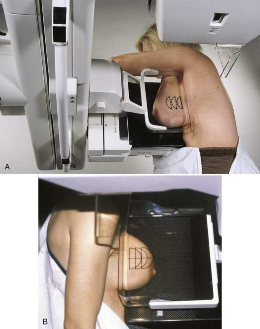
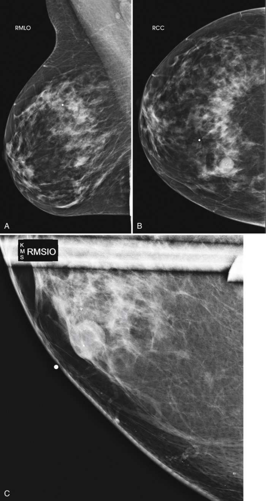
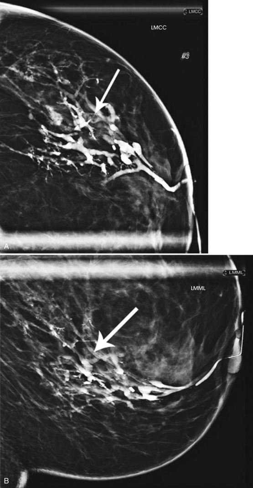
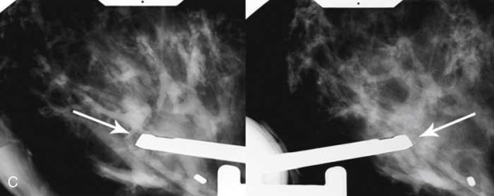
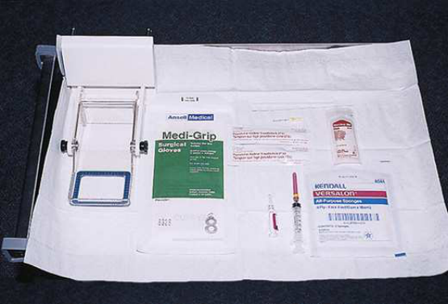
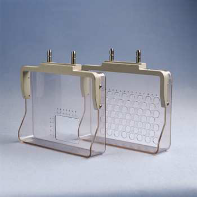
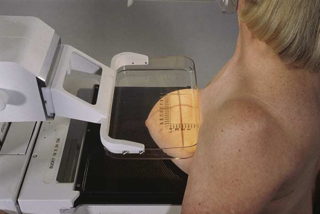
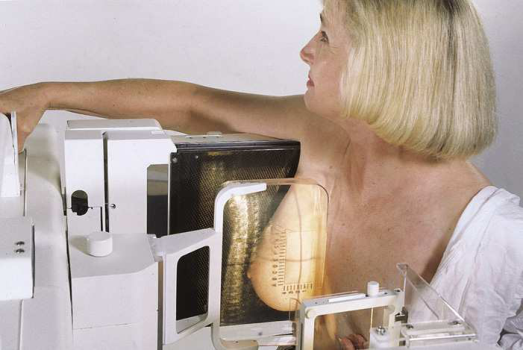
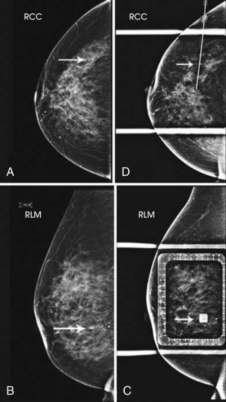

# Rx Mamografie — Incidență oblică supero-laterală spre infero-medială (SIO) sau 10 × 12 țoli (24 × 30 cm). (Merrill)

  📷 Radiografie Convențională (Rx)
  <strong>Actualizat:</strong> 2026-09-16
  <strong>Autor:</strong> Referință Merrill

---

-   __1. Rezumat Clinic & Indicații__

    ---

    === "Indicații Clinice"

        - Conform reperelor anatomice standard din tratat

    === "Ghid Național IRIS"

        !!! info "Referință Primară: Ghidul Național IRIS (Ordinul MS 1342/2012)"
            - **Capitol Ghid IRIS:** *Sân*
            - **Grad de Recomandare:** **Grad A**
            - **Nivel de Iradiere Estimată:** `Clasa 1 (Minimă < 0.4 mSv)`

            [:octicons-search-16: Deschide Ghidul IRIS](../../iris.md){ .md-button .md-button--primary } [:material-open-in-new: Aplicația Oficială PWA](https://radiologie-pediatrica.ro/iris/){ .md-button target="_blank" rel="noopener" }

-   __2. Poziționare & Centrare Fascicul__

    ---

    - **Poziție Pacient:** Se instruiește pacienta să stea cu fața spre receptorul de imagine sau se așază pacienta pe un scaun, pe un taburet reglabil, cu fața spre aparat; se rotește aparatul cu braț C astfel încât raza centrală să fie orientată la un unghi spre aspectul superior și lateral al sânului afectat. LIQ este adiacent receptorului de imagine. Se ajustează gradul de oblicitate al brațului C în funcție de conformația pacientei sau, atunci când se utilizează incidența oblică supero-laterală spre infero-medială (SIO) ca incidență suplimentară pentru a vizualiza mai clar aria de țesut fără suprapunerea țesuturilor înconjurătoare, se ajustează brațul C la unghiul de angulație necesar de către radiolog, în general un unghi de 20–30 de grade. Se ajustează înălțimea brațului C pentru a poziționa sânul pacientei deasupra centrului receptorului de imagine. Se instruiește pacienta să-și sprijine mâna de partea afectată pe mânerul adiacent suportului receptorului de imagine. Cotul pacientei trebuie să fie flectat. Pentru incidențele SIO cu înclinare redusă, brațul de partea afectată trebuie să fie întins pe lângă corpul pacientei sau sprijinit de acesta. Mânerul este ținut cu mâna de partea contralaterală. Se plasează colțul superior al receptorului de imagine de-a lungul marginii sternale, adiacent aspectului supero-medial al sânului pacientei. Cu pacienta aplecată ușor înainte, se trage ușor cât mai mult țesut medial posibil în afara marginii sternale, menținând sânul în sus și în afară. Sânul nu trebuie să atârne. Se verifică dacă spatele pacientei rămâne drept în timpul poziționării și dacă pacienta nu se înclină în lateral sau spre receptorul de imagine. Se informează pacienta cu privire la aplicarea compresiei pe glanda mamară. Se continuă menținerea sânului în sus și în afară. Se aduce paleta de compresie sub brațul afectat și în contact cu sânul pacientei, în timp ce mâna este deplasată spre mamelonul pacientei. Pentru SIO cu înclinare redusă, brațul afectat, aflat pe lângă corpul pacientei, trebuie flectat la cot pentru a evita suprapunerea capului humeral peste țesutul mamar. Se aplică progresiv compresia până când glanda mamară este fixată ferm. Colțul superior al paletei de compresie trebuie să fie în axilă pentru incidența SIO standard. Se instruiește pacienta să indice dacă compresia devine inconfortabilă. Când se obține compresia completă pentru SIO standard, se ajută pacienta să ridice brațul și să-l treacă peste aparat, cu cotul flectat sprijinit pe partea superioară a receptorului de imagine. Se trage ușor în jos de țesutul abdominal al pacientei pentru a netezi orice pliuri cutanate. Se deplasează detectorul AEC în poziția corespunzătoare și se instruiește pacienta să-și oprească respirația (Fig. 18.72). Se declanșează expunerea. Se decomprimă sânul imediat după efectuarea expunerii.
    - **Punct de Centrare Fascicul:** Perpendicular pe receptorul de imagine (RI). Aparatul cu braț în C este poziționat la un unghi determinat de conformația corporală sau de compoziția țesutului pacientului.
    - **Distanță Focar-Film (DFF / SID):** Nespecificat în fragmentul extras; de verificat în sursă
    - **Comandă Respiratorie:** Conform reperelor anatomice standard din tratat

-   __3. Parametri Tehnici Expunere__

    ---

    | Parametru Tehnic | Valoare Configurare Generator / Tub |
    |:-----------------|:-------------------------------------|
    | **Tensiune Tub (kV)** | DE CONFIGURAT PE APARAT |
    | **Sarcină / Produs Curent-Timp (mAs)** | DE CONFIGURAT PE APARAT |
    | **Distanță Focar-Film (DFF / SID)** | Nespecificat în fragmentul extras; de verificat în sursă |
    | **Grilă Antidifuzoare (Bucky)** | DE CONFIGURAT PE APARAT |
    | **Dimensiune Focar** | DE CONFIGURAT PE APARAT |
    | **Camere de Ionizare AEC** | DE CONFIGURAT PE APARAT |
    | **Colimare Fascicul** | Conform reperelor anatomice standard din tratat |
    | **Filtrare Tub** | DE CONFIGURAT PE APARAT |

-   __4. Criterii de Calitate & Reușită Imagine__

    ---

    - Următoarele trebuie să fie clar vizualizate:
    - UIQ și LOQ libere de suprapunere (aceste cadrane sunt suprapuse în incidențele MLO și LMO)
    - Aspectul infero-medial al sânului vizualizat cu detalii mai clare
    - Mamelonul în profil, dacă este posibil
    - Țesuturile mamare profund și superficial sunt bine separate atunci când sânul este mobilizat adecvat în sus și în afara peretelui toracic
    - Grăsimea retroglandulară este bine vizualizată pentru a asigura includerea țesutului fibroglandular profund al sânului
    - Expunere uniformă a țesutului dacă compresia este adecvată.
    - Se efectuează imediat radiografii cu pacienta poziționată pentru incidențele CC și de profil ale regiunii subareolare, utilizând tehnica de magnificare (vezi Fig. 18.74A și B). Dacă este necesar, se pot efectua incidențe de magnificare MLO sau CC rulată și MLO rulată pentru clarificarea canalelor suprapuse.
    - Se utilizează tehnicile de expunere folosite în general pentru mamografie.
    - Se lasă canula în canal pentru a minimiza scurgerea substanței de contrast în timpul compresiei și pentru a facilita reinjectarea substanței de contrast fără a fi necesară recanularea.
    - Dacă se îndepărtează canula pentru obținerea imaginilor, nu se aplică o compresie viguroasă, deoarece aceasta ar determina expulzarea substanței de contrast. Localizarea și biopsia leziunilor suspecte Aproximativ 80% dintre leziunile nepalpabile identificate prin mamografie nu sunt maligne. Cu toate acestea, o leziune mamară nu poate fi considerată definitiv benignă până când nu a fost evaluată microscopic. Atunci când mamografia identifică o leziune nepalpabilă care justifică biopsia, anomalia trebuie localizată cu exactitate, astfel încât să fie îndepărtată cea mai mică cantitate posibilă de țesut mamar pentru evaluarea microscopică, minimizând traumatismul / regimul de urgență la sân. Această tehnică păstrează cantitatea maximă de țesut mamar normal, cu excepția cazului în care intervenția chirurgicală extinsă este indicată prin rezultatele patologice. Leziunile mamare suspecte pot fi biopsiate prin trei tehnici: (1) FNAB, (2) biopsia cu ac de calibru mare (LCNB) și (3) biopsia chirurgicală deschisă. FNAB utilizează un ac gol, de calibru mic, pentru a extrage celule tisulare din leziunea suspectă. Localizarea leziunii este identificată de medic prin palpare, ultrasonografie sau ghidaj mamografic ori stereotactic. FNAB poate reduce potențial necesitatea biopsiei chirurgicale excizionale prin identificarea leziunilor benigne și diagnosticarea leziunilor maligne care necesită o intervenție chirurgicală extinsă, mai degrabă decât biopsie excizională. LCNB obține probe mici de țesut mamar prin intermediul unui ac gol de calibru mai mare (în general între 9 gauge și 14 gauge), cu o fantă adiacentă vârfului acului, utilizând aceleași tehnici de localizare. În timpul acestei proceduri se utilizează frecvent un sistem de aspirație cu vid pentru a trage țesutul-țintă prin fantă în camera de colectare. După obținerea probei de țesut, se plasează adesea un clip de titan în sân prin ac pentru a marca localizarea exactă a biopsiei. Acest clip poate fi utilizat de chirurg pentru localizarea zonei de interes în timpul exciziei chirurgicale deschise sau pentru indicarea zonei unei LCNB anterioare în timpul unei mamografii ulterioare. Deoarece prin LCNB se obțin probe de țesut mai mari și deoarece rezultatele sunt foarte precise, există suport clinic pentru utilizarea acestei tehnici în locul biopsiei chirurgicale excizionale pentru diagnosticarea patologiei leziunii. LCNB poate fi utilizată cu ghidaj clinic, ecografic, stereotactic și RMN. Metoda utilizată depinde de preferința radiologului și a chirurgului și este determinată de obicei de modalitatea prin care leziunea este cel mai vizibilă. Atunci când pacienta este candidată pentru biopsie chirurgicală deschisă, se utilizează localizarea preoperatorie pentru a localiza leziunea nepalpabilă și pentru a ghida chirurgul. În prezent sunt utilizate mai multe tipuri de metode de localizare preoperatorie, dar toate necesită asistență imagistică pentru marcarea zonei nepalpabile de interes. Cea mai frecventă metodă de localizare preoperatorie este localizarea cu ac și fir metalic. Un ac lung care conține un fir de ghidaj cu cârlig este introdus în sân pentru a conduce chirurgul direct la leziune. Cele mai frecvente patru sisteme de localizare cu ac și fir metalic sunt ghidajele pentru biopsie Kopans, Homer (18 gauge), Frank (21 gauge) și Hawkins (20 gauge). Poate fi necesară o mică incizie (1–2 mm) la locul de intrare pentru a facilita introducerea acului de calibru mai mare. Pentru fiecare sistem, acul lung care conține firul cu cârlig este introdus în sân până când vârful acului este adiacent leziunii. Când acul și firul sunt poziționate, acul este retras de-a lungul firului. Cârligul de la capătul firului fixează firul în țesutul mamar. Unii radiologi injectează, de asemenea, o cantitate mică de colorant albastru de metilen pentru a marca vizual locul corect al biopsiei. După localizarea cu ac și fir metalic, pacienta este pansată și transportată în sala de operație pentru biopsia excizională (Fig. 18.75). Chirurgul efectuează apoi incizia de-a lungul firului de ghidaj și îndepărtează țesutul mamar din jurul capătului cu cârlig al firului. Ca alternativă, chirurgul poate alege un loc de incizie care intersectează firul fixat la distanță de punctul de intrare al firului. În mod ideal, radiologul și chirurgul trebuie să revizuiască împreună imaginile de localizare înainte de efectuarea biopsiei excizionale. Metodele mai noi de localizare preoperatorie care utilizează imagistica mamară includ localizarea radioghidată a leziunii oculte (ROLL), localizarea cu semințe de iod radioactiv (RSL) și localizarea radar SAVI Scout (Cianna Medical). Metoda ROLL implică injectarea unui radioizotop în țesutul din zona care urmează să fie excizată. În cazul RSL, o sămânță radioactivă este plasată în țesut prin acul de localizare. Ambele metode necesită ca chirurgul să localizeze țesutul care urmează să fie excizat utilizând o sondă gamma. Rezultatele chirurgicale obținute prin această metodă s-au dovedit similare celor ale localizărilor ghidate prin fir. 35, 36 Metoda SAVI Scout utilizează tehnologia radar. Reflectorul este plasat în țesutul-țintă de către radiolog cu până la 30 de zile înainte de intervenția chirurgicală, folosind ghidaj mamografic sau ecografic. Chirurgul utilizează ghidul SCOUT, care emite un semnal radar, pentru a detecta localizarea reflectorului și a țesutului-țintă. Indicatorii acustici și vizuali în timp real ai consolei radar asistă chirurgul în localizarea cu exactitate a reflectorului și a țesutului-țintă. 37 Aceasta este o metodă de localizare mai nouă și neradioactivă. 38
    - Se efectuează incidențe mamografice complete de rutină preliminare pentru confirmarea existenței leziunii (Fig. 18.77 și 18.78). Incidențele ortogonale vor fi mai utile pentru vizualizarea localizării exacte a leziunii; prin urmare, incidența MLO poate fi înlocuită cu o incidență de profil la 90 de grade.
    - Se obține consimțământul informat după discutarea următoarelor aspecte cu pacienta: 1. Explicația completă a procedurii 2. Descrierea completă a problemelor potențiale conform politicii unității: acestea pot include reacție vasovagală, sângerare excesivă, reacție alergică la lidocaină și posibilul eșec al procedurii (rată de eșec de 0% până la 20%). 39–41 3. Răspunsuri la întrebările preliminare ale pacientei
    - Se poziționează pacienta astfel încât placa de compresie să fie pe suprafața cutanată cea mai apropiată de leziune, conform determinării din imaginile preliminare.
    - I se spune pacientei că nu se va elibera compresia până când acul nu a fost plasat cu succes și că trebuie să stea cât mai nemișcată posibil.
    - Se dezactivează eliberarea automată a paletei de compresie.
    - Se efectuează o expunere preliminară folosind compresia. Marcajele cu cerneală pot fi plasate la colțurile ferestrei paletei sau în câteva dintre orificiile concentrice, la distanță de zona care urmează să fie localizată, pentru a determina dacă pacienta se mișcă în timpul procedurii.
    - Se procesează imaginea fără îndepărtarea compresiei. Imaginea rezultată arată poziția leziunii în raport cu deschiderile plăcii de compresie (Fig. 18.79). Dacă se utilizează o paletă perforată circular, se numără orificiile vizibile pe imagine pentru a determina punctul corect de intrare al acului. Dacă se utilizează un orificiu dreptunghiular, se folosește sistemul de marcaje alfanumerice furnizat împreună cu paleta pentru a determina localizarea leziunii și punctul de intrare al acului.
    - Se curăță pielea sânului de deasupra locului de intrare cu un antiseptic topic. Unii radiologi pot prefera să efectueze acest lucru înainte de compresie.
    - Se aplică anestezic topic, dacă este necesar.
    - Se introduc acul de localizare și firul de ghidaj în sân, perpendicular pe placa de compresie și paralel cu peretele toracic, deplasând acul direct spre leziunea subiacentă. Se avansează acul până la adâncimea estimată a leziunii. Deoarece sânul este comprimat în direcția introducerii acului, este mai bine ca acul să treacă dincolo de leziune decât să rămână înaintea acesteia. Nu se avansează firul de ghidaj în țesut până când adâncimea leziunii nu a fost determinată printr-o incidență ortogonală.
    - Cu acul în poziție, se efectuează expunerea. Se verifică dacă umbra conectorului acului se proiectează direct peste punctul de introducere al acului în timpul expunerii, pentru a indica cu precizie localizarea vârfului. Se eliberează lent placa de compresie, lăsând sistemul ac–fir în poziție. Se obține o incidență suplimentară după ce aparatul cu braț C a fost deplasat cu 90 de grade. (Aceste două radiografii ortogonale sunt utilizate pentru a determina poziția capătului sistemului ac–fir în raport cu profunzimea leziunii.)
    - Dacă acul nu este localizat adiacent sau în aria de interes diagnostic, se repoziționează sistemul ac–fir și se repetă expunerile.
    - Când acul este plasat cu exactitate în leziune, se retrage acul, dar se lasă firul de ghidaj cu cârlig în poziție.
    - Se aplică un pansament de tifon peste sân.
    - Se transportă pacienta la intervenția chirurgicală împreună cu imaginile finale de localizare. Localizarea calcificărilor dermice Pentru localizarea calcificărilor dermice nepalpabile sunt necesare două incidențe: (1) incidența de localizare (care depinde de aria de interes diagnostic) și (2) incidența TAN.
    - Din incidențele CC și MLO de rutină, se determină cadranul în care este localizată aria de interes diagnostic.
    - Se determină ce incidență ar localiza cel mai bine aria de interes diagnostic — CC sau incidența de profil la 90 de grade.
    - Se dezactivează eliberarea automată a compresiei și se informează pacienta că aceasta va fi menținută în timp ce prima imagine este procesată.
    - Folosind compresorul pentru localizare, se poziționează C-brațul și mamografia (sânul) astfel încât deschiderea compresorului să fie poziționată deasupra cadranului de interes.
    - Se aplică progresiv compresia până când glanda mamară este ferm fixată.
    - Se instruiește pacientul să indice dacă compresia devine inconfortabilă.
    - Când compresia completă este obținută, se deplasează detectorul AEC în poziția corespunzătoare și se instruiește pacientul să intre în apnee.
    - Se declanșează expunerea.
    - Nu eliberați compresia. Mențineți sânul comprimat în timp ce imaginea inițială este procesată.

-   __5. Protecție Radiologică (ALARA)__

    ---

    - Nespecificat în fragmentul extras; de verificat în sursă

!!! note "Observații Clinice & Tehnice"
    Conform reperelor anatomice standard din tratat

### 🖼️ Imagini

<figure class="protocol-image-card" markdown>

<figcaption><strong>Merrill — pagina 1402, imaginea 1</strong> — Imagine din fragmentul sursă; asocierea necesită revizie.</figcaption>

</figure>

<figure class="protocol-image-card" markdown>

<figcaption><strong>Merrill — pagina 1404, imaginea 2</strong> — Imagine din fragmentul sursă; asocierea necesită revizie.</figcaption>

</figure>

<figure class="protocol-image-card" markdown>

<figcaption><strong>Merrill — pagina 1406, imaginea 3</strong> — Imagine din fragmentul sursă; asocierea necesită revizie.</figcaption>

</figure>

<figure class="protocol-image-card" markdown>

<figcaption><strong>Merrill — pagina 1407, imaginea 4</strong> — Imagine din fragmentul sursă; asocierea necesită revizie.</figcaption>

</figure>

<figure class="protocol-image-card" markdown>

<figcaption><strong>Merrill — pagina 1408, imaginea 5</strong> — Imagine din fragmentul sursă; asocierea necesită revizie.</figcaption>

</figure>

<figure class="protocol-image-card" markdown>

<figcaption><strong>Merrill — pagina 1409, imaginea 6</strong> — Imagine din fragmentul sursă; asocierea necesită revizie.</figcaption>

</figure>

<figure class="protocol-image-card" markdown>

<figcaption><strong>Merrill — pagina 1409, imaginea 7</strong> — Imagine din fragmentul sursă; asocierea necesită revizie.</figcaption>

</figure>

<figure class="protocol-image-card" markdown>

<figcaption><strong>Merrill — pagina 1410, imaginea 8</strong> — Imagine din fragmentul sursă; asocierea necesită revizie.</figcaption>

</figure>

<figure class="protocol-image-card" markdown>

<figcaption><strong>Merrill — pagina 1411, imaginea 9</strong> — Imagine din fragmentul sursă; asocierea necesită revizie.</figcaption>

</figure>

=== "Ghid Rapid de Execuție"

    1. **Identificarea și verificarea pacientului:** verificare identitate, zonă de examinat, consimțământ conform procedurii și evaluarea posibilității unei sarcini, când este relevantă.
    2. **Pregătire:** îndepărtarea oricăror obiecte radiopace (bijuterii, agrafe, fermoare, proteze, pansamente dense).
    3. **Poziționare precisă:** alinierea receptorului de imagine și a tubului la distanța prescrisă (Nespecificat în fragmentul extras; de verificat în sursă).
    4. **Colimare strictă:** adaptarea fasciculului strict la regiunea de diagnostic pentru scăderea iradierii și reducerea radiației difuze.
    5. **Radioprotecție:** verificarea [politicii RX](../radioprotectie.md), cu măsuri distincte pentru pacient, personal și însoțitor.

## Surse de documentare

- [Merrill’s Atlas, 18. Mammography, pagini 1401–1412](https://books.google.com/books/about/Merrill_s_Atlas_of_Radiographic_Position.html?id=BM0lEQAAQBAJ)
