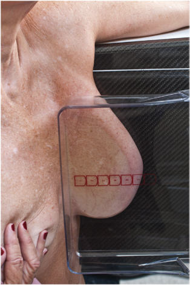
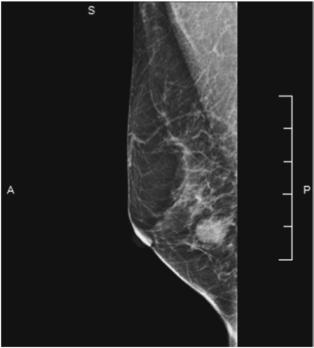

# Rx Incidență medio-laterală (ML) (incidență adevărată de profil — poziționarea în mamografie)

  📷 Radiografie Convențională (Rx)
  <strong>Actualizat:</strong> 2026-09-15
  <strong>Autor:</strong> Departamentul de Radiologie / Referință Bontrager

---

-   __1. Rezumat Clinic & Indicații__

    ---

    === "Indicații Clinice"

        - Mamografie (sân): afecțiuni patologice, în special inflamația sau alte modificări patologice din aspectul lateral al sânului.
        - Această incidență poate fi solicitată de radiolog ca incidență opțională pentru confirmarea unei anomalii observate numai pe MLO.
        - Este utilă și pentru evaluarea nivelurilor aer-lichid din structuri sau a concentrațiilor mari de calciu dintr-un chist (lapte de calciu).

    === "Ghid Național IRIS"

        !!! info "Referință Primară: Ghidul Național IRIS (Ordinul MS 1342/2012)"
            - **Capitol Ghid IRIS:** *Sân*
            - **Grad de Recomandare:** **Grad A**
            - **Nivel de Iradiere Estimată:** `Clasa 1 (Minimă < 0.4 mSv)`

            [:octicons-search-16: Deschide Ghidul IRIS](../../iris.md){ .md-button .md-button--primary } [:material-open-in-new: Aplicația Oficială PWA](https://radiologie-pediatrica.ro/iris/){ .md-button target="_blank" rel="noopener" }

-   __2. Poziționare & Centrare Fascicul__

    ---

    - **Poziție Pacient:** Pacientă: în ortostatism; dacă nu este posibil, în poziție șezândă; Regiunea anatomică: tubul și receptorul de imagine rămân în unghiuri drepte unul față de celălalt, deoarece raza centrală este înclinată la 90° față de verticală. se ajustează înălțimea receptorului de imagine pentru a fi centrat pe mijlocul sânului. Cu pacienta orientată spre aparat, cu picioarele înainte, se plasează brațul de partea examinată înainte și mâna pe bara din față (Fig. 20.71). Se trage țesutul mamar și mușchiul pectoral anterior și medial, îndepărtându-le de peretele toracic. Se împinge ușor pacienta spre receptorul de imagine până când aspectul infero-lateral al sânului atinge receptorul de imagine. Mamelonul trebuie să fie în profil. Se aplică lent compresia, menținând sânul îndepărtat de peretele toracic și ridicat pentru a preveni lăsarea. După ce paleta a trecut de stern, pacienta se rotește până când sânul este în adevărata incidență de profil (lateral). Ridurile și pliurile sânului trebuie netezite, iar compresia se aplică până când sânul este întins. Se deschide IMF trăgând în jos țesutul abdominal. Dacă este necesar, se instruiește pacienta să retragă ușor sânul opus cu cealaltă mână pentru a preveni suprapunerea. Markerul de incidență R sau L trebuie plasat sus și aproape de axilă. Sfaturi de poziționare pentru pacienta cu țesut adipos suplimentar la nivelul brațului superior și al spatelui—după poziționarea pacientei pentru MLO, se menține o mână pe sân, pe sau sprijinită de receptorul de imagine, iar cu celălalt braț se trage înapoi țesutul posterior din jurul spatelui pacientei. Aceasta va reduce probabilitatea formării unui pliu cutanat. Pentru brațul superior—în timp ce se poziționează brațul peste partea superioară a receptorului de imagine, se rotește ușor brațul spre interior și se trage țesutul adipos („aripile”) spre partea posterioară a receptorului de imagine. În plus, în timpul aplicării compresiei, se plasează mâna liberă peste umărul dependent și se trage în sus de țesutul mamar superior pentru a reduce pliul tisular care apare frecvent în acel loc.
    - **Punct de Centrare Fascicul:** perpendiculară, centrată pe baza sânului, marginea peretelui toracic a receptorului de imagine; raza centrală nu este mobilă
    - **Distanță Focar-Film (DFF / SID):** 60 cm
    - **Comandă Respiratorie:** Apnee (oprirea respirației) respirație.

-   __3. Parametri Tehnici Expunere__

    ---

    | Parametru Tehnic | Valoare Configurare Generator / Tub |
    |:-----------------|:-------------------------------------|
    | **Tensiune Tub (kV)** | DE CONFIGURAT PE APARAT |
    | **Sarcină / Produs Curent-Timp (mAs)** | DE CONFIGURAT PE APARAT |
    | **Distanță Focar-Film (DFF / SID)** | 60 cm |
    | **Grilă Antidifuzoare (Bucky)** | Cu grilă antidifuzoare Bucky |
    | **Dimensiune Focar** | Focar Mic (0.6 mm) |
    | **Camere de Ionizare AEC** | Camerele laterale (sau camera centrală, în funcție de regiune) |
    | **Colimare Fascicul** | Raza centrală și camera de colimare sunt fixe și corect centrate dacă țesutul mamar este corect centrat și vizualizat pe receptorul de imagine. Zonele dense sunt penetrate adecvat, rezultând un contrast optim. Rețeaua fină de țesuturi indică absența mișcării. Markerii de incidență R și L și informațiile despre pacientă sunt plasați corect pe partea axilară a receptorului de imagine. Nu sunt vizibile artefacte. Fig. 20.72, incidență ML. |
    | **Filtrare Tub** | Totală ≥ 2.5 mm Al echivalent |

-   __4. Criterii de Calitate & Reușită Imagine__

    ---

    - Incidența laterală a întregului țesut mamar include regiunea axilară, mușchiul pectoral și IMF deschis (Fig. 20.72). Poziționare și compresie
    - Mamelonul este vizualizat în profil; grosimea țesutului este distribuită uniform pe receptorul de imagine, indicând o compresie optimă.
    - Țesutul mamar axilar, incluzând în general mușchiul pectoral, este inclus, indicând centrarea corectă și poziționarea verticală corectă a receptorului de imagine.

-   __5. Protecție Radiologică (ALARA)__

    ---

    - Ecranare gonadică și a organelor radiosensibile conform procedurilor locale de radioprotecție ALARA.
    - Colimare strictă la aria de interes pentru limitarea radiației difuze.
    - Verificarea posibilității unei sarcini la pacientele de vârstă fertilă înainte de expunere.

!!! note "Observații Clinice & Tehnice"
    se poziționează camera AEC în poziția adecvată pentru a asigura expunerea corespunzătoare a diferitelor densități tisulare. Fig. 20.71, incidență ML.

### 🖼️ Imagini

<figure class="protocol-image-card" markdown>

<figcaption><strong>Fig. 20.71, incidență ML.</strong> — Poziționarea pacientei conform Ghidului Bontrager (Fig. 20.71, incidență ML.)</figcaption>

</figure>

<figure class="protocol-image-card" markdown>

<figcaption><strong>Fig. 20.72, incidență ML.</strong> — Aspect radiografic de referință conform Ghidului Bontrager (Fig. 20.72, incidență ML.)</figcaption>

</figure>

=== "Ghid Rapid de Execuție"

    1. **Identificarea și verificarea pacientului:** verificare identitate, zonă de examinat, consimțământ conform procedurii și evaluarea posibilității unei sarcini, când este relevantă.
    2. **Pregătire:** îndepărtarea oricăror obiecte radiopace (bijuterii, agrafe, fermoare, proteze, pansamente dense).
    3. **Poziționare precisă:** alinierea receptorului de imagine și a tubului la distanța prescrisă (60 cm).
    4. **Colimare strictă:** adaptarea fasciculului strict la regiunea de diagnostic pentru scăderea iradierii și reducerea radiației difuze.
    5. **Radioprotecție:** verificarea [politicii RX](../radioprotectie.md), cu măsuri distincte pentru pacient, personal și însoțitor.

## Surse de documentare

- [Bontrager's Textbook of Radiographic Positioning (Ed. 9/10), Pagina 792](https://www.elsevier.com/books/textbook-of-radiographic-positioning-and-related-anatomy/lampignano/978-0-323-65367-1)
