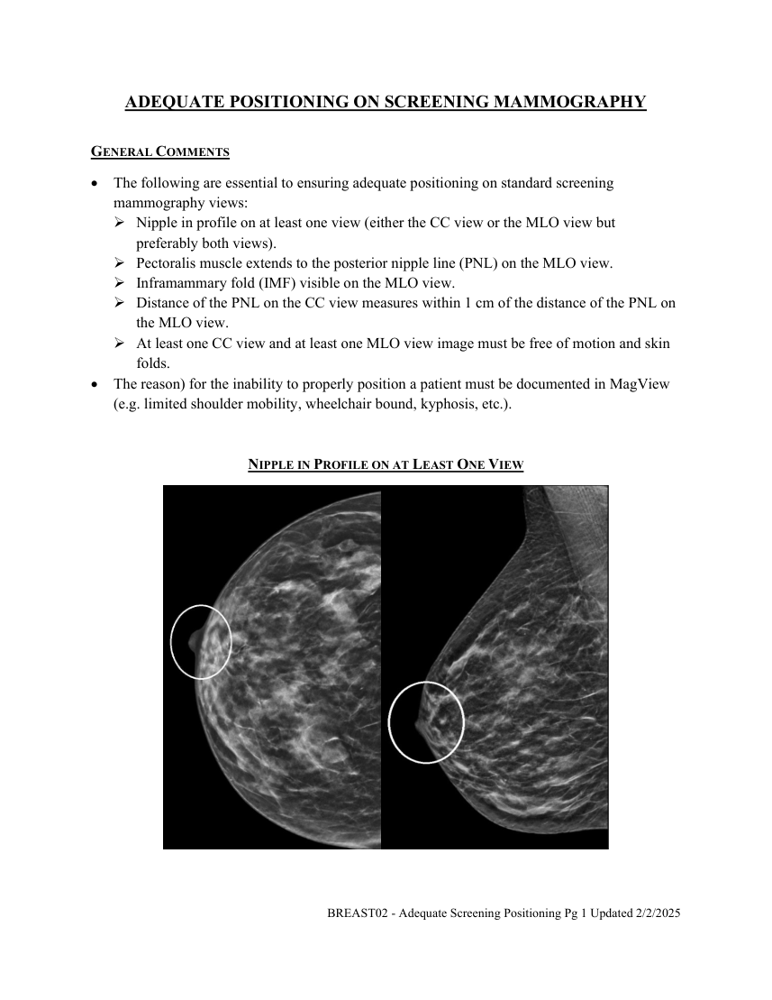
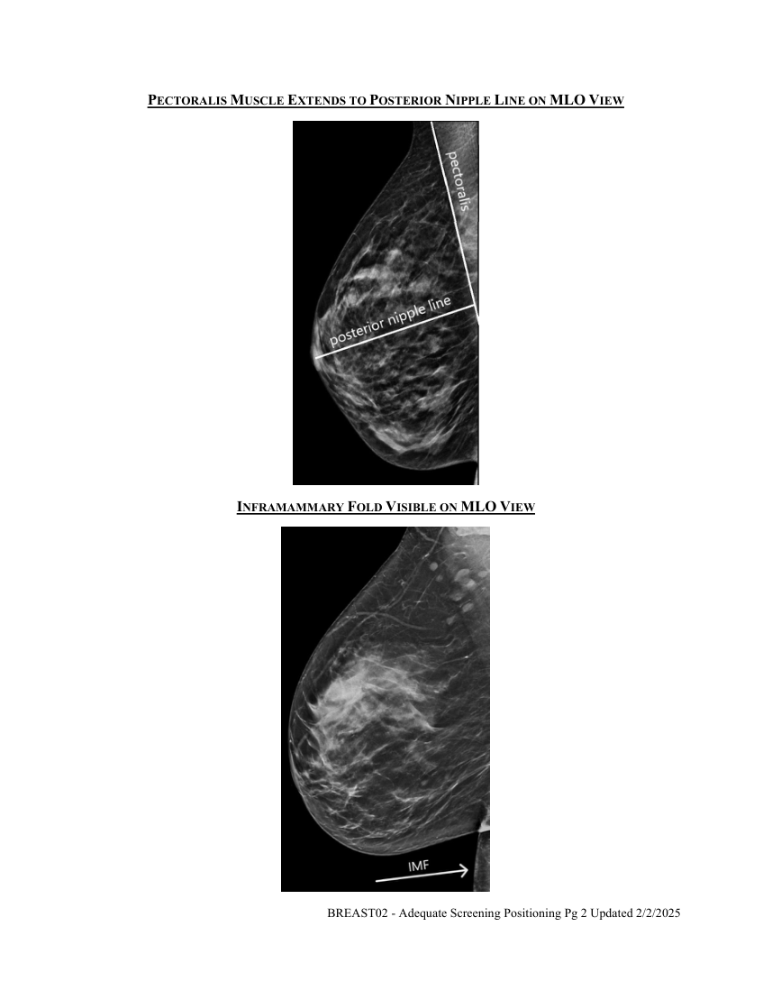
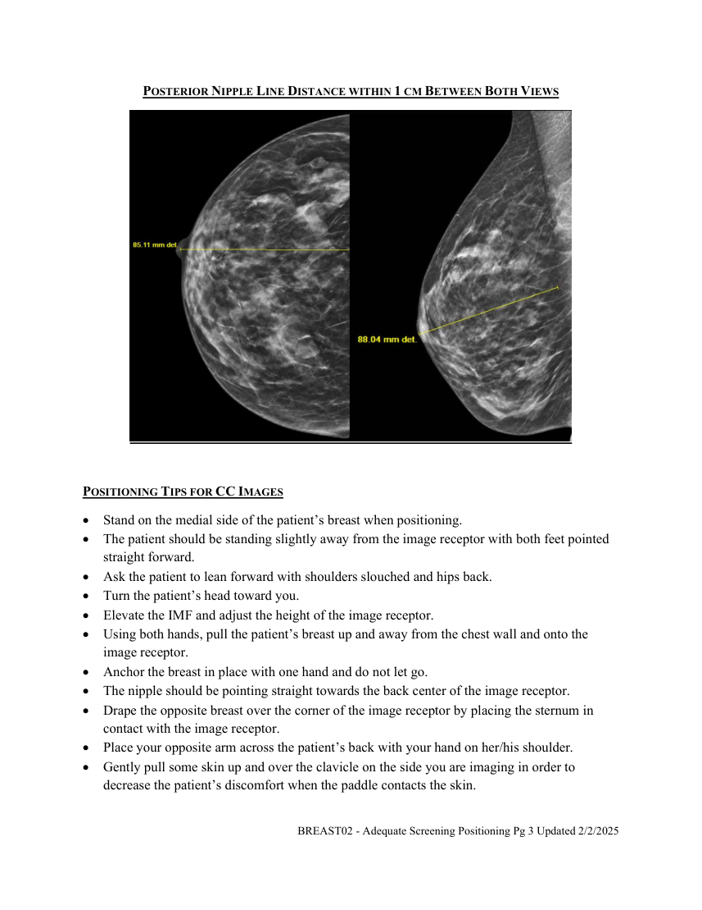
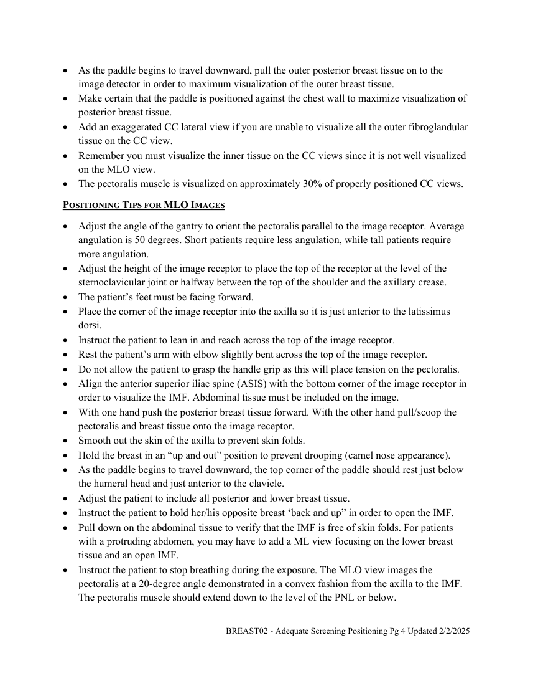

# RX — Poziționare adecvată în screeningul mamar (MCB)

## Documentul original MCB — Poziționare adecvată în screeningul mamar

**Politică procedurală · 4 pagini · consultat la 2026-09-27.**

[Descarcă PDF-ul integral](../../assets/mcb-modalities/rx-pozitionare-adecvata-in-screeningul-mamar-mcb/document.pdf) · [Sursa MCB](https://ref.mcbradiology.com/Breast/Policies/BREAST02%20-%20Adequate%20Screening%20Positioning.pdf) · [Catalogul MCB pentru această modalitate](../mcb/index.md)

Instrucțiunile, valorile și ilustrațiile din documentul original sunt păstrate în **engleză**. Titlul și navigarea sunt în română.

### Pagina 1

{ loading=lazy }

### Pagina 2

{ loading=lazy }

### Pagina 3

{ loading=lazy }

### Pagina 4

{ loading=lazy }

## Textul documentului original

??? abstract "Pagina 1 — text în engleză"

    
ADEQUATE POSITIONING ON SCREENING MAMMOGRAPHY 
     
    GENERAL COMMENTS 
     The following are essential to ensuring adequate positioning on standard screening 
    mammography views: 
     Nipple in profile on at least one view (either the CC view or the MLO view but 
    preferably both views). 
     Pectoralis muscle extends to the posterior nipple line (PNL) on the MLO view. 
     Inframammary fold (IMF) visible on the MLO view. 
     Distance of the PNL on the CC view measures within 1 cm of the distance of the PNL on 
    the MLO view. 
     At least one CC view and at least one MLO view image must be free of motion and skin 
    folds. 
     The reason) for the inability to properly position a patient must be documented in MagView 
    (e.g. limited shoulder mobility, wheelchair bound, kyphosis, etc.). 
     
    NIPPLE IN PROFILE ON AT LEAST ONE VIEW 
     
     
    BREAST02 - Adequate Screening Positioning Pg 1 Updated 2/2/2025 
     
     
    

??? abstract "Pagina 2 — text în engleză"

    
PECTORALIS MUSCLE EXTENDS TO POSTERIOR NIPPLE LINE ON MLO VIEW 
     
    INFRAMAMMARY FOLD VISIBLE ON MLO VIEW 
     
    BREAST02 - Adequate Screening Positioning Pg 2 Updated 2/2/2025 
     
     
    

??? abstract "Pagina 3 — text în engleză"

    
POSTERIOR NIPPLE LINE DISTANCE WITHIN 1 CM BETWEEN BOTH VIEWS 
     
     
    POSITIONING TIPS FOR CC IMAGES 
     Stand on the medial side of the patient’s breast when positioning. 
     The patient should be standing slightly away from the image receptor with both feet pointed 
    straight forward. 
     Ask the patient to lean forward with shoulders slouched and hips back. 
     Turn the patient’s head toward you. 
     Elevate the IMF and adjust the height of the image receptor. 
     Using both hands, pull the patient’s breast up and away from the chest wall and onto the 
    image receptor. 
     Anchor the breast in place with one hand and do not let go. 
     The nipple should be pointing straight towards the back center of the image receptor. 
     Drape the opposite breast over the corner of the image receptor by placing the sternum in 
    contact with the image receptor.  
     Place your opposite arm across the patient’s back with your hand on her/his shoulder.  
     Gently pull some skin up and over the clavicle on the side you are imaging in order to 
    decrease the patient’s discomfort when the paddle contacts the skin.  
    BREAST02 - Adequate Screening Positioning Pg 3 Updated 2/2/2025 
     
     
    

??? abstract "Pagina 4 — text în engleză"

    
 As the paddle begins to travel downward, pull the outer posterior breast tissue on to the 
    image detector in order to maximum visualization of the outer breast tissue.  
     Make certain that the paddle is positioned against the chest wall to maximize visualization of 
    posterior breast tissue.  
     Add an exaggerated CC lateral view if you are unable to visualize all the outer fibroglandular 
    tissue on the CC view.  
     Remember you must visualize the inner tissue on the CC views since it is not well visualized 
    on the MLO view. 
     The pectoralis muscle is visualized on approximately 30% of properly positioned CC views.  
    POSITIONING TIPS FOR MLO IMAGES 
     Adjust the angle of the gantry to orient the pectoralis parallel to the image receptor. Average 
    angulation is 50 degrees. Short patients require less angulation, while tall patients require 
    more angulation. 
     Adjust the height of the image receptor to place the top of the receptor at the level of the 
    sternoclavicular joint or halfway between the top of the shoulder and the axillary crease. 
     The patient’s feet must be facing forward. 
     Place the corner of the image receptor into the axilla so it is just anterior to the latissimus 
    dorsi. 
     Instruct the patient to lean in and reach across the top of the image receptor. 
     Rest the patient’s arm with elbow slightly bent across the top of the image receptor. 
     Do not allow the patient to grasp the handle grip as this will place tension on the pectoralis. 
     Align the anterior superior iliac spine (ASIS) with the bottom corner of the image receptor in 
    order to visualize the IMF. Abdominal tissue must be included on the image. 
     With one hand push the posterior breast tissue forward. With the other hand pull/scoop the 
    pectoralis and breast tissue onto the image receptor. 
     Smooth out the skin of the axilla to prevent skin folds. 
     Hold the breast in an “up and out” position to prevent drooping (camel nose appearance). 
     As the paddle begins to travel downward, the top corner of the paddle should rest just below 
    the humeral head and just anterior to the clavicle. 
     Adjust the patient to include all posterior and lower breast tissue. 
     Instruct the patient to hold her/his opposite breast ‘back and up” in order to open the IMF. 
     Pull down on the abdominal tissue to verify that the IMF is free of skin folds. For patients 
    with a protruding abdomen, you may have to add a ML view focusing on the lower breast 
    tissue and an open IMF. 
     Instruct the patient to stop breathing during the exposure. The MLO view images the 
    pectoralis at a 20-degree angle demonstrated in a convex fashion from the axilla to the IMF. 
    The pectoralis muscle should extend down to the level of the PNL or below. 
    BREAST02 - Adequate Screening Positioning Pg 4 Updated 2/2/2025 
     
     
    

