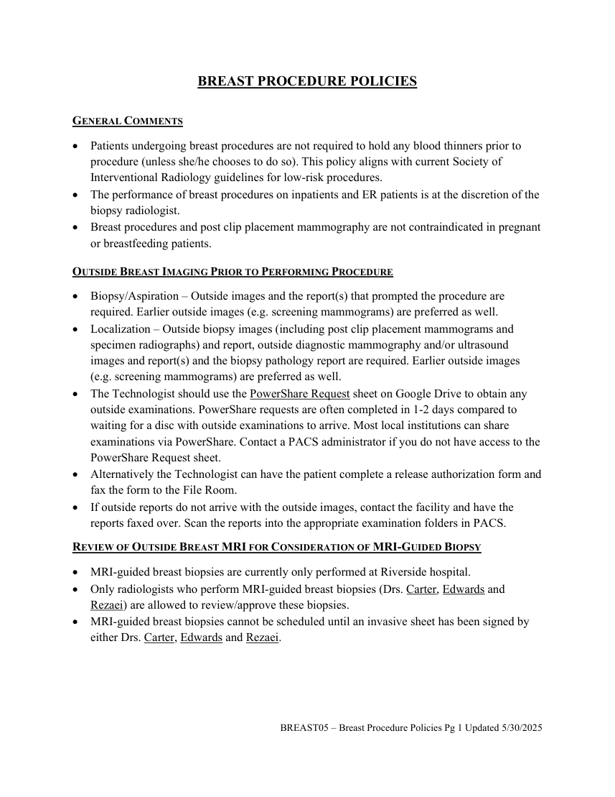
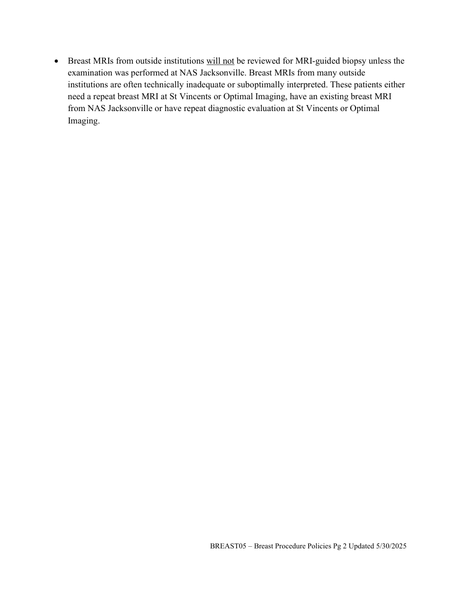

# RX — Proceduri mamare (MCB)

## Documentul original MCB — Proceduri mamare

**Politică procedurală · 2 pagini · consultat la 2026-09-27.**

[Descarcă PDF-ul integral](../../assets/mcb-modalities/rx-proceduri-mamare-mcb/document.pdf) · [Sursa MCB](https://ref.mcbradiology.com/Breast/Policies/BREAST05%20-%20Breast%20Procedure%20Policies.pdf) · [Catalogul MCB pentru această modalitate](../mcb/index.md)

Instrucțiunile, valorile și ilustrațiile din documentul original sunt păstrate în **engleză**. Titlul și navigarea sunt în română.

### Pagina 1

{ loading=lazy }

### Pagina 2

{ loading=lazy }

## Textul documentului original

??? abstract "Pagina 1 — text în engleză"

    
BREAST PROCEDURE POLICIES 
     
    GENERAL COMMENTS 
     Patients undergoing breast procedures are not required to hold any blood thinners prior to 
    procedure (unless she/he chooses to do so). This policy aligns with current Society of 
    Interventional Radiology guidelines for low-risk procedures. 
     The performance of breast procedures on inpatients and ER patients is at the discretion of the 
    biopsy radiologist. 
     Breast procedures and post clip placement mammography are not contraindicated in pregnant 
    or breastfeeding patients. 
    OUTSIDE BREAST IMAGING PRIOR TO PERFORMING PROCEDURE 
     Biopsy/Aspiration – Outside images and the report(s) that prompted the procedure are 
    required. Earlier outside images (e.g. screening mammograms) are preferred as well. 
     Localization – Outside biopsy images (including post clip placement mammograms and 
    specimen radiographs) and report, outside diagnostic mammography and/or ultrasound 
    images and report(s) and the biopsy pathology report are required. Earlier outside images 
    (e.g. screening mammograms) are preferred as well. 
     The Technologist should use the PowerShare Request sheet on Google Drive to obtain any 
    outside examinations. PowerShare requests are often completed in 1-2 days compared to 
    waiting for a disc with outside examinations to arrive. Most local institutions can share 
    examinations via PowerShare. Contact a PACS administrator if you do not have access to the 
    PowerShare Request sheet. 
     Alternatively the Technologist can have the patient complete a release authorization form and 
    fax the form to the File Room. 
     If outside reports do not arrive with the outside images, contact the facility and have the 
    reports faxed over. Scan the reports into the appropriate examination folders in PACS. 
    REVIEW OF OUTSIDE BREAST MRI FOR CONSIDERATION OF MRI-GUIDED BIOPSY 
     MRI-guided breast biopsies are currently only performed at Riverside hospital. 
     Only radiologists who perform MRI-guided breast biopsies (Drs. Carter, Edwards and 
    Rezaei) are allowed to review/approve these biopsies.  
     MRI-guided breast biopsies cannot be scheduled until an invasive sheet has been signed by 
    either Drs. Carter, Edwards and Rezaei. 
     
     
     
     
    BREAST05 – Breast Procedure Policies Pg 1 Updated 5/30/2025 
     
     
    

??? abstract "Pagina 2 — text în engleză"

    
 Breast MRIs from outside institutions will not be reviewed for MRI-guided biopsy unless the 
    examination was performed at NAS Jacksonville. Breast MRIs from many outside 
    institutions are often technically inadequate or suboptimally interpreted. These patients either 
    need a repeat breast MRI at St Vincents or Optimal Imaging, have an existing breast MRI 
    from NAS Jacksonville or have repeat diagnostic evaluation at St Vincents or Optimal 
    Imaging. 
    BREAST05 – Breast Procedure Policies Pg 2 Updated 5/30/2025 
     
     
    

