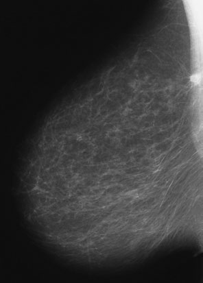
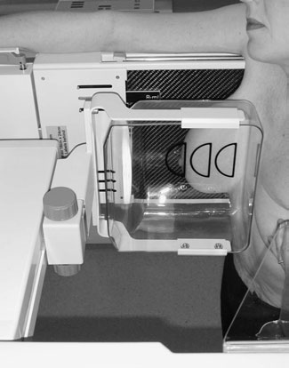
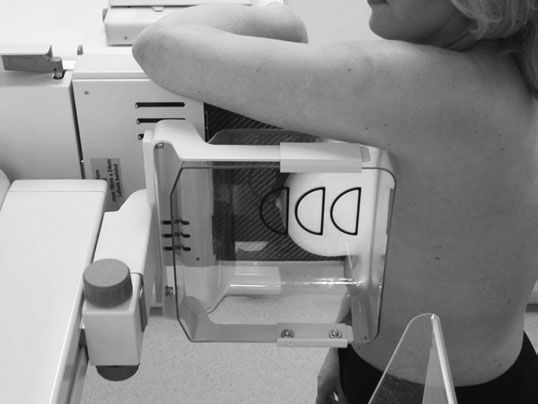
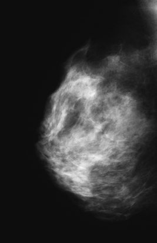

# Rx Incidență de profil (lateral) medio-profil (lateral)

  📷 Radiografie Convențională (Rx)
  <strong>Actualizat:</strong> 2026-09-16
  <strong>Autor:</strong> Departamentul de Radiologie / Referință Clark (Ed. 12)

---

-   __1. Rezumat Clinic & Indicații__

    ---

    === "Indicații Clinice"

        - 455 15 Incidența de profil (lateral) este deplasată din nou înainte pentru a se asigura că femeia se află în poziția pentru adevărata incidență de profil (lateral).
        - Poziția sânului este menținută manual, radiograful folosind cealaltă mână pentru a îndepărta orice pliuri cutanate dintre masa-suport pentru sân și aspectul de profil (lateral) al sânului.
        - Mâna este îndepărtată, asigurând menținerea poziției în timp ce se aplică compresia finală.

    === "Ghid Național IRIS"

        !!! info "Referință Primară: Ghidul Național IRIS (Ordinul MS 1342/2012)"
            - **Capitol Ghid IRIS:** *Sân*
            - **Grad de Recomandare:** **Grad A**
            - **Nivel de Iradiere Estimată:** `Clasa 1 (Minimă < 0.4 mSv)`

            [:octicons-search-16: Deschide Ghidul IRIS](../../iris.md){ .md-button .md-button--primary } [:material-open-in-new: Aplicația Oficială PWA](https://radiologie-pediatrica.ro/iris/){ .md-button target="_blank" rel="noopener" }

-   __2. Poziționare & Centrare Fascicul__

    ---

    - **Poziție Pacient:**
        - aparatul este poziționat cu tubul și masa-suport pentru sân în poziție verticală.
        - femeia este orientată spre aparat, cu masa-suport pentru sân pe partea de profil (lateral) a sânului. Femeia își plasează brațul în spatele mesei-suport pentru sân și se ține de aparat pentru stabilitate. Se apleacă din talie pentru a se asigura că țesutul mamar cel mai apropiat de peretele toracic va fi vizualizat.
        - aparatul este ajustat la înălțimea la care va fi inclusă porțiunea inferioară a sânului.
        - mâna radiografului este plasată pe sau sprijinită de partea laterală a cutiei toracice și alunecă înainte pentru a susține sânul, cu palma pe aspectul de profil (lateral) și policele pe aspectul medial.
        - femeia este împinsă ușor înainte, iar sânul este extins în afară și în sus pe sau sprijinit de masa-suport pentru sân, asigurând menținerea mamelonului în profil.
        - umărul de partea opusă este împins înapoi astfel încât placa de compresie să poată fi adusă în contact cu sânul examinat. În acest moment este necesar un sprijin ferm al sânului, astfel încât țesutul mamar de la marginea peretelui toracic să nu fie tras înapoi.
        - se aplică ușor compresia. Când placa intră în contact cu sânul la peretele toracic, celălalt umăr este adus [fragment deteriorat în sursă]
        - masa-suport pentru sân este plasată pe sau sprijinită de stern. Brațul de partea examinată este ridicat pentru a elibera tubul radiologic și este sprijinit pe aparat. Corpul este rotit ușor spre interior pentru a intra în contact cu masa-suport pentru sân.
        - înălțimea aparatului este modificată astfel încât să fie inclusă marginea inferioară a sânului.
        - sânul este ghidat ușor transversal și în sus, asigurând menținerea mamelonului în profil.
        - se aplică compresia în timp ce mâna radiografului susține sânul. Mâna este îndepărtată când se obține compresia finală.
        - această incidență se efectuează pentru demonstrarea leziunilor situate medial.
    - **Punct de Centrare Fascicul:** Raza centrală perpendiculară pe centrul receptorului de imagine.
    - **Distanță Focar-Film (DFF / SID):** 100 cm
    - **Comandă Respiratorie:** Apnee pe durata expunerii (apnee în inspir pentru torace; expir pentru Abdomen/bazin).

-   __3. Parametri Tehnici Expunere__

    ---

    | Parametru Tehnic | Valoare Configurare Generator / Tub |
    |:-----------------|:-------------------------------------|
    | **Tensiune Tub (kV)** | DE CONFIGURAT PE APARAT |
    | **Sarcină / Produs Curent-Timp (mAs)** | Conform AEC / grosimii anatomice |
    | **Distanță Focar-Film (DFF / SID)** | 100 cm |
    | **Grilă Antidifuzoare (Bucky)** | Conform grosimii anatomice (> 10-12 cm cu grilă) |
    | **Dimensiune Focar** | Focar Mic (0.6 mm) |
    | **Camere de Ionizare AEC** | DE CONFIGURAT PE APARAT |
    | **Colimare Fascicul** | Colimare strictă la aria anatomică de interes diagnostic |
    | **Filtrare Tub** | Totală ≥ 2.5 mm Al echivalent (conform Clark: 3.0 mm Al echivalent) |

-   __4. Criterii de Calitate & Reușită Imagine__

    ---

    - Sânul, inclusiv marginea sa inferioară, trebuie să fie evidențiat adecvat.
    - Trebuie să existe aceeași profunzime de țesut ca în incidența cranio-caudală.
    - Sânul este evidențiat complet, inclusiv marginea sa inferioară.
    - Aceeași profunzime a țesutului mamar trebuie vizualizată ca în incidența cranio-caudală.
    - Erori de evitat / remedii: Dacă nu este vizualizat întregul țesut mamar, atunci mâna radiografului nu a fost retrasă la nivelul cutiei toracice, iar sânul nu a fost deplasat suficient înainte peste masa-suport pentru sân.
    - Erori de evitat / remedii: Dacă mamelonul nu era în profil, atunci femeia se afla în ortostatism prea mult înaintea mesei-suport pentru sân dacă mamelonul era situat în spatele majorității țesutului mamar și prea mult în spate dacă mamelonul era situat înaintea majorității țesutului mamar.
    - Erori de evitat / remedii: Dacă compresia este inadecvată, atunci filmul radiologic va fi subexpus. Sânul nu a fost verificat pentru fermitate.

-   __5. Protecție Radiologică (ALARA)__

    ---

    - Ecranare gonadică cu șorț plumbat dacă gonadele sunt în apropierea fasciculului util (regula ALARA).
    - Colimare precisă la dimensiunea anatomică strict necesară pentru reducerea dozei și a radiației difuze.
    - Verificarea posibilității unei sarcini la pacientele de vârstă fertilă înainte de expunere.

!!! note "Observații Clinice & Tehnice"
    Pregătirea pacientului prin îndepărtarea tuturor accesoriilor radio-opace.

### 🖼️ Imagini

<figure class="protocol-image-card" markdown>

<figcaption><strong>• Dacă nu este vizualizat întregul țesut mamar, atunci mâna radiografului</strong> — Poziționarea pacientului și centrarea fasciculului conform Clark (Ed. 12)</figcaption>

</figure>

<figure class="protocol-image-card" markdown>

<figcaption><strong>detaliu, de exemplu microcalcificări patologice; trebuie acordată o mare atenție</strong> — Aspect radiografic / ghid de poziționare conform tratatului Clark (Ed. 12)</figcaption>

</figure>

<figure class="protocol-image-card" markdown>

<figcaption><strong>• Compresia se aplică în timp ce mâna radiografului</strong> — Aspect radiografic / ghid de poziționare conform tratatului Clark (Ed. 12)</figcaption>

</figure>

<figure class="protocol-image-card" markdown>

<figcaption><strong>detaliu, de exemplu microcalcificări patologice; trebuie acordată o mare atenție</strong> — Aspect radiografic / ghid de poziționare conform tratatului Clark (Ed. 12)</figcaption>

</figure>

=== "Ghid Rapid de Execuție"

    1. **Identificarea și verificarea pacientului:** verificare identitate, zonă de examinat, consimțământ conform procedurii și evaluarea posibilității unei sarcini, când este relevantă.
    2. **Pregătire:** îndepărtarea oricăror obiecte radiopace (bijuterii, agrafe, fermoare, proteze, pansamente dense).
    3. **Poziționare precisă:** alinierea receptorului de imagine și a tubului la distanța prescrisă (100 cm).
    4. **Colimare strictă:** adaptarea fasciculului strict la regiunea de diagnostic pentru scăderea iradierii și reducerea radiației difuze.
    5. **Radioprotecție:** verificarea [politicii RX](../radioprotectie.md), cu măsuri distincte pentru pacient, personal și însoțitor.

## Surse de documentare

- [Clark's Positioning in Radiography (Ed. 12), Pagina 470](https://books.google.com/books/about/Clark_s_Positioning_in_Radiography.html?id=Xxu6MwEACAAJ)
