# Rx ▪ Incidență cu compresie focalizată — Incidență tangențială (TAN) (Merrill)

  📷 Radiografie Convențională (Rx)
  <strong>Actualizat:</strong> 2026-09-16
  <strong>Autor:</strong> Referință Merrill

---

-   __1. Rezumat Clinic & Indicații__

    ---

    === "Indicații Clinice"

        - Conform reperelor anatomice standard din tratat

    === "Ghid Național IRIS"

        !!! info "Referință Primară: Ghidul Național IRIS (Ordinul MS 1342/2012)"
            - **Capitol Ghid IRIS:** *Sân*
            - **Grad de Recomandare:** **Grad A**
            - **Nivel de Iradiere Estimată:** `Clasa 1 (Minimă < 0.4 mSv)`

            [:octicons-search-16: Deschide Ghidul IRIS](../../iris.md){ .md-button .md-button--primary } [:material-open-in-new: Aplicația Oficială PWA](https://radiologie-pediatrica.ro/iris/){ .md-button target="_blank" rel="noopener" }

-   __2. Poziționare & Centrare Fascicul__

    ---

    - **Poziție Pacient:** Se instruiește pacientul să stea cu fața spre receptorul de imagine sau se așază pacientul pe un scaun, pe un taburet reglabil, cu fața spre aparat. Se instruiește pacientul să stea cu fața spre receptorul de imagine sau se așază pacientul pe un scaun, pe un taburet reglabil, cu fața spre aparat. Se instruiește pacientul să stea cu fața spre receptorul de imagine. Se instruiește pacientul să stea cu fața spre receptorul de imagine sau se așază pacientul pe un scaun, pe un taburet reglabil, cu fața spre aparat. Se instruiește pacientul să stea cu fața spre receptorul de imagine sau se așază pacientul pe un scaun, pe un taburet reglabil, cu fața spre aparat.; pentru o masă palpabilă, incidența TAN este efectuată cel mai frecvent folosind tehnica de magnificație. Se selectează paleta standard, paleta pentru cadran sau paleta pentru compresie focalizată, după caz. Se plasează detectorul AEC la nivelul peretelui toracic. Se localizează aria de interes diagnostic prin palparea sânului pacientei. Se plasează un marker radiopac sau o bilă BB pe masă sau se instruiește pacienta să plaseze bila BB pe aria de interes. Folosind linia imaginară dintre mamelon și bila BB ca reper unghiular (Fig. 18.58), se rotește aparatul cu braț C paralel cu această linie. Raza centrală este orientată tangențial către sân, la punctul identificat prin markerul BB. Se plasează sânul pe receptorul de imagine sau pe suportul de magnificație, cu aria de interes diagnostic marcată prin bila BB la marginea tegumentului. „Umbra” bilei BB va fi proiectată pe suprafața receptorului de imagine. Folosind paleta de compresie adecvată, se comprimă sânul, asigurându-se că o cantitate suficientă de țesut mamar acoperă aria detectorului AEC. Se aplică progresiv compresia până când glanda mamară este ferm fixată. Se instruiește pacienta să indice dacă compresia devine neconfortabilă. Când se obține compresia completă, se instruiește pacienta să oprească respirația (Figs. 18.59 și 18.60). Se declanșează expunerea. Se decomprimă sânul imediat după efectuarea expunerii. Se plasează pe aparat platforma de magnificație destinată utilizării cu unitatea de mamografie dedicată. Se plasează bila BB de plumb peste masa palpabilă. Folosind mâinile, se determină incidența cu cea mai mare probabilitate de a evidenția masa fără suprapunerea altui țesut. Se plasează aria de interes clinic la marginea sânului, în plan tangent față de placa de imagine. Aria palpabilă de interes clinic este captată cu colțul unui dispozitiv din sârmă în formă de umeraș sau cu un dispozitiv de compresie focalizată inversat. Nu este necesară compresie suplimentară. Poate fi necesară utilizarea tehnicii manuale dacă volumul de țesut captat în dispozitivul tip umeraș sau în dispozitivul de compresie inversat nu acoperă detectorul AEC. Se rotește aparatul cu braț C la 180 de grade față de rotația utilizată pentru incidența CC de rutină. Capul tubului va fi aproape de podea, iar receptorul de imagine va fi deasupra sânului pacientei. În ortostatism, pe partea medială a sânului care urmează să fie examinat, se ridică pliul inframamar la înălțimea maximă. Se ajustează înălțimea brațului C astfel încât receptorul de imagine să fie în contact cu țesutul mamar superior. Pacienta se apleacă ușor înainte în timp ce sânul ridicat este tras cu blândețe în afară și perpendicular pe peretele toracic. Se menține sânul în poziție. Se instruiește pacienta să sprijine brațul de partea afectată peste partea superioară a receptorului de imagine. Se informează pacienta cu privire la aplicarea compresiei pe glanda mamară. Se aduce paleta de compresie de jos până la contactul cu sânul pacientei, în timp ce mâna este deplasată spre mamelon. Se aplică progresiv compresia până când glanda mamară este ferm fixată. Se instruiește pacienta să indice dacă compresia devine neconfortabilă. Pentru a se asigura că abdomenul pacientei nu este suprapus peste traiectul fasciculului, se instruiește pacienta să-și retragă abdomenul sau să-și deplaseze ușor șoldurile posterior. Când se obține compresia completă, se deplasează detectorul AEC în poziția adecvată și se instruiește pacienta să oprească respirația (Fig. 18.64). Se declanșează expunerea. Se decomprimă sânul imediat după efectuarea expunerii. Se determină gradul de oblicitate al aparatului cu braț C prin rotirea tubului până când marginea lungă a receptorului de imagine este paralelă cu partea afectată. Gradul de oblicitate variază între 10 și 35 de grade. Se ajustează înălțimea brațului C astfel încât marginea superioară a receptorului de imagine să fie chiar sub axilă. Se instruiește pacienta să ridice brațul de partea afectată peste colțul receptorului de imagine și să-și sprijine mâna pe mânerul adiacent. Cotul pacientei trebuie să fie flectat. Se instruiește pacienta să relaxeze umărul afectat și să-l aplece ușor anterior. Folosind suprafața palmei, se trage ușor coada sânului anterior și medial pe receptorul de imagine, menținând tegumentul și țesutul netede și fără pliuri. Se instruiește pacienta să întoarcă capul în partea opusă celei examinate și să-și sprijine capul pe apărătoarea facială. Se informează pacienta cu privire la aplicarea compresiei pe glanda mamară. Se continuă menținerea sânului în poziție în timp ce mâna este deplasată spre mamelon, pe măsură ce paleta de compresie este adusă în contact cu acesta (Fig. 18.66). Se aplică progresiv compresia până când glanda mamară este ferm fixată. Colțul paletei de compresie trebuie să fie inferior claviculei. Pentru a evita disconfortul pacientei cauzat de colțul paletei și pentru a facilita o compresie uniformă, i se reamintește pacientei să mențină umărul relaxat. Se instruiește pacienta să indice dacă compresia devine neconfortabilă. Când se obține compresia completă, se deplasează detectorul AEC în poziția adecvată și se instruiește pacienta să oprească respirația. Poate fi necesară creșterea parametrilor de expunere dacă nivelul compresiei nu este la fel de ferm ca în incidențele de rutină. Se declanșează expunerea. Se decomprimă sânul imediat după efectuarea expunerii. Se rotește brațul C la aproximativ 70 de grade. Se ajustează înălțimea brațului C astfel încât marginea superioară a receptorului de imagine să fie la același nivel cu partea superioară a umărului pacientei. Se selectează dispozitivul de compresie adecvat. Paleta pentru cadran va capta mai mult țesut axilar profund; paleta standard de compresie de 18 × 24 cm va capta țesut lateral suplimentar și [fragment deteriorat în sursă]. Se instruiește pacienta să ridice brațul de partea afectată astfel încât acesta să fie perpendicular pe corp. Se plasează brațul pe receptorul de imagine astfel încât aspectul posterior al umărului să fie sprijinit pe receptorul de imagine. Brațul pacientei este așezat peste receptorul de imagine, cu antebrațul sprijinit pe bara de prindere. Se instruiește pacienta să relaxeze umărul afectat și să se aplece ușor anterior. Folosind suprafața palmei plasată sub regiunea axilară, se trage ușor coada sânului anterior și medial pe receptorul de imagine, menținând tegumentul și țesutul netede și fără pliuri. Se informează pacienta cu privire la aplicarea compresiei pe glanda mamară. Se aduce lent compresia de-a lungul coastelor pacientei, cu marginea superioară a paletei de compresie alunecând pe marginea inferioară a brațului superior al pacientei. Se aplică lent compresia până când țesutul axilar devine tensionat. Colțul paletei de compresie trebuie să fie inferior claviculei. Pentru a evita disconfortul pacientei cauzat de colțul paletei și pentru a facilita o compresie uniformă, i se reamintește pacientei să mențină umărul relaxat. Se instruiește pacienta să indice dacă compresia devine neconfortabilă. Compresia viguroasă nu este necesară pentru această incidență (Fig. 18.68). Când se obține compresia completă, se deplasează detectorul AEC în poziția adecvată și se instruiește pacienta să oprească respirația. Poate fi necesară creșterea parametrilor de expunere dacă nivelul compresiei nu este la fel de ferm ca în incidențele de rutină. Se declanșează expunerea. Se decomprimă sânul imediat după efectuarea expunerii.
    - **Punct de Centrare Fascicul:** perpendicular pe aria de interes diagnostic, perpendicular pe placa de imagistică. perpendicular pe baza sânului perpendicular pe receptorul de imagine (RI); unghiul aparatului cu C-braț este determinat prin panta pacientei către [fragment deteriorat în sursă]
    - **Distanță Focar-Film (DFF / SID):** Nespecificat în fragmentul extras; de verificat în sursă
    - **Comandă Respiratorie:** Conform reperelor anatomice standard din tratat

-   __3. Parametri Tehnici Expunere__

    ---

    | Parametru Tehnic | Valoare Configurare Generator / Tub |
    |:-----------------|:-------------------------------------|
    | **Tensiune Tub (kV)** | DE CONFIGURAT PE APARAT |
    | **Sarcină / Produs Curent-Timp (mAs)** | DE CONFIGURAT PE APARAT |
    | **Distanță Focar-Film (DFF / SID)** | Nespecificat în fragmentul extras; de verificat în sursă |
    | **Grilă Antidifuzoare (Bucky)** | DE CONFIGURAT PE APARAT |
    | **Dimensiune Focar** | DE CONFIGURAT PE APARAT |
    | **Camere de Ionizare AEC** | DE CONFIGURAT PE APARAT |
    | **Colimare Fascicul** | Conform reperelor anatomice standard din tratat |
    | **Filtrare Tub** | DE CONFIGURAT PE APARAT |

-   __4. Criterii de Calitate & Reușită Imagine__

    ---

    - Următoarele trebuie să fie clar vizualizate:
    - Leziune palpabilă vizualizată peste țesutul adipos subcutanat
    - Markerul radiopac TAN sau markerul BB corelat exact cu leziunea palpabilă
    - Suprapunere minimă a parenchimului adiacent
    - Calcificare în parenchim sau tegument
    - Expunere uniformă a țesutului dacă este aplicată o compresie adecvată; următoarele trebuie să fie clar vizualizate:
    - Aria de interes diagnostic din marginile colimate și autocompresate trebuie să fie vizualizată clar:
    - Țesutul mamar superior și leziunile vizualizate clar
    - Pentru imaginile de localizare a acului, leziunea inferioară vizualizată în interiorul plăcii de compresie fenestrate specializate
    - Abdomenul pacientei proiectat în afara imaginii
    - Includerea țesutului posterior fix al aspectului superior al sânului
    - PNL extins posterior până la marginea imaginii, măsurând în limita a ⅓ țol (1 cm) din profunzimea PNL pe incidența MLO
    - Toate țesuturile mediale incluse, evidențiate prin vizualizarea grăsimii retroglandulare mediale și absența țesutului fibroglandular care se extinde până la marginea posteromedială a imaginii
    - Mamelonul în profil, dacă este posibil, și pe linia mediană, indicând absența exagerării poziționării
    - O parte din țesutul lateral poate fi exclusă pentru a evidenția țesutul medial
    - Ușoară reflexie cutanată medială la nivelul clivajului, asigurând includerea adecvată a țesutului posteromedial
    - Expunere uniformă a țesutului dacă este asigurată compresia adecvată. Incidență mediolaterală oblică pentru coada axilară. Paletă: 8 × 10 țoli (18 × 24 cm) sau 10 × 12 țoli (24 × 30 cm). Următoarele trebuie să fie vizualizate clar:
    - [fragment deteriorat în sursă], cu includerea ganglionilor limfatici axilari sub compresie focalizată (Fig. 18.67)
    - Expunere tisulară uniformă dacă compresia este adecvată
    - Ușoară reflexie cutanată a brațului afectat pe marginea superioară a imaginii. Următoarele trebuie să fie vizualizate clar:
    - [fragment deteriorat în sursă], cu includerea ganglionilor limfatici axilari sub compresie focalizată (Fig. 18.69)
    - Expunere tisulară uniformă dacă compresia este adecvată
    - Ușoară reflexie cutanată a brațului afectat pe marginea superioară a imaginii

-   __5. Protecție Radiologică (ALARA)__

    ---

    - Nespecificat în fragmentul extras; de verificat în sursă

!!! note "Observații Clinice & Tehnice"
    Conform reperelor anatomice standard din tratat

### 🖼️ Imagini

<figure class="protocol-image-card" markdown>

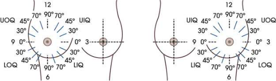

<figcaption><strong>Merrill — pagina 1389, imaginea 1</strong> — Imagine din fragmentul sursă; asocierea necesită revizie.</figcaption>

</figure>

<figure class="protocol-image-card" markdown>

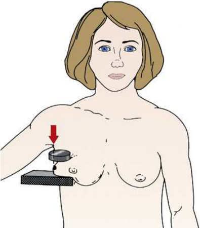

<figcaption><strong>Merrill — pagina 1390, imaginea 2</strong> — Imagine din fragmentul sursă; asocierea necesită revizie.</figcaption>

</figure>

<figure class="protocol-image-card" markdown>

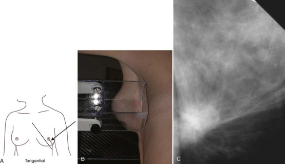

<figcaption><strong>Merrill — pagina 1390, imaginea 3</strong> — Imagine din fragmentul sursă; asocierea necesită revizie.</figcaption>

</figure>

<figure class="protocol-image-card" markdown>

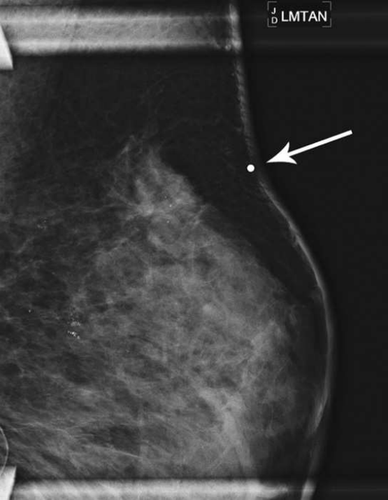

<figcaption><strong>Merrill — pagina 1391, imaginea 4</strong> — Imagine din fragmentul sursă; asocierea necesită revizie.</figcaption>

</figure>

<figure class="protocol-image-card" markdown>

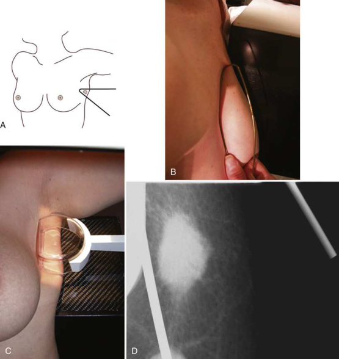

<figcaption><strong>Merrill — pagina 1392, imaginea 5</strong> — Imagine din fragmentul sursă; asocierea necesită revizie.</figcaption>

</figure>

<figure class="protocol-image-card" markdown>

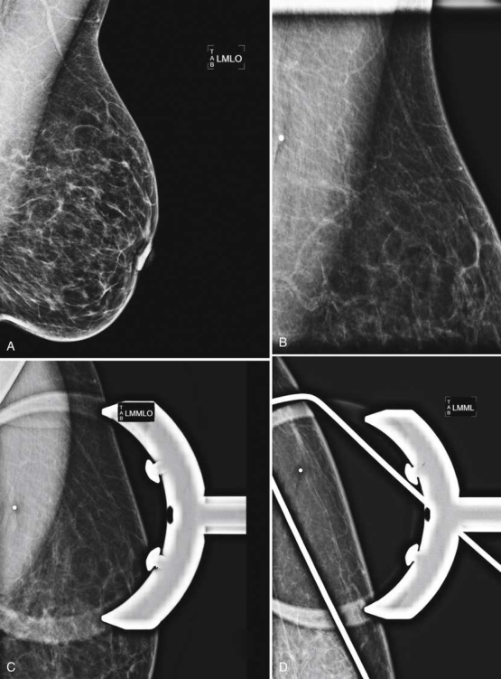

<figcaption><strong>Merrill — pagina 1393, imaginea 6</strong> — Imagine din fragmentul sursă; asocierea necesită revizie.</figcaption>

</figure>

<figure class="protocol-image-card" markdown>

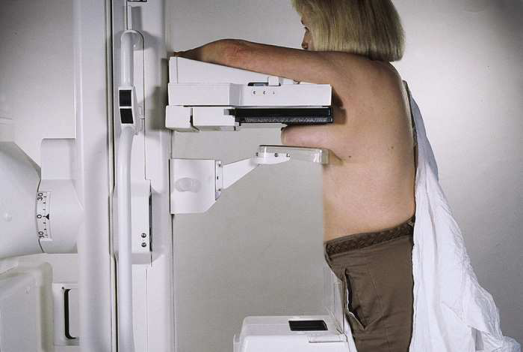

<figcaption><strong>Merrill — pagina 1394, imaginea 7</strong> — Imagine din fragmentul sursă; asocierea necesită revizie.</figcaption>

</figure>

<figure class="protocol-image-card" markdown>

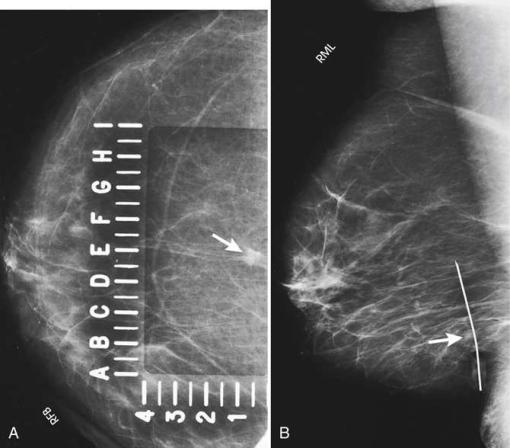

<figcaption><strong>Merrill — pagina 1395, imaginea 8</strong> — Imagine din fragmentul sursă; asocierea necesită revizie.</figcaption>

</figure>

<figure class="protocol-image-card" markdown>

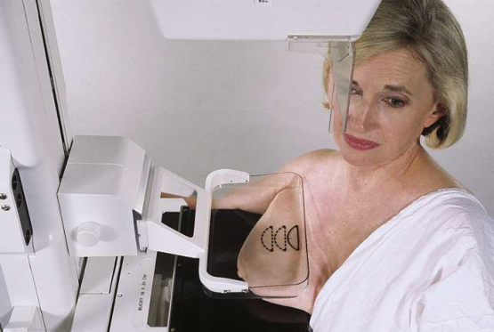

<figcaption><strong>Merrill — pagina 1396, imaginea 9</strong> — Imagine din fragmentul sursă; asocierea necesită revizie.</figcaption>

</figure>

<figure class="protocol-image-card" markdown>

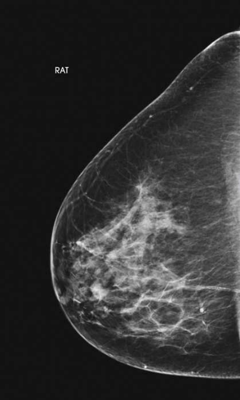

<figcaption><strong>Merrill — pagina 1397, imaginea 10</strong> — Imagine din fragmentul sursă; asocierea necesită revizie.</figcaption>

</figure>

<figure class="protocol-image-card" markdown>

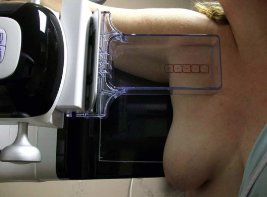

<figcaption><strong>Merrill — pagina 1398, imaginea 11</strong> — Imagine din fragmentul sursă; asocierea necesită revizie.</figcaption>

</figure>

<figure class="protocol-image-card" markdown>

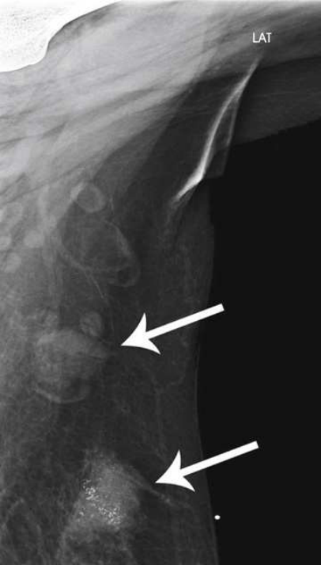

<figcaption><strong>Merrill — pagina 1399, imaginea 12</strong> — Imagine din fragmentul sursă; asocierea necesită revizie.</figcaption>

</figure>

=== "Ghid Rapid de Execuție"

    1. **Identificarea și verificarea pacientului:** verificare identitate, zonă de examinat, consimțământ conform procedurii și evaluarea posibilității unei sarcini, când este relevantă.
    2. **Pregătire:** îndepărtarea oricăror obiecte radiopace (bijuterii, agrafe, fermoare, proteze, pansamente dense).
    3. **Poziționare precisă:** alinierea receptorului de imagine și a tubului la distanța prescrisă (Nespecificat în fragmentul extras; de verificat în sursă).
    4. **Colimare strictă:** adaptarea fasciculului strict la regiunea de diagnostic pentru scăderea iradierii și reducerea radiației difuze.
    5. **Radioprotecție:** verificarea [politicii RX](../radioprotectie.md), cu măsuri distincte pentru pacient, personal și însoțitor.

## Surse de documentare

- [Merrill’s Atlas, 18. Mammography, pagini 1388–1399](https://books.google.com/books/about/Merrill_s_Atlas_of_Radiographic_Position.html?id=BM0lEQAAQBAJ)
