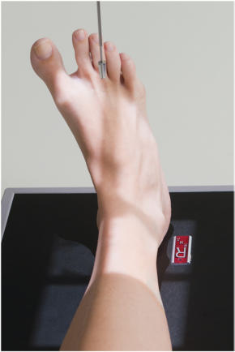
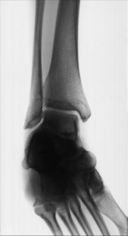
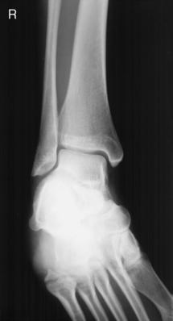

# Rx 15° TO 20° MEDIAL ROTATION AP MORTISE PROJECTION (Gleznă (Articulație Talocrurală))

  📷 Radiografie Convențională (Rx)
  <strong>Actualizat:</strong> 2026-09-15
  <strong>Autor:</strong> Departamentul de Radiologie / Referință Bontrager

---

-   __1. Rezumat Clinic & Indicații__

    ---

    === "Indicații Clinice"

        - Evaluation of pathology involving the entire Gleznă (Articulație Talocrurală) mortise1 and the proximal fifth metatarsal, a common suspiciune de fractură site. This is a common projection taken during open reduction surgery of the Gleznă (Articulație Talocrurală) (see

    === "Ghid Național IRIS"

        !!! info "Referință Primară: Ghidul Național IRIS (Ordinul MS 1342/2012)"
            - **Capitol Ghid IRIS:** *Ghidul Național IRIS*
            - **Grad de Recomandare:** **De verificat pe indicație; fără grad atribuit automat**
            - **Nivel de Iradiere Estimată:** `De verificat pentru examinarea și populația selectate`

            [:octicons-search-16: Deschide Ghidul IRIS](../../iris.md){ .md-button .md-button--primary } [:material-open-in-new: Aplicația Oficială PWA](https://radiologie-pediatrica.ro/iris/){ .md-button target="_blank" rel="noopener" }
-   __2. Poziționare & Centrare Fascicul__

    ---

    - **Poziție Pacient:** Pacient: Place patient in the Decubit Dorsal position; place pillow under patient’s head; legs should be fully extended.; Regiune anatomică: Center and align Gleznă (Articulație Talocrurală) joint to CR and to long axis of portion of IR being exposed (Fig. 6.84). Do not dorsiflex Picior; allow Picior to remain in natural extended (plantar flexed) position (allows for visualization of base of fifth metatarsal, a common suspiciune de fractură site).5 Internally rotate entire leg and Picior approximately 15° to 20° until intermalleolar line is parallel to IR. Place support against Picior if needed to prevent motion.
    - **Punct de Centrare Fascicul:** perpendicular to IR, directed midway between malleoli
    - **Distanță Focar-Film (DFF / SID):** 100 cm
    - **Comandă Respiratorie:** Apnee pe durata expunerii (sau conform cooperării pacientului)

-   __3. Parametri Tehnici Expunere__

    ---

    | Parametru Tehnic | Valoare Configurare Generator / Tub |
    |:-----------------|:-------------------------------------|
    | **Tensiune Tub (kV)** | 60-75 kV |
    | **Sarcină / Produs Curent-Timp (mAs)** | DE CONFIGURAT PE APARAT |
    | **Distanță Focar-Film (DFF / SID)** | 100 cm |
    | **Grilă Antidifuzoare (Bucky)** | Fără grilă (expunere directă) |
    | **Dimensiune Focar** | Focar Mic (0.6 mm) |
    | **Camere de Ionizare AEC** | DE CONFIGURAT PE APARAT |
    | **Colimare Fascicul** | Collimate to lateral skin margins, including proximal metatarsals and distal tibiafibula. |
    | **Filtrare Tub** | Totală ≥ 2.5 mm Al echivalent |

-   __4. Criterii de Calitate & Reușită Imagine__

    ---

    - Distal onethird of tibia and fibula, tibial plafond involving the epiphysis if present, lateral and medial malleoli, talus, and proximal half of the metatarsals should be demonstrated.
    - Entire Gleznă (Articulație Talocrurală) mortise should be open and well visualized (3to 4mm space over entire talar surface is normal; an extra 2 mm of widening is abnormal)2 (Figs. 6.85 and 6.86). Position:
    - Proper obliquity for the mortise joint is evidenced by demonstration of open lateral and medial mortise joints with malleoli demonstrated in profile.
    - Only minimal superimposition should exist at distal tibiofibular joint.
    - Collimation to area of interest. Exposure:
    - No motion as demonstrated by sharp bony outlines and trabecular markings.
    - Optimal image receptor exposure and contrast to demonstrate soft tissue structures and sufficient exposure for talus and distal tibia and fibula.

-   __5. Protecție Radiologică (ALARA)__

    ---

    - Ecranare gonadică și a organelor radiosensibile conform procedurilor locale de radioprotecție ALARA.
    - Colimare strictă la aria de interes pentru limitarea radiației difuze.
    - Verificarea posibilității unei sarcini la pacientele de vârstă fertilă înainte de expunere.

!!! note "Observații Clinice & Tehnice"
    This position should not be a substitute for either the Incidență Antero-Posterioară (AP) or the oblique Gleznă (Articulație Talocrurală) position but rather should be a separate projection of the Gleznă (Articulație Talocrurală) that is taken routinely when potential traumatism acuttism / Regim Urgență or sprains of the Gleznă (Articulație Talocrurală) joint are involved.1 Gleznă (Articulație Talocrurală) ROUTINE AP AP mortise (15°) Lateral SPECIAL Oblique (45°) AP stress Fig. 6.84 Mortise projection, demonstrating 15° to 20° medial rotation of Gambă and Picior. Fig. 6.85 Mortise projection. Talus Medial malleolus Tibial plafond Distal tibiofibular joint Gleznă (Articulație Talocrurală) mortise Lateral malleolus suspiciune de fractură at base of 5th metatarsal Fig. 6.86 Mortise projection.

### 🖼️ Imagini

<figure class="protocol-image-card" markdown>

<figcaption><strong>Fig. 6.84 Mortise projection, demonstrating 15° to 20° medial</strong> — Poziționare pacient conform Ghidului Bontrager (Fig. 6.84 Mortise projection, demonstrating 15° to 20° medial)</figcaption>

</figure>

<figure class="protocol-image-card" markdown>

<figcaption><strong>Fig. 6.85 Mortise projection.</strong> — Aspect radiografic de referință conform Ghidului Bontrager (Fig. 6.85 Mortise projection.)</figcaption>

</figure>

<figure class="protocol-image-card" markdown>

<figcaption><strong>Fig. 6.86 Mortise projection.</strong> — Aspect radiografic de referință conform Ghidului Bontrager (Fig. 6.86 Mortise projection.)</figcaption>

</figure>

=== "Ghid Rapid de Execuție"

    1. **Identificarea și verificarea pacientului:** verificare identitate, zonă de examinat, consimțământ conform procedurii și evaluarea posibilității unei sarcini, când este relevantă.
    2. **Pregătire:** îndepărtarea oricăror obiecte radiopace (bijuterii, agrafe, fermoare, proteze, pansamente dense).
    3. **Poziționare precisă:** alinierea receptorului de imagine și a tubului la distanța prescrisă (100 cm).
    4. **Colimare strictă:** adaptarea fasciculului strict la regiunea de diagnostic pentru scăderea iradierii și reducerea radiației difuze.
    5. **Radioprotecție:** verificarea [politicii RX](../radioprotectie.md), cu măsuri distincte pentru pacient, personal și însoțitor.

## Surse de documentare

- [Bontrager's Textbook of Radiographic Positioning (Ed. 9/10), Pagina 255](https://www.elsevier.com/books/textbook-of-radiographic-positioning-and-related-anatomy/lampignano/978-0-323-65367-1)
