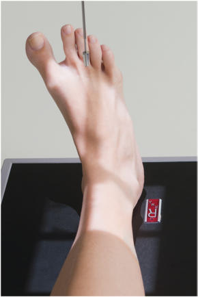
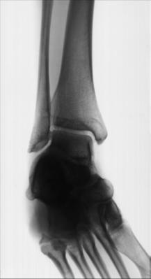
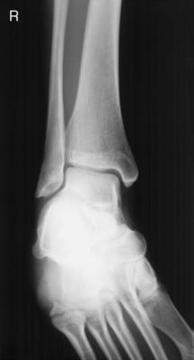

# Rx gleznă (articulație talocrurală) — incidență AP pentru mortază, cu rotație medială de 15°-20°

  📷 Radiografie Convențională (Rx)
  <strong>Actualizat:</strong> 2026-09-15
  <strong>Autor:</strong> Departamentul de Radiologie / Referință Bontrager

---

-   __1. Rezumat Clinic & Indicații__

    ---

    === "Indicații Clinice"

        - Evaluarea patologiei care implică întreaga scoabă tibioperonieră a gleznei (articulația talocrurală)[1] și porțiunea proximală a celui de-al cincilea metatarsian, o localizare frecventă a suspiciunii de fractură. Această incidență se efectuează frecvent în timpul intervențiilor de reducere deschisă la nivelul gleznei (articulația talocrurală) (vezi [fragment trunchiat în sursă]).

    === "Ghid Național IRIS"

        !!! info "Referință Primară: Ghidul Național IRIS (Ordinul MS 1342/2012)"
            - **Capitol Ghid IRIS:** *Aparat locomotor & Membru inferior*
            - **Grad de Recomandare:** **Grad A**
            - **Nivel de Iradiere Estimată:** `Clasa 1 (Minimă < 0.01 mSv)`

            [:octicons-search-16: Deschide Ghidul IRIS](../../iris.md){ .md-button .md-button--primary } [:material-open-in-new: Aplicația Oficială PWA](https://radiologie-pediatrica.ro/iris/){ .md-button target="_blank" rel="noopener" }

-   __2. Poziționare & Centrare Fascicul__

    ---

    - **Poziție Pacient:** Pacient: Așezați pacientul în decubit dorsal; plasați o pernă sub capul pacientului; membrele inferioare trebuie să fie complet extinse.; Regiune anatomică: Centrați și aliniați articulația gleznei la raza centrală și la axa longitudinală a porțiunii receptorului de imagine expuse (Fig. 6.84). Nu dorsiflectați piciorul; permiteți piciorului să rămână în poziție naturală extinsă (flectată plantar) (permite vizualizarea bazei metatarsianului V, sediu frecvent suspectat de fractură).5 Rotiți intern întregul membru inferior și piciorul cu aproximativ 15° până la 20°, până când linia intermalleolară este paralelă cu receptorul de imagine. Plasați un suport împotriva piciorului, dacă este necesar, pentru a preveni mișcarea.
    - **Punct de Centrare Fascicul:** perpendicular pe receptorul de imagine, orientat la jumătatea distanței dintre maleole
    - **Distanță Focar-Film (DFF / SID):** 100 cm
    - **Comandă Respiratorie:** Apnee pe durata expunerii (sau conform cooperării pacientului)

-   __3. Parametri Tehnici Expunere__

    ---

    | Parametru Tehnic | Valoare Configurare Generator / Tub |
    |:-----------------|:-------------------------------------|
    | **Tensiune Tub (kV)** | 60-75 kV |
    | **Sarcină / Produs Curent-Timp (mAs)** | DE CONFIGURAT PE APARAT |
    | **Distanță Focar-Film (DFF / SID)** | 100 cm |
    | **Grilă Antidifuzoare (Bucky)** | Fără grilă (expunere directă) |
    | **Dimensiune Focar** | Focar Mic (0.6 mm) |
    | **Camere de Ionizare AEC** | DE CONFIGURAT PE APARAT |
    | **Colimare Fascicul** | Colimați până la marginile cutanate laterale, incluzând oasele metatarsiene proximale și tibiafibula distală. |
    | **Filtrare Tub** | Totală ≥ 2.5 mm Al echivalent |

-   __4. Criterii de Calitate & Reușită Imagine__

    ---

    - treimea distală a tibiei și fibulei, plafonul tibial cu epifiza, dacă este prezentă, maleolele laterală și medială, astragalul (talusul) și jumătatea proximală a oaselor metatarsiene trebuie să fie evidențiate.
    - Întreaga mortază a gleznei trebuie să fie deschisă și bine vizualizată (un spațiu de 3 până la 4 mm pe întreaga suprafață talară este normal; o lărgire suplimentară de 2 mm este anormală)2 (Figs. 6.85 și 6.86). poziție:
    - Oblicitatea corectă pentru articulația mortazei este evidențiată prin demonstrarea articulațiilor mortazei laterală și medială deschise, cu maleolele evidențiate în profil.
    - Trebuie să existe doar o suprapunere minimă la nivelul articulației tibiofibulare distale.
    - Colimare la aria de interes diagnostic. Expunere:
    - fără mișcare, după cum evidențiază contururile osoase nete și reperele trabeculare.
    - expunere optimă a receptorului de imagine și contrast suficient pentru evidențierea structurilor părților moi și expunere suficientă pentru astragal (talus), tibia distală și fibulă.

-   __5. Protecție Radiologică (ALARA)__

    ---

    - Ecranare gonadică și a organelor radiosensibile conform procedurilor locale de radioprotecție ALARA.
    - Colimare strictă la aria de interes pentru limitarea radiației difuze.
    - Verificarea posibilității unei sarcini la pacientele de vârstă fertilă înainte de expunere.

!!! note "Observații Clinice & Tehnice"
    Această poziție nu trebuie să înlocuiască poziția antero-posterioară (AP) sau oblică a gleznei (articulația talocrurală), ci trebuie să constituie o incidență separată a gleznei, efectuată de rutină în cazul unui posibil traumatism acut / în regim de urgență sau al entorselor articulației gleznei.[1] Gleznă (articulația talocrurală) — INCIDENȚE DE RUTINĂ: AP, AP pentru scoaba tibioperonieră (15°), profil; SPECIALE: oblică (45°), AP de stres. Fig. 6.84 Incidență pentru scoaba tibioperonieră, evidențiind rotația internă (medială) de 15° la 20° a gambei și piciorului. Fig. 6.85 Incidență pentru scoaba tibioperonieră. Astragal (talus), maleolă medială (tibială), plafon tibial, articulație tibiofibulară distală, scoaba tibioperonieră a gleznei (articulația talocrurală), maleolă laterală (fibulară), suspiciune de fractură la baza celui de-al 5-lea metatarsian. Fig. 6.86 Incidență pentru scoaba tibioperonieră.

### 🖼️ Imagini

<figure class="protocol-image-card" markdown>

<figcaption><strong>Fig. 6.84 Incidență pentru mortază, evidențiind 15° până la 20° medial.</strong> — Poziționarea pacientului conform Ghidului Bontrager (Fig. 6.84 Incidență pentru mortază, evidențiind 15° până la 20° medial)</figcaption>

</figure>

<figure class="protocol-image-card" markdown>

<figcaption><strong>Fig. 6.85 Incidență pentru mortază.</strong> — Aspect radiografic de referință conform Ghidului Bontrager (Fig. 6.85 Incidență pentru mortază.)</figcaption>

</figure>

<figure class="protocol-image-card" markdown>

<figcaption><strong>Fig. 6.86 Incidență pentru mortază.</strong> — Aspect radiografic de referință conform Ghidului Bontrager (Fig. 6.86 Incidență pentru mortază.)</figcaption>

</figure>

=== "Ghid Rapid de Execuție"

    1. **Identificarea și verificarea pacientului:** verificare identitate, zonă de examinat, consimțământ conform procedurii și evaluarea posibilității unei sarcini, când este relevantă.
    2. **Pregătire:** îndepărtarea oricăror obiecte radiopace (bijuterii, agrafe, fermoare, proteze, pansamente dense).
    3. **Poziționare precisă:** alinierea receptorului de imagine și a tubului la distanța prescrisă (100 cm).
    4. **Colimare strictă:** adaptarea fasciculului strict la regiunea de diagnostic pentru scăderea iradierii și reducerea radiației difuze.
    5. **Radioprotecție:** verificarea [politicii RX](../radioprotectie.md), cu măsuri distincte pentru pacient, personal și însoțitor.

## Surse de documentare

- [Bontrager's Textbook of Radiographic Positioning (Ed. 9/10), Pagina 255](https://www.elsevier.com/books/textbook-of-radiographic-positioning-and-related-anatomy/lampignano/978-0-323-65367-1)
