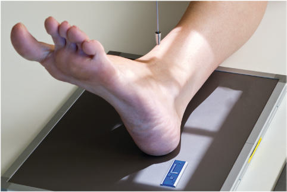
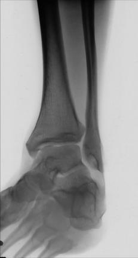
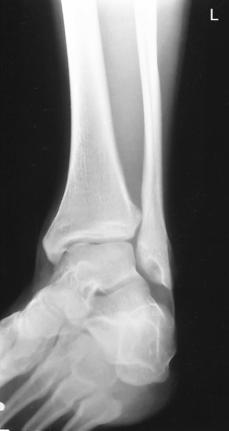

# Rx 45° Rotație Internă (Medială) AP Oblică (Gleznă (Articulație Talocrurală))

  📷 Radiografie Convențională (Rx)
  <strong>Actualizat:</strong> 2026-09-15
  <strong>Autor:</strong> Departamentul de Radiologie / Referință Bontrager

---

-   __1. Rezumat Clinic & Indicații__

    ---

    === "Indicații Clinice"

        - Pathologies including possible suspiciune de fractură involving distal tibiofibular articulație
        - suspiciune de fractură de distal fibula și maleolă laterală (fibulară) și base de fifth metatarsal

    === "Ghid Național IRIS"

        !!! info "Referință Primară: Ghidul Național IRIS (Ordinul MS 1342/2012)"
            - **Capitol Ghid IRIS:** *Ghidul Național IRIS*
            - **Grad de Recomandare:** **De verificat pe indicație; fără grad atribuit automat**
            - **Nivel de Iradiere Estimată:** `De verificat pentru examinarea și populația selectate`

            [:octicons-search-16: Deschide Ghidul IRIS](../../iris.md){ .md-button .md-button--primary } [:material-open-in-new: Aplicația Oficială PWA](https://radiologie-pediatrica.ro/iris/){ .md-button target="_blank" rel="noopener" }
-   __2. Poziționare & Centrare Fascicul__

    ---

    - **Poziție Pacient:** Pacient: Place pacient în Decubit dorsal poziție; place pillow under pacient’s cap; membre inferioare trebuie să fie fully extins (small săculeți cu nisip sau other support under Genunchi increases comfort de pacient).; Regiune anatomică: Center și align Gleznă (Articulație Talocrurală) articulație la raza centrală și la axa longitudinală de portion de receptorul de imagine being exposed (Fig. 6.87). If pacient’s condition allows, dorsiflex Picior if needed astfel încât plantar surface este la least 80° la 85° de la receptorul de imagine (10° la 15° de la vertical). (See NOTE 1.) Rotate membru inferior și Picior medially 45°.
    - **Punct de Centrare Fascicul:** perpendicular pe receptorul de imagine, orientat la point midway între malleoli
    - **Distanță Focar-Film (DFF / SID):** 100 cm
    - **Comandă Respiratorie:** Apnee pe durata expunerii (sau conform cooperării pacientului)

-   __3. Parametri Tehnici Expunere__

    ---

    | Parametru Tehnic | Valoare Configurare Generator / Tub |
    |:-----------------|:-------------------------------------|
    | **Tensiune Tub (kV)** | 60-75 kV |
    | **Sarcină / Produs Curent-Timp (mAs)** | DE CONFIGURAT PE APARAT |
    | **Distanță Focar-Film (DFF / SID)** | 100 cm |
    | **Grilă Antidifuzoare (Bucky)** | Fără grilă (expunere directă) |
    | **Dimensiune Focar** | Focar Mic (0.6 mm) |
    | **Camere de Ionizare AEC** | DE CONFIGURAT PE APARAT |
    | **Colimare Fascicul** | Collimate la include distal tibia și fibula la midmetatarsal area (see NOTE 2). |
    | **Filtrare Tub** | Totală ≥ 2.5 mm Al echivalent |

-   __4. Criterii de Calitate & Reușită Imagine__

    ---

    - distal onethird de Gambă, malleoli, astragal (talus), și proximal half de oase metatarsiene trebuie să fie seen (Figs. 6.88 și 6.89). poziție:
    - A 45° medial oblic evidențiază distal tibiofibular articulație open, cu fără sau only minimal overlap pe average person.
    - maleolă laterală (fibulară) și astragal (talus) articulație trebuie să show fără sau only slight superimposition, but maleolă medială (tibială) și astragal (talus) sunt partially superimposed.
    - Gleznă (Articulație Talocrurală) articulație trebuie să fie în center de foursided câmp colimat cu distal onethird de Gambă la proximal half de oase metatarsiene și surrounding soft tissues included. expunere:
    - optim receptorul de imagine expunere și contrast la evidențiază bony cortical margins și trabecular patterns trebuie să fie sharply defined pe imagine if fără mișcare este present.
    - astragal (talus) trebuie să fie sufficiently penetrated la evidențiază trabeculae; părți moi structures also trebuie să fie evident. Gleznă (Articulație Talocrurală) ROUTINE
    - AP
    - AP mortise (15°)
    - lateral SPECIAL
    - oblic (45°)
    - AP stress Fig. 6.88 45° AP medial oblic. (Courtesy E. Frank, RT[R], FASRT.) maleolă medială (tibială) distal tibiofibular articulație maleolă laterală (fibulară) L Base de 5th metatarsal astragal (talus) Calcaneu Fig. 6.89 45° AP medial oblic. (Courtesy E. Frank, RT[R], FASRT.)

-   __5. Protecție Radiologică (ALARA)__

    ---

    - Ecranare gonadică și a organelor radiosensibile conform procedurilor locale de radioprotecție ALARA.
    - Colimare strictă la aria de interes pentru limitarea radiației difuze.
    - Verificarea posibilității unei sarcini la pacientele de vârstă fertilă înainte de expunere.

!!! note "Observații Clinice & Tehnice"
    base de fifth metatarsal (common suspiciune de fractură site) poate fie evidențiat în this incidență și trebuie să fie included în collimation field. If suspiciune de fractură de fifth metatarsal este suspected, Picior series trebuie să fie ordered prin physician. Fig. 6.87 45° AP medial oblic.

### 🖼️ Imagini

<figure class="protocol-image-card" markdown>

<figcaption><strong>Fig. 6.87 45° AP medial oblic.</strong> — Poziționare pacient conform Ghidului Bontrager (Fig. 6.87 45° AP medial oblic.)</figcaption>

</figure>

<figure class="protocol-image-card" markdown>

<figcaption><strong>Fig. 6.88 45° AP medial oblic.</strong> — Aspect radiografic de referință conform Ghidului Bontrager (Fig. 6.88 45° AP medial oblic.)</figcaption>

</figure>

<figure class="protocol-image-card" markdown>

<figcaption><strong>Fig. 6.89 45° AP medial</strong> — Aspect radiografic de referință conform Ghidului Bontrager (Fig. 6.89 45° AP medial)</figcaption>

</figure>

=== "Ghid Rapid de Execuție"

    1. **Identificarea și verificarea pacientului:** verificare identitate, zonă de examinat, consimțământ conform procedurii și evaluarea posibilității unei sarcini, când este relevantă.
    2. **Pregătire:** îndepărtarea oricăror obiecte radiopace (bijuterii, agrafe, fermoare, proteze, pansamente dense).
    3. **Poziționare precisă:** alinierea receptorului de imagine și a tubului la distanța prescrisă (100 cm).
    4. **Colimare strictă:** adaptarea fasciculului strict la regiunea de diagnostic pentru scăderea iradierii și reducerea radiației difuze.
    5. **Radioprotecție:** verificarea [politicii RX](../radioprotectie.md), cu măsuri distincte pentru pacient, personal și însoțitor.

## Surse de documentare

- [Bontrager's Textbook of Radiographic Positioning (Ed. 9/10), Pagina 256](https://www.elsevier.com/books/textbook-of-radiographic-positioning-and-related-anatomy/lampignano/978-0-323-65367-1)
