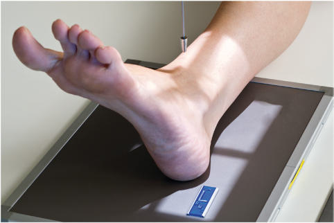
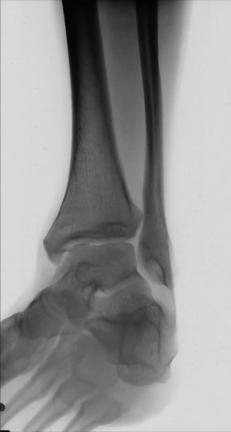
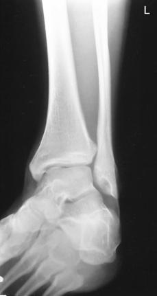

# Rx rotație internă (medială) la 45°, incidență AP oblică (gleznă [articulație talocrurală])

  📷 Radiografie Convențională (Rx)
  <strong>Actualizat:</strong> 2026-09-15
  <strong>Autor:</strong> Departamentul de Radiologie / Referință Bontrager

---

-   __1. Rezumat Clinic & Indicații__

    ---

    === "Indicații Clinice"

        - Patologii, inclusiv suspiciunea posibilă de fractură care implică articulația tibiofibulară distală
        - suspiciune de fractură a fibulei distale și a maleolei laterale (fibulare) și a bazei celui de-al cincilea metatarsian

    === "Ghid Național IRIS"

        !!! info "Referință Primară: Ghidul Național IRIS (Ordinul MS 1342/2012)"
            - **Capitol Ghid IRIS:** *Aparat locomotor & Membru inferior*
            - **Grad de Recomandare:** **Grad A**
            - **Nivel de Iradiere Estimată:** `Clasa 1 (Minimă < 0.01 mSv)`

            [:octicons-search-16: Deschide Ghidul IRIS](../../iris.md){ .md-button .md-button--primary } [:material-open-in-new: Aplicația Oficială PWA](https://radiologie-pediatrica.ro/iris/){ .md-button target="_blank" rel="noopener" }

-   __2. Poziționare & Centrare Fascicul__

    ---

    - **Poziție Pacient:** Pacient: Așezați pacientul în decubit dorsal; așezați o pernă sub capul pacientului; membrele inferioare trebuie să fie complet extinse (săculeții mici cu nisip sau alt suport sub genunchi cresc confortul pacientului).; Regiune anatomică: Centrați și aliniați articulația gleznei (talocrurală) la raza centrală și la axa longitudinală a porțiunii receptorului de imagine expuse (Fig. 6.87). Dacă starea pacientului permite, efectuați dorsiflexia piciorului, dacă este necesar, astfel încât suprafața plantară să fie la cel puțin 80° până la 85° față de receptorul de imagine (10° până la 15° față de verticală). (Consultați NOTA 1.) Rotiți membrul inferior și piciorul medial la 45°.
    - **Punct de Centrare Fascicul:** perpendicular pe receptorul de imagine, orientat la punctul situat la jumătatea distanței dintre maleole
    - **Distanță Focar-Film (DFF / SID):** 100 cm
    - **Comandă Respiratorie:** Apnee pe durata expunerii (sau conform cooperării pacientului)

-   __3. Parametri Tehnici Expunere__

    ---

    | Parametru Tehnic | Valoare Configurare Generator / Tub |
    |:-----------------|:-------------------------------------|
    | **Tensiune Tub (kV)** | 60-75 kV |
    | **Sarcină / Produs Curent-Timp (mAs)** | DE CONFIGURAT PE APARAT |
    | **Distanță Focar-Film (DFF / SID)** | 100 cm |
    | **Grilă Antidifuzoare (Bucky)** | Fără grilă (expunere directă) |
    | **Dimensiune Focar** | Focar Mic (0.6 mm) |
    | **Camere de Ionizare AEC** | DE CONFIGURAT PE APARAT |
    | **Colimare Fascicul** | Colimați pentru a include tibia și fibula distale până la regiunea metatarsiană mijlocie (consultați NOTA 2). |
    | **Filtrare Tub** | Totală ≥ 2.5 mm Al echivalent |

-   __4. Criterii de Calitate & Reușită Imagine__

    ---

    - treimea distală a gambei, maleolele, astragalul (talusul) și jumătatea proximală a oaselor metatarsiene trebuie să fie vizibile (Fig. 6.88 și 6.89). poziție:
    - O incidență oblică medială la 45° evidențiază articulația tibiofibulară distală deschisă, fără suprapunere sau cu suprapunere minimă la persoana medie.
    - maleola laterală (fibulară) și astragalul (talusul) trebuie să prezinte absența suprapunerii sau doar o ușoară suprapunere, dar maleola medială (tibială) și astragalul (talusul) sunt parțial suprapuse.
    - Articulația gleznei (talocrurală) trebuie să fie în centrul unui câmp colimat cu patru laturi, de la treimea distală a gambei până la jumătatea proximală a oaselor metatarsiene, incluzând țesuturile moi înconjurătoare. expunere:
    - expunerea optimă a receptorului de imagine și contrastul astfel încât marginile corticale osoase și modelele trabeculare să fie clar definite pe imagine, dacă este prezentă mișcare absentă.
    - astragalul (talusul) trebuie să fie suficient penetrat pentru evidențierea trabeculelor; structurile părților moi trebuie, de asemenea, să fie vizibile. GLEZNĂ (ARTICULAȚIE TALOCRURALĂ) DE RUTINĂ
    - AP
    - AP pentru mortază (15°)
    - profil SPECIALĂ
    - oblică (45°)
    - AP în stres Fig. 6.88 Incidență AP oblică medială la 45°. (Cu amabilitatea lui E. Frank, RT[R], FASRT.) maleolă medială (tibială) articulație tibiofibulară distală maleolă laterală (fibulară) L Baza celui de-al 5-lea metatarsian astragal (talus) calcaneu Fig. 6.89 Incidență AP oblică medială la 45°. (Cu amabilitatea lui E. Frank, RT[R], FASRT.)

-   __5. Protecție Radiologică (ALARA)__

    ---

    - Ecranare gonadică și a organelor radiosensibile conform procedurilor locale de radioprotecție ALARA.
    - Colimare strictă la aria de interes pentru limitarea radiației difuze.
    - Verificarea posibilității unei sarcini la pacientele de vârstă fertilă înainte de expunere.

!!! note "Observații Clinice & Tehnice"
    baza celui de-al cincilea metatarsian (sediu frecvent al suspiciunii de fractură) poate fi evidențiată în această incidență și trebuie inclusă în câmpul de colimare. Dacă există suspiciune de fractură a celui de-al cincilea metatarsian, medicul trebuie să solicite seria de radiografii a piciorului. Fig. 6.87 Incidență AP oblică medială la 45°.

### 🖼️ Imagini

<figure class="protocol-image-card" markdown>

<figcaption><strong>Fig. 6.87 Incidență AP oblică medială la 45°.</strong> — Poziționarea pacientului conform Ghidului Bontrager (Fig. 6.87 Incidență AP oblică medială la 45°.)</figcaption>

</figure>

<figure class="protocol-image-card" markdown>

<figcaption><strong>Fig. 6.88 Incidență AP oblică medială la 45°.</strong> — Aspect radiografic de referință conform Ghidului Bontrager (Fig. 6.88 Incidență AP oblică medială la 45°.)</figcaption>

</figure>

<figure class="protocol-image-card" markdown>

<figcaption><strong>Fig. 6.89 Incidență AP medială la 45°</strong> — Aspect radiografic de referință conform Ghidului Bontrager (Fig. 6.89 Incidență AP medială la 45°)</figcaption>

</figure>

=== "Ghid Rapid de Execuție"

    1. **Identificarea și verificarea pacientului:** verificare identitate, zonă de examinat, consimțământ conform procedurii și evaluarea posibilității unei sarcini, când este relevantă.
    2. **Pregătire:** îndepărtarea oricăror obiecte radiopace (bijuterii, agrafe, fermoare, proteze, pansamente dense).
    3. **Poziționare precisă:** alinierea receptorului de imagine și a tubului la distanța prescrisă (100 cm).
    4. **Colimare strictă:** adaptarea fasciculului strict la regiunea de diagnostic pentru scăderea iradierii și reducerea radiației difuze.
    5. **Radioprotecție:** verificarea [politicii RX](../radioprotectie.md), cu măsuri distincte pentru pacient, personal și însoțitor.

## Surse de documentare

- [Bontrager's Textbook of Radiographic Positioning (Ed. 9/10), Pagina 256](https://www.elsevier.com/books/textbook-of-radiographic-positioning-and-related-anatomy/lampignano/978-0-323-65367-1)
