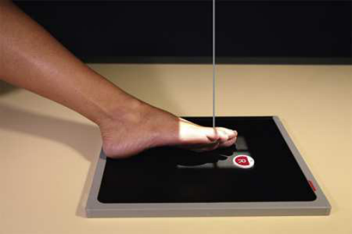
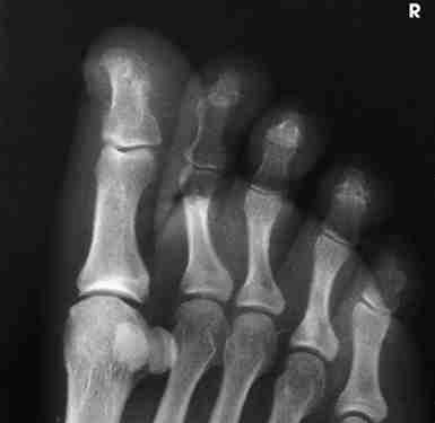
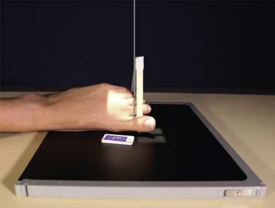

# Rx Membru Inferior — Oblică Antero-Posterioară (AP) — Rotație Internă (Medială) (Merrill)

  📷 Radiografie Convențională (Rx)
  <strong>Actualizat:</strong> 2026-09-16
  <strong>Autor:</strong> Referință Merrill

---

-   __1. Rezumat Clinic & Indicații__

    ---

    === "Indicații Clinice"

        - Conform reperelor anatomice standard din tratat

    === "Ghid Național IRIS"

        !!! info "Referință Primară: Ghidul Național IRIS (Ordinul MS 1342/2012)"
            - **Capitol Ghid IRIS:** *Ghidul Național IRIS*
            - **Grad de Recomandare:** **De verificat pe indicație; fără grad atribuit automat**
            - **Nivel de Iradiere Estimată:** `De verificat pentru examinarea și populația selectate`

            [:octicons-search-16: Deschide Ghidul IRIS](../../iris.md){ .md-button .md-button--primary } [:material-open-in-new: Aplicația Oficială PWA](https://radiologie-pediatrica.ro/iris/){ .md-button target="_blank" rel="noopener" }
-   __2. Poziționare & Centrare Fascicul__

    ---

    - **Poziție Pacient:** se așază pacientul în Decubit dorsal sau Poziție Șezândă poziție pe masa radiologică. se flectează Genunchi de afected side enough la have sole de Picior resting firmly pe masa de examinare.; poziție receptorul de imagine under Degete Picior. Medially se rotește Gambă și Picior și se ajustează plantar surface de Picior la form a 30- la 45-grade angle de la plane de receptorul de imagine (Fig. 7.22). se centrează Degete Picior la receptorul de imagine. se efectuează ecranarea gonadelor cu șorț plumbat.
    - **Punct de Centrare Fascicul:** perpendicular și entering third articulații metatarsofalangiene (MTF).
    - **Distanță Focar-Film (DFF / SID):** Nespecificat în fragmentul extras; de verificat în sursă
    - **Comandă Respiratorie:** Conform reperelor anatomice standard din tratat

-   __3. Parametri Tehnici Expunere__

    ---

    | Parametru Tehnic | Valoare Configurare Generator / Tub |
    |:-----------------|:-------------------------------------|
    | **Tensiune Tub (kV)** | DE CONFIGURAT PE APARAT |
    | **Sarcină / Produs Curent-Timp (mAs)** | DE CONFIGURAT PE APARAT |
    | **Distanță Focar-Film (DFF / SID)** | Nespecificat în fragmentul extras; de verificat în sursă |
    | **Grilă Antidifuzoare (Bucky)** | DE CONFIGURAT PE APARAT |
    | **Dimensiune Focar** | DE CONFIGURAT PE APARAT |
    | **Camere de Ionizare AEC** | DE CONFIGURAT PE APARAT |
    | **Colimare Fascicul** | se ajustează câmp de iradiere la 1 inch (2.5 cm) pe toate sides de Degete Picior, including 1 inch (2.5 cm) proximal la articulații metatarsofalangiene (MTF). Se plasează markerul de lateralitate în câmpul colimat. |
    | **Filtrare Tub** | DE CONFIGURAT PE APARAT |

-   __4. Criterii de Calitate & Reușită Imagine__

    ---

    - Criterii radiologice de calitate imaginii:
    - Evidence de corect collimation și presence de marker de lateralitate (D/S) plasat clear de anatomy de interest
    - Entire Degete Picior, including distal ends de oase metatarsiene
    - Degete Picior separated de la fiecare other
    - corect rotație de Degete Picior, ca evidențiat prin more părți moi width și more midshaft concavity pe ridicat side
    - Open interphalangeal și second through fifth articulații metatarsofalangiene (MTF) spaces
    - First articulații metatarsofalangiene (MTF) (nu always opened)
    - Bony detalii trabeculare osoase și surrounding soft tissues

-   __5. Protecție Radiologică (ALARA)__

    ---

    - Nespecificat în fragmentul extras; de verificat în sursă

!!! note "Observații Clinice & Tehnice"
    oblic incidențe de individual Degete Picior poate fie obtained prin centering afected toe la portion de receptorul de imagine being used și collimating closely. Picior poate fie plasat în medial Incidență Oblică pentru first și second Degete Picior și în lateral Incidență Oblică pentru fourth și fifth Degete Picior. Either Incidență Oblică este adecvat pentru third (middle) toe.

### 🖼️ Imagini

<figure class="protocol-image-card" markdown>

<figcaption><strong>Merrill — pagina PDF 467, imaginea 1</strong> — Imagine din fragmentul sursă; asocierea necesită revizie.</figcaption>

</figure>

<figure class="protocol-image-card" markdown>

<figcaption><strong>Merrill — pagina PDF 468, imaginea 2</strong> — Imagine din fragmentul sursă; asocierea necesită revizie.</figcaption>

</figure>

<figure class="protocol-image-card" markdown>

<figcaption><strong>Merrill — pagina PDF 468, imaginea 3</strong> — Imagine din fragmentul sursă; asocierea necesită revizie.</figcaption>

</figure>

=== "Ghid Rapid de Execuție"

    1. **Identificarea și verificarea pacientului:** verificare identitate, zonă de examinat, consimțământ conform procedurii și evaluarea posibilității unei sarcini, când este relevantă.
    2. **Pregătire:** îndepărtarea oricăror obiecte radiopace (bijuterii, agrafe, fermoare, proteze, pansamente dense).
    3. **Poziționare precisă:** alinierea receptorului de imagine și a tubului la distanța prescrisă (Nespecificat în fragmentul extras; de verificat în sursă).
    4. **Colimare strictă:** adaptarea fasciculului strict la regiunea de diagnostic pentru scăderea iradierii și reducerea radiației difuze.
    5. **Radioprotecție:** verificarea [politicii RX](../radioprotectie.md), cu măsuri distincte pentru pacient, personal și însoțitor.

## Surse de documentare

- [Merrill’s Atlas, 7. Lower Extremity, pagini PDF 466–468](../../assets/protocols/sources/a56d45c16829_Merrills_Atlas_of_Radiographic_Positioning__Procedures_3Vol_Set.pdf#page=466)

## Fragmente sursă traduse (referință tehnică)

### anatomy

AP oblic incidență de falange shows toes și distal portion de oase metatarsiene rotit medially (Fig. 7.23).

### collimation

• se ajustează câmp de iradiere la 1 inch (2.5 cm) pe toate sides de toes, including 1 inch (2.5 cm) proximal la articulații metatarsofalangiene (MTF). Place side
marker în collimated expunere field.

### cr

• perpendicular și entering third articulații metatarsofalangiene (MTF).

### criteria

Criterii radiologice de calitate imaginii:
• Evidence de corect collimation și presence de marker de lateralitate (D/S) plasat clear de anatomy de interest
• Entire toes, including distal ends de oase metatarsiene
• Toes separated de la fiecare other
• corect rotație de toes, ca evidențiat prin more părți moi width și more midshaft concavity pe ridicat side
• Open interphalangeal și second through fifth articulații metatarsofalangiene (MTF) spaces
• First articulații metatarsofalangiene (MTF) (nu always opened)
• Bony detalii trabeculare osoase și surrounding soft tissues

### notes

oblic incidențe de individual toes poate fie obtained prin centering afected toe la portion de receptorul de imagine being used și
collimating closely. picior poate fie plasat în medial oblic poziție pentru first și second toes și în lateral oblic poziție pentru fourth și fifth toes. Either oblic poziție este adecvat pentru third (middle) toe.

### part_pos

• poziție receptorul de imagine under toes.
• Medially se rotește lower membru inferior și picior și se ajustează plantar surface de picior la form a 30- la 45-grade angle de la plane de receptorul de imagine (Fig. 7.22).
• se centrează toes la receptorul de imagine.
• se efectuează ecranarea gonadelor cu șorț plumbat.

### patient_pos

• se așază pacientul în decubit dorsal sau așezat pe scaun poziție pe masa radiologică.
• se flectează genunchi de afected side enough la have sole de picior resting firmly pe masa de examinare.

### tech

poziționat prin manufacturer sau department protocol pentru corect anatomy display orientation; raza centrală plate: 10 × 12 inches (24 ×30 cm) longitudinal.

