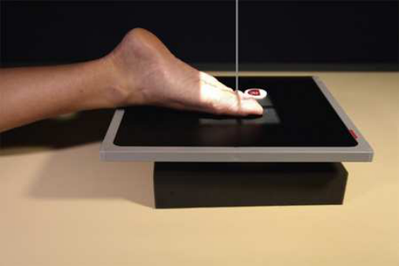
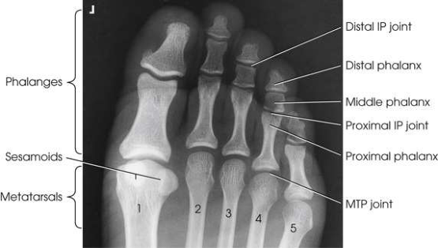

# Rx Membru Inferior — Incidență Postero-Anterioară (PA) (Merrill)

  📷 Radiografie Convențională (Rx)
  <strong>Actualizat:</strong> 2026-09-16
  <strong>Autor:</strong> Referință Merrill

---

-   __1. Rezumat Clinic & Indicații__

    ---

    === "Indicații Clinice"

        - Conform reperelor anatomice standard din tratat

    === "Ghid Național IRIS"

        !!! info "Referință Primară: Ghidul Național IRIS (Ordinul MS 1342/2012)"
            - **Capitol Ghid IRIS:** *Ghidul Național IRIS*
            - **Grad de Recomandare:** **De verificat pe indicație; fără grad atribuit automat**
            - **Nivel de Iradiere Estimată:** `De verificat pentru examinarea și populația selectate`

            [:octicons-search-16: Deschide Ghidul IRIS](../../iris.md){ .md-button .md-button--primary } [:material-open-in-new: Aplicația Oficială PWA](https://radiologie-pediatrica.ro/iris/){ .md-button target="_blank" rel="noopener" }
-   __2. Poziționare & Centrare Fascicul__

    ---

    - **Poziție Pacient:** Se instruiește pacientul să lie Decubit ventral pe masa radiologică because this poziție naturally turns Picior over astfel încât dorsal aspect este în contact cu receptorul de imagine.; Place Degete Picior în appropriate poziție prin elevating them pe one sau two small săculeți cu nisip și adjusting support la place Degete Picior horizontally. Place receptorul de imagine under Degete Picior cu linia mediană paralel cu axa longitudinală de Picior, și centrat pe third articulații metatarsofalangiene (MTF) (Fig. 7.20).
    - **Punct de Centrare Fascicul:** perpendicular pe midpoint de receptorul de imagine entering third articulații metatarsofalangiene (MTF) (see Fig. 7.20). articulații interfalangiene (IF) spaces sunt vizualizat well because natural divergence de x-ray fascicul coincides closely cu poziție de Degete Picior (Fig. 7.21).
    - **Distanță Focar-Film (DFF / SID):** Nespecificat în fragmentul extras; de verificat în sursă
    - **Comandă Respiratorie:** Conform reperelor anatomice standard din tratat

-   __3. Parametri Tehnici Expunere__

    ---

    | Parametru Tehnic | Valoare Configurare Generator / Tub |
    |:-----------------|:-------------------------------------|
    | **Tensiune Tub (kV)** | DE CONFIGURAT PE APARAT |
    | **Sarcină / Produs Curent-Timp (mAs)** | DE CONFIGURAT PE APARAT |
    | **Distanță Focar-Film (DFF / SID)** | Nespecificat în fragmentul extras; de verificat în sursă |
    | **Grilă Antidifuzoare (Bucky)** | DE CONFIGURAT PE APARAT |
    | **Dimensiune Focar** | DE CONFIGURAT PE APARAT |
    | **Camere de Ionizare AEC** | DE CONFIGURAT PE APARAT |
    | **Colimare Fascicul** | se ajustează câmp de iradiere la 1 inch (2.5 cm) pe toate sides de Degete Picior, including 1 inch (2.5 cm) proximal la articulații metatarsofalangiene (MTF). Se plasează markerul de lateralitate în câmpul colimat. |
    | **Filtrare Tub** | DE CONFIGURAT PE APARAT |

-   __4. Criterii de Calitate & Reușită Imagine__

    ---

    - Criterii radiologice de calitate imaginii:
    - Evidence de corect collimation și presence de marker de lateralitate (D/S) plasat clear de anatomy de interest
    - Entire Degete Picior, including distal ends de oase metatarsiene
    - Degete Picior separated de la fiecare other
    - Absența rotației anatomice (simetrie bilaterală perfectă) de falange; părți moi width și midshaft concavity equal pe ambele părți (bilateral)
    - Open interphalangeal și articulații metatarsofalangiene (MTF) spaces
    - Bony detalii trabeculare osoase și surrounding soft tissues

-   __5. Protecție Radiologică (ALARA)__

    ---

    - Nespecificat în fragmentul extras; de verificat în sursă

!!! note "Observații Clinice & Tehnice"
    Conform reperelor anatomice standard din tratat

### 🖼️ Imagini

<figure class="protocol-image-card" markdown>

<figcaption><strong>Merrill — pagina PDF 466, imaginea 1</strong> — Imagine din fragmentul sursă; asocierea necesită revizie.</figcaption>

</figure>

<figure class="protocol-image-card" markdown>

<figcaption><strong>Merrill — pagina PDF 466, imaginea 2</strong> — Imagine din fragmentul sursă; asocierea necesită revizie.</figcaption>

</figure>

=== "Ghid Rapid de Execuție"

    1. **Identificarea și verificarea pacientului:** verificare identitate, zonă de examinat, consimțământ conform procedurii și evaluarea posibilității unei sarcini, când este relevantă.
    2. **Pregătire:** îndepărtarea oricăror obiecte radiopace (bijuterii, agrafe, fermoare, proteze, pansamente dense).
    3. **Poziționare precisă:** alinierea receptorului de imagine și a tubului la distanța prescrisă (Nespecificat în fragmentul extras; de verificat în sursă).
    4. **Colimare strictă:** adaptarea fasciculului strict la regiunea de diagnostic pentru scăderea iradierii și reducerea radiației difuze.
    5. **Radioprotecție:** verificarea [politicii RX](../radioprotectie.md), cu măsuri distincte pentru pacient, personal și însoțitor.

## Surse de documentare

- [Merrill’s Atlas, 7. Lower Extremity, pagini PDF 465–466](../../assets/protocols/sources/a56d45c16829_Merrills_Atlas_of_Radiographic_Positioning__Procedures_3Vol_Set.pdf#page=465)

## Fragmente sursă traduse (referință tehnică)

### anatomy

14 falange de toes, articulații interfalangiene (IF), și distal portions de oase metatarsiene.

### collimation

• se ajustează câmp de iradiere la 1 inch (2.5 cm) pe toate sides de toes, including 1 inch (2.5 cm) proximal la articulații metatarsofalangiene (MTF). Place side
marker în collimated expunere field.

### cr

• perpendicular pe midpoint de receptorul de imagine entering third articulații metatarsofalangiene (MTF) (see Fig. 7.20). articulații interfalangiene (IF) spaces sunt vizualizat well because natural divergence de x-ray fascicul coincides closely cu poziție de toes (Fig. 7.21).

### criteria

Criterii radiologice de calitate imaginii:
• Evidence de corect collimation și presence de marker de lateralitate (D/S) plasat clear de anatomy de interest
• Entire toes, including distal ends de oase metatarsiene
• Toes separated de la fiecare other
• Absența rotației anatomice (simetrie bilaterală perfectă) de falange; părți moi width și midshaft concavity equal pe ambele părți (bilateral)
• Open interphalangeal și articulații metatarsofalangiene (MTF) spaces
• Bony detalii trabeculare osoase și surrounding soft tissues

### part_pos

• Place toes în appropriate poziție prin elevating them pe one sau two small săculeți cu nisip și adjusting support la place toes
horizontally.
Place receptorul de imagine under toes cu linia mediană paralel cu axa longitudinală de picior, și centrat pe third articulații metatarsofalangiene (MTF) (Fig. 7.20).

### patient_pos

• Se instruiește pacientul să lie în decubit ventral pe masa radiologică because this poziție naturally turns picior over astfel încât dorsal aspect este în
contact cu receptorul de imagine.

### tech

poziționat prin manufacturer sau department protocol pentru corect anatomy display orientation; raza centrală plate: 10 × 12 inches (24 × 30 cm) longitudinal.

