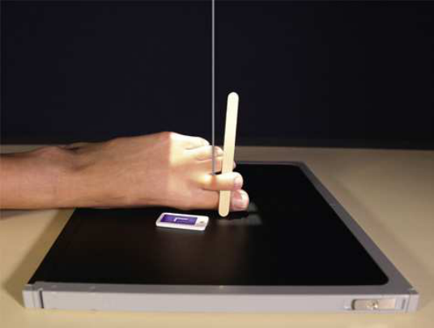
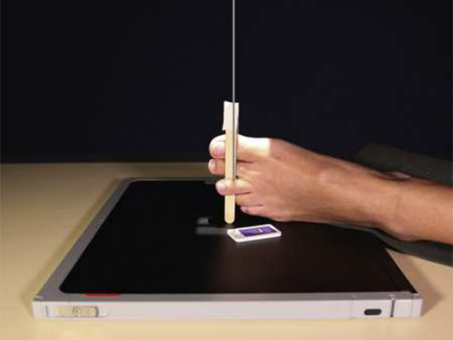
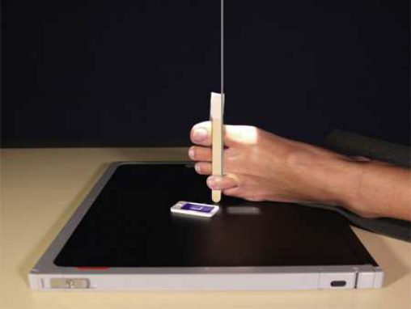
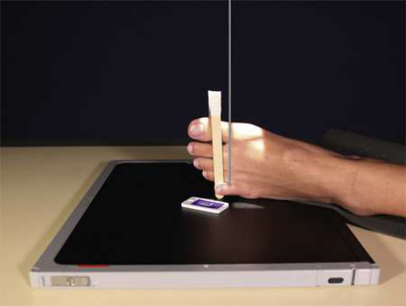
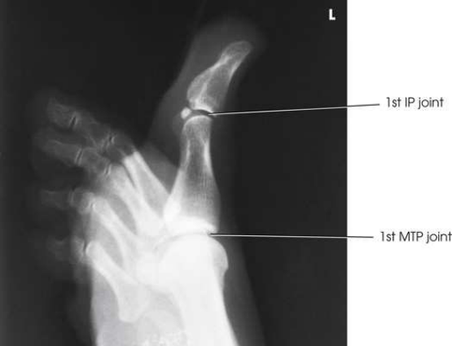
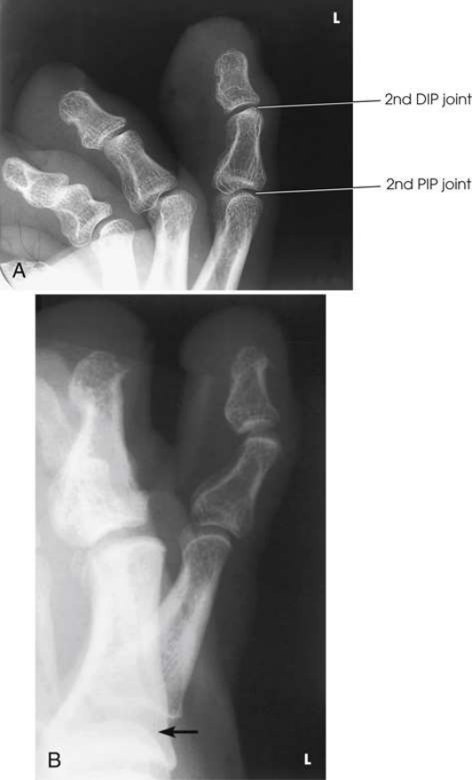
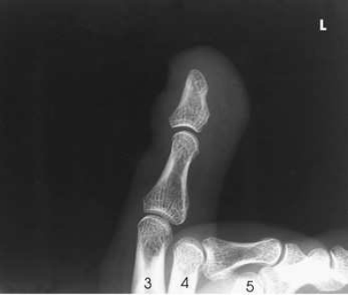
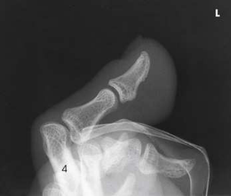

# Rx Membru Inferior — Lateral Incidență — Medio-Lateral or Latero-Medial (Merrill)

  📷 Radiografie Convențională (Rx)
  <strong>Actualizat:</strong> 2026-09-16
  <strong>Autor:</strong> Referință Merrill

---

-   __1. Rezumat Clinic & Indicații__

    ---

    === "Indicații Clinice"

        - Conform reperelor anatomice standard din tratat

    === "Ghid Național IRIS"

        !!! info "Referință Primară: Ghidul Național IRIS (Ordinul MS 1342/2012)"
            - **Capitol Ghid IRIS:** *Ghidul Național IRIS*
            - **Grad de Recomandare:** **De verificat pe indicație; fără grad atribuit automat**
            - **Nivel de Iradiere Estimată:** `De verificat pentru examinarea și populația selectate`

            [:octicons-search-16: Deschide Ghidul IRIS](../../iris.md){ .md-button .md-button--primary } [:material-open-in-new: Aplicația Oficială PWA](https://radiologie-pediatrica.ro/iris/){ .md-button target="_blank" rel="noopener" }
-   __2. Poziționare & Centrare Fascicul__

    ---

    - **Poziție Pacient:** Se instruiește pacientul să lie în lateral Decubit poziție. Support afected extremity pe săculeți cu nisip și adjust it în comfortable poziție. la prevent superimposition, tape Degete Picior above one being examined into flectat poziție; a 4 × 4-inch gauze pad also poate fie used la separate Degete Picior.; Great toe, second toe se poziționează pacientul pe unaffected side pentru these two Degete Picior. Place receptorul de imagine under medial side de Picior și center it la afected toe. Grasp pacientul’s extremity prin heel și Genunchi și adjust its poziție la place toe în true Incidență de Profil (lateral) (plane through articulații metatarsofalangiene (MTF) will fie perpendicular pe receptorul de imagine). se ajustează axa longitudinală de receptorul de imagine so that it este paralel cu axa longitudinală de toe (Figs. 7.24 și 7.25). Third, fourth, fifth Degete Picior se poziționează pacientul pe affected side pentru these three Degete Picior. Place receptorul de imagine under lateral side de Picior și center it la Degete Picior. Grasp pacient’s extremity prin heel și Genunchi și adjust its poziție la place Degete Picior în true Incidență de Profil (lateral) (plane through articulații metatarsofalangiene (MTF) este perpendicular pe receptorul de imagine). se ajustează axa longitudinală de receptorul de imagine so that it este paralel cu axa longitudinală de toe. Support ridicat heel pe săculeți cu nisip sau sponge pentru imobilizare (Figs. 7.26 through 7.28). se efectuează ecranarea gonadelor cu șorț plumbat.
    - **Punct de Centrare Fascicul:** perpendicular pe plane de receptorul de imagine, entering articulații interfalangiene (IF) de great toe sau proximal articulații interfalangiene (IF) de lesser Degete Picior.
    - **Distanță Focar-Film (DFF / SID):** Nespecificat în fragmentul extras; de verificat în sursă
    - **Comandă Respiratorie:** Conform reperelor anatomice standard din tratat

-   __3. Parametri Tehnici Expunere__

    ---

    | Parametru Tehnic | Valoare Configurare Generator / Tub |
    |:-----------------|:-------------------------------------|
    | **Tensiune Tub (kV)** | DE CONFIGURAT PE APARAT |
    | **Sarcină / Produs Curent-Timp (mAs)** | DE CONFIGURAT PE APARAT |
    | **Distanță Focar-Film (DFF / SID)** | Nespecificat în fragmentul extras; de verificat în sursă |
    | **Grilă Antidifuzoare (Bucky)** | DE CONFIGURAT PE APARAT |
    | **Dimensiune Focar** | DE CONFIGURAT PE APARAT |
    | **Camere de Ionizare AEC** | DE CONFIGURAT PE APARAT |
    | **Colimare Fascicul** | se ajustează câmp de iradiere la 1 inch (2.5 cm) pe toate sides de Degete Picior, including 1 inch (2.5 cm) proximal la articulații metatarsofalangiene (MTF). Se plasează markerul de lateralitate în câmpul colimat. |
    | **Filtrare Tub** | DE CONFIGURAT PE APARAT |

-   __4. Criterii de Calitate & Reușită Imagine__

    ---

    - Criterii radiologice de calitate imaginii:
    - Evidence de corect collimation și presence de marker de lateralitate (D/S) plasat clear de anatomy de interest
    - Entire toe, fără superimposition de adjacent Degete Picior; when superimposition cannot fie avoided, proximal phalanx trebuie să fie vizualizat
    - Toe(s) în true Incidență de Profil (lateral)
    - Toenail în profile, if visualized și normal
    - Concave, plantar surfaces de falange
    - Absența rotației anatomice (simetrie bilaterală perfectă) de falange
    - Open articulații interfalangiene (IF) spaces; articulații metatarsofalangiene (MTF) sunt overlapped but poate fie seen în some pacienți
    - Bony detalii trabeculare osoase și surrounding soft tissues

-   __5. Protecție Radiologică (ALARA)__

    ---

    - Nespecificat în fragmentul extras; de verificat în sursă

!!! note "Observații Clinice & Tehnice"
    Manipulate Degete Picior only if fără deformity este apparent.

### 🖼️ Imagini

<figure class="protocol-image-card" markdown>

<figcaption><strong>Merrill — pagina PDF 469, imaginea 1</strong> — Imagine din fragmentul sursă; asocierea necesită revizie.</figcaption>

</figure>

<figure class="protocol-image-card" markdown>

<figcaption><strong>Merrill — pagina PDF 469, imaginea 2</strong> — Imagine din fragmentul sursă; asocierea necesită revizie.</figcaption>

</figure>

<figure class="protocol-image-card" markdown>

<figcaption><strong>Merrill — pagina PDF 470, imaginea 3</strong> — Imagine din fragmentul sursă; asocierea necesită revizie.</figcaption>

</figure>

<figure class="protocol-image-card" markdown>

<figcaption><strong>Merrill — pagina PDF 471, imaginea 4</strong> — Imagine din fragmentul sursă; asocierea necesită revizie.</figcaption>

</figure>

<figure class="protocol-image-card" markdown>

<figcaption><strong>Merrill — pagina PDF 471, imaginea 5</strong> — Imagine din fragmentul sursă; asocierea necesită revizie.</figcaption>

</figure>

<figure class="protocol-image-card" markdown>

<figcaption><strong>Merrill — pagina PDF 472, imaginea 6</strong> — Imagine din fragmentul sursă; asocierea necesită revizie.</figcaption>

</figure>

<figure class="protocol-image-card" markdown>

<figcaption><strong>Merrill — pagina PDF 473, imaginea 7</strong> — Imagine din fragmentul sursă; asocierea necesită revizie.</figcaption>

</figure>

<figure class="protocol-image-card" markdown>

<figcaption><strong>Merrill — pagina PDF 473, imaginea 8</strong> — Imagine din fragmentul sursă; asocierea necesită revizie.</figcaption>

</figure>

=== "Ghid Rapid de Execuție"

    1. **Identificarea și verificarea pacientului:** verificare identitate, zonă de examinat, consimțământ conform procedurii și evaluarea posibilității unei sarcini, când este relevantă.
    2. **Pregătire:** îndepărtarea oricăror obiecte radiopace (bijuterii, agrafe, fermoare, proteze, pansamente dense).
    3. **Poziționare precisă:** alinierea receptorului de imagine și a tubului la distanța prescrisă (Nespecificat în fragmentul extras; de verificat în sursă).
    4. **Colimare strictă:** adaptarea fasciculului strict la regiunea de diagnostic pentru scăderea iradierii și reducerea radiației difuze.
    5. **Radioprotecție:** verificarea [politicii RX](../radioprotectie.md), cu măsuri distincte pentru pacient, personal și însoțitor.

## Surse de documentare

- [Merrill’s Atlas, 7. Lower Extremity, pagini PDF 468–473](../../assets/protocols/sources/a56d45c16829_Merrills_Atlas_of_Radiographic_Positioning__Procedures_3Vol_Set.pdf#page=468)

## Fragmente sursă traduse (referință tehnică)

### anatomy

lateral incidență de falange de toe și IP articulations projected liber de other toes (Figs. 7.29 through 7.33).

### collimation

• se ajustează câmp de iradiere la 1 inch (2.5 cm) pe toate sides de toes, including 1 inch (2.5 cm) proximal la articulații metatarsofalangiene (MTF). Place side
marker în collimated expunere field.

### cr

• perpendicular pe plane de receptorul de imagine, entering articulații interfalangiene (IF) de great toe sau proximal articulații interfalangiene (IF) de lesser toes.

### criteria

Criterii radiologice de calitate imaginii:
• Evidence de corect collimation și presence de marker de lateralitate (D/S) plasat clear de anatomy de interest
• Entire toe, fără superimposition de adjacent toes; when superimposition cannot fie avoided, proximal phalanx trebuie să fie vizualizat
• Toe(s) în true poziție de profil (lateral)
• Toenail în profile, if visualized și normal
• Concave, plantar surfaces de falange
• Absența rotației anatomice (simetrie bilaterală perfectă) de falange
• Open articulații interfalangiene (IF) spaces; articulații metatarsofalangiene (MTF) sunt overlapped but poate fie seen în some pacienți
• Bony detalii trabeculare osoase și surrounding soft tissues

### notes

Manipulate toes only if fără deformity este apparent.

### part_pos

Great toe, second toe
• se poziționează pacientul pe unaffected side pentru these two toes.
• Place receptorul de imagine under medial side de picior și center it la afected toe.
• Grasp pacientul’s extremity prin heel și genunchi și adjust its poziție la place toe în true poziție de profil (lateral) (plane through MTP
articulații will fie perpendicular pe receptorul de imagine).
• se ajustează axa longitudinală de receptorul de imagine so that it este paralel cu axa longitudinală de toe (Figs. 7.24 și 7.25).
Third, fourth, fifth toes
• se poziționează pacientul pe affected side pentru these three toes.
• Place receptorul de imagine under lateral side de picior și center it la toes.
• Grasp pacient’s extremity prin heel și genunchi și adjust its poziție la place toes în true poziție de profil (lateral) (plane through articulații metatarsofalangiene (MTF)
este perpendicular pe receptorul de imagine).
• se ajustează axa longitudinală de receptorul de imagine so that it este paralel cu axa longitudinală de toe.
• Support ridicat heel pe săculeți cu nisip sau sponge pentru imobilizare (Figs. 7.26 through 7.28).
• se efectuează ecranarea gonadelor cu șorț plumbat.

### patient_pos

• Se instruiește pacientul să lie în lateral recumbent poziție.
• Support afected extremity pe săculeți cu nisip și adjust it în comfortable poziție.
• la prevent superimposition, tape toes above one being examined into flectat poziție; a 4 × 4-inch gauze pad also poate fie used
la separate toes.

### tech

poziționat prin manufacturer sau department protocol pentru corect anatomy display orientation; raza centrală plate: 10 × 12 inches (24 × 30 cm) longitudinal.

