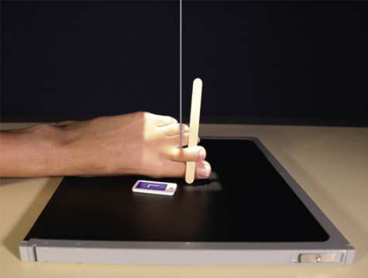
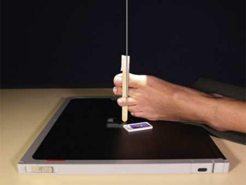
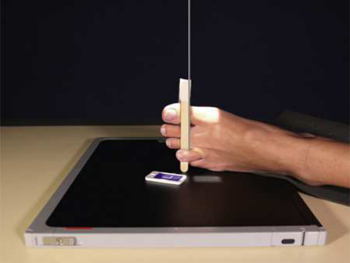
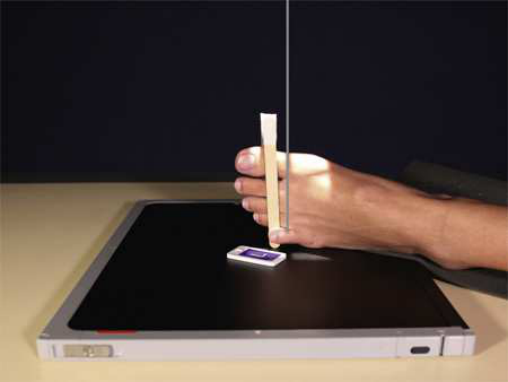
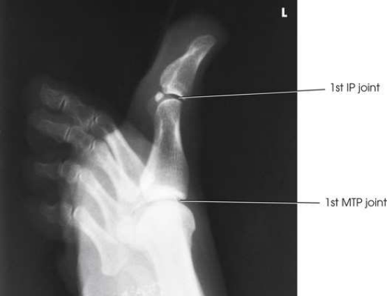
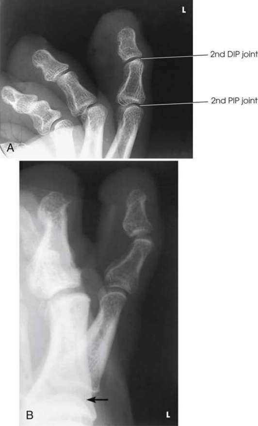
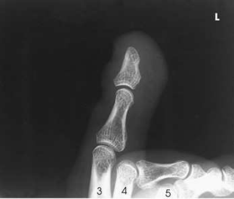
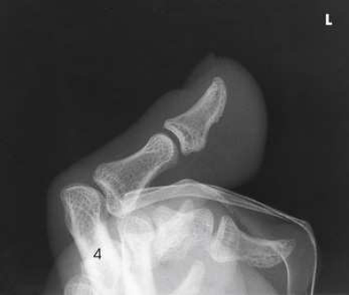

# Rx membru inferior — incidență de profil — mediolaterală sau lateromedială (Merrill)

  📷 Radiografie Convențională (Rx)
  <strong>Actualizat:</strong> 2026-09-16
  <strong>Autor:</strong> Referință Merrill

---

-   __1. Rezumat Clinic & Indicații__

    ---

    === "Indicații Clinice"

        - Conform reperelor anatomice standard din tratat

    === "Ghid Național IRIS"

        !!! info "Referință Primară: Ghidul Național IRIS (Ordinul MS 1342/2012)"
            - **Capitol Ghid IRIS:** *Aparat locomotor & Membru inferior*
            - **Grad de Recomandare:** **Grad A**
            - **Nivel de Iradiere Estimată:** `Clasa 1 (Minimă < 0.01 mSv)`

            [:octicons-search-16: Deschide Ghidul IRIS](../../iris.md){ .md-button .md-button--primary } [:material-open-in-new: Aplicația Oficială PWA](https://radiologie-pediatrica.ro/iris/){ .md-button target="_blank" rel="noopener" }

-   __2. Poziționare & Centrare Fascicul__

    ---

    - **Poziție Pacient:** Se instruiește pacientul să stea în decubit lateral. Se sprijină extremitatea afectată pe săculeți cu nisip și se ajustează într-o poziție confortabilă. Pentru a preveni suprapunerea, se fixează cu bandă adezivă degetele de la picior situate deasupra celui examinat într-o poziție flectată; pentru separarea degetelor de la picior poate fi utilizat și un tampon de tifon de 4 × 4 țoli; pentru haluce și al doilea deget de la picior, pacientul este poziționat pe partea neafectată pentru aceste două degete de la picior. Se plasează receptorul de imagine sub partea medială a piciorului și se centrează pe degetul afectat. Se prinde extremitatea pacientului de călcâi și de genunchi și se ajustează poziția pentru a plasa degetul în incidență de profil adevărată (laterală) (planul prin articulațiile metatarsofalangiene (MTF) trebuie să fie perpendicular pe receptorul de imagine). Se ajustează axa longitudinală a receptorului de imagine astfel încât să fie paralelă cu axa longitudinală a degetului (Fig. 7.24 și 7.25). Pentru al treilea, al patrulea și al cincilea deget de la picior, pacientul este poziționat pe partea afectată pentru aceste trei degete de la picior. Se plasează receptorul de imagine sub partea laterală a piciorului și se centrează pe degetele de la picior. Se prinde extremitatea pacientului de călcâi și de genunchi și se ajustează poziția pentru a plasa degetele în incidență de profil adevărată (laterală) (planul prin articulațiile metatarsofalangiene (MTF) este perpendicular pe receptorul de imagine). Se ajustează axa longitudinală a receptorului de imagine astfel încât să fie paralelă cu axa longitudinală a degetului. Se sprijină călcâiul ridicat pe săculeți cu nisip sau pe un burete pentru imobilizare (Fig. 7.26 până la 7.28). Se efectuează ecranarea gonadelor cu șorț plumbat.
    - **Punct de Centrare Fascicul:** perpendicular pe planul receptorului de imagine, intrând la nivelul articulațiilor interfalangiene (IF) ale halucelui sau al articulațiilor interfalangiene (IF) proximale ale degetelor mici de la picior.
    - **Distanță Focar-Film (DFF / SID):** Nespecificat în fragmentul extras; de verificat în sursă
    - **Comandă Respiratorie:** Conform reperelor anatomice standard din tratat

-   __3. Parametri Tehnici Expunere__

    ---

    | Parametru Tehnic | Valoare Configurare Generator / Tub |
    |:-----------------|:-------------------------------------|
    | **Tensiune Tub (kV)** | DE CONFIGURAT PE APARAT |
    | **Sarcină / Produs Curent-Timp (mAs)** | DE CONFIGURAT PE APARAT |
    | **Distanță Focar-Film (DFF / SID)** | Nespecificat în fragmentul extras; de verificat în sursă |
    | **Grilă Antidifuzoare (Bucky)** | DE CONFIGURAT PE APARAT |
    | **Dimensiune Focar** | DE CONFIGURAT PE APARAT |
    | **Camere de Ionizare AEC** | DE CONFIGURAT PE APARAT |
    | **Colimare Fascicul** | ajustați câmpul de iradiere la 1 țol (2.5 cm) pe toate laturile degetelor de la picior, inclusiv 1 țol (2.5 cm) proximal față de articulațiile metatarsofalangiene (MTF). Plasați markerul de lateralitate în câmpul colimat. |
    | **Filtrare Tub** | DE CONFIGURAT PE APARAT |

-   __4. Criterii de Calitate & Reușită Imagine__

    ---

    - Criterii radiologice de calitate a imaginii:
    - Evidențierea colimării corecte și prezența markerului de lateralitate (D/S), plasat fără a se suprapune peste anatomia de interes
    - Degetul întreg, fără suprapunerea degetelor de la picior adiacente; când suprapunerea nu poate fi evitată, trebuie vizualizată falanga proximală
    - Degetul sau degetele de la picior în incidență de profil adevărată (laterală)
    - Unghia de la picior în profil, dacă este vizualizată și normală
    - Suprafețele concave, plantare ale falangelor
    - Absența rotației anatomice (simetrie bilaterală perfectă) a falangelor
    - Spații articulare interfalangiene (IF) deschise; articulațiile metatarsofalangiene (MTF) sunt suprapuse, dar pot fi vizibile la unii pacienți
    - Detalii trabeculare osoase și țesuturile moi înconjurătoare

-   __5. Protecție Radiologică (ALARA)__

    ---

    - Nespecificat în fragmentul extras; de verificat în sursă

!!! note "Observații Clinice & Tehnice"
    Se mobilizează degetele de la picior numai dacă nu este evidentă nicio deformare.

### 🖼️ Imagini

<figure class="protocol-image-card" markdown>

<figcaption><strong>Merrill — pagina 469, imaginea 1</strong> — Imagine din fragmentul sursă; asocierea necesită revizie.</figcaption>

</figure>

<figure class="protocol-image-card" markdown>

<figcaption><strong>Merrill — pagina 469, imaginea 2</strong> — Imagine din fragmentul sursă; asocierea necesită revizie.</figcaption>

</figure>

<figure class="protocol-image-card" markdown>

<figcaption><strong>Merrill — pagina 470, imaginea 3</strong> — Imagine din fragmentul sursă; asocierea necesită revizie.</figcaption>

</figure>

<figure class="protocol-image-card" markdown>

<figcaption><strong>Merrill — pagina 471, imaginea 4</strong> — Imagine din fragmentul sursă; asocierea necesită revizie.</figcaption>

</figure>

<figure class="protocol-image-card" markdown>

<figcaption><strong>Merrill — pagina 471, imaginea 5</strong> — Imagine din fragmentul sursă; asocierea necesită revizie.</figcaption>

</figure>

<figure class="protocol-image-card" markdown>

<figcaption><strong>Merrill — pagina 472, imaginea 6</strong> — Imagine din fragmentul sursă; asocierea necesită revizie.</figcaption>

</figure>

<figure class="protocol-image-card" markdown>

<figcaption><strong>Merrill — pagina 473, imaginea 7</strong> — Imagine din fragmentul sursă; asocierea necesită revizie.</figcaption>

</figure>

<figure class="protocol-image-card" markdown>

<figcaption><strong>Merrill — pagina 473, imaginea 8</strong> — Imagine din fragmentul sursă; asocierea necesită revizie.</figcaption>

</figure>

=== "Ghid Rapid de Execuție"

    1. **Identificarea și verificarea pacientului:** verificare identitate, zonă de examinat, consimțământ conform procedurii și evaluarea posibilității unei sarcini, când este relevantă.
    2. **Pregătire:** îndepărtarea oricăror obiecte radiopace (bijuterii, agrafe, fermoare, proteze, pansamente dense).
    3. **Poziționare precisă:** alinierea receptorului de imagine și a tubului la distanța prescrisă (Nespecificat în fragmentul extras; de verificat în sursă).
    4. **Colimare strictă:** adaptarea fasciculului strict la regiunea de diagnostic pentru scăderea iradierii și reducerea radiației difuze.
    5. **Radioprotecție:** verificarea [politicii RX](../radioprotectie.md), cu măsuri distincte pentru pacient, personal și însoțitor.

## Surse de documentare

- [Merrill’s Atlas, 7. Lower Extremity, pagini 468–473](https://books.google.com/books/about/Merrill_s_Atlas_of_Radiographic_Position.html?id=BM0lEQAAQBAJ)
