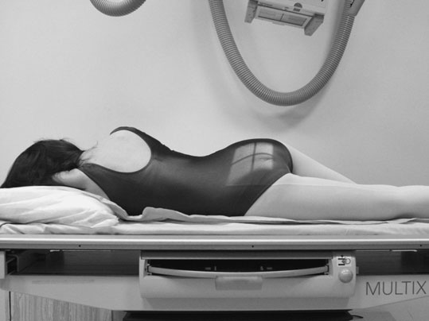
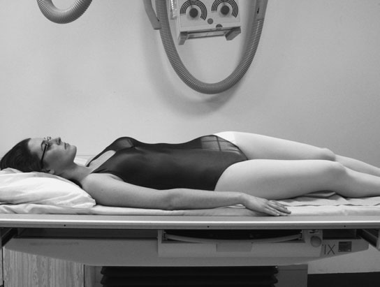
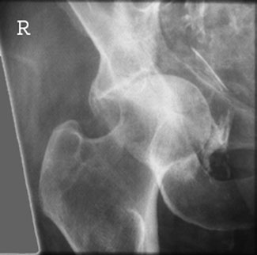

# Rx Acetabulum and Șold (Articulație Coxofemurală) Oblică Anterioară (Judet’s

  📷 Radiografie Convențională (Rx)
  <strong>Actualizat:</strong> 2026-09-16
  <strong>Autor:</strong> Departamentul de Radiologie / Referință Clark (Ed. 12)

---

-   __1. Rezumat Clinic & Indicații__

    ---

    === "Indicații Clinice"

        - 155 5 cotil (acetabul) și Șold (Articulație Coxofemurală) Oblică Anterioară (Judet’s incidență) This incidență poate fie used la assess cotil (acetabul) when suspiciune de fractură este suspected. Although cotil (acetabul) este seen pe anteroposterior Bazin (bazin (pelvis)), anterior și posterior rims sunt superimposed over capul de Femur și ischium. If pacientul este immobile sau în pain, then reverse Judet’s incidență este taken. Judet’s incidență evidențiază anterior rim de cotil (acetabul), cu pacientul Decubit ventral. Oblică Posterioară incidență (Lauenstein’s incidență) shows posterior rim de cotil (acetabul), cu pacientul Decubit dorsal.

    === "Ghid Național IRIS"

        !!! info "Referință Primară: Ghidul Național IRIS (Ordinul MS 1342/2012)"
            - **Capitol Ghid IRIS:** *Ghidul Național IRIS*
            - **Grad de Recomandare:** **De verificat pe indicație; fără grad atribuit automat**
            - **Nivel de Iradiere Estimată:** `De verificat pentru examinarea și populația selectate`

            [:octicons-search-16: Deschide Ghidul IRIS](../../iris.md){ .md-button .md-button--primary } [:material-open-in-new: Aplicația Oficială PWA](https://radiologie-pediatrica.ro/iris/){ .md-button target="_blank" rel="noopener" }
-   __2. Poziționare & Centrare Fascicul__

    ---

    - **Poziție Pacient:** • Pacientul este așezat în decubit dorsal pe masa radiologică.
• partea afectată este raised approximately 45 grade și sprijinit pe non-opaque pads.
    - **Punct de Centrare Fascicul:** • Centre la femoral pulse pe raised side, cu raza centrală centrală orientat 12 grade spre picioarele.
• caseta este centred la nivelul femoral pulse și collimated la area under examination.
    - **Distanță Focar-Film (DFF / SID):** 100 cm
    - **Comandă Respiratorie:** Apnee pe durata expunerii (apnee în inspir pentru torace; expir pentru Abdomen/bazin).

-   __3. Parametri Tehnici Expunere__

    ---

    | Parametru Tehnic | Valoare Configurare Generator / Tub |
    |:-----------------|:-------------------------------------|
    | **Tensiune Tub (kV)** | DE CONFIGURAT PE APARAT |
    | **Sarcină / Produs Curent-Timp (mAs)** | Conform AEC / grosime anatomică |
    | **Distanță Focar-Film (DFF / SID)** | 100 cm |
    | **Grilă Antidifuzoare (Bucky)** | Cu grilă antidifuzoare Bucky |
    | **Dimensiune Focar** | Focar Mic (0.6 mm) |
    | **Camere de Ionizare AEC** | Camerele laterale (sau camera centrală funcție de regiune) |
    | **Colimare Fascicul** | Colimare strictă adaptată pe receptor 24 x 30 cm |
    | **Filtrare Tub** | Totală ≥ 2.5 mm Al echivalent (conform Clark: 3.0 mm Al eq.) |

-   __4. Criterii de Calitate & Reușită Imagine__

    ---

    - Vizualizarea clară întregii arii anatomice (cotil (acetabul) și Șold (Articulație Coxofemurală)).
    - Absența artefactelor de mișcare; trabeculație osoasă și contururi nete.
    - Densitate optică și contrast adecvate pentru diferențierea țesuturilor moi de structurile osoase.

-   __5. Protecție Radiologică (ALARA)__

    ---

    - Ecranare gonadică cu șorț plumbat dacă gonadele sunt în apropierea fasciculului util (regula ALARA).
    - Colimare precisă la dimensiunea anatomică strict necesară pentru reducerea dozei și a radiației difuze.
    - Verificarea posibilității unei sarcini la pacientele de vârstă fertilă înainte de expunere.

!!! note "Observații Clinice & Tehnice"
    • It este necessary în trauma cases la adequately evidențiază suspiciune de fractură de Bazin (bazin (pelvis)) și cotil (acetabul), ca there este high incident de damage la surrounding anatomy (lower Tract Urinar (Aparatul Renal), blood vessels, nerves). These suspiciune de fractură poate fie classified ca stable/unstable depending pe stability de bony fragments.
• Computed Tomografie Liniară Convențională (CT) scanning este used la assess poziție de intra-articular bony fragments și părți moi injuries.
Judet’s incidență de Șold evidențiind central suspiciune de fractură de cotil (acetabul)

### 🖼️ Imagini

<figure class="protocol-image-card" markdown>

<figcaption><strong>blood vessels, nerves). These suspiciune de fractură poate fie classified ca sta-</strong> — Poziționare pacient și centrare fascicul conform Clark (Ed. 12)</figcaption>

</figure>

<figure class="protocol-image-card" markdown>

<figcaption><strong>Judet’s incidență de Șold evidențiind central suspiciune de fractură de cotil (acetabul)</strong> — Aspect radiografic / ghid de poziționare conform tratatului Clark (Ed. 12)</figcaption>

</figure>

<figure class="protocol-image-card" markdown>

<figcaption><strong>Figura 3: Aspect radiografic / Poziționare (Clark Ed. 12)</strong> — Aspect radiografic / ghid de poziționare conform tratatului Clark (Ed. 12)</figcaption>

</figure>

=== "Ghid Rapid de Execuție"

    1. **Identificarea și verificarea pacientului:** verificare identitate, zonă de examinat, consimțământ conform procedurii și evaluarea posibilității unei sarcini, când este relevantă.
    2. **Pregătire:** îndepărtarea oricăror obiecte radiopace (bijuterii, agrafe, fermoare, proteze, pansamente dense).
    3. **Poziționare precisă:** alinierea receptorului de imagine și a tubului la distanța prescrisă (100 cm).
    4. **Colimare strictă:** adaptarea fasciculului strict la regiunea de diagnostic pentru scăderea iradierii și reducerea radiației difuze.
    5. **Radioprotecție:** verificarea [politicii RX](../radioprotectie.md), cu măsuri distincte pentru pacient, personal și însoțitor.

## Surse de documentare

- [Clark's Positioning in Radiography (Ed. 12), Pagina 170](../../assets/protocols/sources/Clark___Positioning_in_Radiography__12th_edition.pdf#page=170)
