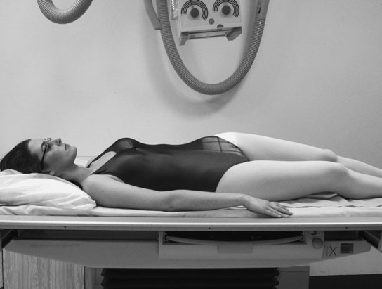
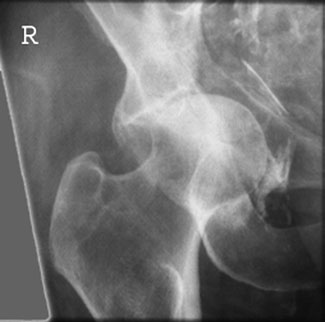

# Rx cotil (acetabul) — șold (articulație coxofemurală), incidență oblică anterioară (incidența Judet)

  📷 Radiografie Convențională (Rx)
  <strong>Actualizat:</strong> 2026-09-16
  <strong>Autor:</strong> Departamentul de Radiologie / Referință Clark (Ed. 12)

---

-   __1. Rezumat Clinic & Indicații__

    ---

    === "Indicații Clinice"

        - 155 5 Cotil (acetabul) și șold (articulația coxofemurală) — incidență oblică anterioară (incidența Judet). Această incidență poate fi utilizată pentru evaluarea cotilului (acetabulului) când există suspiciunea unei fracturi. Deși cotilul este vizibil pe radiografia antero-posterioară a bazinului (pelvisului), marginile sale anterioară și posterioară se suprapun peste capul femural și ischion. Dacă pacientul este imobilizat sau are dureri, se efectuează incidența Judet inversată. Incidența Judet evidențiază marginea anterioară a cotilului, cu pacientul în decubit ventral. Incidența oblică posterioară (incidența Lauenstein) evidențiază marginea posterioară a cotilului, cu pacientul în decubit dorsal.

    === "Ghid Național IRIS"

        !!! info "Referință Primară: Ghidul Național IRIS (Ordinul MS 1342/2012)"
            - **Capitol Ghid IRIS:** *Aparat locomotor & Bazin*
            - **Grad de Recomandare:** **Grad A**
            - **Nivel de Iradiere Estimată:** `Clasa 2 (Foarte mică ~ 0.8 - 1.0 mSv)`

            [:octicons-search-16: Deschide Ghidul IRIS](../../iris.md){ .md-button .md-button--primary } [:material-open-in-new: Aplicația Oficială PWA](https://radiologie-pediatrica.ro/iris/){ .md-button target="_blank" rel="noopener" }

-   __2. Poziționare & Centrare Fascicul__

    ---

    - **Poziție Pacient:**
        - Pacientul este așezat în decubit dorsal pe masa radiologică.
        - Partea afectată este ridicată aproximativ 45 grade și sprijinită pe tampoane radiotransparente.
    - **Punct de Centrare Fascicul:**
        - Se centrează pulsul femural pe partea ridicată, cu raza centrală orientată 12 grade spre picioare.
        - Caseta este centrată la nivelul pulsului femural și colimată la regiunea examinată.
    - **Distanță Focar-Film (DFF / SID):** 100 cm
    - **Comandă Respiratorie:** Apnee pe durata expunerii (apnee în inspir pentru torace; expir pentru Abdomen/bazin).

-   __3. Parametri Tehnici Expunere__

    ---

    | Parametru Tehnic | Valoare Configurare Generator / Tub |
    |:-----------------|:-------------------------------------|
    | **Tensiune Tub (kV)** | DE CONFIGURAT PE APARAT |
    | **Sarcină / Produs Curent-Timp (mAs)** | Conform AEC / grosimii anatomice |
    | **Distanță Focar-Film (DFF / SID)** | 100 cm |
    | **Grilă Antidifuzoare (Bucky)** | Cu grilă antidifuzoare Bucky |
    | **Dimensiune Focar** | Focar Mic (0.6 mm) |
    | **Camere de Ionizare AEC** | Camerele laterale (sau camera centrală, în funcție de regiune) |
    | **Colimare Fascicul** | Colimare strictă adaptată pe receptor 24 x 30 cm |
    | **Filtrare Tub** | Totală ≥ 2.5 mm Al echivalent (conform Clark: 3.0 mm Al echivalent) |

-   __4. Criterii de Calitate & Reușită Imagine__

    ---

    - Vizualizarea clară a întregii arii anatomice (cotilul (acetabulul) și șoldul (articulația coxofemurală)).
    - Absența artefactelor de mișcare; trabeculație osoasă și contururi nete.
    - Densitate optică și contrast adecvate pentru diferențierea țesuturilor moi de structurile osoase.

-   __5. Protecție Radiologică (ALARA)__

    ---

    - Ecranare gonadică cu șorț plumbat dacă gonadele sunt în apropierea fasciculului util (regula ALARA).
    - Colimare precisă la dimensiunea anatomică strict necesară pentru reducerea dozei și a radiației difuze.
    - Verificarea posibilității unei sarcini la pacientele de vârstă fertilă înainte de expunere.

!!! note "Observații Clinice & Tehnice"
    - Este necesară în cazurile de traumă pentru a evidenția adecvat suspiciunea de fractură a bazinului (pelvisului) și cotilului (acetabulului), deoarece există o incidență mare a leziunilor anatomiei înconjurătoare (tractul urinar inferior (aparatul renal), vasele sanguine, nervii). Aceste fracturi suspectate pot fi clasificate ca stabile/instabile în funcție de stabilitatea fragmentelor osoase.
    - Tomografia computerizată (CT) convențională liniară este utilizată pentru evaluarea poziției fragmentelor osoase intraarticulare și a leziunilor părților moi. Incidența Judet a șoldului, evidențiind central suspiciunea de fractură a cotilului (acetabulului)

### 🖼️ Imagini

<figure class="protocol-image-card" markdown>

![vasele sanguine, nervii). Aceste fracturi suspectate pot fi clasificate ca sta- [fragment deteriorat în sursă]](../../assets/images/protocols/clark/rx-acetabulum-and-sold-articulatie-coxofemurala-oblica-anterioara-judet-s-p170-clark/fig_1.jpeg)

<figcaption><strong>vasele sanguine, nervii). Aceste fracturi suspectate pot fi clasificate ca sta- [fragment deteriorat în sursă]</strong> — Poziționarea pacientului și centrarea fasciculului conform Clark (Ed. 12)</figcaption>

</figure>

<figure class="protocol-image-card" markdown>

<figcaption><strong>Incidența Judet a șoldului, evidențiind central suspiciunea de fractură a cotilului (acetabulului)</strong> — Aspect radiografic / ghid de poziționare conform tratatului Clark (Ed. 12)</figcaption>

</figure>

<figure class="protocol-image-card" markdown>

<figcaption><strong>Figura 3: Aspect radiografic / Poziționare (Clark Ed. 12)</strong> — Aspect radiografic / ghid de poziționare conform tratatului Clark (Ed. 12)</figcaption>

</figure>

=== "Ghid Rapid de Execuție"

    1. **Identificarea și verificarea pacientului:** verificare identitate, zonă de examinat, consimțământ conform procedurii și evaluarea posibilității unei sarcini, când este relevantă.
    2. **Pregătire:** îndepărtarea oricăror obiecte radiopace (bijuterii, agrafe, fermoare, proteze, pansamente dense).
    3. **Poziționare precisă:** alinierea receptorului de imagine și a tubului la distanța prescrisă (100 cm).
    4. **Colimare strictă:** adaptarea fasciculului strict la regiunea de diagnostic pentru scăderea iradierii și reducerea radiației difuze.
    5. **Radioprotecție:** verificarea [politicii RX](../radioprotectie.md), cu măsuri distincte pentru pacient, personal și însoțitor.

## Surse de documentare

- [Clark's Positioning in Radiography (Ed. 12), Pagina 170](https://books.google.com/books/about/Clark_s_Positioning_in_Radiography.html?id=Xxu6MwEACAAJ)
