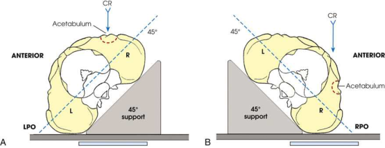

# Rx Acetabulum — Oblică Antero-Posterioară (AP) — Judet Method 9 Modified Judet Method 10 RPO and Oblică Posterioară Stângă (OPS / LPO)s (Merrill)

  📷 Radiografie Convențională (Rx)
  <strong>Actualizat:</strong> 2026-09-16
  <strong>Autor:</strong> Referință Merrill

---

-   __1. Rezumat Clinic & Indicații__

    ---

    === "Indicații Clinice"

        - Conform reperelor anatomice standard din tratat

    === "Ghid Național IRIS"

        !!! info "Referință Primară: Ghidul Național IRIS (Ordinul MS 1342/2012)"
            - **Capitol Ghid IRIS:** *Ghidul Național IRIS*
            - **Grad de Recomandare:** **De verificat pe indicație; fără grad atribuit automat**
            - **Nivel de Iradiere Estimată:** `De verificat pentru examinarea și populația selectate`

            [:octicons-search-16: Deschide Ghidul IRIS](../../iris.md){ .md-button .md-button--primary } [:material-open-in-new: Aplicația Oficială PWA](https://radiologie-pediatrica.ro/iris/){ .md-button target="_blank" rel="noopener" }
-   __2. Poziționare & Centrare Fascicul__

    ---

    - **Poziție Pacient:** se așază pacientul în posterior Incidență Oblică cu afected Șold up. se așază pacientul în posterior Incidență Oblică cu afected Șold down.; se aliniază corp și se centrează Șold being examined la middle de receptorul de imagine. Elevate afected side astfel încât MCP de corp forms a 45-grade angle de la masa de examinare (Fig. 8.42A). se aliniază corp și se centrează Șold being examined la middle de receptorul de imagine. Elevate unafected side astfel încât MCP de corp forms a 45-grade angle de la masa de examinare (Fig. 8.42B).
    - **Punct de Centrare Fascicul:** perpendicular pe receptorul de imagine (RI) și entering 2 inches (5 cm) inferior la spină iliacă antero-superioară (SIAS) de afected side extern oblic extern oblic este used pentru pacient cu suspected suspiciune de fractură de ilioischial column (posterior) și anterior rim de cotil (acetabul). perpendicular pe receptorul de imagine (RI) și entering la simfiză pubiană
    - **Distanță Focar-Film (DFF / SID):** Nespecificat în fragmentul extras; de verificat în sursă
    - **Comandă Respiratorie:** apnee (oprirea respirației). apnee (oprirea respirației).

-   __3. Parametri Tehnici Expunere__

    ---

    | Parametru Tehnic | Valoare Configurare Generator / Tub |
    |:-----------------|:-------------------------------------|
    | **Tensiune Tub (kV)** | DE CONFIGURAT PE APARAT |
    | **Sarcină / Produs Curent-Timp (mAs)** | DE CONFIGURAT PE APARAT |
    | **Distanță Focar-Film (DFF / SID)** | Nespecificat în fragmentul extras; de verificat în sursă |
    | **Grilă Antidifuzoare (Bucky)** | DE CONFIGURAT PE APARAT |
    | **Dimensiune Focar** | DE CONFIGURAT PE APARAT |
    | **Camere de Ionizare AEC** | DE CONFIGURAT PE APARAT |
    | **Colimare Fascicul** | Se ajustează câmpul de iradiere la formatul 24 × 30 cm pe colimator. Se plasează markerul de lateralitate în câmpul colimat. |
    | **Filtrare Tub** | DE CONFIGURAT PE APARAT |

-   __4. Criterii de Calitate & Reușită Imagine__

    ---

    - Criterii radiologice de calitate imaginii:
    - Colimare adecvată vizibilă și prezența markerului de lateralitate (D/S) plasat clear de anatomy de interest
    - cotil (acetabul) centrat pe receptorul de imagine
    - iliopubic column și posterior rim de afected cotil (acetabul) pe intern oblic
    - ilioischial column și anterior rim de cotil (acetabul) pe extern oblic
    - Bony detalii trabeculare osoase și surrounding soft tissues

-   __5. Protecție Radiologică (ALARA)__

    ---

    - Nespecificat în fragmentul extras; de verificat în sursă

!!! note "Observații Clinice & Tehnice"
    iliopubic column (anterior), composed de short segment de ilium și pubis, extends up ca far ca anterior coloană vertebrală de ilium și de la simfiză pubiană și găuri obturatoare through cotil (acetabul) la spină iliacă antero-superioară (SIAS). ilioischial column (posterior), composed de vertical portion de ischium și portion de ilium immediately above ischium, extends de la găuri obturatoare through posterior aspect de cotil (acetabul).

### 🖼️ Imagini

<figure class="protocol-image-card" markdown>

<figcaption><strong>Merrill — pagina PDF 637, imaginea 1</strong> — Imagine din fragmentul sursă; asocierea necesită revizie.</figcaption>

</figure>

=== "Ghid Rapid de Execuție"

    1. **Identificarea și verificarea pacientului:** verificare identitate, zonă de examinat, consimțământ conform procedurii și evaluarea posibilității unei sarcini, când este relevantă.
    2. **Pregătire:** îndepărtarea oricăror obiecte radiopace (bijuterii, agrafe, fermoare, proteze, pansamente dense).
    3. **Poziționare precisă:** alinierea receptorului de imagine și a tubului la distanța prescrisă (Nespecificat în fragmentul extras; de verificat în sursă).
    4. **Colimare strictă:** adaptarea fasciculului strict la regiunea de diagnostic pentru scăderea iradierii și reducerea radiației difuze.
    5. **Radioprotecție:** verificarea [politicii RX](../radioprotectie.md), cu măsuri distincte pentru pacient, personal și însoțitor.

## Surse de documentare

- [Merrill’s Atlas, 8. Pelvis and Hip, pagini PDF 636–637](../../assets/protocols/sources/a56d45c16829_Merrills_Atlas_of_Radiographic_Positioning__Procedures_3Vol_Set.pdf#page=636)

## Fragmente sursă traduse (referință tehnică)

### anatomy

acetabular rim (Fig. 8.43).

### collimation

• Se ajustează câmpul de iradiere la formatul 24 × 30 cm pe colimator. Se plasează markerul de lateralitate în câmpul colimat.

### cr

• perpendicular pe receptorul de imagine (RI) și entering 2 inches (5 cm) inferior la spină iliacă antero-superioară (SIAS) de afected side
extern oblic
extern oblic este used pentru pacient cu suspected suspiciune de fractură de ilioischial column (posterior) și anterior rim de cotil (acetabul).
• perpendicular pe receptorul de imagine (RI) și entering la simfiză pubiană

### criteria

Criterii radiologice de calitate imaginii:
• Colimare adecvată vizibilă și prezența markerului de lateralitate (D/S) plasat clear de anatomy de interest
• cotil (acetabul) centrat pe receptorul de imagine
• iliopubic column și posterior rim de afected cotil (acetabul) pe intern oblic
• ilioischial column și anterior rim de cotil (acetabul) pe extern oblic
• Bony detalii trabeculare osoase și surrounding soft tissues

### notes

iliopubic column (anterior), composed de short segment de ilium și pubis, extends up ca far ca anterior coloană vertebrală de ilium și de la simfiză pubiană și găuri obturatoare through cotil (acetabul) la spină iliacă antero-superioară (SIAS).
ilioischial column (posterior), composed de vertical portion de ischium și portion de ilium immediately above ischium, extends de la găuri obturatoare through posterior aspect de cotil (acetabul).

### part_pos

• se aliniază corp și se centrează hip being examined la middle de receptorul de imagine.
• Elevate afected side astfel încât MCP de corp forms a 45-grade angle de la masa de examinare (Fig. 8.42A).
• se aliniază corp și se centrează hip being examined la middle de receptorul de imagine.
• Elevate unafected side astfel încât MCP de corp forms a 45-grade angle de la masa de examinare (Fig. 8.42B).

### patient_pos

• se așază pacientul în posterior oblic poziție cu afected hip up.
• se așază pacientul în posterior oblic poziție cu afected hip down.

### respiration

apnee (oprirea respirației).
apnee (oprirea respirației).

### tech

poziționat prin manufacturer sau department protocol pentru corect anatomy display orientation; raza centrală plate: 10 × 12 inches (24
× 30 cm) longitudinal.
intern oblic
intern oblic poziție este used pentru pacient cu suspected suspiciune de fractură de iliopubic column (anterior) și posterior rim de cotil (acetabul).

