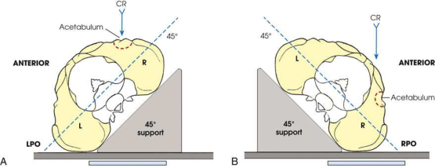

# Rx acetabul — incidență oblică antero-posterioară (AP) — metoda Judet [9], metoda Judet modificată [10], poziții oblice posterioare dreaptă (RPO) și stângă (OPS / LPO) (Merrill)

  📷 Radiografie Convențională (Rx)
  <strong>Actualizat:</strong> 2026-09-16
  <strong>Autor:</strong> Referință Merrill

---

-   __1. Rezumat Clinic & Indicații__

    ---

    === "Indicații Clinice"

        - Conform reperelor anatomice standard din tratat

    === "Ghid Național IRIS"

        !!! info "Referință Primară: Ghidul Național IRIS (Ordinul MS 1342/2012)"
            - **Capitol Ghid IRIS:** *Aparat locomotor & Membru inferior*
            - **Grad de Recomandare:** **Grad A**
            - **Nivel de Iradiere Estimată:** `Clasa 1 (Minimă < 0.01 mSv)`

            [:octicons-search-16: Deschide Ghidul IRIS](../../iris.md){ .md-button .md-button--primary } [:material-open-in-new: Aplicația Oficială PWA](https://radiologie-pediatrica.ro/iris/){ .md-button target="_blank" rel="noopener" }

-   __2. Poziționare & Centrare Fascicul__

    ---

    - **Poziție Pacient:** Se așază pacientul în incidență oblică posterioară, cu șoldul afectat în sus. Se așază pacientul în incidență oblică posterioară, cu șoldul afectat în jos; se aliniază corpul și se centrează șoldul examinat la mijlocul receptorului de imagine. Se ridică partea afectată astfel încât MCP-ul corpului să formeze un unghi de 45 grade față de masa de examinare (Fig. 8.42A). Se aliniază corpul și se centrează șoldul examinat la mijlocul receptorului de imagine. Se ridică partea neafectată astfel încât MCP-ul corpului să formeze un unghi de 45 grade față de masa de examinare (Fig. 8.42B).
    - **Punct de Centrare Fascicul:** perpendicular pe receptorul de imagine (RI) și intrând la 2 țoli (5 cm) inferior față de spina iliacă anterosuperioară (SIAS) de partea afectată. Incidența oblică externă este utilizată pentru pacientul cu suspiciune de fractură a coloanei ilioischiatice (posterioare) și a marginii anterioare a cotilului (acetabulului). perpendicular pe receptorul de imagine (RI) și intrând la nivelul simfizei pubiene
    - **Distanță Focar-Film (DFF / SID):** Nespecificat în fragmentul extras; de verificat în sursă
    - **Comandă Respiratorie:** apnee (oprirea respirației). apnee (oprirea respirației).

-   __3. Parametri Tehnici Expunere__

    ---

    | Parametru Tehnic | Valoare Configurare Generator / Tub |
    |:-----------------|:-------------------------------------|
    | **Tensiune Tub (kV)** | DE CONFIGURAT PE APARAT |
    | **Sarcină / Produs Curent-Timp (mAs)** | DE CONFIGURAT PE APARAT |
    | **Distanță Focar-Film (DFF / SID)** | Nespecificat în fragmentul extras; de verificat în sursă |
    | **Grilă Antidifuzoare (Bucky)** | DE CONFIGURAT PE APARAT |
    | **Dimensiune Focar** | DE CONFIGURAT PE APARAT |
    | **Camere de Ionizare AEC** | DE CONFIGURAT PE APARAT |
    | **Colimare Fascicul** | Se ajustează câmpul de iradiere la formatul 24 × 30 cm pe colimator. Se plasează markerul de lateralitate în câmpul colimat. |
    | **Filtrare Tub** | DE CONFIGURAT PE APARAT |

-   __4. Criterii de Calitate & Reușită Imagine__

    ---

    - Criterii radiologice de calitate a imaginii:
    - Colimare adecvată vizibilă și prezența markerului de lateralitate (D/S) plasat în afara structurilor anatomice de interes
    - cotilul (acetabulul) centrat pe receptorul de imagine
    - coloana iliopubiană și marginea posterioară a cotilului (acetabulului) afectat pe incidența oblică internă
    - coloana ilioischiatică și marginea anterioară a cotilului (acetabulului) pe incidența oblică externă
    - Detalii trabeculare osoase și țesuturile moi înconjurătoare

-   __5. Protecție Radiologică (ALARA)__

    ---

    - Nespecificat în fragmentul extras; de verificat în sursă

!!! note "Observații Clinice & Tehnice"
    coloana iliopubiană (anterioară), alcătuită dintr-un segment scurt al ilionului și pubisului, se extinde superior până la coloana anterioară a ilionului și de la simfiza pubiană și găurile obturatoare, prin cotil (acetabul), până la spina iliacă anterosuperioară (SIAS). Coloana ilioischiatica (posterioară), alcătuită din porțiunea verticală a ischionului și porțiunea ilionului situată imediat deasupra ischionului, se extinde de la găurile obturatoare, prin aspectul posterior al cotilului (acetabulului).

### 🖼️ Imagini

<figure class="protocol-image-card" markdown>

<figcaption><strong>Merrill — pagina 637, imaginea 1</strong> — Imagine din fragmentul sursă; asocierea necesită revizie.</figcaption>

</figure>

=== "Ghid Rapid de Execuție"

    1. **Identificarea și verificarea pacientului:** verificare identitate, zonă de examinat, consimțământ conform procedurii și evaluarea posibilității unei sarcini, când este relevantă.
    2. **Pregătire:** îndepărtarea oricăror obiecte radiopace (bijuterii, agrafe, fermoare, proteze, pansamente dense).
    3. **Poziționare precisă:** alinierea receptorului de imagine și a tubului la distanța prescrisă (Nespecificat în fragmentul extras; de verificat în sursă).
    4. **Colimare strictă:** adaptarea fasciculului strict la regiunea de diagnostic pentru scăderea iradierii și reducerea radiației difuze.
    5. **Radioprotecție:** verificarea [politicii RX](../radioprotectie.md), cu măsuri distincte pentru pacient, personal și însoțitor.

## Surse de documentare

- [Merrill’s Atlas, 8. Pelvis and Hip, pagini 636–637](https://books.google.com/books/about/Merrill_s_Atlas_of_Radiographic_Position.html?id=BM0lEQAAQBAJ)
